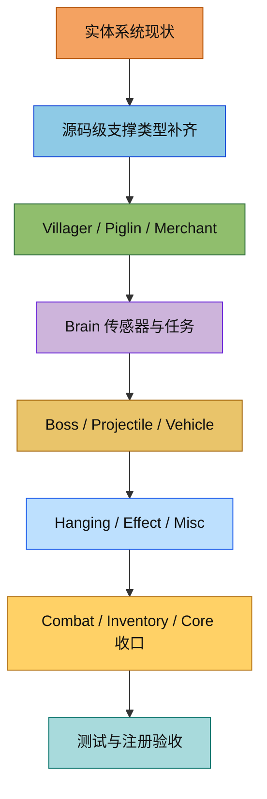

# 实体系统补全计划（对照 Minecraft 1.16.5 源码）

参考源码目录：`D:\Minecraft\MC研究\Minecraft1.16.5源码`

本文件是当前实体系统的总补全计划，用于替代旧的局部计划 [src/common/entity/COMPLETION_PLAN.md](src/common/entity/COMPLETION_PLAN.md)。旧文件可以保留作历史记录，但后续补全任务统一以本文件为准。

## 1. 当前结论

当前仓库已经覆盖了实体系统的大部分外壳：`player`、`passive`、`monster`、`projectile`、`boss`、`vehicle`、`hanging`、`effect`、`misc`、`experience`、`inventory`、`combat`、`ai` 的目录都已经存在，并且不少实体类也已经落地。

但和 1.16.5 源码相比，缺口仍然集中在四类：

1. 源码级支撑类型还不完整，尤其是玩家、村民/商人、马类、鱼类、怪物基类和投掷物基类。
2. 现有实体的行为实现仍有大量 TODO，特别是 Boss、载具、投掷物、村民交易、悬挂实体、效果实体和杂项实体。
3. AI 目标系统只覆盖了部分 1.16.5 行为，`brain` 目前仍以骨架为主。
4. 注册和同步层还没有完全收口，`VanillaEntities` 里仍有若干实体处于注释或半完成状态。

## 2. 现状矩阵

| 模块 | 当前状态 | 与 1.16.5 的主要差距 | 优先级 |
|---|---|---|---|
| 玩家 | 核心玩家类已存在 | 缺少 `ServerPlayerEntity`、`ChatVisibility`、`PlayerModelPart`、`SpawnLocationHelper`，并且若干生存/同步逻辑仍是 TODO | 高 |
| 村民/商人 | `VillagerEntity`、`WanderingTraderEntity` 和交易框架已存在 | 缺少 `entity.merchant` 层的完整接口和声望联动，brain 与交易/POI 的串联未完成 | 高 |
| 被动生物 | 大量基础动物已存在 | 马类仍缺少 1.16.5 的中间层支撑类型，鱼类还缺 `AbstractGroupFishEntity` 语义 | 中 |
| 敌对生物 | 主要实体已存在 | 还缺若干基类/接口和 1.16.5 特有的猪灵、灾厄村民、骷髅体系支撑层 | 高 |
| 投掷物 | 大部分具体投掷物已存在 | 伤害、命中、粒子、拾取、附魔和支撑基类还未按源码补齐 | 高 |
| Boss | `WitherEntity`、`EnderDragonEntity` 已存在 | 阶段机、部件伤害、龙息/凋灵头、重生、传送门流程未完成 | 高 |
| 载具 | 船和矿车实体已存在 | 铁轨、水上物理、库存/漏斗/熔炉/命令方块逻辑未完成 | 中 |
| 悬挂实体 | `HangingEntity` 已存在 | 方块支撑、掉落物、交互和方向校验仍未完成 | 中 |
| 效果实体 | `LightningBoltEntity`、`AreaEffectCloudEntity`、`ArmorStandEntity`、`ExperienceOrbEntity` 等已存在 | 生成粒子、范围效果、爆炸和持久化细节未完成 | 中 |
| 杂项实体 | `FallingBlockEntity`、`TNTEntity`、`EyeOfEnderEntity`、`ConduitEntity`、`EvokerFangsEntity` 已存在 | 方块放置、爆炸、潮涌核心、尖牙时序等逻辑仍有 TODO | 中 |
| AI 目标 | 只覆盖了部分 1.16.5 Goal | 仍缺大量 movement/attack/special/villager 目标 | 高 |
| AI Brain | 框架已有 | 传感器、任务、Piglin/Villager 脑整合仍是骨架 | 高 |
| Combat / Inventory / Core | 有基础实现 | 伤害公式、击退、护甲、乘客、视线、容器丢出物等仍未收口 | 中 |

## 3. 必须补齐的源码级支撑类型

### 3.1 玩家层

1. `ServerPlayerEntity`
2. `ChatVisibility`
3. `PlayerModelPart`
4. `SpawnLocationHelper`
5. 将玩家相关的服务端逻辑、重生逻辑、聊天可见性和皮肤部件状态从当前 `Player` 中拆出或补齐到和源码一致的层次

### 3.2 村民 / 商人层

1. `IMerchant`
2. `IReputationTracking`
3. `IReputationType`
4. `VillagerData` 的完整升级、类型和职业语义
5. `VillagerTrades`、`MerchantOffer`、`MerchantOffers`、`VillageGossip` 与实体层的完整联动

### 3.3 被动生物支撑层

1. `AbstractChestedHorseEntity`
2. `TraderLlamaEntity`
3. `ShoulderRidingEntity`
4. `CoatColors`
5. `CoatTypes`
6. `AbstractGroupFishEntity`

### 3.4 敌对生物支撑层

1. `AbstractSkeletonEntity`
2. `SpellcastingIllagerEntity`
3. `PatrollerEntity`
4. `IMob`
5. `IFlinging`

### 3.5 投掷物支撑层

1. `DamagingProjectileEntity`
2. `ProjectileHelper`

### 3.6 AI 支撑层

1. `BrainUtil`
2. `BodyController`
3. `DolphinLookController`
4. `FlyingMovementController`
5. `EntitySenses`
6. `RandomPositionGenerator`
7. `GlobalEntityTypeAttributes`
8. `DutyTime`、`ScheduleBuilder`、`ScheduleDuties`、`WalkTarget` 等 1.16.5 脑系统辅助类型

## 4. 既有实体的行为补全任务

### 4.1 玩家

1. 补齐脚步声、游泳声、视野晃动、睡眠、传送门、空气供应和溺水逻辑。
2. 补齐药水、附魔、深海探索者、海豚的恩惠、护甲值、击退、摔落保护等派生行为。
3. 明确玩家的服务端与客户端职责边界，避免把权威状态留在本地缓存里。

### 4.2 村民 / 流浪商人

1. 完成 `VillagerData` 的职业、类型、等级和经验升级链路。
2. 完成交易补货、职业工作站点、休息、睡眠、社交、繁殖和物品拾取行为。
3. 把村民脑系统从骨架补成可运行实现。
4. 完成流浪商人的交易表、消失计时、贸易羊驼和特有 AI。
5. 把声望和 gossip 系统真正接到交易价格与村民行为上。

### 4.3 猪灵 / 疣猪兽 / 僵尸疣猪兽

1. 完成猪灵的脑/目标/交易/黄金偏好/灵魂火恐惧逻辑。
2. 补齐猪灵蛮兵、疣猪兽和僵尸疣猪兽的行为差异。
3. 把 `PiglinAction`、`PiglinTasks`、`PiglinBruteBrain`、`HoglinTasks` 等 1.16.5 专属逻辑落地。

### 4.4 Boss

1. `WitherEntity` 需要补齐凋灵头独立目标、蓝色凋灵之首、充能、爆炸和无敌阶段。
2. `EnderDragonEntity` 需要补齐阶段机、龙息区域效果云、龙火球、末影龙部件伤害和重生流程。
3. 将 `EnderDragonPartEntity` 的伤害转发和碰撞体管理与主龙实体彻底对齐。

### 4.5 投掷物

1. 统一补齐命中判定、实体/方块射线追踪、所有者追踪和拾取状态。
2. 按 1.16.5 语义补齐箭矢、光灵箭、三叉戟、火球、雪球、鸡蛋、末影珍珠、喷溅药水、经验之瓶、唾液、潜影贝子弹、烟花、钓鱼浮漂和末影之眼。
3. 处理特殊效果：忠诚、激流、引雷、药水效果、传送伤害、孵化、经验生成和粒子反馈。

### 4.6 载具

1. 完成船的水面高度探测、划桨、碰撞推动和木材变体掉落。
2. 完成矿车的铁轨寻路、动力轨、探测轨、激活轨、TNT/漏斗/熔炉/命令方块变体逻辑。
3. 补齐矿车库存、掉落和命令执行语义。

### 4.7 悬挂 / 效果 / 杂项实体

1. `HangingEntity` 需要补齐背后方块支撑、方向校验和掉落物生成。
2. `LightningBoltEntity`、`AreaEffectCloudEntity`、`EnderCrystalEntity`、`ArmorStandEntity` 需要补齐效果应用、爆炸、姿势、持久化和粒子。
3. `FallingBlockEntity`、`TNTEntity`、`EyeOfEnderEntity`、`ConduitEntity`、`EvokerFangsEntity` 需要补齐时序、爆炸、路径和范围效果。

### 4.8 核心战斗、背包和实体基类

1. `PlayerAttackHelper`、`AttackContext`、`CombatTracker` 需要补齐附魔、药水、护甲、击退和死亡消息。
2. `Entity` / `LivingEntity` / `MobEntity` 需要补齐乘客系统、视线检测、游泳/溺水、车辆关联和更多不变量。
3. `Container`、`Slot`、`PlayerInventory` 需要补齐护甲类型、丢出实体、NBT 和交互一致性。

## 5. AI 补全计划

### 5.1 Goal 系统缺口

当前已覆盖的目标包括游泳、随机漫步、诱惑、繁殖、近战、部分远程攻击、部分 villager 目标和一部分特殊目标。仍需补齐的 1.16.5 目标族主要有：

| 目标族 | 需要补齐的类 |
|---|---|
| movement | `BreakBlockGoal`, `BreakDoorGoal`, `BreatheAirGoal`, `CatLieOnBedGoal`, `CatSitOnBlockGoal`, `FollowBoatGoal`, `FollowMobGoal`, `FindWaterGoal`, `JumpGoal`, `MoveThroughVillageGoal`, `MoveThroughVillageAtNightGoal`, `MoveToBlockGoal`, `MoveTowardsRestrictionGoal`, `MoveTowardsTargetGoal`, `PatrolVillageGoal`, `RandomSwimmingGoal`, `WaterAvoidingRandomFlyingGoal` |
| attack / target | `RangedCrossbowAttackGoal`, `NearestAttackableTargetExpiringGoal`, `ToggleableNearestAttackableTargetGoal`, `ZombieAttackGoal`, `ResetAngerGoal` |
| interact / special | `FoxEatBerriesGoal`, `OcelotAttackGoal`, `LookAtCustomerGoal`, `LandOnOwnersShoulderGoal`, `UseItemGoal` |
| villager 专属 | `VillagerTasks` 对应的睡觉、工作、回家、社交、收获、收集、避险等行为 |

### 5.2 Brain 系统缺口

`brain` 现在的状态是“框架已搭，但更新逻辑基本没落地”。补全顺序建议如下：

1. 先把传感器的 `update()` 实现补齐，至少让记忆模块有真实世界输入。
2. 再把任务层的 `shouldRun()` / `update()` / `end()` 全部串起来。
3. 最后把村民和猪灵从传统 Goal 驱动迁移到 Brain 驱动，避免双系统并行导致状态分叉。

需要补齐的典型源类包括：

| 类型 | 代表类 |
|---|---|
| sensors | `NearestPlayersSensor`, `NearestVisibleLivingEntitySensor`, `HurtBySensor`, `MobSensor`, `WorkStationSensor`, `VillagePoiSensor`, `BabySensor`, `AvoidEntitySensor` |
| tasks - movement | `MoveToTargetTask`, `StrollTask`, `LookAtEntityTask`, `FindHiddenBlockTask`, `ChaseTask`, `FleeTask` |
| tasks - action | `AttackTask`, `BreedTask`, `EatTask`, `PlayDeadTask`, `JumpTask`, `KickTask` |
| tasks - interact | `VillagerInteractTask`, `InteractWithDoorTask`, `FollowOwnerTask`, `ProtectOwnerTask`, `PickupItemTask`, `FollowParentTask`, `TemptTask` |
| piglin / villager brain | `PiglinAction`, `PiglinTasks`, `PiglinBruteBrain`, `HoglinTasks`, `VillagerTasks` |

### 5.3 Brain 接入目标

1. `VillagerEntity` 要接入完整 Brain，而不是只注册记忆模块。
2. `PiglinEntity` 也要接入 Brain，不能长期停留在传统 Goal 方案里。
3. 与 `world/village` 的 POI、gossip、trade、schedule 形成闭环。

## 6. 推荐实施顺序

### 第一阶段：补源码支撑类型和注册

1. 补齐玩家、商人、马类、鱼类、怪物基类、投掷物基类和 AI 支撑类型。
2. 清理 `VanillaEntities` 里仍然被注释掉的实体注册。
3. 把当前实体名和来源类名做一次统一映射，避免后续脑系统和注册系统继续分裂。

### 第二阶段：村民 / 猪灵 / Brain

1. 完成 merchant / reputation / gossip 层。
2. 完成 villager 和 wandering trader 的交易、工作、睡眠、繁殖、补货和贸易羊驼。
3. 把 piglin / hoglin / villager 的 Brain 接口补齐。

### 第三阶段：高行为复杂度实体

1. 完成 Boss 的阶段机、部件、爆炸和重生。
2. 完成 projectile 的命中、拾取、粒子、特殊效果和支撑基类。
3. 完成 vehicle 的铁轨、水上和库存逻辑。

### 第四阶段：AI 目标全量补齐

1. 补 movement / attack / target / special / villager 的缺失 Goal。
2. 把 Goal 与 Brain 的职责分开，避免后续重复实现。

### 第五阶段：杂项实体和回归收口

1. 补 hanging / effect / misc 的剩余 TODO。
2. 修正 combat / inventory / core 的跨模块行为。
3. 统一补测试和文档。

## 7. 验收标准

1. 1.16.5 里的实体类要么有对应的 C++ 实现，要么在本文件中明确说明是合并实现，不允许“看起来有、实际没接上”。
2. `VanillaEntities` 必须能注册当前计划内的所有 gameplay entity。
3. 所有 entity 模块里的核心 TODO 需要收口，尤其是 tick、碰撞、传送、交易、AI 和生成逻辑。
4. 每个新补的实体或 AI 行为都要补测试，至少覆盖创建、tick、交互、序列化和注册。
5. 若某些 1.16.5 类被当前架构合并到一个 C++ 类里，必须在计划和 README 里写清楚映射关系。

## 8. 关系图

