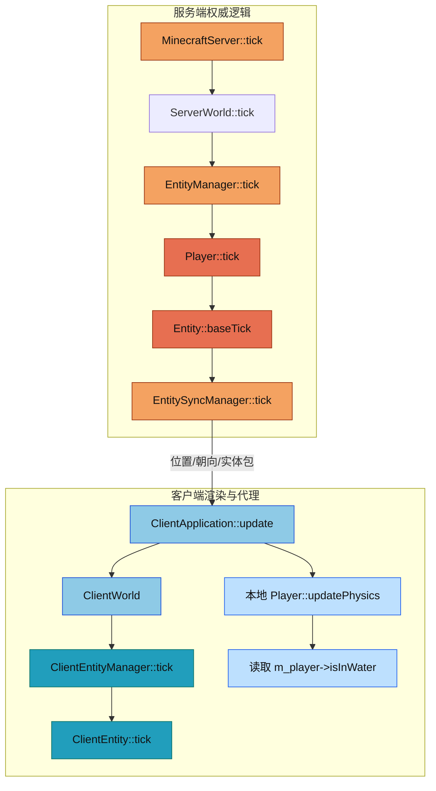
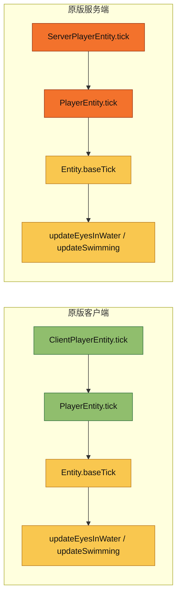

# 实体系统 Tick 与同步入门

这份文档用于解释一个很容易误判的问题：`Player::tick()` 在本项目里为什么看起来像“没被调用”，以及这和客户端、服务端、网络同步之间到底是什么关系。

如果你不熟悉实体系统，先记住一句话：

- 服务端是权威逻辑，负责真正的实体 tick、物理、环境状态和同步包发送。
- 客户端主要负责渲染、插值、输入和网络回放，不会自动执行服务端那套实体业务 tick。

## 先给结论

1. 你在客户端启动后看到的本地 `m_player`，不会进入 `Player::tick()` 这条路径。
2. 真正调用 `Player::tick()` 的地方是服务端实体管理链路：`MinecraftServer::tick()` -> `EntityManager::tick()` -> `entity->tick()` -> `Player::tick()`。
3. 客户端的 `ClientWorld::entityManager()` 返回的是 `ClientEntityManager`，它只 tick 轻量级代理实体 `ClientEntity`，不是 `common/entity/entities/player/Player`。
4. 客户端本地 `m_player->isInWater()` 过去不能保证正确值；现在代码已经补了本地刷新路径，但它依然依赖本地物理刷新，不等于服务端权威结果。
5. 网络包同步的基础设施已经补齐了 `EntityMetadata` 闭环：服务端会发 spawn 内联 metadata 和 dirty metadata packet，客户端也会把它写回实体对象。

## 先补一点背景知识

### 1. 什么是 tick

在 Minecraft 里，tick 是游戏逻辑更新的最小单位，默认 20 tick = 1 秒。它不是“渲染一帧”，也不是“输入事件一次回调”，而是会推进实体状态、世界状态、AI、碰撞和网络同步的逻辑步。

### 2. 为什么一个类名不能直接告诉你它在哪边跑

本项目里很多实体类都放在 `src/common/entity/` 下。这个“common”只是表示代码会被客户端和服务端都编译进去，不代表它们在客户端和服务端都以同样方式运行。

真正决定运行侧的是“谁拥有这个对象、谁在 tick 它”：

- 服务端世界里的实体对象，交给 `EntityManager` 统一 tick。
- 客户端世界里的实体代理对象，交给 `ClientEntityManager` 统一 tick。
- 客户端本地玩家对象是一个特殊情况，它直接跟输入、物理和渲染交互，但当前并没有被放进一条会调用 `Player::tick()` 的管理链路。

### 3. 这几个角色不要混淆

| 角色 | 所在位置 | 职责 |
|---|---|---|
| `Player` | `src/common/entity/entities/player/` | 玩家基础逻辑类，包含生命值、饥饿、经验、游泳、移动等通用行为 |
| `ServerPlayerData` | `src/server/core/` | 服务端玩家网络状态数据，保存位置、连接、视距、心跳等 |
| `ServerPlayer` | `src/server/player/` | 服务端玩家实体扩展，目前更多像预留扩展点 |
| `ClientEntity` | `src/client/world/entity/` | 客户端代理实体，只做插值和动画 |
| `m_player` | `ClientApplication` 内部 | 客户端本地玩家对象，负责输入和本地物理，不等于客户端世界里的代理实体 |

## 当前项目里的真实调用链

### 服务端：真正的实体 tick 在这里

```cpp
// 服务端主循环
MinecraftServer::tick()
  -> ServerWorld::tick()
  -> EntityManager::tick()
  -> entity->tick()
  -> Player::tick()
  -> Entity::baseTick()
  -> updateEnvironmentState()
```

对应代码：

- [MinecraftServer::tick](src/server/application/MinecraftServer.cpp#L90)
- [EntityManager::tick](src/common/world/entity/EntityManager.cpp#L161)
- [Entity::tick](src/common/entity/core/Entity.cpp#L92)
- [Entity::baseTick](src/common/entity/core/Entity.cpp#L99)
- [Entity::updateEnvironmentState](src/common/entity/core/Entity.cpp#L148)
- [Player::tick](src/common/entity/entities/player/Player.cpp#L192)

这条链路里，`Entity::baseTick()` 会处理火焰、空气值和环境状态，然后 `updateEnvironmentState()` 再去根据世界方块刷新 `m_inWater` / `m_inLava`。

### 客户端：这里 tick 的是代理实体，不是业务实体

```cpp
// 客户端主循环
ClientApplication::update()
  -> ClientWorld::update(viewState)
  -> ClientWorld::entityManager()
  -> ClientEntityManager::tick()
  -> ClientEntity::tick()

// 本地玩家另走一条路
ClientApplication::update()
  -> m_player->updatePhysics()
  -> 直接读取 m_player->isInWater()
```

对应代码：

- [ClientApplication::update](src/client/application/ClientApplication.cpp#L1386)
- [ClientWorld::entityManager](src/client/world/ClientWorld.hpp#L107)
- [ClientEntityManager::tick](src/client/world/entity/ClientEntityManager.cpp#L109)
- [ClientEntity::tick](src/client/world/entity/ClientEntity.cpp#L93)
- [ClientApplication 读取液体状态](src/client/application/ClientApplication.cpp#L1451)
- [TridentEngine::updateLiquidState](src/client/renderer/trident/core/TridentEngine.cpp#L1130)

这里有一个很关键的事实：`ClientEntityManager::tick()` 更新的是 `ClientEntity` 的位置、朝向和动画，不会进入 `Player::tick()`。本地玩家之所以现在能拿到更可靠的液体状态，是因为 `Player::updatePhysics()` 和 `handleMovementInput()` 已经在客户端路径里主动刷新了环境状态。

## 这次排查的核心问题

### 1. 为什么你会觉得 `Player::tick()` 没被调用

因为你看的很可能是客户端进程。

- 客户端这边，`m_world.entityManager()` 实际上是 `ClientEntityManager`，不是共享的 `EntityManager`。
- `ClientEntityManager::tick()` 只会调用 `ClientEntity::tick()`，不会调用 `common/entity/entities/player/Player.cpp` 里的 `Player::tick()`。
- 你在 `ClientApplication::update()` 中看到的 `m_player`，是本地玩家对象，它只经过 `updatePhysics()`、输入和相机同步，不在客户端世界实体管理器里。

### 2. 其他实体是否存在类似问题

有，而且是同一类问题。

只要是 `src/common/entity/entities/...` 下面那些业务实体，它们的 `tick()`、AI、状态机和环境逻辑，都应该在服务端实体管理器里跑。客户端不会自动跑这套逻辑，只会拿到一个轻量代理。

换句话说，这不是 `Player` 特有的问题，而是“业务实体”和“客户端代理实体”分层之后必然出现的行为差异。

### 3. 这个调用是在客户端还是服务端进行

结论很直接：

- `Player::tick()` 的权威调用在服务端。
- 客户端运行的是 `ClientEntityManager::tick()`，不是 `Player::tick()`。
- 原版 1.16.5 则是客户端和服务端各自都有自己的玩家实体 tick，客户端本地玩家也会 tick 自己。

### 4. 如果只在服务端算，客户端读 `m_player->isInWater()` 能拿到正确值吗

现在的答案是：不能把它当成服务端权威，但客户端本地玩家已经有了本地刷新路径，读到的值比最初排查时可靠得多。

原因有两个：

1. `Entity::isInWater()` 只是返回 `m_inWater` 这个缓存字段。
2. 这个缓存字段只会在 `Entity::baseTick()` 里通过 `updateEnvironmentState()` 刷新，而客户端本地 `m_player` 目前没有走到那条 tick 路径。

因此，客户端 `ClientApplication.cpp` 里这句：

```cpp
bool inWater = m_player->isInWater();
```

在当前实现里更像是读取一个没有被更新的状态。它对水下雾效和水面状态判断会产生直接影响，因为读到的结果会被传给 `TridentEngine::updateLiquidState(...)`。

## 原版 1.16.5 是怎么做的

### 1. 原版玩家实体在客户端和服务端都会 tick

原版源码里：

- `net.minecraft.entity.player.PlayerEntity#tick()` 会先处理眼部液体状态，然后调用 `super.tick()`。
- `net.minecraft.client.entity.player.ClientPlayerEntity#tick()` 也会调用 `super.tick()`。
- `net.minecraft.entity.player.ServerPlayerEntity#tick()` 同样有自己的服务端 tick 逻辑。

这说明原版并不是“只有服务端 tick 玩家，客户端完全不动”。客户端本地玩家也有自己的实体 tick，所以本地液体状态能在客户端侧被自然刷新。

### 2. 原版的环境状态是实体自己算出来的

我对照的是这些文件：

- `D:\Minecraft\MC研究\Minecraft1.16.5源码\net\minecraft\entity\Entity.java:407, 418, 436-438, 1007, 1039, 1048, 1073`
- `D:\Minecraft\MC研究\Minecraft1.16.5源码\net\minecraft\entity\player\PlayerEntity.java:199, 226-227, 285, 499, 1462`
- `D:\Minecraft\MC研究\Minecraft1.16.5源码\net\minecraft\client\entity\player\ClientPlayerEntity.java:215-217, 226, 249`
- `D:\Minecraft\MC研究\Minecraft1.16.5源码\net\minecraft\entity\player\ServerPlayerEntity.java:371`

从这些代码可以读出原版的逻辑：

- `Entity.baseTick()` 会处理 `updateEyesInWater()`、`updateSwimming()` 等环境/状态更新。
- `PlayerEntity.tick()` 会调用 `updateEyesInWaterPlayer()`，然后进入 `super.tick()`。
- `ClientPlayerEntity.tick()` 在客户端也会走 `super.tick()`。

也就是说，原版的 `isInWater()` 不是靠“服务端发一个专用水状态包”来维持的，而是每一侧都让自己的实体逻辑自己算。

### 3. 原版和当前项目的关键差异

| 项目 | 原版 1.16.5 | 当前项目 |
|---|---|---|
| 客户端本地玩家是否 tick | 是，`ClientPlayerEntity.tick()` 会调用 `super.tick()` | 否，当前客户端没有把本地 `Player` 放进会调用 `Player::tick()` 的链路 |
| `isInWater()` 是否本地计算 | 是，实体自己算 | 服务端会算，客户端本地玩家目前没有可靠刷新 |
| 客户端实体是否是业务实体 | 不是，客户端有自己的实体层次 | 也不是，`ClientEntity` 只是代理 |
| 水/岩浆状态是否靠专用同步包 | 不是，原版主要靠本地实体 tick + 世界状态 | 当前代码也没有一条完整的“水状态同步包”链路 |

## 网络包同步现状

### 1. 现有基础设施

这些包和处理器在代码里已经存在：

- [EntityPackets.hpp](src/common/network/packet/EntityPackets.hpp)
- [EntityPackets.cpp](src/common/network/packet/EntityPackets.cpp)
- [EntityMetadataSerializer.cpp](src/common/network/packet/EntityMetadataSerializer.cpp#L66)
- [PlayerAbilitiesPacket.hpp](src/common/network/packet/PlayerAbilitiesPacket.hpp)
- [NetworkClient.cpp](src/client/network/NetworkClient.cpp#L1009)

客户端网络层也确实能接收一批实体相关包：

- `onEntityMove`
- `onEntityTeleport`
- `onEntityVelocity`
- `onEntityMetadata`
- `onEntityHeadLook`
- `onEntityStatus`
- `onPlayerAbilities`

对应回调接线在：

- [ClientApplication.cpp](src/client/application/ClientApplication.cpp#L1980)
- [ClientApplication.cpp](src/client/application/ClientApplication.cpp#L1990)
- [ClientApplication.cpp](src/client/application/ClientApplication.cpp#L1999)
- [ClientApplication.cpp](src/client/application/ClientApplication.cpp#L2010)
- [ClientApplication.cpp](src/client/application/ClientApplication.cpp#L2022)
- [ClientApplication.cpp](src/client/application/ClientApplication.cpp#L2054)

### 2. 目前真正接上的部分

当前能明确看到的有效同步链主要有这些：

- 玩家位置和朝向：服务端追踪实体后发生成/传送，客户端更新本地对象。
- 玩家能力和游戏模式：`GameModeManager` 会发送 `PlayerAbilitiesPacket`，客户端也会把能力写回本地 `m_player`。
- 区块、光照、天气：这是世界层同步，不是实体本体同步，但会影响实体逻辑和渲染。

### 3. 现在明显不完整的部分

这几类在当前代码里存在“定义了包，但没有闭环”的情况：

| 项目 | 现状 |
|---|---|
| `EntityMetadataPacket` | 服务端实体追踪链现在会在 spawn 和脏数据更新时发送它；客户端应用层也会把 `onEntityMetadata` 写回 `ClientEntity` |
| `EntityVelocityPacket` | 客户端有处理器，但服务端实体追踪链没有看到明确发送路径 |
| `EntityHeadLookPacket` | 客户端有处理器，但服务端实体追踪链没有看到明确发送路径 |
| `EntityStatusPacket` | 客户端有处理器，但当前应用层只是 TODO |
| `EntityMovePacket` | 包存在，但服务端当前追踪逻辑主要用 `EntityTeleportPacket` 做位置更新 |

### 4. 这意味着什么

这意味着当前的实体同步更像“分批接线”而不是“完整镜像”：

- 位置和能力已经比较清楚。
- 细粒度实体状态，尤其是依赖 `EntityDataManager` 的状态，还没有完整接上。
- 客户端本地玩家的环境状态没有一条专门的同步或本地刷新路径。

## 为什么 `m_player->isInWater()` 过去不可靠

把代码串起来看，原因其实很简单：

1. `ClientApplication::update()` 在这里读液体状态：[ClientApplication.cpp](src/client/application/ClientApplication.cpp#L1451)
2. 这个值直接送进渲染器的液体状态接口：[TridentEngine::updateLiquidState](src/client/renderer/trident/core/TridentEngine.cpp#L1130)
3. 但客户端本地 `Player` 没有进入 `Player::tick()`，所以如果不额外补刷新路径，`Entity::baseTick()` 里的 `updateEnvironmentState()` 就没有机会刷新 `m_inWater`。
4. `Entity::isInWater()` 只是返回缓存字段，不会自己去查世界；现在的修复是在本地物理路径里显式刷新这个缓存。

所以，如果只看当前代码，客户端本地玩家的 `isInWater()` 大概率是初始值或旧值，而不是实时值。

## 哪些文件最适合先看

如果你是第一次接触这套实体系统，推荐按这个顺序读：

1. [src/common/entity/core/Entity.hpp](src/common/entity/core/Entity.hpp#L500) 和 [src/common/entity/core/Entity.cpp](src/common/entity/core/Entity.cpp#L92)
2. [src/common/entity/entities/player/Player.hpp](src/common/entity/entities/player/Player.hpp#L388) 和 [src/common/entity/entities/player/Player.cpp](src/common/entity/entities/player/Player.cpp#L192)
3. [src/common/world/entity/EntityManager.cpp](src/common/world/entity/EntityManager.cpp#L161)
4. [src/client/world/ClientWorld.hpp](src/client/world/ClientWorld.hpp#L107) 和 [src/client/world/ClientWorld.cpp](src/client/world/ClientWorld.cpp#L1)
5. [src/client/world/entity/ClientEntityManager.cpp](src/client/world/entity/ClientEntityManager.cpp#L109)
6. [src/server/application/MinecraftServer.cpp](src/server/application/MinecraftServer.cpp#L90)
7. [src/server/world/entity/EntityTracker.cpp](src/server/world/entity/EntityTracker.cpp#L227)
8. [src/client/network/NetworkClient.cpp](src/client/network/NetworkClient.cpp#L1009)
9. [src/common/network/packet/EntityPackets.hpp](src/common/network/packet/EntityPackets.hpp#L180)
10. `D:\Minecraft\MC研究\Minecraft1.16.5源码\net\minecraft\entity\Entity.java`

## 相关测试

现有、直接相关的测试文件：

| 测试文件 | 主要覆盖内容 |
|---|---|
| `tests/common/world/EntityManagerSpawnTest.cpp` | 实体管理器的创建和添加流程 |
| `tests/entity/EntityCoreTests.cpp` | 基础实体行为 |
| `tests/entity/LivingEntityTests.cpp` | 生物实体行为 |
| `tests/common/entity/PlayerMovementTest.cpp` | 玩家移动和物理 |
| `tests/server/world/EntityTrackerTest.cpp` | 服务端实体追踪和同步 |
| `tests/network/EntityPacketsTest.cpp` | 实体相关网络包的序列化/反序列化 |

我这次排查里看到的测试缺口也很明确：

- 没有看到一个测试专门证明“客户端本地 `m_player->isInWater()` 会随着水中/出水变化被更新”。
- 没有看到一个测试专门证明 `EntityMetadata` 从服务端实体数据一路走到客户端实体对象。

## 一眼看懂的图

### 图 1：当前项目的实体 tick 分流



### 图 2：原版 1.16.5 的对照



## 最后一条结论

如果你只记住一件事，就记住这个：

- `Player::tick()` 是实体逻辑 tick，不是客户端渲染 tick。
- 在当前项目里，它只会被服务端实体管理链路调用。
- 客户端如果想要正确的液体状态，必须有自己的本地刷新路径，或者把这个状态显式同步过来；现在项目已经补了本地刷新和实体 metadata 同步，后续新增字段也要沿同一条链路接完。
