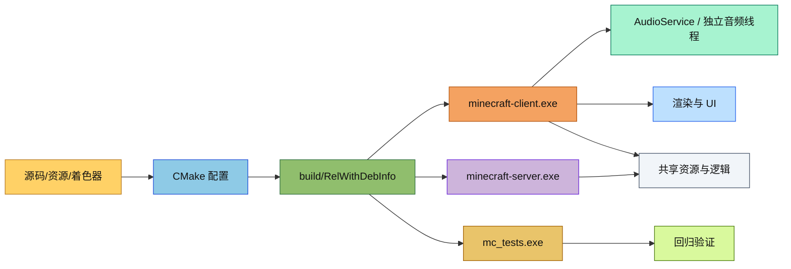
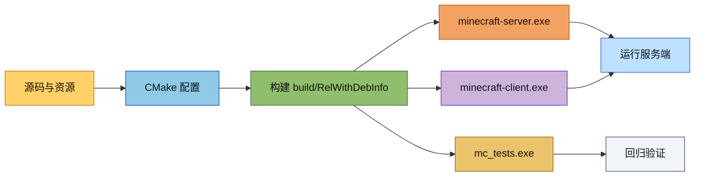

# Minecraft Reborn

现代 Minecraft 克隆，使用 C++17 和 Vulkan 渲染，采用客户端-服务端架构。

## 项目总览

### 目录结构

```text
.
├── README.md
├── CMakeLists.txt
├── shaders/                # Vulkan 着色器
├── resources/              # 原版资源与数据文件
├── src/
│   ├── client/             # 客户端
│   ├── common/             # 客户端/服务端共享代码
│   └── server/             # 服务端
└── tests/                  # 测试（不放 README）
```

### 文件介绍

- `README.md`：项目入口说明、构建方式与运行命令。
- `CMakeLists.txt`：顶层构建入口。
- `src/client`：客户端主循环、渲染、UI、音频、输入和网络。
- `src/common`：共享的实体、方块、资源、网络、物理等基础能力。
- `src/server`：集成服务端与独立服务端实现。
- `resources`：内置资源包与数据文件，音频系统会共享其中的 `resources/data/minecraft`。
- `shaders`：Vulkan 着色器源码与编译产物。

### 模块关系

- `client` 依赖 `common` 和 `server`。
- `server` 依赖 `common`。
- `client/sound` 通过 `AudioService` 共享 `common/resource/ResourcePackList`。
- `client/resource` 和 `client/renderer` 消费资源包输出。

### 整体职责

1. 提供完整的客户端/服务端工程入口。
2. 管理构建、运行与回归测试。
3. 提供统一的资源与着色器组织方式。
4. 维持客户端音频线程、渲染线程和服务端线程的分层边界。

### 输入 / 输出

- 输入：
  - C++ 源码
  - 资源包
  - 着色器源码
  - 设置文件
- 输出：
  - `minecraft-client.exe`
  - `minecraft-server.exe`
  - 测试程序
  - SPIR-V 着色器
  - 日志与性能追踪文件

### 依赖项

- C++17
- CMake
- clang-format
- clang-tidy
- Vulkan
- GLFW
- vcpkg 依赖：`glm`、`spdlog`、`nlohmann-json`、`asio`、`GTest`、`stb` 等

### 代码格式与静态分析

仓库根目录已经提供了 `.clang-format` 和 `.clang-tidy` 配置，项目构建时也会自动导出 `compile_commands.json`，因此 `clang-tidy` 可以直接读取完整编译上下文。

常用命令如下：

```bash
# 格式化单个文件或一组文件
clang-format -i src/common/util/Direction.hpp

# 先检查、再决定是否写回
clang-format --dry-run --Werror src/common/util/Direction.hpp

# 对单个翻译单元运行静态分析
clang-tidy src/common/util/Direction.hpp -p build
```

如果需要批量检查，建议先确保已经生成 `build/compile_commands.json`，再用编辑器集成、脚本或 `run-clang-tidy` 之类的工具批量扫描。

### 使用方法

- 配置：`cmake -B build -G "Visual Studio 17 2022" -A x64 ...`
- 构建：`cmake --build build --config RelWithDebInfo`
- 运行客户端：`./build/bin/RelWithDebInfo/minecraft-client.exe`
- 运行服务端：`./build/bin/RelWithDebInfo/minecraft-server.exe --help`
- 回归测试：`ctest --test-dir build -C RelWithDebInfo --output-on-failure`

### 容易踩的坑

- `RelWithDebInfo` 构建很重，建议优先使用它而不是 Debug。
- 音频资源现在共享 `ResourcePackList`，不要把它当成只读单线程容器。
- 启动期如果额外触发资源包变更，可能导致资源重载，初始化顺序要固定。
- 构建目录可能需要迁移到更大磁盘，避免 `obj/pdb` 写满。
- `clang-tidy` 依赖 `compile_commands.json`，如果你换了构建目录，要先重新配置一次。

### 测试用例

- `tests/common/resource/ResourcePackListSelfContainedTest.cpp`
- `tests/common/test_block.cpp`
- `tests/client/resource/test_resource_location.cpp`

### Mermaid 图表



## 构建命令

### 环境配置

```powershell
# 设置 vcpkg 环境变量
$env:VCPKG_ROOT = "D:\tools\vcpkg"

# 配置项目
cmake -B build -G "Visual Studio 17 2022" -A x64 -DCMAKE_TOOLCHAIN_FILE=D:/tools/vcpkg/scripts/buildsystems/vcpkg.cmake

# 若想启用perfetto性能分析：
cmake -B build -G "Visual Studio 17 2022" -A x64 -DCMAKE_TOOLCHAIN_FILE=D:/tools/vcpkg/scripts/buildsystems/vcpkg.cmake -DMC_ENABLE_TRACING=ON

# 编译
chcp 65001 # 务必记得先执行这一行，避免中文乱码

# 注：即使在开发过程中，也要尽量使用RelWithDebInfo构建，因为Debug运行非常慢，除非必要否则不要用。
# 这行命令除了编译cpp代码之外，还会编译着色器
cmake --build build --config RelWithDebInfo
# 构建过程可能出现“cl : 命令行  error D8040: 创建子进程或与子进程通讯时出错”这种错误，此时只需要重新跑一遍构建命令就行，不用清理构建目录、不用重新生成构建脚本。

# 运行测试
# 强烈建议只运行特定测试并设置brief，运行全部测试会更慢（测试用例有几千个），且很快就会耗尽上下文，导致你无法有效地分析测试结果。
# 建议只在全部编码工作完成之后运行回归测试的时候才运行全部测试，且也要启用brief。
./build/bin/RelWithDebInfo/mc_tests.exe --gtest_filter=ChunkWorkerPoolTest.* --gtest_brief=1

```

# 运行服务端

./build/bin/RelWithDebInfo/minecraft-server.exe --help

# 运行客户端

./build/bin/RelWithDebInfo/minecraft-client.exe

````

增加新的着色器之后要在shaders\CMakeLists.txt中新增文件

## 着色器编译

项目使用 Vulkan SPIR-V 着色器。如果系统未找到着色器编译器，需要手动编译：

### 方法1: 使用 Vulkan SDK 中的 glslc

确保已安装 [Vulkan SDK](https://vulkan.lunarg.com/)，然后：

```powershell
cd D:\MiscProjects\minecraft-reborn
# 编译所有着色器
glslc shaders/block.vert -o build/shaders/block.vert.spv
glslc shaders/block.frag -o build/shaders/block.frag.spv
glslc shaders/debug.vert -o build/shaders/debug.vert.spv
glslc shaders/debug.frag -o build/shaders/debug.frag.spv
````

### 方法2: 使用 CMake 自动编译

如果 Vulkan SDK 已安装并在 PATH 中，CMake 会自动检测 `glslc` 或 `glslangValidator` 并编译着色器：

```powershell
# 重新配置并编译
cmake -B build -G "Visual Studio 17 2022" -A x64 -DCMAKE_TOOLCHAIN_FILE=D:/tools/vcpkg/scripts/buildsystems/vcpkg.cmake
cmake --build build --config RelWithDebInfo
```

## 依赖

通过 vcpkg 管理：

- **glm** - 数学库
- **spdlog** - 日志
- **nlohmann-json** - JSON 解析
- **glfw3** - 窗口/输入
- **Vulkan** - 图形 API
- **VulkanMemoryAllocator** - GPU 内存管理
- **asio** - 网络 (异步 I/O)
- **GTest** - 测试框架
- **stb** - 图像加载

## Mermaid 图


