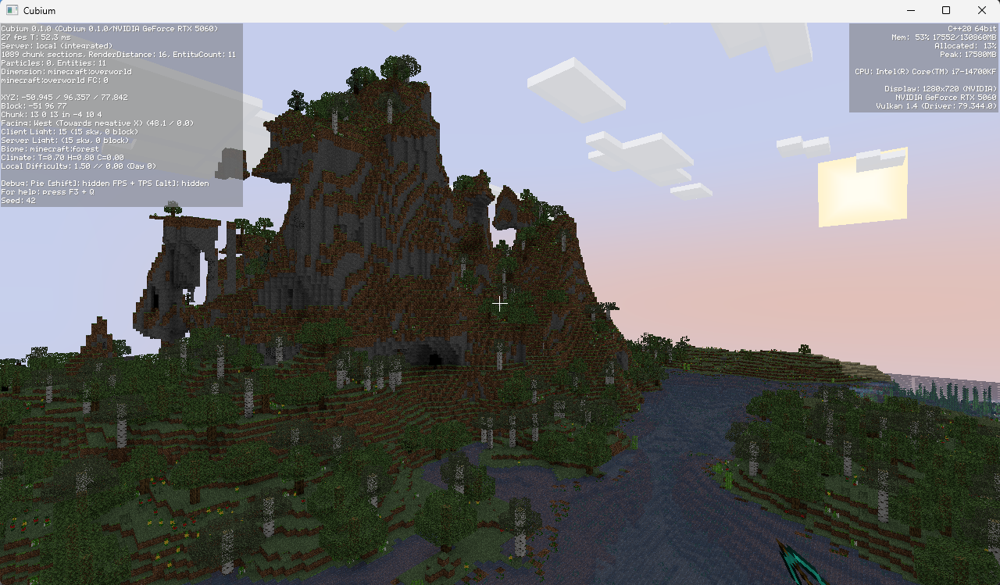
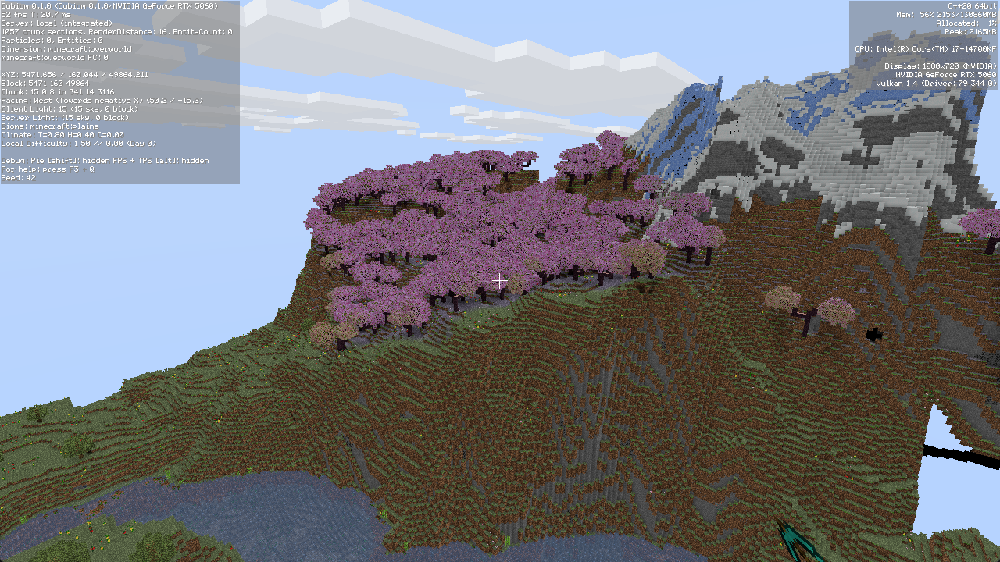

# Cubium





现代 Minecraft 第三方完整实现，使用 C++20 和 Vulkan 渲染，采用客户端-服务端架构。

## 项目总览

### 目录结构

```text
.
├── README.md
├── CMakeLists.txt
├── scripts/                # 构建 & 工具脚本
│   ├── configure.bat       # Windows 构建环境配置 (CMD)
│   ├── configure.sh        # Windows 构建环境配置 (Git Bash)
│   ├── configure.ps1       # Windows 构建环境配置 (PowerShell)
│   ├── tidy/               # clang-tidy 静态分析
│   │   ├── tidy.sh         #   Bash 版本
│   │   └── tidy.ps1        #   PowerShell 版本
│   └── vsenv.bat           # VS 开发环境注入
├── shaders/                # Vulkan 着色器
├── resources/              # 原版资源与数据文件
├── src/
│   ├── client/             # 客户端
│   ├── common/             # 客户端/服务端共享代码
│   └── server/             # 服务端
└── tests/                  # 测试（不放 README）
```

详细的构建指南见 [docs/BUILD.md](docs/BUILD.md)，包含环境配置、构建命令、运行方式、着色器编译、VS Code IntelliSense 配置、本地 Sanitizer 构建等。

## 运行客户端

### Windows / Linux

直接运行构建产物：

```bash
./build/bin/RelWithDebInfo/minecraft-client
```

### macOS

macOS 上 Vulkan 加载器（vcpkg 打包的 `libvulkan`）默认不会发现 Homebrew 安装的 MoltenVK 驱动，必须通过 `VK_ICD_FILENAMES` 指向 ICD 清单，否则 `vkCreateInstance` 会返回 `-9`（`VK_ERROR_INCOMPATIBLE_DRIVER`）。启动命令：

```bash
# 方式 A：作为命令前缀（仅对本次启动生效）
VK_ICD_FILENAMES=/opt/homebrew/etc/vulkan/icd.d/MoltenVK_icd.json build/bin/RelWithDebInfo/minecraft-client

# 方式 B：先 export 再运行（当前 shell 后续都生效）
export VK_ICD_FILENAMES=/opt/homebrew/etc/vulkan/icd.d/MoltenVK_icd.json
build/bin/RelWithDebInfo/minecraft-client
```

> 注意：`VAR=value;` 单独一行（带分号、另起一行再运行二进制）只会设置 shell 变量而**不会**导出给子进程，进程仍然读不到该变量，会再次报 `-9`。请用上面两种写法之一。
>
> MoltenVK 经 Homebrew 安装时，ICD 清单路径为 `/opt/homebrew/etc/vulkan/icd.d/MoltenVK_icd.json`；若改用 Vulkan SDK 安装，路径见 SDK 目录下的 `share/vulkan/icd.d/`。

## 测试

项目测试基于 GoogleTest，通过 CTest 编排运行，支持单用例限时（默认 300 秒）、并行、按名筛选。完整指南见 [docs/TEST.md](docs/TEST.md)。

## clang-tidy 静态分析

项目配置了 `.clang-tidy` 文件，启用 `bugprone-*`、`clang-analyzer-*`、`concurrency-*`、`performance-*` 等检查规则。

由于项目使用 clang-cl 编译，`compile_commands.json` 会导致 clang-tidy segfault，因此需要使用项目提供的脚本，自动注入 MSVC / Windows SDK / vcpkg 头文件路径。

### 用法

```bash
# Bash (Git Bash)
./scripts/tidy/tidy.sh src/server/world/ServerChunkManager.cpp    # 扫描单个文件
./scripts/tidy/tidy.sh src/common/world/*.cpp                      # 扫描多个文件
./scripts/tidy/tidy.sh                                             # 不指定文件则扫描全部 src/

# PowerShell
.\scripts\tidy\tidy.ps1 src\server\world\ServerChunkManager.cpp
.\scripts\tidy\tidy.ps1                                            # 扫描全部 src/
```

### 常用选项

```bash
# 自动修复（谨慎使用，先不加 --fix 确认告警）
./scripts/tidy/tidy.sh --fix src/server/world/Foo.cpp

# 只跑特定检查
./scripts/tidy/tidy.sh --checks 'bugprone-use-after-move' src/common/core/Result.hpp

# 覆盖告警等级（不视为错误）
./scripts/tidy/tidy.sh --warnings-as-errors='' src/server/world/Foo.cpp
```

### 环境变量

| 变量 | 说明 | 默认值 |
|------|------|--------|
| `CLANG_TIDY` | clang-tidy 可执行文件路径 | 自动检测 PATH / VS 内置 |
| `MSVC_ROOT` | MSVC 工具链根目录 | 自动检测最新版本 |
| `WIN_SDK_ROOT` | Windows Kits 根目录 | `D:/Windows Kits` |
| `WIN_SDK_VERSION` | SDK 版本号 | 自动检测最新版本 |

### 输出示例

```
Using clang-tidy: /d/Program Files/.../clang-tidy
MSVC: D:/Program Files/.../MSVC/14.51.36231
Windows SDK: D:/Windows Kits/10/Include/10.0.26100.0
Scanning 1 file(s)...

FAIL: src/server/world/ServerChunkManager.cpp
src/server/world/ServerChunkManager.cpp:47:70: error: the parameter 'waiters'
  is copied for each invocation but only used as a const reference
  [performance-unnecessary-value-param,-warnings-as-errors]

==========================================
  Total: 1  Pass: 0  Fail: 1  Skip: 0
==========================================
```

## 依赖

见vcpkg.json
