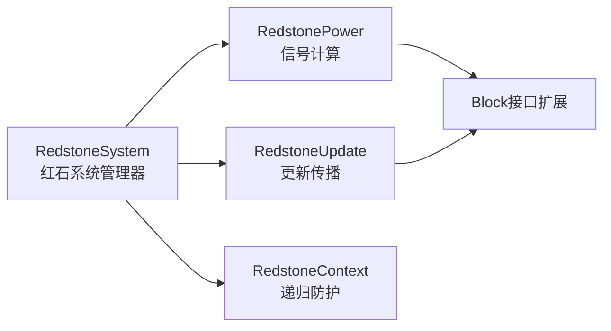
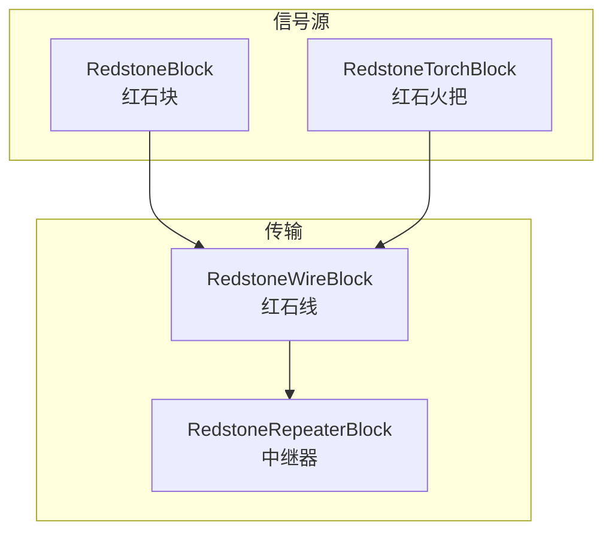
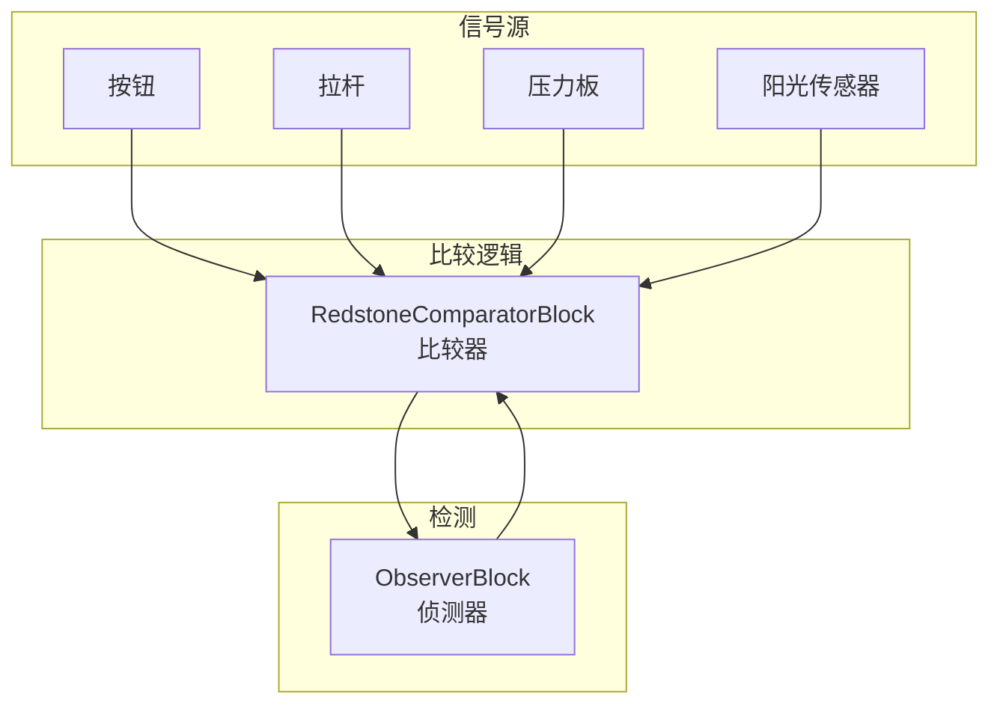
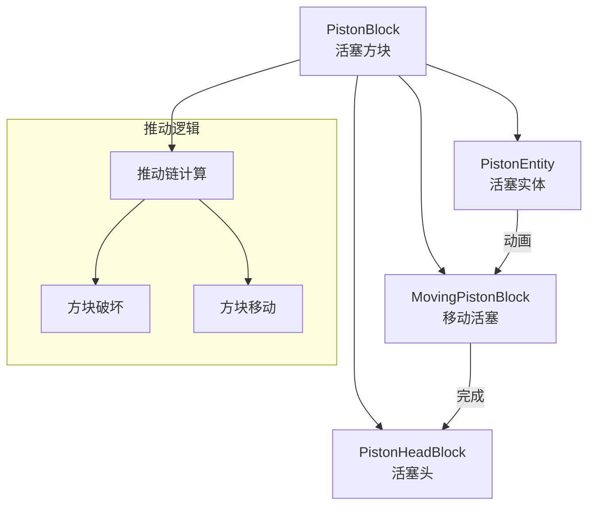
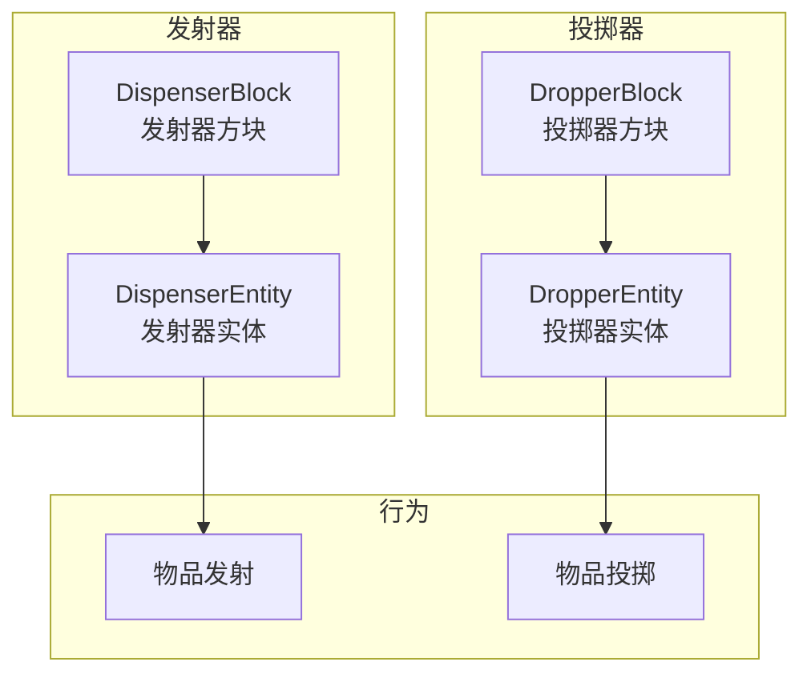
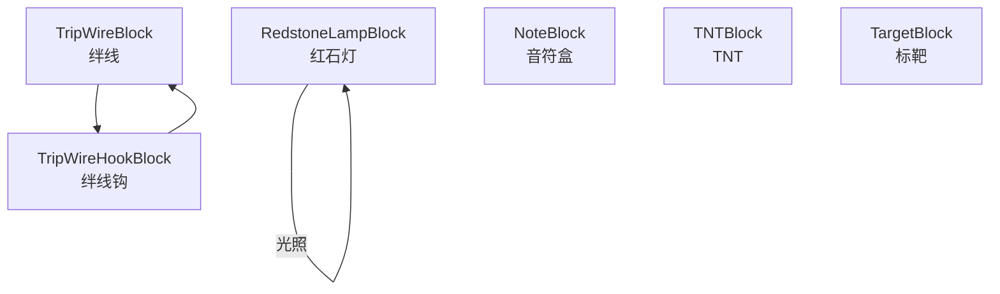

# 红石系统实现计划

> **目标**：为 Minecraft Reborn 项目实现完整、优雅、可扩展的红石系统，复刻 MC Java 1.16.5 游戏逻辑，同时采用现代 C++ 架构设计。

---

## 一、系统架构总览

```mermaid
graph TB
    subgraph "红石核心系统"
        RS[RedstoneSystem<br/>红石系统管理器]
        RP[RedstonePower<br/>信号强度计算]
        RU[RedstoneUpdate<br/>更新传播机制]
    end

    subgraph "红石组件层"
        RW[RedstoneWireBlock<br/>红石线]
        RT[RedstoneTorchBlock<br/>红石火把]
        RR[RedstoneRepeaterBlock<br/>红石中继器]
        RC[RedstoneComparatorBlock<br/>红石比较器]
        OB[ObserverBlock<br/>侦测器]
        PB[PistonBlock<br/>活塞]
        RB[RedstoneBlock<br/>红石块]
        RL[RedstoneLampBlock<br/>红石灯]
    end

    subgraph "信号源层"
        AB[AbstractButtonBlock<br/>按钮]
        LV[LeverBlock<br/>拉杆]
        PP[PressurePlateBlock<br/>压力板]
        WP[WeightedPressurePlateBlock<br/>加权压力板]
        DD[DaylightDetectorBlock<br/>阳光传感器]
        TW[TripWireHookBlock<br/>绊线钩]
    end

    subgraph "方块实体层"
        PE[PistonEntity<br/>活塞实体]
        CE[ComparatorEntity<br/>比较器实体]
        DE[DispenserEntity<br/>发射器实体]
        DrE[DropperEntity<br/>投掷器实体]
        ObE[ObserverEntity<br/>侦测器实体]
    end

    subgraph "基础设施层"
        TM[TickManager<br/>计划刻管理]
        BE[BlockEntity<br/>方块实体基类]
        BL[Block<br/>方块基类]
        WD[IWorld/World<br/>世界接口]
    end

    RS --> RP
    RS --> RU
    RS --> TM

    RW --> RP
    RW --> RU
    RT --> RP
    RR --> RP
    RC --> RP
    OB --> RU
    PB --> RU
    RB --> RP
    RL --> RP

    AB --> RP
    LV --> RP
    PP --> RP
    WP --> RP
    DD --> RP
    TW --> RP

    PB --> PE
    RC --> CE
    OB --> ObE

    RS --> WD
    RP --> BL
    RU --> BL
    PE --> BE
    CE --> BE
```



---

## 二、目录结构设计

```
src/common/
├── world/
│   ├── block/
│   │   ├── blocks/
│   │   │   ├── redstone/                    # 红石方块（新建）
│   │   │   │   ├── README.md
│   │   │   │   ├── RedstoneWireBlock.hpp    # 红石线
│   │   │   │   ├── RedstoneWireBlock.cpp
│   │   │   │   ├── RedstoneTorchBlock.hpp   # 红石火把
│   │   │   │   ├── RedstoneTorchBlock.cpp
│   │   │   │   ├── RedstoneWallTorchBlock.hpp # 墙上红石火把
│   │   │   │   ├── RedstoneWallTorchBlock.cpp
│   │   │   │   ├── RedstoneRepeaterBlock.hpp # 红石中继器
│   │   │   │   ├── RedstoneRepeaterBlock.cpp
│   │   │   │   ├── RedstoneComparatorBlock.hpp # 红石比较器
│   │   │   │   ├── RedstoneComparatorBlock.cpp
│   │   │   │   ├── RedstoneBlock.hpp        # 红石块（固体信号源）
│   │   │   │   ├── RedstoneBlock.cpp
│   │   │   │   ├── RedstoneLampBlock.hpp    # 红石灯
│   │   │   │   ├── RedstoneLampBlock.cpp
│   │   │   │   ├── RedstoneDiodeBlock.hpp   # 二极管基类（中继器/比较器）
│   │   │   │   ├── RedstoneDiodeBlock.cpp
│   │   │   │   ├── ObserverBlock.hpp        # 侦测器
│   │   │   │   ├── ObserverBlock.cpp
│   │   │   │   ├── PistonBlock.hpp          # 活塞
│   │   │   │   ├── PistonBlock.cpp
│   │   │   │   ├── PistonHeadBlock.hpp      # 活塞头
│   │   │   │   ├── PistonHeadBlock.cpp
│   │   │   │   ├── MovingPistonBlock.hpp    # 移动中的活塞
│   │   │   │   ├── MovingPistonBlock.cpp
│   │   │   │   ├── DispenserBlock.hpp       # 发射器
│   │   │   │   ├── DispenserBlock.cpp
│   │   │   │   ├── DropperBlock.hpp         # 投掷器
│   │   │   │   ├── DropperBlock.cpp
│   │   │   │   ├── DaylightDetectorBlock.hpp # 阳光传感器
│   │   │   │   ├── DaylightDetectorBlock.cpp
│   │   │   │   ├── LeverBlock.hpp           # 拉杆
│   │   │   │   ├── LeverBlock.cpp
│   │   │   │   ├── TripWireHookBlock.hpp    # 绊线钩
│   │   │   │   ├── TripWireHookBlock.cpp
│   │   │   │   ├── TripWireBlock.hpp        # 绊线
│   │   │   │   ├── TripWireBlock.cpp
│   │   │   │   └── Buttons/                 # 按钮子目录
│   │   │   │       ├── README.md
│   │   │   │       ├── AbstractButtonBlock.hpp
│   │   │   │       ├── AbstractButtonBlock.cpp
│   │   │   │       ├── StoneButtonBlock.hpp
│   │   │   │       ├── StoneButtonBlock.cpp
│   │   │   │       ├── WoodenButtonBlock.hpp
│   │   │   │       └── WoodenButtonBlock.cpp
│   │   │   ├── pressureplate/               # 压力板子目录（新建）
│   │   │   │   ├── README.md
│   │   │   │   ├── PressurePlateBlock.hpp   # 普通压力板基类
│   │   │   │   ├── PressurePlateBlock.cpp
│   │   │   │   ├── WeightedPressurePlateBlock.hpp # 加权压力板
│   │   │   │   └── WeightedPressurePlateBlock.cpp
│   │   │   └── ...
│   │   └── ...
│   ├── blockentity/
│   │   ├── redstone/                        # 红石方块实体（新建）
│   │   │   ├── README.md
│   │   │   ├── PistonEntity.hpp             # 活塞实体
│   │   │   ├── PistonEntity.cpp
│   │   │   ├── ComparatorEntity.hpp         # 比较器实体
│   │   │   ├── ComparatorEntity.cpp
│   │   │   ├── DispenserEntity.hpp          # 发射器实体
│   │   │   ├── DispenserEntity.cpp
│   │   │   ├── DropperEntity.hpp            # 投掷器实体
│   │   │   ├── DropperEntity.cpp
│   │   │   ├── ObserverEntity.hpp           # 侦测器实体
│   │   │   ├── ObserverEntity.cpp
│   │   │   ├── DaylightDetectorEntity.hpp   # 阳光传感器实体
│   │   │   └── DaylightDetectorEntity.cpp
│   │   └── ...
│   └── redstone/                            # 红石核心系统（新建）
│       ├── README.md
│       ├── RedstoneSystem.hpp               # 红石系统管理器
│       ├── RedstoneSystem.cpp
│       ├── RedstonePower.hpp                # 信号强度计算
│       ├── RedstonePower.cpp
│       ├── RedstoneUpdate.hpp               # 更新传播
│       ├── RedstoneUpdate.cpp
│       ├── RedstoneHelper.hpp               # 辅助函数
│       ├── RedstoneHelper.cpp
│       └── RedstoneContext.hpp              # 红石上下文（防止无限递归）
```

---

## 三、核心类设计

### 3.1 红石系统管理器 (RedstoneSystem)

```cpp
// src/common/world/redstone/RedstoneSystem.hpp
#pragma once

#include "world/tick/base/TickPriority.hpp"
#include <unordered_set>
#include <vector>

namespace mc {
namespace world {
namespace redstone {

class IWorld;
class BlockPos;
class BlockState;
class Block;

/**
 * @brief 红石系统管理器
 *
 * 负责协调红石信号的计算、更新和传播。
 * 使用单例模式，通过 IWorld 接口与世界交互。
 *
 * ## 核心职责
 * 1. 红石信号强度计算
 * 2. 更新传播和调度
 * 3. 防止无限递归
 * 4. 性能优化（批处理）
 *
 * ## 使用示例
 * ```cpp
 * auto& redstone = RedstoneSystem::instance();
 * redstone.updateNeighbors(world, pos);
 * redstone.scheduleUpdate(world, pos, block, 2);
 * ```
 */
class RedstoneSystem {
public:
    static RedstoneSystem& instance();

    /**
     * @brief 获取指定位置的红石信号强度
     *
     * 计算方块接收到的总红石信号强度，包括：
     * - 直接强信号（红石火把、中继器等）
     * - 弱信号（红石线传导）
     * - 方块内部信号（比较器检测容器）
     *
     * @param world 世界引用
     * @param pos 方块位置
     * @return i32 信号强度 0-15
     */
    [[nodiscard]] i32 getReceivedPower(IWorld& world, const BlockPos& pos) const;

    /**
     * @brief 获取指定方向的红石信号强度
     *
     * @param world 世界引用
     * @param pos 方块位置
     * @param direction 信号来源方向
     * @return i32 信号强度 0-15
     */
    [[nodiscard]] i32 getPowerOnSide(IWorld& world, const BlockPos& pos,
                                      Direction direction) const;

    /**
     * @brief 更新相邻方块的红石状态
     *
     * 当红石信号变化时，通知相邻方块更新状态。
     * 这会触发 neighborChanged 回调。
     *
     * @param world 世界引用
     * @param pos 信号源位置
     * @param block 信号源方块
     */
    void updateNeighbors(IWorld& world, const BlockPos& pos, Block& block);

    /**
     * @brief 更新指定方向以外的相邻方块
     *
     * 用于红石线等需要跳过特定方向的更新。
     *
     * @param world 世界引用
     * @param pos 信号源位置
     * @param block 信号源方块
     * @param skipDirection 跳过的方向
     */
    void updateNeighborsExcept(IWorld& world, const BlockPos& pos,
                               Block& block, Direction skipDirection);

    /**
     * @brief 调度红石更新
     *
     * 安排延迟tick执行的红石更新。
     * 红石更新使用高优先级执行。
     *
     * @param world 世界引用
     * @param pos 更新位置
     * @param block 方块引用
     * @param delay 延迟tick数
     * @param priority tick优先级（默认High）
     */
    void scheduleUpdate(IWorld& world, const BlockPos& pos, Block& block,
                       i32 delay, tick::TickPriority priority = tick::TickPriority::High);

    /**
     * @brief 检查位置是否正在被更新（防止递归）
     *
     * @param pos 检查位置
     * @return true 如果位置正在更新中
     */
    [[nodiscard]] bool isUpdating(const BlockPos& pos) const;

    /**
     * @brief 开始更新某个位置
     *
     * 将位置加入更新集合，防止递归更新。
     * 更新完成后必须调用 endUpdate。
     *
     * @param pos 更新位置
     */
    void beginUpdate(const BlockPos& pos);

    /**
     * @brief 结束更新某个位置
     *
     * 从更新集合中移除位置。
     *
     * @param pos 更新位置
     */
    void endUpdate(const BlockPos& pos);

private:
    RedstoneSystem() = default;

    // 正在更新的位置集合（防止递归）
    std::unordered_set<BlockPos> m_updatingPositions;
};

} // namespace redstone
} // namespace world
} // namespace mc
```

### 3.2 红石信号计算 (RedstonePower)

```cpp
// src/common/world/redstone/RedstonePower.hpp
#pragma once

#include "core/Types.hpp"
#include "world/block/BlockState.hpp"
#include "world/Direction.hpp"

namespace mc {
namespace world {
namespace redstone {

class IWorld;
class BlockPos;

/**
 * @brief 红石信号强度计算工具
 *
 * 提供静态方法计算各种红石信号强度。
 * 区分强信号和弱信号，支持方向性计算。
 */
class RedstonePower {
public:
    /// 红石信号最大强度
    static constexpr i32 MAX_POWER = 15;

    /// 红石信号最小强度
    static constexpr i32 MIN_POWER = 0;

    /**
     * @brief 获取方块的强信号输出
     *
     * 强信号直接从方块侧面输出，可以被红石线检测。
     * 例如：红石火把、中继器输出端。
     *
     * @param world 世界引用
     * @param pos 方块位置
     * @param side 输出方向
     * @return i32 强信号强度 0-15
     */
    [[nodiscard]] static i32 getStrongPower(IWorld& world,
                                             const BlockPos& pos,
                                             Direction side);

    /**
     * @brief 获取方块所有方向的强信号总和
     *
     * @param world 世界引用
     * @param pos 方块位置
     * @return i32 最强方向的强信号强度
     */
    [[nodiscard]] static i32 getStrongPower(IWorld& world, const BlockPos& pos);

    /**
     * @brief 获取方块的弱信号输出
     *
     * 弱信号通过方块传导，强度不叠加。
     * 例如：被充能的方块、红石线。
     *
     * @param world 世界引用
     * @param pos 方块位置
     * @param side 输出方向
     * @return i32 弱信号强度 0-15
     */
    [[nodiscard]] static i32 getWeakPower(IWorld& world,
                                           const BlockPos& pos,
                                           Direction side);

    /**
     * @brief 获取方块所有方向的弱信号
     *
     * @param world 世界引用
     * @param pos 方块位置
     * @return i32 最强方向的弱信号强度
     */
    [[nodiscard]] static i32 getWeakPower(IWorld& world, const BlockPos& pos);

    /**
     * @brief 检查方块是否被红石信号充能
     *
     * 当任意方向的强信号或弱信号 > 0 时返回 true。
     *
     * @param world 世界引用
     * @param pos 方块位置
     * @return true 如果被充能
     */
    [[nodiscard]] static bool isPowered(IWorld& world, const BlockPos& pos);

    /**
     * @brief 检查方块是否被间接充能
     *
     * 检查相邻方块是否有强信号输出。
     *
     * @param world 世界引用
     * @param pos 方块位置
     * @return true 如果被间接充能
     */
    [[nodiscard]] static bool isIndirectlyPowered(IWorld& world, const BlockPos& pos);

    /**
     * @brief 检查方块侧面是否被充能
     *
     * @param world 世界引用
     * @param pos 方块位置
     * @param side 检查方向
     * @return true 如果该方向被充能
     */
    [[nodiscard]] static bool isSidePowered(IWorld& world,
                                            const BlockPos& pos,
                                            Direction side);

    /**
     * @brief 获取红石线的输入信号强度
     *
     * 计算红石线从相邻方块接收的信号强度，
     * 包括水平方向的衰减和垂直方向的传导。
     *
     * @param world 世界引用
     * @param pos 红石线位置
     * @return i32 输入信号强度 0-15
     */
    [[nodiscard]] static i32 getWireInputPower(IWorld& world, const BlockPos& pos);

    /**
     * @brief 计算比较器输入信号
     *
     * 检测容器信号输出或红石线信号。
     *
     * @param world 世界引用
     * @param pos 比较器位置
     * @param facing 比较器朝向
     * @return i32 输入信号强度 0-15
     */
    [[nodiscard]] static i32 getComparatorInput(IWorld& world,
                                                 const BlockPos& pos,
                                                 Direction facing);
};

} // namespace redstone
} // namespace world
} // namespace mc
```

### 3.3 红石二极管基类 (RedstoneDiodeBlock)

```cpp
// src/common/world/block/blocks/redstone/RedstoneDiodeBlock.hpp
#pragma once

#include "world/block/Block.hpp"
#include "world/Direction.hpp"

namespace mc {
namespace blocks {

/**
 * @brief 红石二极管基类
 *
 * 中继器（RepeaterBlock）和比较器（ComparatorBlock）的公共基类。
 * 提供方向性信号传输、锁定检测等通用功能。
 *
 * ## 子类需要实现
 * - getDelay(): 返回延迟tick数
 * - shouldBePowered(): 判断是否应该输出信号
 * - calculateOutputSignal(): 计算输出信号强度
 *
 * ## 特性
 * - 只能水平放置
 * - 有明确的输入端和输出端
 * - 支持侧面锁定
 * - 支持延迟更新
 */
class RedstoneDiodeBlock : public Block {
public:
    // ========== 方块状态属性 ==========

    /// 朝向属性（水平四方向）
    [[nodiscard]] static util::DirectionProperty& FACING();

    /// 是否充能（输出信号）
    [[nodiscard]] static util::BooleanProperty& POWERED();

    // ========== 构造函数 ==========

    RedstoneBlock(const String& id, const BlockBehaviour& behaviour);

    // ========== Block 接口实现 ==========

    [[nodiscard]] bool canProvidePower(const BlockState& state) const override {
        return true;
    }

    [[nodiscard]] i32 getWeakPower(const BlockState& state, IWorld& world,
                                   const BlockPos& pos, Direction side) const override;

    void neighborChanged(IWorld& world, const BlockPos& pos, Block& neighborBlock,
                        const BlockPos& neighborPos, bool isMoving) override;

    void onBlockAdded(IWorld& world, const BlockPos& pos,
                     const BlockState& state) override;

    void tick(IWorld& world, const BlockPos& pos, BlockState& state) override;

    // ========== 红石二极管特有方法 ==========

    /**
     * @brief 获取延迟tick数
     *
     * 子类必须实现，返回信号延迟。
     * - 中继器：2-8 ticks
     * - 比较器：2 ticks
     *
     * @param state 当前方块状态
     * @return i32 延迟tick数
     */
    [[nodiscard]] virtual i32 getDelay(const BlockState& state) const = 0;

    /**
     * @brief 判断是否应该输出信号
     *
     * 根据输入信号判断是否应该激活。
     *
     * @param world 世界引用
     * @param pos 方块位置
     * @param state 当前方块状态
     * @return true 如果应该输出信号
     */
    [[nodiscard]] virtual bool shouldBePowered(IWorld& world, const BlockPos& pos,
                                               const BlockState& state) const = 0;

    /**
     * @brief 计算输出信号强度
     *
     * @param world 世界引用
     * @param pos 方块位置
     * @param state 当前方块状态
     * @return i32 输出信号强度 0-15
     */
    [[nodiscard]] virtual i32 calculateOutputSignal(IWorld& world, const BlockPos& pos,
                                                    const BlockState& state) const;

    /**
     * @brief 检查是否被锁定
     *
     * 当侧面有信号输入时，二极管被锁定，
     * 保持当前输出状态不变。
     *
     * @param world 世界引用
     * @param pos 方块位置
     * @param state 当前方块状态
     * @return true 如果被锁定
     */
    [[nodiscard]] virtual bool isLocked(IWorld& world, const BlockPos& pos,
                                        const BlockState& state) const;

    /**
     * @brief 获取输入信号强度
     *
     * 从前方获取红石信号，支持红石线信号检测。
     *
     * @param world 世界引用
     * @param pos 方块位置
     * @param state 当前方块状态
     * @return i32 输入信号强度 0-15
     */
    [[nodiscard]] i32 getInputSignal(IWorld& world, const BlockPos& pos,
                                     const BlockState& state) const;

    /**
     * @brief 获取侧面信号强度
     *
     * 用于锁定检测。
     *
     * @param world 世界引用
     * @param pos 方块位置
     * @param state 当前方块状态
     * @return i32 侧面信号最大强度
     */
    [[nodiscard]] i32 getPowerOnSides(IWorld& world, const BlockPos& pos,
                                      const BlockState& state) const;

protected:
    /**
     * @brief 触发状态更新
     *
     * 检查是否需要改变状态，如果需要则调度延迟更新。
     *
     * @param world 世界引用
     * @param pos 方块位置
     * @param state 当前方块状态
     */
    void updateState(IWorld& world, const BlockPos& pos, const BlockState& state);

    /**
     * @brief 检查是否朝向另一个二极管
     *
     * 用于确定更新优先级。
     *
     * @param world 世界引用
     * @param pos 方块位置
     * @param state 当前方块状态
     * @return true 如果朝向另一个二极管
     */
    [[nodiscard]] bool isFacingTowardsRepeater(IWorld& world, const BlockPos& pos,
                                               const BlockState& state) const;
};

} // namespace blocks
} // namespace mc
```

### 3.4 红石线 (RedstoneWireBlock)

```cpp
// src/common/world/block/blocks/redstone/RedstoneWireBlock.hpp
#pragma once

#include "world/block/Block.hpp"
#include "world/Direction.hpp"

namespace mc {
namespace blocks {

/**
 * @brief 红石连接类型
 *
 * 描述红石线在某个方向的连接状态。
 */
enum class RedstoneSide : u8 {
    None = 0,   ///< 无连接
    Side = 1,   ///< 水平连接
    Up = 2      ///< 向上连接（连接到高一格的方块侧面）
};

/**
 * @brief 红石线方块
 *
 * 红石线是红石系统的核心组件，负责信号传输和衰减。
 *
 * ## 核心机制
 * - 信号强度：0-15，每传输一格衰减1
 * - 连接状态：四个方向独立计算
 * - 十字形连接：信号向四个方向传输
 * - T形/L形连接：根据相邻方块动态调整
 *
 * ## 信号传播
 * 1. 从相邻信号源获取信号
 * 2. 计算本方块信号强度
 * 3. 向连接的相邻红石线传播
 * 4. 更新所有连接的红石组件
 *
 * ## 容易踩的坑
 * - 信号传播顺序影响性能，需要优化
 * - 向上/向下连接需要特殊处理
 * - 避免无限递归更新
 */
class RedstoneWireBlock : public Block {
public:
    // ========== 方块状态属性 ==========

    /// 信号强度 0-15
    [[nodiscard]] static util::IntegerProperty& POWER();

    /// 四个方向的连接状态
    [[nodiscard]] static util::EnumProperty<RedstoneSide>& NORTH();
    [[nodiscard]] static util::EnumProperty<RedstoneSide>& EAST();
    [[nodiscard]] static util::EnumProperty<RedstoneSide>& SOUTH();
    [[nodiscard]] static util::EnumProperty<RedstoneSide>& WEST();

    // ========== 构造函数 ==========

    RedstoneWireBlock();

    // ========== Block 接口实现 ==========

    [[nodiscard]] BlockState defaultState() const override;

    [[nodiscard]] BlockState updatePostPlacement(
        const BlockState& state, Direction facing,
        const BlockState& facingState, IWorld& world,
        const BlockPos& currentPos, const BlockPos& facingPos) override;

    void neighborChanged(IWorld& world, const BlockPos& pos, Block& neighborBlock,
                        const BlockPos& neighborPos, bool isMoving) override;

    void onBlockAdded(IWorld& world, const BlockPos& pos,
                     const BlockState& state) override;

    void onBlockRemoved(IWorld& world, const BlockPos& pos,
                       const BlockState& state) override;

    void tick(IWorld& world, const BlockPos& pos, BlockState& state) override;

    [[nodiscard]] bool canProvidePower(const BlockState& state) const override {
        return true;
    }

    [[nodiscard]] i32 getWeakPower(const BlockState& state, IWorld& world,
                                   const BlockPos& pos, Direction side) const override;

    // ========== 红石线特有方法 ==========

    /**
     * @brief 更新信号强度和连接状态
     *
     * 核心方法：计算本方块应该有的信号强度，
     * 更新方块状态，传播信号到相邻红石线。
     *
     * @param world 世界引用
     * @param pos 红石线位置
     * @return true 如果信号强度发生变化
     */
    bool updatePower(IWorld& world, const BlockPos& pos);

    /**
     * @brief 计算连接状态
     *
     * 根据相邻方块类型确定四个方向的连接状态。
     *
     * @param world 世界引用
     * @param pos 红石线位置
     * @param state 当前方块状态
     * @return BlockState 更新后的方块状态
     */
    [[nodiscard]] BlockState calculateConnections(IWorld& world,
                                                   const BlockPos& pos,
                                                   const BlockState& state) const;

    /**
     * @brief 检查是否可以连接到指定方向
     *
     * @param world 世界引用
     * @param pos 红石线位置
     * @param direction 检查方向
     * @return RedstoneSide 连接类型
     */
    [[nodiscard]] RedstoneSide getConnection(IWorld& world,
                                             const BlockPos& pos,
                                             Direction direction) const;

    /**
     * @brief 判断方块是否可以连接红石
     *
     * 检查方块是否能够接收或输出红石信号。
     *
     * @param state 方块状态
     * @return true 如果可以连接
     */
    [[nodiscard]] static bool canConnectTo(const BlockState& state);

    /**
     * @brief 获取当前信号强度
     *
     * @param state 方块状态
     * @return i32 信号强度 0-15
     */
    [[nodiscard]] static i32 getPower(const BlockState& state);

    /**
     * @brief 设置信号强度
     *
     * @param state 方块状态（会被修改）
     * @param power 信号强度 0-15
     * @return BlockState 更新后的状态
     */
    [[nodiscard]] static BlockState withPower(BlockState state, i32 power);

private:
    /**
     * @brief 通知相邻红石组件更新
     *
     * @param world 世界引用
     * @param pos 红石线位置
     */
    void notifyWireNeighbors(IWorld& world, const BlockPos& pos);
};

} // namespace blocks
} // namespace mc
```

### 3.5 活塞系统设计

```cpp
// src/common/world/block/blocks/redstone/PistonBlock.hpp
#pragma once

#include "world/block/Block.hpp"
#include "world/Direction.hpp"

namespace mc {
namespace blocks {

/**
 * @brief 活塞移动方向
 */
enum class PistonAction : u8 {
    Extend = 0,  ///< 伸出
    Retract = 1  ///< 收回
};

/**
 * @brief 活塞方块
 *
 * 活塞是红石系统中最复杂的组件之一，负责推动/拉动方块。
 *
 * ## 核心机制
 * - 伸出：推动最多12个方块
 * - 收回：粘性活塞可以拉回方块
 * - 动画：需要 PistonEntity 支持动画渲染
 *
 * ## 推动规则
 * - 黑曜石、基岩等无法推动
 * - 有方块实体的方块无法推动
 * - 最大推动距离：12格
 * - 推动时会破坏某些方块（花、草等）
 *
 * ## 容易踩的坑
 * - 推动顺序很重要：先计算推动链
 * - 收回时可能需要丢弃方块
 * - 动画期间方块是特殊状态
 */
class PistonBlock : public Block {
public:
    // ========== 方块状态属性 ==========

    /// 朝向
    [[nodiscard]] static util::DirectionProperty& FACING();

    /// 是否伸出
    [[nodiscard]] static util::BooleanProperty& EXTENDED();

    // ========== 构造函数 ==========

    /**
     * @brief 构造活塞方块
     * @param isSticky 是否为粘性活塞
     */
    explicit PistonBlock(bool isSticky);

    // ========== Block 接口实现 ==========

    [[nodiscard]] BlockState defaultState() const override;

    void neighborChanged(IWorld& world, const BlockPos& pos, Block& neighborBlock,
                        const BlockPos& neighborPos, bool isMoving) override;

    void onBlockAdded(IWorld& world, const BlockPos& pos,
                     const BlockState& state) override;

    [[nodiscard]] bool canProvidePower(const BlockState& state) const override {
        return false; // 活塞不输出红石信号
    }

    // ========== 活塞特有方法 ==========

    /**
     * @brief 检查是否应该伸出
     *
     * @param world 世界引用
     * @param pos 活塞位置
     * @param state 当前方块状态
     * @return true 如果应该伸出
     */
    [[nodiscard]] bool shouldExtend(IWorld& world, const BlockPos& pos,
                                    const BlockState& state) const;

    /**
     * @brief 检查方块是否可以被推动
     *
     * @param blockState 方块状态
     * @param world 世界引用
     * @param pos 方块位置
     * @param facing 推动方向
     * @param destroyBlocks 是否可以破坏方块
     * @param pistonFacing 活塞朝向
     * @return true 如果可以推动
     */
    [[nodiscard]] static bool canPush(const BlockState& blockState, IWorld& world,
                                      const BlockPos& pos, Direction facing,
                                      bool destroyBlocks, Direction pistonFacing);

    /**
     * @brief 执行活塞伸出
     *
     * @param world 世界引用
     * @param pos 活塞位置
     * @param state 当前方块状态
     * @return true 如果伸出成功
     */
    bool extend(IWorld& world, const BlockPos& pos, const BlockState& state);

    /**
     * @brief 执行活塞收回
     *
     * @param world 世界引用
     * @param pos 活塞位置
     * @param state 当前方块状态
     * @return true 如果收回成功
     */
    bool retract(IWorld& world, const BlockPos& pos, const BlockState& state);

    /**
     * @brief 是否为粘性活塞
     */
    [[nodiscard]] bool isSticky() const { return m_isSticky; }

private:
    bool m_isSticky;

    /**
     * @brief 计算推动链
     *
     * 分析需要推动的所有方块，返回推动列表。
     *
     * @param world 世界引用
     * @param pos 活塞位置
     * @param facing 推动方向
     * @param toMove 输出：需要移动的方块列表
     * @param toBreak 输出：需要破坏的方块列表
     * @return true 如果推动链有效（不超过12格）
     */
    bool calculateMoveList(IWorld& world, const BlockPos& pos, Direction facing,
                          std::vector<BlockPos>& toMove,
                          std::vector<BlockPos>& toBreak) const;
};

} // namespace blocks
} // namespace mc
```

---

## 四、实现优先级和阶段划分

### 阶段一：红石基础设施（1周）



**交付物**：
- `src/common/world/redstone/` 目录
- `RedstoneSystem` 管理器
- `RedstonePower` 信号计算工具
- `RedstoneUpdate` 更新传播工具
- `RedstoneHelper` 辅助函数
- `RedstoneContext` 递归防护
- Block 基类扩展（`getRedstonePower`等方法）

**关键接口**：
```cpp
// IWorld 扩展
virtual i32 getRedstonePower(const BlockPos& pos, Direction side) const;
virtual i32 getDirectSignal(const BlockPos& pos, Direction side) const;
virtual bool isBlockPowered(const BlockPos& pos) const;
```

### 阶段二：核心红石组件（2周）



**交付物**：
1. **红石块** (`RedstoneBlock`)
   - 始终输出15强度
   - 实体方块，可被活塞推动

2. **红石火把** (`RedstoneTorchBlock`, `RedstoneWallTorchBlock`)
   - 信号反转（下方有信号时熄灭）
   - 输出15强度
   - 烧毁机制（60tick内翻转8次）

3. **红石线** (`RedstoneWireBlock`)
   - 信号传输和衰减（每格-1）
   - 连接状态计算（十字/T形/L形）
   - 向上/向下连接

4. **红石中继器** (`RedstoneRepeaterBlock`)
   - 延迟可调（2/4/6/8 ticks）
   - 信号再生（输出15）
   - 锁定机制
   - 方向性传输

**测试用例**：
- 红石线信号衰减测试
- 红石火把反转测试
- 红石火把烧毁测试
- 中继器延迟测试
- 中继器锁定测试

### 阶段三：高级红石组件（2周）



**交付物**：
1. **红石比较器** (`RedstoneComparatorBlock`, `ComparatorEntity`)
   - 比较模式/减法模式
   - 容器信号检测
   - 输出保持
   - 2 tick延迟

2. **侦测器** (`ObserverBlock`, `ObserverEntity`)
   - 方块变化检测
   - 2 tick脉冲输出
   - 方向性

3. **按钮** (`AbstractButtonBlock`, `StoneButtonBlock`, `WoodenButtonBlock`)
   - 短脉冲输出
   - 自动复位（石按钮20tick，木按钮30tick）
   - 木按钮可被箭矢触发

4. **拉杆** (`LeverBlock`)
   - 手动切换
   - 持续输出15强度

5. **压力板** (`PressurePlateBlock`, `WeightedPressurePlateBlock`)
   - 实体检测
   - 加权输出（轻/重压力板）

6. **阳光传感器** (`DaylightDetectorBlock`, `DaylightDetectorEntity`)
   - 天空光照检测
   - 可反转信号

**测试用例**：
- 比较器比较模式测试
- 比较器减法模式测试
- 比较器容器检测测试
- 侦测器检测测试
- 按钮复位测试
- 压力板实体检测测试

### 阶段四：活塞系统（2周）



**交付物**：
1. **活塞** (`PistonBlock`)
   - 推动方块（最多12格）
   - 粘性活塞拉回方块
   - 推动链计算
   - PushReaction枚举

2. **活塞头** (`PistonHeadBlock`)
   - 活塞伸出时显示
   - 渲染属性

3. **移动活塞** (`MovingPistonBlock`)
   - 动画期间的临时方块
   - 配合 PistonEntity

4. **活塞实体** (`PistonEntity`)
   - 动画进度（0.0-1.0）
   - 移动中的方块存储
   - NBT序列化

5. **PushReaction 枚举**
   ```cpp
   enum class PushReaction : u8 {
       Normal,    // 可推动
       Destroy,   // 被推动时破坏
       Block,     // 阻止推动
       PushOnly,  // 只能被推动，不能被拉回
       Ignore     // 忽略（如空气）
   };
   ```

**测试用例**：
- 活塞伸出测试
- 粘性活塞收回测试
- 推动12格限制测试
- 无法推动方块测试
- 推动链计算测试

### 阶段五：发射器和投掷器（1周）



**交付物**：
1. **发射器** (`DispenserBlock`, `DispenserEntity`)
   - 9格存储
   - 随机选择物品发射
   - 特殊行为（箭矢、火焰弹等）

2. **投掷器** (`DropperBlock`, `DropperEntity`)
   - 9格存储
   - 随机选择物品投掷
   - 向容器输出物品

**测试用例**：
- 发射器发射测试
- 投掷器投掷测试
- 物品选择测试

### 阶段六：其他红石组件（1周）



**交付物**：
1. **红石灯** (`RedstoneLampBlock`)
   - 被充能时点亮
   - 光照等级15

2. **绊线系统** (`TripWireBlock`, `TripWireHookBlock`)
   - 实体碰撞检测
   - 绊线连接检测（最长42格）

3. **音符盒** (`NoteBlock`)
   - 音调可调（25个音阶）
   - 乐器取决于下方方块

4. **TNT** (`TNTBlock`)
   - 红石触发点燃
   - 爆炸机制

5. **标靶** (`TargetBlock`)
   - 箭矢命中检测
   - 输出信号强度取决于命中精度

---

## 五、核心算法详解

### 5.1 红石线信号传播算法

```cpp
i32 RedstoneWireBlock::updatePower(IWorld& world, const BlockPos& pos) {
    // 1. 获取相邻信号源的最大强度
    i32 maxPower = 0;

    // 防止循环依赖（红石火把等）
    bool prevCanProvidePower = m_canProvidePower;
    m_canProvidePower = false;

    // 2. 从相邻方块获取强信号
    for (Direction dir : Direction::values()) {
        BlockPos neighborPos = pos.offset(dir);
        i32 power = world.getStrongPower(neighborPos, dir.getOpposite());
        maxPower = std::max(maxPower, power);
    }

    // 3. 从相邻红石线获取信号（衰减后）
    if (maxPower < 15) {
        for (Direction dir : Direction::horizontal()) {
            BlockPos neighborPos = pos.offset(dir);
            const BlockState* state = world.getBlockState(neighborPos);
            if (state && state->is(Blocks::REDSTONE_WIRE)) {
                maxPower = std::max(maxPower, state->get(POWER) - 1);
            }
            // 向上连接
            else if (state && state->isNormalCube()) {
                const BlockState* upState = world.getBlockState(neighborPos.up());
                if (upState && upState->is(Blocks::REDSTONE_WIRE)) {
                    maxPower = std::max(maxPower, upState->get(POWER) - 1);
                }
            }
            // 向下连接
            else if (!state || !state->isNormalCube()) {
                const BlockState* downState = world.getBlockState(neighborPos.down());
                if (downState && downState->is(Blocks::REDSTONE_WIRE)) {
                    maxPower = std::max(maxPower, downState->get(POWER) - 1);
                }
            }
        }
    }

    m_canProvidePower = prevCanProvidePower;

    // 4. 更新方块状态
    const BlockState* currentState = world.getBlockState(pos);
    if (currentState) {
        i32 currentPower = currentState->get(POWER);
        if (maxPower != currentPower) {
            world.setBlockState(pos, currentState->with(POWER, maxPower), 2);
            return maxPower;
        }
    }

    return -1; // 无变化
}
```

### 5.2 活塞推动链计算算法

```cpp
bool PistonBlock::calculateMoveList(IWorld& world, const BlockPos& pos,
                                    Direction facing,
                                    std::vector<BlockPos>& toMove,
                                    std::vector<BlockPos>& toBreak) const {
    // 从活塞前方开始
    BlockPos currentPos = pos.offset(facing);
    Direction pushDir = facing;

    // 最多推动12个方块
    constexpr i32 MAX_PUSH = 12;

    while (toMove.size() <= MAX_PUSH) {
        const BlockState* state = world.getBlockState(currentPos);

        // 空气或无法推动的方块
        if (!state || state->isAir()) {
            break;
        }

        // 检查是否可以推动
        if (!canPush(*state, world, currentPos, pushDir, true, facing)) {
            // 需要破坏的方块
            if (state->getPushReaction() == PushReaction::Destroy) {
                toBreak.push_back(currentPos);
            }
            break;
        }

        // 有方块实体的方块无法推动
        if (world.getBlockEntity(currentPos)) {
            return false; // 推动失败
        }

        // 添加到移动列表
        toMove.push_back(currentPos);

        // 继续向前检查
        currentPos = currentPos.offset(facing);
    }

    return toMove.size() <= MAX_PUSH;
}
```

### 5.3 比较器输出计算算法

```cpp
i32 RedstoneComparatorBlock::calculateOutputSignal(IWorld& world,
                                                   const BlockPos& pos,
                                                   const BlockState& state) const {
    Direction facing = state.get(FACING);
    BlockPos inputPos = pos.offset(facing.getOpposite());

    // 获取输入信号
    i32 inputSignal = getInputSignal(world, pos, state);

    // 检查是否有容器信号
    const BlockState* inputState = world.getBlockState(inputPos);
    if (inputState && inputState->hasComparatorInputOverride()) {
        inputSignal = inputState->getComparatorInputOverride(world, inputPos);
    }

    // 获取侧面信号
    i32 sidePower = getPowerOnSides(world, pos, state);

    // 根据模式计算输出
    if (state.get(MODE) == ComparatorMode::Subtract) {
        // 减法模式：输出 = 输入 - 侧面信号
        return std::max(inputSignal - sidePower, 0);
    } else {
        // 比较模式：输入 >= 侧面信号时输出输入，否则输出0
        return (inputSignal >= sidePower) ? inputSignal : 0;
    }
}
```

---

## 六、测试策略

### 6.1 单元测试框架

```cpp
// tests/common/world/redstone/RedstoneWireTest.cpp

class RedstoneWireTest : public ::testing::Test {
protected:
    void SetUp() override {
        // 创建测试世界
        world_ = std::make_unique<TestWorld>();
        redstoneWire_ = Blocks::REDSTONE_WIRE;
    }

    std::unique_ptr<TestWorld> world_;
    const Block* redstoneWire_;
};

TEST_F(RedstoneWireTest, SignalDecay) {
    // 放置红石块作为信号源
    world_->setBlock(0, 0, 0, Blocks::REDSTONE_BLOCK->defaultState());

    // 放置15格红石线
    for (int i = 1; i <= 15; ++i) {
        world_->setBlock(i, 0, 0, redstoneWire_->defaultState());
    }

    // 更新红石信号
    redstoneWire_->updateAllConnections(*world_, BlockPos(1, 0, 0));

    // 验证信号衰减
    for (int i = 1; i <= 15; ++i) {
        const BlockState* state = world_->getBlockState(i, 0, 0);
        EXPECT_EQ(RedstoneWireBlock::getPower(*state), 15 - i + 1);
    }
}

TEST_F(RedstoneWireTest, TorchInversion) {
    // 红石火把应该反转信号
    world_->setBlock(0, 0, 0, Blocks::REDSTONE_BLOCK->defaultState());
    world_->setBlock(0, 1, 0, Blocks::REDSTONE_TORCH->defaultState());

    // 火把应该熄灭
    const BlockState* torchState = world_->getBlockState(0, 1, 0);
    EXPECT_FALSE(torchState->get(RedstoneTorchBlock::LIT));
}
```

### 6.2 集成测试场景

1. **基础信号传输**
   - 红石块 → 红石线 → 红石灯
   - 红石火把 → 红石线 → 中继器 → 红石灯

2. **逻辑门测试**
   - NOT门（红石火把）
   - OR门（红石线合并）
   - AND门（红石火把组合）
   - XOR门（组合逻辑）

3. **时序测试**
   - 中继器延迟
   - 比较器脉冲
   - 侦测器检测

4. **活塞测试**
   - 推动方块
   - 粘性活塞拉回
   - 推动链计算

---

## 七、性能优化策略

### 7.1 批量更新

```cpp
class RedstoneUpdateBatch {
public:
    void addUpdate(const BlockPos& pos, i32 delay) {
        m_updates.emplace(pos, delay);
    }

    void execute(IWorld& world) {
        // 按延迟分组批量执行
        std::unordered_map<i32, std::vector<BlockPos>> grouped;
        for (const auto& [pos, delay] : m_updates) {
            grouped[delay].push_back(pos);
        }

        for (auto& [delay, positions] : grouped) {
            // 批量调度
            for (const auto& pos : positions) {
                world.scheduleBlockTick(pos, *m_block, delay, TickPriority::High);
            }
        }
    }

private:
    std::unordered_set<std::pair<BlockPos, i32>> m_updates;
};
```

### 7.2 信号缓存

```cpp
class RedstoneCache {
public:
    i32 getCachedPower(const BlockPos& pos) {
        auto it = m_cache.find(pos);
        if (it != m_cache.end() && it->second.tick == currentTick) {
            return it->second.power;
        }
        return -1; // 缓存失效
    }

    void cachePower(const BlockPos& pos, i32 power) {
        m_cache[pos] = {power, currentTick};
    }

    void invalidate(const BlockPos& pos) {
        m_cache.erase(pos);
    }

private:
    struct CacheEntry {
        i32 power;
        u64 tick;
    };
    std::unordered_map<BlockPos, CacheEntry> m_cache;
    u64 currentTick = 0;
};
```

### 7.3 更新抑制

```cpp
class RedstoneUpdateSuppression {
public:
    void beginUpdate(const BlockPos& pos) {
        m_updating.insert(pos);
    }

    void endUpdate(const BlockPos& pos) {
        m_updating.erase(pos);
    }

    bool isUpdating(const BlockPos& pos) const {
        return m_updating.count(pos) > 0;
    }

    // 最大更新深度
    static constexpr i32 MAX_DEPTH = 512;

    bool checkDepth() const {
        return m_depth < MAX_DEPTH;
    }

    void pushDepth() { ++m_depth; }
    void popDepth() { --m_depth; }

private:
    std::unordered_set<BlockPos> m_updating;
    i32 m_depth = 0;
};
```

---

## 八、与现有系统集成

### 8.1 Block 基类扩展

```cpp
// 扩展 Block.hpp

class Block {
public:
    // ========== 红石相关接口 ==========

    /**
     * @brief 是否可以输出红石信号
     */
    [[nodiscard]] virtual bool canProvidePower(const BlockState& state) const {
        return false;
    }

    /**
     * @brief 获取弱信号强度
     *
     * 弱信号通过方块传导，不能直接充能红石线。
     */
    [[nodiscard]] virtual i32 getWeakPower(const BlockState& state, IWorld& world,
                                           const BlockPos& pos, Direction side) const {
        return 0;
    }

    /**
     * @brief 获取强信号强度
     *
     * 强信号直接充能相邻方块和红石线。
     */
    [[nodiscard]] virtual i32 getStrongPower(const BlockState& state, IWorld& world,
                                             const BlockPos& pos, Direction side) const {
        return 0;
    }

    /**
     * @brief 是否有比较器覆盖输入
     *
     * 容器类方块应该重写此方法。
     */
    [[nodiscard]] virtual bool hasComparatorInputOverride(const BlockState& state) const {
        return false;
    }

    /**
     * @brief 获取比较器输入信号
     *
     * 返回容器填充程度对应的信号强度（0-15）。
     */
    [[nodiscard]] virtual i32 getComparatorInputOverride(const BlockState& state,
                                                          IWorld& world,
                                                          const BlockPos& pos) const {
        return 0;
    }

    /**
     * @brief 方块被推动时的反应
     */
    [[nodiscard]] virtual PushReaction getPushReaction(const BlockState& state) const {
        return PushReaction::Normal;
    }
};
```

### 8.2 IWorld 接口扩展

```cpp
// 扩展 IWorld.hpp

class IWorld {
public:
    // ========== 红石相关接口 ==========

    /**
     * @brief 获取位置的红石信号强度
     *
     * 从指定方向获取红石信号，包括强信号和弱信号。
     */
    [[nodiscard]] virtual i32 getRedstonePower(const BlockPos& pos,
                                               Direction side) const = 0;

    /**
     * @brief 获取直接信号强度
     *
     * 只获取强信号，不计算通过方块传导的信号。
     */
    [[nodiscard]] virtual i32 getDirectSignal(const BlockPos& pos,
                                              Direction side) const = 0;

    /**
     * @brief 检查位置是否被红石充能
     */
    [[nodiscard]] virtual bool isBlockPowered(const BlockPos& pos) const = 0;

    /**
     * @brief 获取相邻方块的最大信号强度
     */
    [[nodiscard]] virtual i32 getRedstonePowerFromNeighbors(const BlockPos& pos) const = 0;

    /**
     * @brief 更新红石信号
     *
     * 触发红石更新传播。
     */
    virtual void updateRedstone(const BlockPos& pos) = 0;
};
```

### 8.3 BlockState 属性扩展

```cpp
// 扩展 Properties.hpp

namespace mc {
namespace util {

// 红石信号强度属性 (0-15)
[[nodiscard]] inline IntegerProperty& POWER_0_15() {
    static auto prop = IntegerProperty::create("power", 0, 15);
    return *prop;
}

// 延迟属性 (1-4)
[[nodiscard]] inline IntegerProperty& DELAY_1_4() {
    static auto prop = IntegerProperty::create("delay", 1, 4);
    return *prop;
}

// 比较器模式
enum class ComparatorMode : u8 {
    Compare = 0,  // 比较模式
    Subtract = 1  // 减法模式
};

[[nodiscard]] inline EnumProperty<ComparatorMode>& MODE_COMPARATOR() {
    static auto prop = EnumProperty<ComparatorMode>::create("mode");
    return *prop;
}

// 活塞类型
enum class PistonType : u8 {
    Normal = 0,  // 普通活塞
    Sticky = 1   // 粘性活塞
};

[[nodiscard]] inline EnumProperty<PistonType>& PISTON_TYPE() {
    static auto prop = EnumProperty<PistonType>::create("type");
    return *prop;
}

// 红石连接类型
enum class RedstoneSide : u8 {
    None = 0,   // 无连接
    Side = 1,   // 水平连接
    Up = 2      // 向上连接
};

[[nodiscard]] inline EnumProperty<RedstoneSide>& REDSTONE_SIDE_NORTH() {
    static auto prop = EnumProperty<RedstoneSide>::create("north");
    return *prop;
}

} // namespace util
} // namespace mc
```

---

## 九、文档规划

每个目录都需要 README.md，包含：

1. **目录结构树** - 清晰展示文件组织
2. **模块职责** - 每个文件的职责说明
3. **类图** - 主要类的继承关系
4. **流程图** - 核心算法流程
5. **使用示例** - 代码示例
6. **测试用例** - 相关测试文件说明
7. **容易踩的坑** - 常见问题和解决方案

---

## 十、时间规划

| 阶段 | 内容 | 预计时间 |
|------|------|----------|
| 阶段一 | 红石基础设施 | 1周 |
| 阶段二 | 核心红石组件 | 2周 |
| 阶段三 | 高级红石组件 | 2周 |
| 阶段四 | 活塞系统 | 2周 |
| 阶段五 | 发射器和投掷器 | 1周 |
| 阶段六 | 其他红石组件 | 1周 |
| **总计** | | **9周** |

---

## 十一、风险和挑战

### 11.1 性能挑战

- **红石线传播性能**：大型红石电路可能触发大量更新
- **解决方案**：批处理、缓存、更新抑制

### 11.2 并发安全

- **红石更新线程安全**：确保多线程环境下的正确性
- **解决方案**：使用 RedstoneContext 保护共享状态

### 11.3 兼容性

- **与 Java 版一致**：信号传播顺序、延迟时机
- **解决方案**：严格按照 MC Java 1.16.5 逻辑实现，编写兼容性测试

### 11.4 存档兼容

- **方块实体序列化**：确保与 Java 版存档兼容
- **解决方案**：使用相同的 NBT 标签

---

## 十二、验收标准

1. **功能完整性**
   - 所有红石组件可正常工作
   - 信号传播规则与 Java 版一致
   - 延迟和时序正确

2. **性能指标**
   - 1000个红石元件的电路更新时间 < 50ms
   - 无明显卡顿

3. **测试覆盖**
   - 单元测试覆盖率 > 90%
   - 所有边界情况有测试

4. **代码质量**
   - 无编译警告
   - 符合项目代码规范
   - 有完整的文档注释

5. **存档兼容**
   - 可以加载 Java 版存档中的红石电路
   - 可以保存为 Java 版兼容格式
