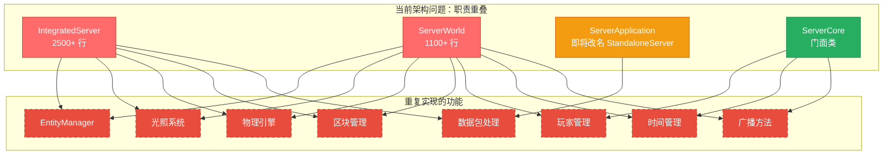
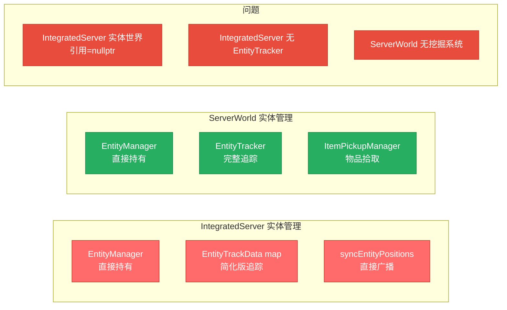
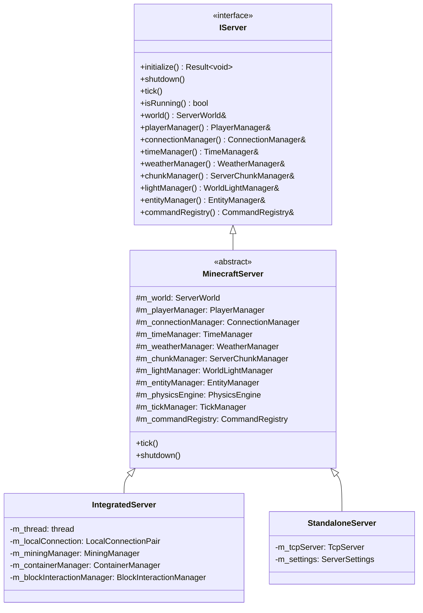
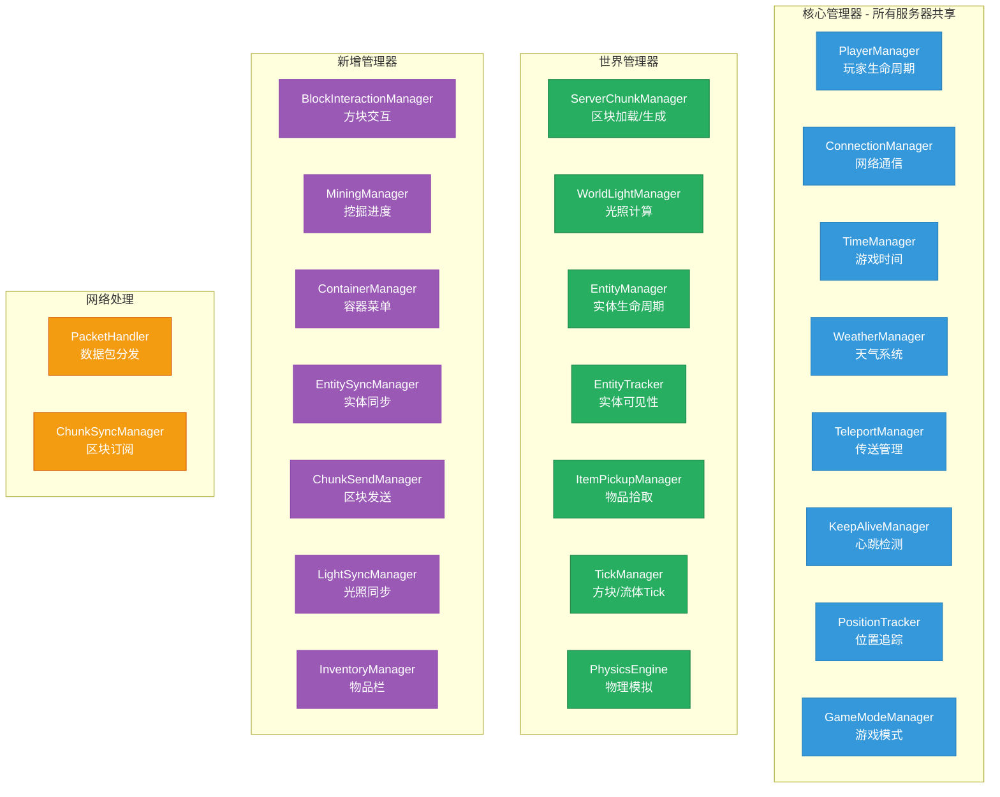
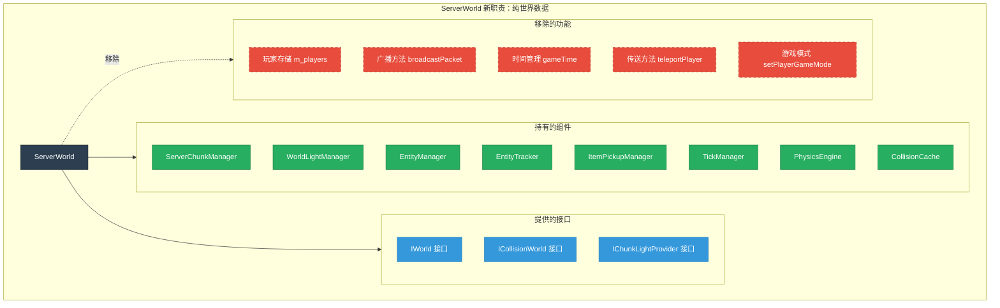
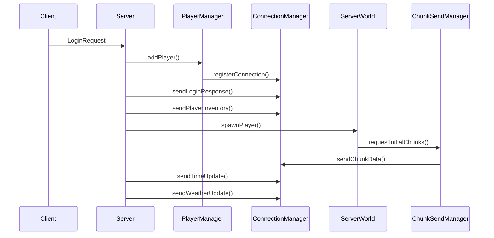
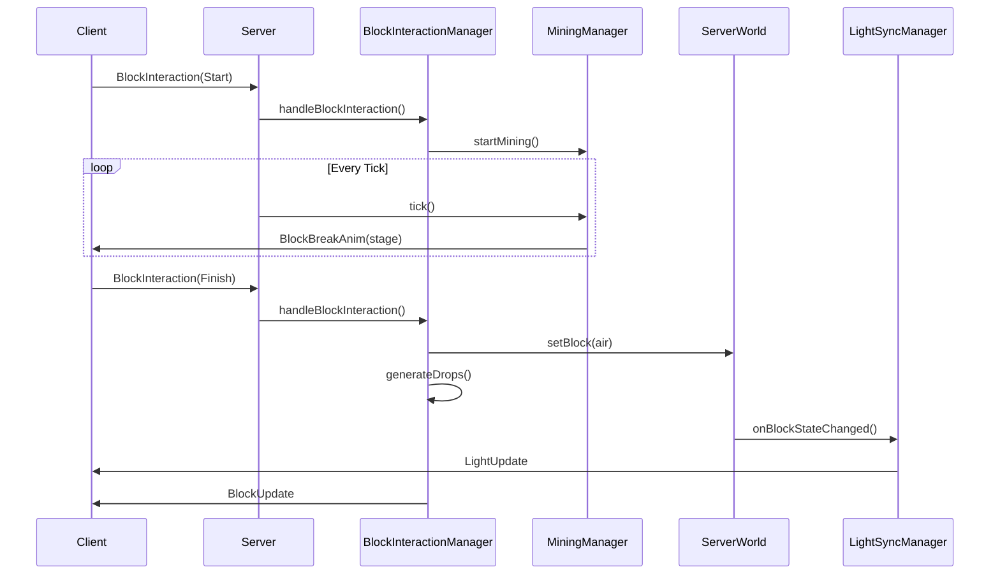
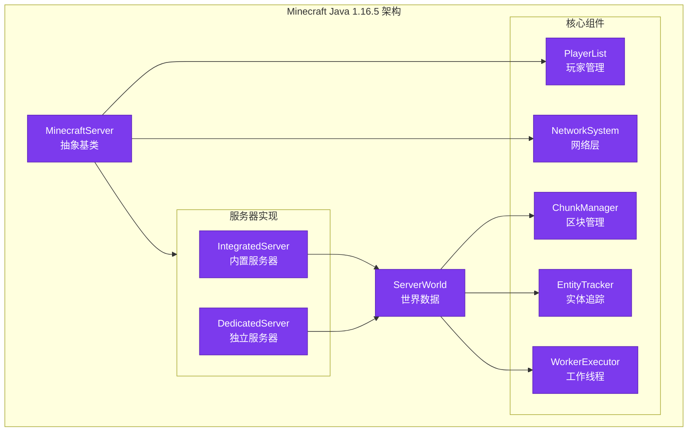

# 服务器架构重构计划

## 概述

本文档详细描述了 Minecraft Reborn 服务器架构的重构计划，目标是：
1. **消除重复代码**：合并 IntegratedServer 和 ServerWorld/ServerApplication 的重复功能
2. **清晰的职责边界**：每个类和模块有明确的单一职责
3. **优雅的目录结构**：分类清晰，不堆砌文件
4. **Manager 模式**：Server 不对 Manager 接口做二次封装，直接访问 `server->xxManager()`

---

## 当前架构问题分析

### 1. 类职责重叠严重



### 2. 数据包处理差异

| 数据包类型 | IntegratedServer | ServerApplication | PacketHandler |
|-----------|------------------|-------------------|---------------|
| LoginRequest | ✅ 完整 | ✅ 简化 | ✅ 返回结果 |
| PlayerMove | ✅ 4种类型 | ⚠️ 简化 | ⚠️ 简化 |
| TeleportConfirm | ✅ 触发区块加载 | ⚠️ 无区块处理 | ⚠️ 仅确认 |
| BlockInteraction | ✅ 完整 | ❌ 未实现 | ❌ 未实现 |
| PlayerTryUseItemOnBlock | ✅ 完整 | ❌ 未实现 | ❌ 未实现 |
| HotbarSelect | ✅ 完整 | ❌ 未实现 | ❌ 未实现 |
| ContainerClick | ✅ 完整 | ❌ 未实现 | ❌ 未实现 |
| CloseContainer | ✅ 完整 | ❌ 未实现 | ❌ 未实现 |

**结论**：IntegratedServer 的实现最完整，应以此为基础。

### 3. 实体管理差异



---

## 目标架构设计

### 新的类层次结构



### Manager 完整列表



### ServerWorld 新边界



---

## 新目录结构

```
src/server/
├── application/                    # 服务器应用层
│   ├── IServer.hpp                 # 服务器接口
│   ├── MinecraftServer.hpp/cpp     # 抽象基类（共享实现）
│   ├── IntegratedServer.hpp/cpp    # 内置服务器（单机）
│   └── StandaloneServer.hpp/cpp    # 独立服务器（多人）
│
├── core/                           # 核心管理器
│   ├── ServerCoreConfig.hpp        # 配置结构
│   ├── ServerPlayerData.hpp        # 玩家数据
│   ├── PlayerManager.hpp/cpp       # 玩家生命周期
│   ├── ConnectionManager.hpp/cpp   # 网络通信
│   ├── TimeManager.hpp/cpp         # 游戏时间
│   ├── TeleportManager.hpp/cpp     # 传送管理
│   ├── KeepAliveManager.hpp/cpp    # 心跳检测
│   ├── PositionTracker.hpp/cpp     # 位置追踪
│   ├── GameModeManager.hpp/cpp     # 游戏模式
│   └── PacketHandler.hpp/cpp       # 数据包分发
│
├── interaction/                    # 交互管理器（新增）
│   ├── BlockInteractionManager.hpp/cpp   # 方块交互
│   ├── MiningManager.hpp/cpp             # 挖掘进度
│   ├── ContainerManager.hpp/cpp          # 容器菜单
│   └── InventoryManager.hpp/cpp          # 物品栏同步
│
├── sync/                           # 同步管理器（新增）
│   ├── EntitySyncManager.hpp/cpp         # 实体同步
│   ├── ChunkSendManager.hpp/cpp          # 区块发送
│   └── LightSyncManager.hpp/cpp          # 光照同步
│
├── network/                        # 网络层
│   ├── TcpServer.hpp/cpp           # TCP 服务器
│   ├── TcpSession.hpp/cpp          # TCP 会话
│   └── TcpConnection.hpp/cpp       # TCP 连接适配器
│
├── command/                        # 命令系统
│   ├── CommandRegistry.hpp/cpp     # 命令注册表
│   ├── ServerCommandSource.hpp/cpp # 命令源
│   └── commands/                   # 具体命令
│       ├── TimeCommand.hpp/cpp
│       ├── WeatherCommand.hpp/cpp
│       ├── GameModeCommand.hpp/cpp
│       └── ...
│
├── world/                          # 世界管理
│   ├── ServerWorld.hpp/cpp         # 服务端世界
│   ├── ServerChunkManager.hpp/cpp  # 区块管理
│   ├── ChunkWorkerPool.hpp/cpp     # 区块工作线程池
│   ├── entity/                     # 实体相关
│   │   ├── EntityTracker.hpp/cpp
│   │   └── ItemPickupManager.hpp/cpp
│   ├── weather/                    # 天气
│   │   └── WeatherManager.hpp/cpp
│   ├── spawn/                      # 生成
│   │   ├── NaturalSpawner.hpp/cpp
│   │   └── SpawnConditions.hpp
│   └── drop/                       # 掉落
│       └── BlockDropHandler.hpp/cpp
│
├── player/                         # 玩家
│   └── ServerPlayer.hpp/cpp        # 服务端玩家实体
│
├── menu/                           # 容器菜单
│   └── CraftingMenu.hpp/cpp
│
└── settings/                       # 设置
    └── ServerSettings.hpp/cpp
```

---

## 重构步骤（按依赖顺序）

### 阶段 1：基础设施（无依赖）

```
步骤 1.1: 创建 IServer 接口
├── 新建 src/server/application/IServer.hpp
├── 定义所有 Manager 访问器接口
└── 定义生命周期接口 (initialize, shutdown, tick)

步骤 1.2: 创建新 Manager 接口
├── 新建 src/server/interaction/ 目录
├── 创建 BlockInteractionManager.hpp/cpp
├── 创建 MiningManager.hpp/cpp
├── 创建 ContainerManager.hpp/cpp
├── 创建 InventoryManager.hpp/cpp
├── 新建 src/server/sync/ 目录
├── 创建 EntitySyncManager.hpp/cpp
├── 创建 ChunkSendManager.hpp/cpp
└── 创建 LightSyncManager.hpp/cpp
```

### 阶段 2：抽象基类

```
步骤 2.1: 创建 MinecraftServer 抽象基类
├── 新建 src/server/application/MinecraftServer.hpp/cpp
├── 实现 IServer 接口
├── 持有所有共享 Manager（unique_ptr）
├── 持有 ServerWorld（unique_ptr）
├── 实现 tick() 主循环框架
├── 实现 shutdown() 框架
└── 将 IntegratedServer 的共享逻辑迁移至此

步骤 2.2: 迁移共享逻辑到 MinecraftServer
├── 区块管理逻辑
├── 光照系统初始化
├── 实体管理
├── 物理引擎
├── 挖掘系统 → MiningManager
├── 容器系统 → ContainerManager
├── 方块交互 → BlockInteractionManager
└── 实体同步 → EntitySyncManager
```

### 阶段 3：重构 ServerWorld

```
步骤 3.1: 清理 ServerWorld
├── 移除 m_players 映射（使用 PlayerManager）
├── 移除 broadcastPacket 方法（使用 ConnectionManager）
├── 移除时间管理（使用 TimeManager）
├── 移除传送方法（使用 TeleportManager）
├── 移除游戏模式方法（使用 GameModeManager）
└── 保留：区块、实体、光照、物理、Tick

步骤 3.2: ServerWorld 作为 MinecraftServer 的组件
├── MinecraftServer 持有 ServerWorld unique_ptr
├── ServerWorld 通过回调/接口访问需要的 Manager
└── ServerWorld 不再直接管理玩家
```

### 阶段 4：重构 IntegratedServer

```
步骤 4.1: IntegratedServer 继承 MinecraftServer
├── 修改 IntegratedServer 继承 MinecraftServer
├── 移除重复的 Manager 成员
├── 保留单机特有逻辑：
│   ├── 独立线程运行
│   ├── LocalConnection 连接
│   └── 单玩家优化
└── 实现纯虚方法

步骤 4.2: 简化 IntegratedServer::tick()
├── 调用 MinecraftServer::tick() 处理共享逻辑
├── 处理网络数据包接收
├── 处理区块发送队列
└── 移除已迁移到 Manager 的逻辑
```

### 阶段 5：重构 ServerApplication → StandaloneServer

```
步骤 5.1: 重命名并重构
├── ServerApplication.hpp → StandaloneServer.hpp
├── ServerApplication.cpp → StandaloneServer.cpp
├── 继承 MinecraftServer
├── 添加 TCP 网络特有逻辑
├── 实现多玩家支持
└── 使用完整的 Manager 集合

步骤 5.2: 实现缺失的数据包处理
├── BlockInteraction → 使用 BlockInteractionManager
├── ContainerClick → 使用 ContainerManager
├── HotbarSelect → 使用 InventoryManager
└── 确保与 IntegratedServer 功能对等
```

### 阶段 6：删除旧代码

```
步骤 6.1: 删除废弃文件
├── 删除 IntegratedServer 中的 IntegratedLightingWorld
├── 删除 IntegratedServer 中的 IntegratedLightProvider
├── 删除 IntegratedServer 中的 ServerCollisionWorld
├── 删除 ServerWorld 中的玩家管理代码
└── 删除 ServerWorld 中的广播代码

步骤 6.2: 清理头文件依赖
├── 更新所有 #include 路径
├── 更新 CMakeLists.txt
└── 编译验证
```

### 阶段 7：测试验证

```
步骤 7.1: 单元测试
├── 测试各 Manager 独立功能
├── 测试 MinecraftServer 基类
├── 测试 IntegratedServer
└── 测试 StandaloneServer

步骤 7.2: 集成测试
├── 测试单机模式完整流程
├── 测试多人模式完整流程
└── 性能对比（确保无回退）
```

---

## Manager 详细设计

### BlockInteractionManager

```cpp
namespace mc::server::interaction {

/**
 * @brief 方块交互管理器
 *
 * 处理玩家与方块的交互：
 * - 方块破坏（距离验证、工具检测、掉落物生成）
 * - 方块放置（位置验证、碰撞检测）
 * - 方块使用（工作台、熔炉等）
 */
class BlockInteractionManager {
public:
    explicit BlockInteractionManager(ServerWorld& world,
                                     core::PlayerManager& playerManager,
                                     loot::LootTableManager& lootTableManager);

    /**
     * @brief 处理方块交互数据包
     * @return 是否成功处理
     */
    Result<BlockInteractionResult> handleBlockInteraction(
        PlayerId playerId,
        const BlockPos& pos,
        network::BlockInteractionAction action);

    /**
     * @brief 处理方块放置数据包
     */
    Result<BlockPlacementResult> handleBlockPlacement(
        PlayerId playerId,
        const BlockPos& pos,
        const Vector3& hitPos,
        Direction face,
        const ItemStack& item);

    // 设置回调
    void setOnBlockBreak(std::function<void(PlayerId, const BlockPos&)> callback);
    void setOnBlockPlace(std::function<void(PlayerId, const BlockPos&, const BlockState&)> callback);

private:
    ServerWorld& m_world;
    core::PlayerManager& m_playerManager;
    loot::LootTableManager& m_lootTableManager;
    drop::BlockDropHandler m_dropHandler;

    std::function<void(PlayerId, const BlockPos&)> m_onBlockBreak;
    std::function<void(PlayerId, const BlockPos&, const BlockState&)> m_onBlockPlace;
};

} // namespace mc::server::interaction
```

### MiningManager

```cpp
namespace mc::server::interaction {

/**
 * @brief 挖掘进度管理器
 *
 * 追踪玩家的挖掘进度：
 * - 计算挖掘速度（工具、方块硬度）
 * - 广播破坏动画阶段
 * - 处理挖掘中止
 */
class MiningManager {
public:
    explicit MiningManager(core::PlayerManager& playerManager,
                          core::ConnectionManager& connectionManager);

    /**
     * @brief 开始挖掘
     */
    void startMining(PlayerId playerId, const BlockPos& pos);

    /**
     * @brief 中止挖掘
     */
    void abortMining(PlayerId playerId);

    /**
     * @brief 每 tick 更新挖掘进度
     */
    void tick(ServerWorld& world);

    /**
     * @brief 获取挖掘进度 (0.0 - 1.0)
     */
    [[nodiscard]] f32 getMiningProgress(PlayerId playerId) const;

    /**
     * @brief 检查是否正在挖掘
     */
    [[nodiscard]] bool isMining(PlayerId playerId) const;

private:
    struct MiningState {
        BlockPos position;
        f32 progress = 0.0f;
        u8 lastStage = 255;
        bool active = false;
        u64 startTick = 0;
    };

    core::PlayerManager& m_playerManager;
    core::ConnectionManager& m_connectionManager;
    std::unordered_map<PlayerId, MiningState> m_miningStates;
};

} // namespace mc::server::interaction
```

### ContainerManager

```cpp
namespace mc::server::interaction {

/**
 * @brief 容器管理器
 *
 * 管理玩家的容器交互：
 * - 打开/关闭容器菜单
 * - 处理容器点击
 * - 合成系统
 */
class ContainerManager {
public:
    explicit ContainerManager(core::PlayerManager& playerManager);

    /**
     * @brief 打开容器
     */
    Result<ContainerId> openContainer(PlayerId playerId,
                                       ContainerType type,
                                       const BlockPos& pos);

    /**
     * @brief 关闭容器
     */
    void closeContainer(PlayerId playerId);

    /**
     * @brief 处理容器点击
     */
    Result<ContainerClickResult> handleClick(PlayerId playerId,
                                               ContainerId containerId,
                                               i32 slot,
                                               u8 button,
                                               u8 mode,
                                               const ItemStack& carriedItem);

    /**
     * @brief 获取打开的菜单
     */
    [[nodiscard]] AbstractContainerMenu* getOpenMenu(PlayerId playerId);

private:
    core::PlayerManager& m_playerManager;
    std::unordered_map<PlayerId, std::unique_ptr<AbstractContainerMenu>> m_openMenus;
    std::unordered_map<PlayerId, ContainerType> m_openContainerTypes;
    std::unordered_map<PlayerId, ContainerId> m_nextContainerIds;
};

} // namespace mc::server::interaction
```

### EntitySyncManager

```cpp
namespace mc::server::sync {

/**
 * @brief 实体同步管理器
 *
 * 负责实体位置的客户端同步：
 * - 追踪实体位置变化
 * - 发送实体生成/移动/销毁包
 * - 多玩家可见性管理
 */
class EntitySyncManager {
public:
    explicit EntitySyncManager(EntityManager& entityManager,
                               EntityTracker& entityTracker,
                               core::ConnectionManager& connectionManager);

    /**
     * @brief 每 tick 同步实体位置
     */
    void tick();

    /**
     * @brief 生成新实体并通知客户端
     */
    void spawnEntity(std::unique_ptr<Entity> entity);

    /**
     * @brief 移除实体并通知客户端
     */
    void removeEntity(EntityId entityId);

    /**
     * @brief 强制发送完整更新
     */
    void forceFullUpdate(EntityId entityId);

private:
    struct EntityTrackData {
        Vector3 lastPosition;
        f32 lastYaw = 0.0f;
        f32 lastPitch = 0.0f;
        bool needsFullUpdate = true;
    };

    static constexpr f32 POSITION_THRESHOLD = 0.01f;
    static constexpr f32 ROTATION_THRESHOLD = 1.0f;

    EntityManager& m_entityManager;
    EntityTracker& m_entityTracker;
    core::ConnectionManager& m_connectionManager;
    std::unordered_map<EntityId, EntityTrackData> m_entityTrackData;
};

} // namespace mc::server::sync
```

### ChunkSendManager

```cpp
namespace mc::server::sync {

/**
 * @brief 区块发送管理器
 *
 * 管理区块数据的异步发送：
 * - 从 Worker 线程接收序列化数据
 * - 主线程发送给客户端
 * - 区块卸载延迟防抖
 */
class ChunkSendManager {
public:
    explicit ChunkSendManager(ServerChunkManager& chunkManager,
                              core::ConnectionManager& connectionManager);

    /**
     * @brief 请求发送区块给玩家
     */
    void requestChunkSend(PlayerId playerId, ChunkCoord x, ChunkCoord z);

    /**
     * @brief 从 Worker 线程提交序列化数据
     * @thread-safe
     */
    void submitChunkData(ChunkCoord x, ChunkCoord z, std::vector<u8> data);

    /**
     * @brief 主线程处理待发送队列
     */
    void processPendingSends();

    /**
     * @brief 处理区块卸载延迟
     */
    void processPendingUnloads();

    /**
     * @brief 设置区块加载回调
     */
    void setOnChunkLoaded(std::function<void(ChunkCoord, ChunkCoord)> callback);

private:
    struct PendingChunkSend {
        ChunkCoord x, z;
        std::vector<u8> serializedData;
        std::vector<PlayerId> waitingPlayers;
    };

    static constexpr u64 UNLOAD_GRACE_TICKS = 8;

    ServerChunkManager& m_chunkManager;
    core::ConnectionManager& m_connectionManager;

    std::vector<PendingChunkSend> m_pendingSends;
    std::mutex m_pendingSendsMutex;

    std::unordered_map<u64, u64> m_pendingUnloads;
    std::function<void(ChunkCoord, ChunkCoord)> m_onChunkLoaded;
};

} // namespace mc::server::sync
```

### LightSyncManager

```cpp
namespace mc::server::sync {

/**
 * @brief 光照同步管理器
 *
 * 管理光照变化的客户端同步：
 * - 监听光照变化
 * - 同步光照数据到 ChunkSection
 * - 广播光照更新包
 */
class LightSyncManager {
public:
    explicit LightSyncManager(WorldLightManager& lightManager,
                              ServerChunkManager& chunkManager,
                              core::ConnectionManager& connectionManager);

    /**
     * @brief 区块加载后初始化光照
     */
    void initializeChunkLighting(ChunkCoord x, ChunkCoord z);

    /**
     * @brief 方块变化时触发光照检查
     */
    void onBlockStateChanged(const BlockPos& pos, i32 oldLightLevel, i32 newLightLevel);

    /**
     * @brief 标记光照变化
     */
    void markLightChanged(LightType type, const SectionPos& pos);

    /**
     * @brief 同步光照数据到 ChunkSection
     */
    void syncLightDataToChunk(LightType type, const SectionPos& pos);

    /**
     * @brief 广播光照更新到订阅玩家
     */
    void broadcastLightUpdate(LightType type, const SectionPos& pos);

private:
    WorldLightManager& m_lightManager;
    ServerChunkManager& m_chunkManager;
    core::ConnectionManager& m_connectionManager;
};

} // namespace mc::server::sync
```

---

## 数据流图

### 登录流程



### 方块交互流程



---

## 重构风险与缓解

| 风险 | 影响 | 缓解措施 |
|-----|------|---------|
| 大量代码删除导致功能丢失 | 高 | 逐步迁移，每步测试 |
| 接口变更影响调用方 | 中 | 先定义接口，再实现 |
| 并发问题 | 中 | Manager 内部加锁 |
| 性能回退 | 低 | 性能对比测试 |
| 循环依赖 | 中 | 使用前向声明和接口 |

---

## 验收标准

1. **无重复代码**：IntegratedServer 和 StandaloneServer 共享所有核心逻辑
2. **清晰职责**：每个类/Manager 职责单一，可一句话描述
3. **目录整洁**：文件分类清晰，单目录不超过 15 个文件
4. **编译无警告**：所有平台编译通过，无警告
5. **测试通过**：所有现有测试通过，新增 Manager 有单元测试
6. **文档完整**：每个公共接口有 doc 注释

---

## 预估工作量

| 阶段 | 文件数 | 预估时间 |
|-----|-------|---------|
| 阶段 1: 基础设施 | 10+ 新文件 | 2-3 天 |
| 阶段 2: 抽象基类 | 2 文件 | 2 天 |
| 阶段 3: 重构 ServerWorld | 1 文件 | 1 天 |
| 阶段 4: 重构 IntegratedServer | 1 文件 | 2 天 |
| 阶段 5: 重构 StandaloneServer | 2 文件 | 1 天 |
| 阶段 6: 删除旧代码 | 多文件 | 0.5 天 |
| 阶段 7: 测试验证 | 测试文件 | 1 天 |
| **总计** | | **9-10 天** |

---

## 附录：MC Java 1.16.5 架构参考



**关键借鉴点**：
1. `MinecraftServer` 作为抽象基类，定义共享接口
2. `PlayerList` 统一管理玩家，不放在 `ServerWorld` 中
3. `EntityTracker` 作为 `ServerWorld` 的组件
4. 区块系统使用 Ticket 优先级加载

---

## 重构原则

1. 无论是ServerApplication还是IntegratedServer，代码量都很大，我希望把更多功能拆成manager，访问的时候直接走server->xxmanager，server不对manager的接口做二次封装，这样好处就是server少了很多接口，更简洁，我有强烈代码洁癖
2. 请你大刀阔斧进行修改，我能容忍重构之后出bug，但不能忍受杂乱的代码
3. 不做任何api兼容，直接一步到位新代码（因此主调者需要修改，这符合预期）
4. 我有强烈代码洁癖，不允许留任何旧代码旧文件。不允许通过注释等任何手段保留旧代码，不允许以兼容等理由保留旧代码，不允许以任何理由偷懒或者加TODO
5. 你有充足时间，不计代价完成本次重构
6. 当你完成一个任务后，不要停下来，请继续做后面的任务，直到任务清空你才能停！
