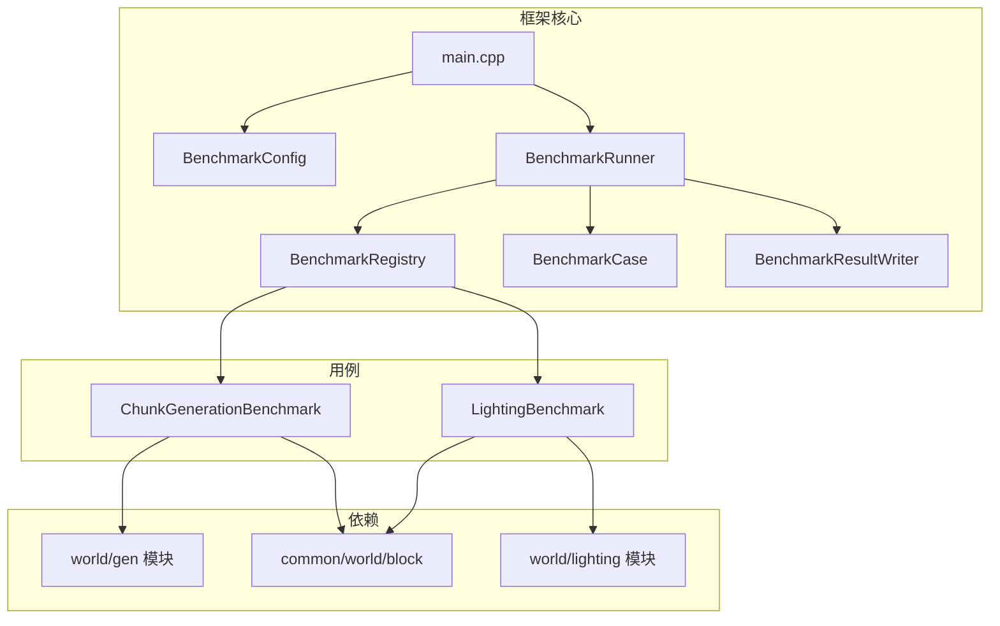

# Benchmark 框架

本目录包含 Minecraft Reborn 项目的基准测试框架，用于测试计算密集型游戏逻辑的性能。

## 目录结构

```
benchmark/
├── main.cpp                    # 入口点，配置加载和运行调度
├── BenchmarkTypes.hpp          # 核心类型定义
├── BenchmarkConfig.hpp/.cpp    # 配置加载（benchmark.json）
├── BenchmarkCase.hpp/.cpp      # Benchmark 用例接口和执行逻辑
├── BenchmarkRegistry.hpp/.cpp  # 用例注册表
├── BenchmarkRunner.hpp/.cpp    # 运行器，串行执行多个用例
├── BenchmarkResultWriter.hpp/.cpp # 结果写入 JSON
└── cases/
    ├── ChunkGenerationBenchmark.cpp  # 区块生成性能测试
    ├── LightingBenchmark.cpp         # 光照引擎性能测试
    └── ChunkMeshBenchmark.cpp        # 区块网格生成（暂时禁用）
```

## 模块关系



## 整体职责

- **配置加载**：从根目录 `benchmark.json` 读取配置，不支持命令行参数
- **用例注册**：通过静态注册机制，用例代码自主注册到全局注册表
- **串行执行**：按配置顺序执行用例，支持预热和多次测量
- **结果输出**：控制台摘要 + JSON 结果文件 + Perfetto trace 文件
- **错误处理**：配置错误或运行失败会记录但继续执行其他用例

## 输入/输出

### 输入

- `benchmark.json`：配置文件（位于仓库根目录）

配置文件结构：
```json
{
  "traceEnabled": true,
  "traceOutputPath": "benchmark_trace.perfetto-trace",
  "resultOutputPath": "benchmark_results.json",
  "threadCount": 4,
  "measurement": {
    "warmupIterations": 2,
    "measuredIterations": 5,
    "minDurationMs": 1
  },
  "cases": [
    {
      "name": "chunk_generation",
      "threadCount": 4,
      "measurement": {
        "warmupIterations": 2,
        "measuredIterations": 5,
        "minDurationMs": 1
      },
      "parameters": {
        "seed": 12345,
        "chunkX": 0,
        "chunkZ": 0
      }
    }
  ]
}
```

### 输出

- **控制台摘要**：每个用例的平均耗时和吞吐量
- **JSON 结果文件**：详细的测量数据
- **Perfetto trace**：可使用 Perfetto UI 分析的性能追踪

## 依赖项

- `mc_common`：核心游戏逻辑
- `mc::perfetto`：性能追踪
- `nlohmann_json`：JSON 解析

## 使用方法

### 构建

```bash
cmake --build build --target mc_benchmarks
```

### 运行

```bash
cd <仓库根目录>
./build/bin/mc_benchmarks
```

### 添加新用例

1. 在 `cases/` 目录创建新的 `.cpp` 文件
2. 实现 `IBenchmarkCase` 接口
3. 使用静态注册：
```cpp
const bool g_registered = []() {
    BenchmarkRegistry::instance().registerCase("my_benchmark", []() {
        return std::make_unique<MyBenchmark>();
    });
    return true;
}();
```
4. 在 `benchmark.json` 添加配置
5. 在 `CMakeLists.txt` 添加源文件

## 容易踩的坑

### 配置文件缺失

- 框架不使用默认值，配置文件缺失或字段缺失会导致错误退出
- 确保 `benchmark.json` 位于工作目录（通常是仓库根目录）

### 用例未注册

- 静态注册依赖全局变量初始化顺序
- 确保用例源文件被链接到目标

### Perfetto 未启用

- 如果 `MC_ENABLE_TRACING=0`，trace 文件将为空
- 检查 CMake 配置确保 Perfetto 已启用

### 客户端依赖

- 某些用例（如 ChunkMeshBenchmark）依赖客户端渲染模块
- 当前框架只链接 `mc_common`，此类用例需要单独处理

## 测试用例说明

### ChunkGenerationBenchmark

测试区块生成的性能，包括：
- 生物群系生成
- 噪声地形生成

参数：
- `seed`：世界种子
- `chunkX`、`chunkZ`：区块坐标

### LightingBenchmark

测试光照引擎的性能，包括：
- 方块光照更新
- 天空光照传播

参数：
- `updatesPerIteration`：每次迭代的光照更新数量

### ChunkMeshBenchmark（暂时禁用）

测试区块网格生成的性能。

**禁用原因**：依赖客户端渲染模块（BlockModelCache、MeshData 等），当前框架只链接 `mc_common`。

启用方法：
1. 创建链接客户端模块的独立 benchmark 目标
2. 或创建最小化的 ChunkMesher 测试路径
