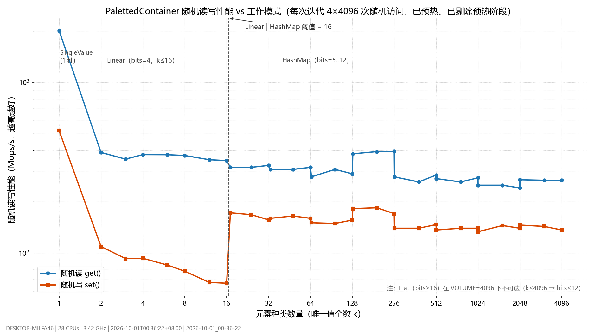

# 基准测试指南（mc_benchmark）

Cubium 的性能基准基于 [google/benchmark](https://github.com/google/benchmark) 1.9.5（vcpkg 引入），可执行目标 `mc_benchmark`。框架细节与用例实现在 [benchmark/README.md](../benchmark/README.md)，本篇是使用指南。

## 构建

```bash
# macOS
cmake --build --preset macos-relwithdebinfo -- -j{核心数-2} mc_benchmark
# Windows（仅支持唯一命令）
./scripts/configure.sh build
```

依赖说明：`vcpkg.json` 中的 `benchmark` port 首次配置会多编译一个库；`mc_benchmark` 链接 `mc_gen/mc_server_storage/mc_common/mc_bedrock_addon` 并直接编译一批 server 源文件（源闭包参照 mc_tests 的登记方式），因此构建时间与 mc_tests 同量级。

## 运行

结果目录基于当前工作目录。启动用例使用 CMake 注入的同配置服务端目标路径：
Release benchmark 会启动 Release 服务端。跨 CI job 复用 artifact 时须保留构建目录布局。

nightly 的 benchmark 在独立 runner 上执行 `release-build` 的产物，未开启 sanitizer 或 profiler。
构建配置变更时重新建立跨日比较基线；内存计数器仍由基准工具采集，不会链接进公开服务端。

```bash
./build/bin/RelWithDebInfo/mc_benchmark                          # 全部用例
./build/bin/RelWithDebInfo/mc_benchmark --benchmark_list_tests   # 列出用例
./build/bin/RelWithDebInfo/mc_benchmark --benchmark_filter="ChunkGeneration/8/16"
./build/bin/RelWithDebInfo/mc_benchmark --benchmark_filter=Lighting --benchmark_min_time=3s
./build/bin/RelWithDebInfo/mc_benchmark --benchmark_filter=serverInitialize

# 录制 Perfetto trace（默认关闭；见下表）
./build/bin/RelWithDebInfo/mc_benchmark --benchmark_trace --benchmark_filter=Lighting
```

命令行 flag 为 google/benchmark 原生（`--benchmark_filter/--benchmark_min_time/--benchmark_repetitions/--benchmark_out` 等），完整列表见 `--help`。`mc_benchmark` 只有一个自有 flag：

| flag | 默认 | 说明 |
|---|---|---|
| `--benchmark_trace[=true\|false]` | `false` | 录制 `.perfetto-trace`。**默认关闭**：不产任何 trace 文件，也不触发下面的额外 profile run（进程启动类用例的墙钟时间可省约 1/3）。该 flag 在 `benchmark::Initialize` 之前由 `benchmark/main.cpp` 解析并剥离 |

结果输出到 `benchmark_results/<时间戳>/`（已 gitignore）：

| 文件 | 内容 |
|---|---|
| `results.json` | 全部结果，含 mean/median/stddev 聚合与内存指标 |
| `<case>.perfetto-trace` | **仅在 `--benchmark_trace` 时产出**：每个用例的每次重复一个 trace（ui.perfetto.dev 分析火焰图）；第 N（N≥2）次重复为 `<case>.repN.perfetto-trace` |

> **墙钟时间 ≠ 计时值之和**：google/benchmark 在注册了 `MemoryManager`（内存指标，本项目**始终注册**）与 `ProfilerManager`（trace，需 `--benchmark_trace`）时，会为**每次重复**各额外跑一遍基准函数（额外那几遍不计时）。用计数桩实测 `serverInitializeShell` 的 5 次重复：默认 **10 次**启动被测服务端，带 `--benchmark_trace` **15 次**。因此进程启动类用例的墙钟耗时约为计时值之和的 2 倍（带 trace 为 3 倍），而 `Time` / `_mean/_median` 统计值不受影响。

## 现有用例

### ChunkGeneration（区块生成系统吞吐）

测生产级并行生成系统：`ServerChunkManager` → `ChunkTaskScheduler`（区域锁调度）→ `UniversalWorkerPool` → 逐状态推进到 FULL。

- 参数矩阵：`threads`（内部线程池大小 1/2/4/8）× `batch`（每迭代 n×n 区块批，8/16/32）
- 口径：提交一批 FULL 请求，主线程 `tick()` 泵送驱动至全部完成；报告 `chunks_per_second`
- 迭代间卸载本批区块（暂停计时），保证每轮测真实生成

解读示例（macOS arm64 实测，batch=16）：

| threads | 耗时/迭代 | chunks/s | 加速比 |
|---|---|---|---|
| 1 | 4975 ms | 51.9 | 1.0× |
| 2 | 2711 ms | 96.3 | 1.9× |
| 4 | 417 ms | 632.7 | 12.2× |
| 8 | 253 ms | 1056.3 | 20.4× |

注意 threads=1 档仍走完整生成系统（含调度器/区域锁开销），与"裸生成器性能"不同口径；跨档对比反映的是系统的并行扩展性。

> **跨机器对比前必读**：上表 threads=8 的 20.4× 超过 worker 数量，唯一解释是该机器的单线程基线含大量可被多线程重叠的串行等待（存储/调度 I/O）。**跨机器只对比相对比值，不对比绝对值**；口径差异与各机器的结构性限制见「[并行扩展性与跨机器对比（调查记录）](#并行扩展性与跨机器对比调查记录)」。

### Lighting（光照引擎本体）

TLS 方块光引擎批量更新：每迭代对一个 16×16 截面层做 256 个方块光变更，GLOWSTONE/AIR 交替翻转保证传播工作量稳定；报告 `blocks_per_second`。不经过 tick 级调度（那属于系统吞吐，由 ChunkGeneration 间接覆盖）。

### PalettedContainerRandomRead / PalettedContainerRandomWrite（调色板随机读写 vs 位宽）

对 `PalettedContainer`（16³ = 4096 格）扫描元素种类数量 k=1..4096，用同一条固定随机序列测随机读（`get`）与随机写（`set`）。容器**只有一种工作模式**（调色板 + 位压缩 + 开放寻址反向哈希表），k 只决定位宽：k=1 是均匀态（`bits=0`、不分配 storage），k≥2 时 `bits = max(1, ceil(log2 k))`（即 1..12 位）。

> 该用例是为"要不要去掉 Linear/Flat/SingleValue 三种模式、破除 4 位下限"提供实测依据而加的；结论已被采纳并落地（见文末「设计变更记录」）。

- 32 档扫描点：均匀态(1) + 每个位宽档（bits 1..12，各取低/中/高）
- 口径：一次迭代 = 4×4096 次随机访问；**装配（填 k 种值）与预热（8 轮同序列访问）都在计时循环之前，不计入结果**（google/benchmark 只对 `for (auto _ : state)` 循环体计时）
- 写入值取自当前 k 种取值集合 → 调色板不增长，测稳态读写，不含扩容/位宽提升
- 报告 `reads_per_second` / `writes_per_second`，并附带 `bits_per_entry` / `palette_size` / `memory_bytes`
- 图表纵轴为**线性、从 0 开始**（横轴为 log2），便于直读绝对吞吐

复现（`--benchmark_trace` 与本用例无关，默认关闭即可）：

```bash
./build/bin/RelWithDebInfo/mc_benchmark --benchmark_repetitions=3 --benchmark_report_aggregates_only=true \
    --benchmark_filter=PalettedContainerRandom
python benchmark/scripts/plot_paletted_container.py \
    --results benchmark_results/<时间戳>/results.json \
    --output docs/paletted_container_random_access.png
```



实测（i7-14700KF，3 次重复取中位数；Mops/s 越高越好）：

| k | bits | 随机读 | 随机写 | 估算内存 |
|---|---|---|---|---|
| 1 | 0（均匀态） | 1864.1 | 522.0 † | 100 B |
| 2 | 1 | 399.5 | 192.5 | 680 B |
| 3 / 4 | 2 | 386.6 / 416.5 | 184.2 / 195.7 | 1.2 KB |
| 6 / 8 | 3 | 390.2 / 385.7 | 182.1 / 174.0 | 1.7 KB |
| 12 / 16 | 4 | 430.2 / 409.2 | 191.0 / 184.2 | 2.3 KB |
| 17 / 32 | 5 | 327.7 / 322.4 | 162.0 / 159.8 | 2.9~3.0 KB |
| 129 / 256 | 8 | 420.2 / 425.5 | 180.7 / 186.4 | 5.8~7.5 KB |
| 1025 / 2048 | 11 | 286.4 / 286.4 | 145.9 / 139.8 | 18.2~31.7 KB |
| 4096 | 12 | 301.1 | 149.1 | 60.6 KB |

† k=1 时写入值恒等于唯一值 → 均匀态早退，属无操作写入，不代表真实写入成本。

**结论**

1. **位宽只由唯一值个数决定，2 的幂位宽仍明显更优**：bits=8 档（k=129..256）读 ~420 / 写 ~183，高于 bits=5..7 与 9..12（读 286~352 / 写 146~176）。根因仍是 `_readBits/_writeBits` 允许条目跨 u64 字（"跨两个字"分支）；bits=1/2/4/8 不跨字。若要把这几档的 20%~30% 拿回来，可改成原版 MC 的 `valuesPerLong = 64/bits` 布局（代价：内存 +2%~17%，bits=11 档最差）。
2. **读比写快、且写入受唯一值个数影响小**：写路径要经反向哈希表查找（开放寻址 + 线性探测，负载 ≤ 75%），读路径只做"位提取 + 调色板正向索引"。
3. **均匀态是绝对甜点**：读 1864 Mops/s、写 522 Mops/s（无操作早退）、内存 100 B。让空气段/整段同值保持均匀态（不分配 storage）收益最大。

> 说明：以上为单机（Windows / i7-14700KF）中位数结果，绝对吞吐随机器变化；跨机只比相对值。

### 设计变更记录：PalettedContainer 收敛为单一哈希模式（2026-10-01）

上述基准得出"Linear 线性扫描让 k=2..16 的写入塌到 67~109 Mops/s、而哈希在 k=17 是 172"的结论后，`PalettedContainer` 已按此重构：

- **删除** `SingleValue` / `Linear` / `Flat` 三种模式与 `_modeForBits`、`MIN_BITS_FOR_FLAT`、`_transitionSingleToLinear`：只剩"调色板 + 位压缩 + 反向哈希表"一种实现
- **破除 4 位下限**：`bits = max(1, ceil(log2(唯一值个数)))`；唯一值为 1 时是均匀态（`bits=0`、不分配 storage / 哈希表，`fill()` 释放二者）
- **删除死接口**：`rawPalette()` / `storage()` / `paletteValue()` / `rawPalettePtr` / `_calculateBitsForValue()`（其中前两者类外无调用者，`rawPalettePtr` 只写不读）
- **磁盘/网络格式不受影响**：`JavaChunkReader` / `ChunkSerializer` / `VanillaChunkWire` 各自按 MC 规则重算位数与打包，内部位宽只影响内存布局
- 顺带修掉一处潜在重复插入：`_hashMapInsert` 在触发扩容重建后直接返回（重建已把新增条目纳入表中）

效果（同机同口径，中位数）：

| 指标 | 旧实现 | 新实现 |
|---|---|---|
| k=2 写 / 读 | 109.2 / 388.6 Mops/s | **192.5 / 399.5** |
| k=8 写 / 读 | 78.3 / 372.8 Mops/s | **174.0 / 385.7** |
| k=16 写 / 读 | 66.6 / 348.0 Mops/s | **184.2 / 409.2** |
| k=16 段内存 | 2.2 KB（恒 4 位） | **2.3 KB**（4 位）+ 哈希 64 B |
| k=2 段内存 | 2.2 KB（恒 4 位） | **680 B**（1 位） |
| 真实地形 256 区块批的位存储合计 | 4.62 MB（2254 段全 4 位） | **2.40 MB（-48%）**：1 位 259 段 / 2 位 1549 段 / 3 位 446 段 |

真实地形分布由 `ChunkGeneration` 的临时 CSV 导出测得（`benchmark_results/palette_bits/`）：出生点 256 区块内 2254 个已创建段的 `palette_size` 全落在 **2..8**（无单值段），因此新位宽是 1~3 位。

### serverInitializeShell / serverInitializeWorld（服务端启动）

每次重复启动外部 `minecraft-server`（5 次重复），统计 mean/median/stddev（实际每次重复会启动 2 次被测进程：一遍采集内存指标、一遍计时；带 `--benchmark_trace` 时为 3 次，见「运行」一节的墙钟说明）：

- **Shell**：`--benchmark-exit-after-shell-init`——子系统初始化 + 网络监听就绪即退出（实测 macOS ~2.05s）
- **World**：`--benchmark-exit-after-world-init`——再加世界创建 + 出生区域（`SPAWN_CHUNK_RADIUS`）全部生成 FULL（实测 macOS ~12.3s）

每次启动使用全新临时世界目录（`$TMPDIR/mc_benchmark_server_init/`），保证冷启动口径；被测进程 `--profiler_enabled=false`，trace 只录基准进程侧；被测进程 stdout/stderr 写入该临时目录下的 `server_console.log`，非零退出时回显日志头尾（头 80 行 + 尾 120 行）并保留目录供排查。**须先构建 `minecraft-server`。**

## 并行扩展性与跨机器对比（调查记录）

### 本机基线（Windows / Intel i7-14700KF：8 P-core + 12 E-core，28 逻辑核）

`--benchmark_filter=ChunkGeneration/*/16`（每迭代 256 区块，单次迭代；跑间波动约 ±5%）：

| threads | 墙钟/迭代 | chunks/s | 加速比（对同表 threads=1） |
|---|---|---|---|
| 1 | 9687 ms | 27.2 | 1.0× |
| 2 | 7411 ms | 35.9 | 1.3× |
| 4 | 3875 ms | 71.9 | 2.5× |
| 8 | 2322 ms | 122.3 | 4.2× |

同机纯 CPU 探针（与项目无关的固定总工作量依赖链负载）并行加速：4 线程 3.81×、8 线程 **6.69×**、16 线程 10.12×——本机同构并行上限本身就不足 8×，而生成管线只拿到 4.2×。

### 与 macOS 参考值的差距分解

122.3（本机 8 线程）vs 1056.3（macOS 8 线程）= **8.6×** 的总差距，其中：

- 单线程吞吐差 **1.9×**（27.2 vs 51.9 chunks/s：CPU/IPC 与核心拓扑差异）；
- 剩余约 **4.5×** 来自并行扩展性差异（macOS 记录 20.4× vs 本机 4.2×，而 macOS 的 20.4× 本身已超出 worker 数，见下节「跨机器可比性结论」）。

**已排除的因素：文件沙箱**。把用例的 RocksDB 临时目录从 `%TEMP%`（工作区外，被沙箱写拦截）换到工作区内对比：单线程 27.49 vs 25.40 chunks/s、8 线程 128.0 vs 123.2 chunks/s，差异在跑间噪声内。

**进程 CPU 口径**（临时开启 `->MeasureProcessCPUTime()` 实测的 进程总 CPU / 墙钟）：1.94（threads=1）→ 2.77（2）→ 4.18（4）→ **6.28（8）**。google/benchmark 默认只统计主线程 CPU，实测主线程 cpu/wall 恒为 0.83~0.98（本用例主线程在忙轮询泵送）。即 8 线程档位约 6.3 个核在烧、worker 利用率仅约 66%：**不是"worker 没活干"，而是存在停等/串行化**。

### 结构性限制（按影响排序，均带证据）

| # | 限制 | 位置 |
|---|---|---|
| a | 区域互斥任务**头部阻塞停等**：FEATURES(writeRadius=1)、LIGHT(writeRadius=2) 走区域互斥池；worker 取到冲突任务后只把它放回队列并 `notify_one`，随后**自己在条件变量上等待自己那片区域释放**，而不是去取其他可运行任务。密集 n×n 批次下 3×3 / 5×5 写入区域高度重叠 | `UniversalWorkerPool.cpp` 冲突分支（`m_areaReleasedCondition.wait`） |
| b | 调度区域锁过粗：`onChunkGenComplete` 持 `2*maxAccessRadius=22`（45×45 区块）的 `ReentrantAreaLock`，而基准批次是密集 8×8~32×32，整个批次落在同一覆盖范围 → 每次状态完成事件都被同一把锁串行化（该项目自身的 Perfetto 剖析中，该锁曾是自耗时 #1 热点） | `ChunkTaskScheduler.cpp`、`src/server/world/README.md` 的调度器说明 |
| c | 主线程串行工作与区块数成正比，并被基准的**忙轮询泵送**放大：`tick()` 每次都跑 `_incrementInhabitedTime()`（遍历**全部已加载区块**）+ `_drainPendingPostProcess()`（onChunkLoaded/实体生成/后处理）+ 周期性 `_checkChunkUnloading()` | `ServerChunkManager::tick()` |
| d | 全局互斥点随任务数放大：单任务队列互斥 + 每个任务两次 `m_runningTaskMutex` + `m_runningTaskInfo` 哈希表增删（每任务两次堆分配） | `UniversalWorkerPool.cpp` 执行路径 |

### 跨机器可比性结论

macOS 表中 threads=8 的 20.4× **超过 8 个 worker**，纯 CPU 并行不可能达到；唯一解释是其单线程基线含大量可被多线程重叠的串行等待（存储/调度 I/O）。本机单线程档位已烧掉约 1.94 个核（几乎没有可重叠等待），因此同一份绝对工作量在本机不可能放大到 8× 以上。**不能用「1056 vs 122 chunks/s」直接判定某一侧存在缺陷，两者测量口径不同**；跨机器只对比相对比值（见「性能回归工作流」）。

### 后续待办（TODO）

1. TODO: 在 macOS 上给 `ChunkGeneration` 加 `->MeasureProcessCPUTime()` 复测单线程档位，确认口径差异（预期其 CPU/墙钟 ≈1.0，而非本机的 1.94）。零风险，优先级最高。
2. TODO: 给 `ChunkGeneration` 增加「稀疏批次」参数（区块间隔 ≥5）与密集批次对比：若稀疏批明显更快，即坐实 (a)(b) 的区域锁/停等结论。
3. TODO: 用 CPU affinity 把基准绑到 8 个 P-core 复测，剥离 E-core/超线程影响（无需改代码）。
4. TODO: 用已能正确归档的 `.perfetto-trace`（每用例/每重复一个文件，需传 `--benchmark_trace`）在 ui.perfetto.dev 查看 worker 线程的 park/阻塞分布，与 (a)(d) 对照。
5. TODO: 结构性优化（需评估后再动）：`_incrementInhabitedTime` 改为仅有玩家追踪时遍历；区域互斥任务冲突时改为跳过并取下一个可运行任务而非自等；评估按实际访问半径收紧 `onChunkGenComplete` 的区域锁半径。

## 指标解读

### 时间与吞吐

- `Time`：每迭代墙钟时间（默认毫秒，`--benchmark_min_time` 控制自动迭代总量）
- `chunks_per_second` / `blocks_per_second`：User Counter 吞吐（`kIsIterationInvariantRate`，自动迭代下统计正确）
- `Repetitions(5)` 用例输出 `_mean/_median/_stddev/_cv` 聚合行；`_cv`（变异系数）< 5% 视为稳定

### 内存指标（MemoryProfiler）

注册了 `benchmark::MemoryManager` 实现（全局 operator new/delete 钩子），JSON 自动携带：

| 指标 | 含义 |
|---|---|
| `num_allocs` / `allocs_per_iter` | 区间内分配次数（总 / 每迭代） |
| `total_allocated_bytes` | 累计分配字节 |
| `max_bytes_used` / `net_heap_growth` | 累计分配 - 累计释放（**近似在用，非精确峰值**——无 size 的 delete 只计次数，是下界口径） |

用于跨提交对比分配行为回归（如某改动让每迭代分配次数翻倍）。跨平台行为一致（C++ 全局替换），无平台 API 依赖。

### CPU 缓存命中率等硬件计数器

`--benchmark_perf_counters` 依赖 Linux PMU + libpfm4（`BENCHMARK_ENABLE_LIBPFM`）。**macOS/Windows 不可用**（Apple Silicon PMU 不暴露用户态）。macOS 替代：`xctrace` 对 `mc_benchmark` 外部采样（CPU Counters 模板）。vcpkg port 默认未开启 libpfm，Linux 上使用需定制 port 或 bazel 构建。

## 添加新用例

1. `cases/` 新建 `.cpp`：`void MyBench(::benchmark::State&)` + `BENCHMARK(MyBench)->...`
2. 用例模型选择：
   - 计算型：默认自动迭代（每用例跑 ≥0.5s）
   - 一次性事件（进程启动等）：`->Repetitions(N)->Iterations(1)`，**禁止**让它自动校准（会启动几百个进程）
3. 每参数独立装配用 `->Setup(...)/->Teardown(...)`；参数用 `->Arg/->Args` 编码，`state.range(i)` 读取
4. 需要独立 trace 文件：计时循环前调 `PerfettoProfilerAdapter::setCaseName("名称")`（使用者需传 `--benchmark_trace` 才会注册适配器）
5. 随机访问/访存类用例必须预热，预热放在计时循环**之前**（google/benchmark 只对循环体计时），参照 `PalettedContainerBenchmark.cpp`
6. `benchmark/CMakeLists.txt` 登记源文件；引用 server 符号时按链接错误补齐源闭包（参照 `tests/unit/CMakeLists.txt`）
7. 有迭代间状态时在 `PauseTiming()/ResumeTiming()` 区间内清理；复用 `ServerChunkManager` 必须主线程 tick 泵送（见 benchmark/README.md 容易踩的坑）
8. 更新 `benchmark/README.md` 的用例清单

## 性能回归工作流

```bash
# 1. 基线（改动前）
./build/bin/RelWithDebInfo/mc_benchmark --benchmark_out=baseline.json --benchmark_filter="ChunkGeneration|Lighting"

# 2. 改动后
./build/bin/RelWithDebInfo/mc_benchmark --benchmark_out=current.json --benchmark_filter="ChunkGeneration|Lighting"

# 3. 对比（tools/compare.py 来自 google/benchmark 仓库，vcpkg 的 tools feature 亦有安装）
python3 tools/compare.py benchmarks baseline.json current.json
```

机器空闲度对结果影响显著（ChunkGeneration threads=8 档尤其敏感）；跨机器只对比相对比值，不对比绝对值（各机器并行扩展性差异与口径说明见「并行扩展性与跨机器对比（调查记录）」，含待办 TODO）。
