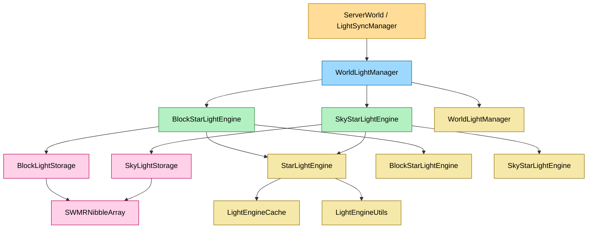

# 光照系统迁移指南

## 目标

本指南用于说明当前光照系统的对外接口、依赖关系、调用顺序和后续迁移约束。当前实现已经切换为基于 Starlight 思路的内部结构，旧名称已经移除，不再提供兼容别名。

## 当前对外接口

### 1. 入口层

- [StarLightLightingProvider](../src/common/world/lighting/IChunkLightProvider.hpp)
- [WorldLightManager](../src/common/world/lighting/manager/WorldLightManager.hpp)
- [LightType](../src/common/world/lighting/LightType.hpp)
- [InternalLight](../src/common/world/lighting/InternalLight.hpp)

### 2. 引擎层

- [StarLightEngine](../src/common/world/lighting/engine/LevelBasedGraph.hpp)
- [BlockStarLightEngine](../src/common/world/lighting/engine/BlockLightEngine.hpp)
- [SkyStarLightEngine](../src/common/world/lighting/engine/SkyLightEngine.hpp)
- [LightEngineCache](../src/common/world/lighting/engine/LightEngineCache.hpp)
- [LightEngineUtils](../src/common/world/lighting/engine/LightEngineUtils.hpp)

### 3. 存储层

- [SWMRNibbleArray](../src/common/world/lighting/storage/SWMRNibbleArray.hpp)
- [SWMRLightDataMap](../src/common/world/lighting/storage/SWMRLightDataMap.hpp)
- [SectionLightStorage](../src/common/world/lighting/storage/SectionLightStorage.hpp)
- [BlockLightStorage](../src/common/world/lighting/storage/BlockLightStorage.hpp)
- [SkyLightStorage](../src/common/world/lighting/storage/SkyLightStorage.hpp)
- [EmptinessMap](../src/common/world/lighting/storage/EmptinessMap.hpp)

### 4. 历史名称（已移除）

以下旧名称已经删除，不再提供兼容别名：

- `LevelBasedGraph` -> `StarLightEngine`
- `BlockLightEngine` -> `BlockStarLightEngine`
- `SkyLightEngine` -> `SkyStarLightEngine`
- `IChunkLightProvider` -> `StarLightLightingProvider`

## 依赖关系

### 服务器侧依赖

- [ServerWorld](../src/server/world/ServerWorld.cpp) 负责初始化区块光照、更新区块段状态、接收方块变更后触发光照重算。
- [LightSyncManager](../src/server/sync/LightSyncManager.cpp) 负责把光照数据同步回 `ChunkSection`。
- [MinecraftServer](../src/server/application/MinecraftServer.cpp) 负责把更新后的光照数据广播给客户端。

### 运行时数据流

1. 区块加载后，`ServerWorld::initializeChunkLighting()` 或同步管理器会把 `ChunkSection` 内的 `NibbleArray` 写入 `WorldLightManager`。
2. 方块变更后，`WorldLightManager::checkBlock()` 触发方块光和天空光的重算。
3. `WorldLightManager::tick()` 处理队列中的传播更新。
4. `SectionLightStorage::updateAndNotify()` 将可见侧数据同步回区块段。
5. `ServerWorld::syncLightDataToChunk()` 或 `LightSyncManager::syncLightDataToChunk()` 再把更新后的光照写回 `ChunkSection`。
6. `MinecraftServer` 发送光照更新包。

## 调用顺序

### 区块初始化

```cpp
WorldLightManager lightManager(provider, true, hasSkyLight);
lightManager.updateSectionStatus(sectionPos, isEmpty);
lightManager.setData(LightType::BLOCK, sectionPos, blockNibble, false);
lightManager.setData(LightType::SKY, sectionPos, skyNibble, false);
lightManager.enableLightSources(chunkPos, true);
```

### 方块变更

```cpp
lightManager.checkBlock(blockPos.x, blockPos.y, blockPos.z);
while (lightManager.hasLightWork()) {
    lightManager.tick(32768, true, true);
}
```

### 数据同步

```cpp
SWMRNibbleArray* lightData = lightManager.getData(LightType::BLOCK, sectionPos);
if (lightData != nullptr) {
    NibbleArray target(lightData->toByteArray());
    section->blockLightNibble() = target;
}
```

## 迁移约束

### 1. 不要恢复默认参数

当前 lighting 相关接口已经改为“重载 + 显式参数”模式。后续新增接口时，不要再引入默认参数；如果需要简化调用，请新增重载。

### 2. 不要破坏 FIFO 波前顺序

`LevelBasedGraph` 的队列必须保持 FIFO 消费顺序。不要改回 LIFO，也不要在处理中间插入会改变波前顺序的逻辑。

### 3. 不要把源面遮挡规则泛化到所有发光方块

完整立方体的发光方块仍然需要向外传播。源面遮挡只应该应用到真正会阻挡光线的条件形状。

### 4. 天空光闭合必须保留减亮后重检

当顶部被封闭时，天空光要先做减亮，再做增亮重检。只做其中一步会导致封顶后残留错误亮度。

## 代码集成说明

### 服务器接入

- `ServerWorld` 和 `LightSyncManager` 继续使用 `WorldLightManager`。
- 旧代码需要直接替换为 `WorldLightManager`、`BlockStarLightEngine`、`SkyStarLightEngine` 和 `StarLightLightingProvider`。
- 不要再指望别名存在；迁移时需要直接改写调用点。

### 测试接入

建议至少运行以下测试：

- `mc_tests.exe --gtest_filter=*Light*`

重点覆盖：

- `LevelBasedGraphQueueTest`
- `BlockLightRegressionTest`
- `SkyLightRegressionTest`
- `LightSyncTest`

## 常见问题

### 1. 为什么 `tick()` 改成顺序预算了

因为原先的半分配策略会让预算和剩余值变得难以推理，也不利于单引擎维度。当前实现改为按“方块光 -> 天空光”的顺序共享预算。

### 2. 为什么不保留别名

因为当前重构目标就是彻底切换到新命名，继续保留别名只会拖慢收敛并增加歧义。现在应该直接修改所有调用点。

### 3. 为什么 `checkBlock()` 还保留在引擎类里

因为这是当前的真实入口名。方块光和天空光都通过 `checkBlock()` 进入队列调度，不再保留 `checkLight()`。

## Mermaid 架构图



## 迁移建议

后续如果还要继续整理命名，优先顺序应该是：

1. 先清理文档和注释里的旧名称。
2. 再处理文件名层面的历史残留。
3. 最后检查测试用例和示例代码是否还有旧符号。

