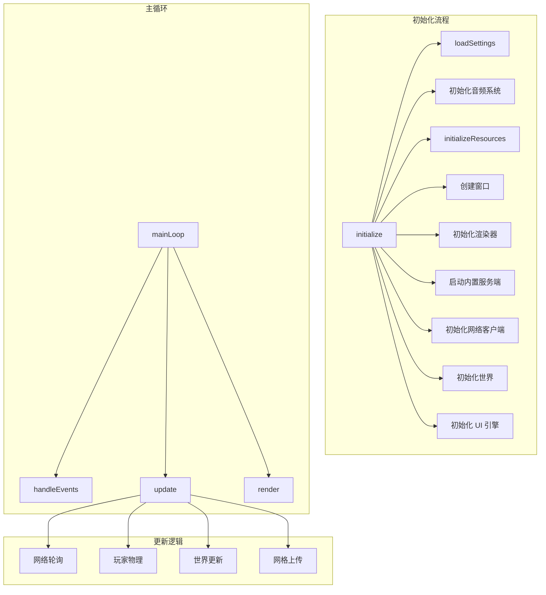
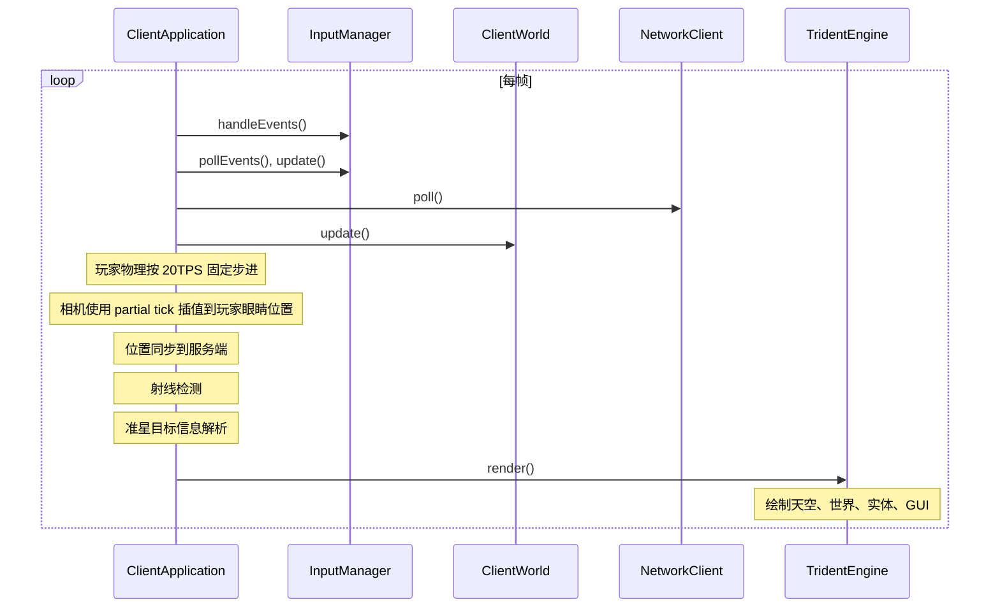
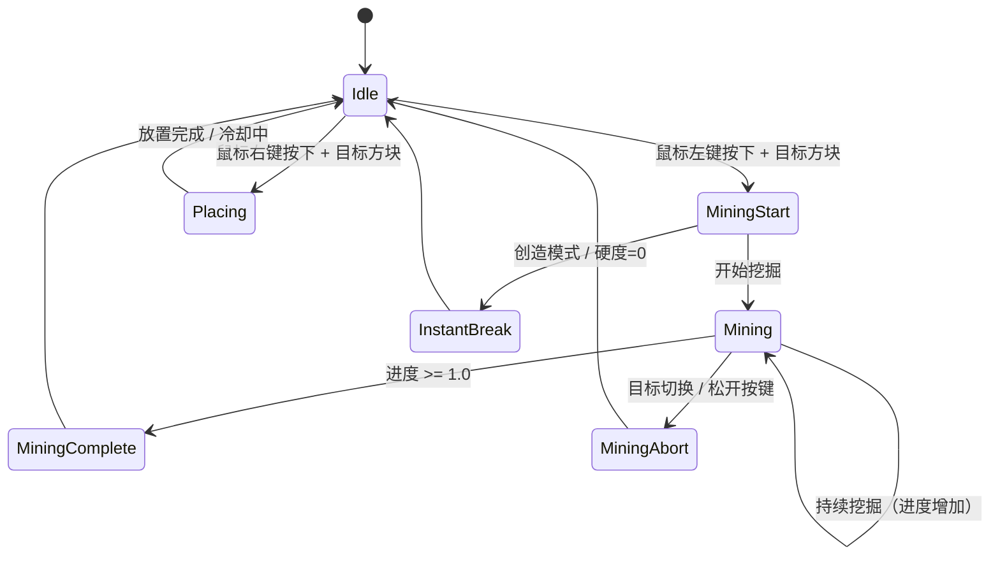
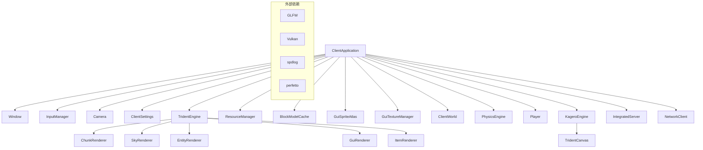

# Client Application 模块

客户端应用模块是 Minecraft Reborn 客户端的核心入口点，负责整合所有客户端子系统并协调游戏主循环。

## 目录结构

```text
src/client/application/
├── ClientApplication.hpp          # 客户端应用主接口
├── ClientApplication.cpp          # 只保留生命周期编排、主循环和少量共享实现
├── features/                      # 从 ClientApplication 拆分出来的功能实现
│   ├── ClientApplicationAudio.cpp
│   ├── ClientApplicationBootstrap.cpp
│   ├── ClientApplicationHelpers.cpp
│   ├── ClientApplicationHelpers.hpp
│   ├── ClientApplicationInput.cpp
│   ├── ClientApplicationNetwork.cpp
│   ├── ClientApplicationResource.cpp
│   ├── ClientApplicationSettings.cpp
│   ├── ClientApplicationTargetInfo.cpp
│   ├── ClientApplicationTargetInfoUi.cpp
│   ├── ClientApplicationTimeWeather.cpp
│   ├── ClientApplicationUi.cpp
│   ├── ClientApplicationUiFrame.cpp
│   └── README.md               # 功能拆分说明
└── README.md                   # 本文档
```

## 文件详解

### ClientApplication.hpp

客户端应用的头文件，定义了两个核心类型：

#### ClientLaunchParams 结构体

客户端启动参数配置，用于命令行覆盖设置文件中的配置：

| 字段 | 类型 | 说明 |
|------|------|------|
| `windowWidth` | `std::optional<i32>` | 窗口宽度覆盖 |
| `windowHeight` | `std::optional<i32>` | 窗口高度覆盖 |
| `fullscreen` | `std::optional<bool>` | 全屏模式覆盖 |
| `serverAddress` | `std::optional<String>` | 服务器地址覆盖 |
| `serverPort` | `std::optional<u16>` | 服务器端口覆盖 |
| `username` | `std::optional<String>` | 用户名覆盖 |
| `settingsPath` | `std::optional<String>` | 自定义设置文件路径 |
| `skipIntegratedServer` | `bool` | 是否跳过内置服务端 |

#### ClientApplication 类

主客户端应用类，管理客户端生命周期和所有子系统。

**核心子系统成员：**

| 成员 | 类型 | 职责 |
|------|------|------|
| `m_settings` | `ClientSettings` | 客户端设置管理 |
| `m_window` | `Window` | GLFW 窗口封装 |
| `m_input` | `InputManager` | 输入管理器 |
| `m_renderer` | `TridentEngine` | Trident Vulkan 渲染引擎 |
| `m_resourceManager` | `ResourceManager` | 资源包加载和管理 |
| `m_modelCache` | `BlockModelCache` | 方块模型缓存 |
| `m_camera` | `Camera` | 相机控制器 |
| `m_world` | `ClientWorld` | 客户端世界 |
| `m_player` | `Player` | 玩家实体 |
| `m_kageroEngine` | `KageroEngine` | Kagero UI 引擎 |
| `m_integratedServer` | `IntegratedServer` | 内置服务端（单机模式） |
| `m_networkClient` | `NetworkClient` | 网络客户端 |
| `m_commandManager` | `ClientCommandManager` | 本地命令树与补全管理 |
| `m_knownPlayerNames` | `unordered_map` | 聊天补全候选缓存 |
| `m_targetInfoLayerId` | `size_t` | 准星目标信息覆盖层 |

### ClientApplication.cpp

客户端应用的主协调文件，保留生命周期编排、主循环和跨功能共享逻辑，具体功能实现已经拆分到 `features/` 目录。

### features/

拆分后的功能实现目录，按职责划分为初始化骨架、输入、网络、音频、资源、UI、时间天气、目标信息、设置与通用辅助逻辑。详细说明见 [features/README.md](features/README.md)。

#### 主要功能模块



#### 初始化流程详解

```cpp
Result<void> ClientApplication::initialize(const ClientLaunchParams& params)
```

初始化顺序：

1. **设置加载** - 从配置文件加载客户端设置
2. **方块注册** - 初始化 VanillaBlocks 和 Items
3. **实体注册** - 注册所有实体类型
4. **音频系统** - 创建 `AudioService`，先把内置音频资源包加入共享 `ResourcePackList`
5. **资源系统** - 只做一次资源加载与纹理图集构建，并在末尾注册资源包变更回调
6. **窗口创建** - 创建 GLFW 窗口
7. **渲染器初始化** - 初始化 Trident Vulkan 渲染引擎及所有子渲染器
8. **内置服务端** - 启动 IntegratedServer（单机模式）
9. **网络连接** - 连接到服务端并等待命令树同步
10. **命令树同步** - 接收 `CommandTreePacket`，创建本地补全管理器
11. **世界初始化** - 初始化 ClientWorld 和网格构建系统（`MeshBuildScheduler` + `MeshWorkerPool`）
12. **物理引擎** - 创建 PhysicsEngine
13. **玩家实体** - 创建 Player 实体
14. **UI 系统** - 初始化 Kagero UI 引擎和所有 UI 层，包括准星目标信息覆盖层

#### 音频线程协作

- `ClientApplication` 只负责创建和销毁 `AudioService`。
- `AudioService` 在线程内独占初始化 `SoundEngine`、`SoundHandler`、音乐播放器与环境音 handler。
- `m_resourcePackList.onChange(...)` 在首次资源加载完成后注册，避免启动期 `addPack()` 触发重复 `reloadResources()`。
- 网络回调和玩家状态更新只投递音频命令，不直接触碰 OpenAL。

#### 主循环详解



#### 网络回调

ClientApplication 通过 `setupNetworkCallbacks()` 设置了完整的网络事件处理：

```cpp
void ClientApplication::setupNetworkCallbacks()
```

| 回调 | 说明 |
|------|------|
| `onLoginSuccess` | 登录成功 |
| `onLoginFailed` | 登录失败 |
| `onDisconnected` | 断开连接 |
| `onCommandTree` | 接收服务端命令树快照 |
| `onChunkData` | 接收区块数据 |
| `onChunkUnload` | 卸载区块 |
| `onTeleport` | 传送玩家 |
| `onBlockUpdate` | 方块更新 |
| `onPlayerMove` | 同步远程玩家位置 |
| `onTimeUpdate` | 时间同步 |
| `onPlayerInventory` | 玩家背包同步 |
| `onOpenContainer` | 打开容器 |
| `onContainerContent` | 容器内容同步 |
| `onContainerSlot` | 容器单槽更新 |
| `onCloseContainer` | 关闭容器 |
| `onSpawnMob` | 生成生物 |
| `onPlayerSpawn` | 玩家生成，刷新命令补全候选 |
| `onPlayerDespawn` | 玩家消失，移除补全候选 |
| `onSpawnEntity` | 生成实体 |
| `onEntityMove` | 实体移动 |
| `onEntityTeleport` | 实体传送 |
| `onEntityVelocity` | 实体速度同步 |
| `onEntityMetadata` | 实体元数据同步 |
| `onEntityHeadLook` | 实体头部朝向 |
| `onEntityStatus` | 实体状态 |
| `onRainStrengthChange` | 雨强度变化 |
| `onThunderStrengthChange` | 雷暴强度变化 |
| `onBeginRaining` | 开始下雨 |
| `onEndRaining` | 结束下雨 |
| `onGameModeChange` | 游戏模式变化 |
| `onPlayerAbilities` | 玩家能力更新 |
| `onLightUpdate` | 光照更新 |
| `onBlockBreakAnim` | 方块破坏动画 |
| `onSetExperience` | 玩家经验同步 |
| `onSpawnExperienceOrb` | 生成经验球 |

#### 方块交互系统



#### UI 层架构

ClientApplication 使用 Kagero UI 引擎管理多层 UI：

```cpp
// 层 Z=0: 准星
m_crosshairLayerId = m_kageroEngine->addLayer(std::move(crosshairWidget), 0);

// 层 Z=10: HUD（生命值、饥饿值、快捷栏）
m_hudLayerId = m_kageroEngine->addLayer(std::move(hudWidget), 10);

// 层 Z=15: 准星目标信息覆盖层
m_targetInfoLayerId = m_kageroEngine->addLayer(std::move(targetInfoWidget), 15);

// 层 Z=20: 聊天框
m_chatLayerId = m_kageroEngine->addLayer(std::move(chatWidget), 20);

// 层 Z=30: Screen 栈（背包、菜单等）
m_screenStackLayerId = m_kageroEngine->addLayer(std::move(screenStackWidget), 30);

// 层 Z=100: 调试屏幕（F3）
m_debugScreenLayerId = m_kageroEngine->addLayer(std::move(debugWidget), 100);
```

#### 背包入口切换

- `E` 键会按游戏模式分流：生存/冒险模式打开普通背包屏幕，创造模式打开 `CreativeScreen`。
- `onGameModeChange` 和 `onPlayerAbilities` 会主动关闭不匹配的屏幕，避免模式切换后保留旧界面。
- 鼠标滚轮在屏幕打开时会转发给屏幕层，创造模式物品库才能滚动。
- 创造模式下的槽位写回会通过 `CreativeInventoryActionPacket` 发送到服务端。

## 模块职责

### 整体职责

ClientApplication 是客户端应用的**协调中心**，负责：

1. **生命周期管理** - 初始化、运行、停止整个客户端应用
2. **子系统协调** - 整合渲染器、世界、网络、UI 等子系统
3. **主循环驱动** - 驱动游戏主循环（事件、更新、渲染）
4. **用户输入处理** - 处理键盘、鼠标输入并转换为游戏操作
5. **网络通信** - 与服务端同步游戏状态
6. **资源管理** - 加载和管理资源包
7. **UI 管理** - 管理所有 UI 层和屏幕

### 输入

| 输入类型 | 来源 | 说明 |
|----------|------|------|
| 启动参数 | `ClientLaunchParams` | 命令行覆盖配置 |
| 用户输入 | `InputManager` | 键盘、鼠标事件 |
| 网络数据包 | `NetworkClient` | 服务端同步数据 |
| 设置文件 | `ClientSettings` | 用户配置 |
| 资源包 | `ResourcePackList` | 游戏资源 |

### 输出

| 输出类型 | 目标 | 说明 |
|----------|------|------|
| 渲染帧 | `TridentEngine` | 图形渲染 |
| 网络数据包 | `NetworkClient` | 发送到服务端 |
| 屏幕输出 | `KageroEngine` | UI 渲染 |
| 日志输出 | `spdlog` | 调试和状态信息 |

## 依赖关系



### 主要依赖模块

| 模块 | 路径 | 说明 |
|------|------|------|
| Window | `client/window/` | GLFW 窗口封装 |
| InputManager | `client/input/` | 输入管理 |
| ClientSettings | `client/settings/` | 客户端设置 |
| TridentEngine | `client/renderer/trident/` | Vulkan 渲染引擎 |
| ResourceManager | `client/resource/` | 资源管理 |
| ClientWorld | `client/world/` | 客户端世界 |
| NetworkClient | `client/network/` | 网络客户端 |
| KageroEngine | `client/ui/kagero/` | UI 引擎 |
| IntegratedServer | `server/application/` | 内置服务端 |

## 使用方法

### 基本使用

```cpp
#include "client/application/ClientApplication.hpp"

int main() {
    mc::client::ClientApplication app;

    mc::client::ClientLaunchParams params;
    params.username = "Player";
    params.windowWidth = 1920;
    params.windowHeight = 1080;

    auto result = app.initialize(params);
    if (result.failed()) {
        // 处理初始化错误
        return 1;
    }

    auto runResult = app.run();
    if (runResult.failed()) {
        // 处理运行错误
        return 1;
    }

    return 0;
}
```

### 跳过内置服务端

```cpp
mc::client::ClientLaunchParams params;
params.skipIntegratedServer = true;
params.serverAddress = "127.0.0.1";
params.serverPort = 25565;

app.initialize(params);
app.run();
```

### 运行时访问子系统

```cpp
// 获取窗口
auto& window = app.window();

// 获取输入管理器
auto& input = app.input();

// 获取设置
auto& settings = app.settings();

// 获取渲染器
auto& renderer = app.renderer();

// 获取相机
auto& camera = app.camera();

// 获取世界
auto& world = app.world();

// 检查运行状态
if (app.isRunning()) {
    // ...
}

// 停止客户端
app.stop();
```

## 容易踩的坑

### 1. 初始化顺序依赖

ClientApplication 的初始化有严格的顺序依赖：

```text
资源系统 → 渲染器 → GUI 图集 → UI 引擎
```

错误的顺序会导致纹理加载失败或 UI 无法渲染。

**解决方案**：严格遵循 `initialize()` 中的初始化顺序，不要随意调整。

### 2. GUI 精灵图集加载顺序

GUI 精灵图集需要按正确顺序初始化：

```cpp
// 1. 初始化图集对象
iconsAtlas->initialize(...);

// 2. 加载纹理（设置正确的图集尺寸）
textureLoader.loadGuiTexture(*iconsAtlas, "minecraft:textures/gui/icons.png");

// 3. 注册精灵（使用正确的图集尺寸计算 UV）
GuiSpriteRegistry::registerIconsSprites(*iconsAtlas);

// 4. 注册到 GuiRenderer
guiRenderer.registerAtlas("icons", iconsAtlas->imageView(), iconsAtlas->sampler());
```

**错误示例**：在加载纹理前注册精灵会导致 UV 坐标计算错误。

### 3. 鼠标捕获状态管理

鼠标捕获状态需要与 UI 状态正确同步：

```cpp
// 打开屏幕时释放鼠标
releaseMouseForScreen(input, mouseCaptured);

// 关闭屏幕时重新捕获
captureMouseAfterScreens(input, mouseCaptured);
```

**常见问题**：屏幕关闭后鼠标没有被重新捕获，导致游戏视角控制失效。

### 4. 方块破坏进度管理

方块破坏需要同时更新本地状态和发送网络包：

```cpp
// 开始挖掘
BreakProgressManager::instance().startBreaking(pos);
sendBlockInteraction(StartDestroyBlock, pos, face);

// 更新进度（每帧）
BreakProgressManager::instance().updateLocalProgress(pos, progress);

// 停止挖掘
BreakProgressManager::instance().stopBreaking();
sendBlockInteraction(StopDestroyBlock, pos, face);
```

**常见问题**：忘记更新 BreakProgressManager 会导致破坏动画不显示。

### 5. 网络回调生命周期

网络回调中访问成员变量时需要检查指针有效性：

```cpp
callbacks.onTeleport = [this](f64 x, f64 y, f64 z, f32 yaw, f32 pitch, u32) {
    if (m_player) {  // 必须检查
        m_player->setPosition(...);
    }
};
```

**常见问题**：在关闭过程中，m_player 可能在回调执行前已被重置。

### 6. 时间同步精度

客户端渲染时间需要平滑过渡到服务端时间：

```cpp
// 每帧推进本地时间
m_renderTickAccumulator += deltaTime * 20.0f;

// 平滑纠正到服务端时间（1% 纠正率）
constexpr f32 CORRECTION_RATE = 0.01f;
m_renderDayTime += static_cast<i64>(dayTimeDiff * CORRECTION_RATE);
```

**常见问题**：直接使用服务端时间会导致天空/太阳跳变。

### 7. 资源重载时机

资源重载后需要标记所有区块为脏：

```cpp
m_world.forEachChunk([](const ChunkId&, ClientChunk& chunk) {
    chunk.needsMeshUpdate = true;
});
```

**常见问题**：忘记标记会导致已加载区块使用旧纹理/模型。

### 8. 关闭顺序

关闭时需要按依赖关系的逆序释放资源：

```cpp
// 1. 外部渲染依赖对象（依赖渲染器）
m_skinManager->shutdown();
m_skinManager.reset();
m_kageroEngine.reset();
m_canvas.reset();
m_iconsAtlas.reset();
m_widgetsAtlas.reset();
m_guiTextureManager.reset();

// 2. 渲染器
m_renderer->destroy();
m_renderer.reset();

// 3. 玩家和物理
m_player.reset();
m_physicsEngine.reset();

// 4. 世界
m_world.destroy();

// 5. 窗口
m_window.destroy();
```

**常见问题**：在渲染器销毁后再析构皮肤图集或 GUI 图集，会触发 Vulkan 资源销毁崩溃。

### 9. 功能拆分结构

**问题**：`ClientApplication` 已按功能域拆到 `src/client/application/features/`，主文件只保留编排与生命周期。

**解决方案**：
- `setupInputBindings()` / `setupCamera()` 等逻辑已迁移，不要再往主文件补回重复实现
- `ClientApplicationBootstrap.cpp` 负责客户端初始化骨架，`initialize()` 只做调度
- 核心注册表、窗口/输入、渲染、游戏系统和 UI 初始化都应继续下沉到 bootstrap/helper 方法里

### 10. 命名空间使用

**问题**：`ClientApplicationHelpers` 的公共辅助函数位于 `mc::client::application::features` 命名空间。

**解决方案**：调用处必须显式限定或导入作用域，否则会出现"找不到标识符"的连锁编译错误。

### 11. UI 组件命名空间

**问题**：`TargetInfoWidget` 位于 `mc::client::ui::minecraft::targetinfo`，`DebugScreenWidget` 仍位于 `mc::client::ui::minecraft`。

**解决方案**：不要把这两个命名空间混用到同一条类型解析路径里，`ClientApplication` 的目标信息刷新逻辑已经拆到 `features/`。

### 12. handleEvents 职责

**问题**：`ClientApplication::handleEvents()` 现在只做输入轮询和分流。

**解决方案**：
- 覆盖层输入放在 `handleUiOverlayInput()`
- 游戏快捷键放在 `handleGameplayShortcutInput()`
- 玩家视角/移动放在 `handleMouseAndMovementInput()`
- 不要把新逻辑再塞回 `handleEvents()`

### 13. 挖掘和放置输入分离

**问题**：`ClientApplication::handleBlockMiningInput()` 和 `handleBlockPlacementInput()` 已分开。

**解决方案**：挖掘的取消、开始、完成逻辑继续留在独立 helper 里，不要重新合并成一个大输入状态机。

### 14. 网络回调状态维护

**问题**：`ClientApplicationNetwork.cpp` 里的网络回调如果不完整维护状态，会导致客户端状态不一致。

**解决方案**：网络回调必须同时维护世界、实体、容器和经验状态。本地玩家、远程玩家、普通实体、经验球和当前打开的容器屏幕都要分别同步，不能把回调留成只接收不落地的空壳。

### 15. NaturalSpawner 密度管理器

**问题**：`NaturalSpawner::createDensityManager()` 如果保存 `EntityManager::countEntitiesByClassification()` 结果的引用，会导致悬垂引用。

**解决方案**：必须把 `EntityManager::countEntitiesByClassification()` 的结果按值持有。`EntityDensityManager` 不能再保存临时分类计数表的引用；`MobDensityTracker` 的密度衰减是 64 格线性衰减，零距离按完整成本计入，超出范围后不再贡献密度。

### 16. 玩家物理与渲染插值

**问题**：玩家物理如果随渲染帧率运行，行走速度会随 FPS 变化；如果只在 20TPS 更新位置，镜头又会出现 tick 级跳变。

**解决方案**：`ClientApplication` 只在固定 20TPS 中调用 `Player::updatePhysics()`，输入由 `Player::handleMovementInput()` 缓存；每帧相机用当前物理累加器相对固定物理 tick 间隔的比例作为 partial tick，在 `prevPosition()` 与 `position()` 之间插值到玩家眼睛位置。传送或纠错应通过 `Player::setPosition()` 同步重置采样，避免插值拖影。

### 17. 视野晃动与真实相机位置

**问题**：把视野晃动写进 `Camera::position()` 会污染视锥剔除、区块调度、云/天气和破坏覆盖层使用的真实相机位置。

**解决方案**：客户端每帧相机只同步到玩家眼睛的真实世界位置；玩家移动视野晃动通过 `Camera::setViewTransform()` 附加到 view matrix，按原版 `GameRenderer.applyBobbing()` 公式在渲染矩阵中完成。

## 涉及的测试用例

ClientApplication 模块目前没有直接的单元测试，但其依赖的子系统有完整测试：

| 子系统 | 测试文件 | 说明 |
|--------|----------|------|
| 渲染器 | `tests/client/renderer/test_trident_engine.cpp` | Trident 引擎测试 |
| 渲染器 | `tests/client/renderer/test_renderer.cpp` | 渲染器测试 |
| GUI 精灵 | `tests/client/renderer/trident/gui/GuiSpriteTest.cpp` | GUI 精灵测试 |
| GUI 精灵 | `tests/client/renderer/trident/gui/GuiSpriteManagerTest.cpp` | GUI 精灵管理器测试 |
| GUI 精灵 | `tests/client/renderer/trident/gui/GuiSpriteParserTest.cpp` | GUI 精灵解析测试 |
| 资源管理 | `tests/client/resource/test_resource_manager_cloud_texture.cpp` | 资源管理器测试 |
| 资源管理 | `tests/client/resource/test_model_loader.cpp` | 模型加载器测试 |
| 网格工作池 | `tests/client/test_mesh_worker_pool.cpp` | 网格执行线程池测试 |
| 网格调度器 | `tests/client/test_mesh_build_scheduler.cpp` | 视锥/距离优先与取消策略测试 |
| 命令补全 | `tests/client/command/ClientCommandManagerTest.cpp` | 命令树包往返和本地补全测试 |
| UI 组件 | `tests/client/ui/kagero/widget/*.cpp` | Kagero UI 组件测试 |

### 集成测试建议

ClientApplication 作为顶层协调器，建议进行以下集成测试：

1. **生命周期测试** - 验证初始化和关闭流程
2. **网络连接测试** - 验证与服务端的连接和断开
3. **资源加载测试** - 验证资源包加载和重载
4. **UI 交互测试** - 验证屏幕打开/关闭和鼠标捕获切换
5. **方块交互测试** - 验证挖掘和放置流程

## 性能追踪

ClientApplication 使用 Perfetto 进行性能追踪：

```cpp
// 帧追踪
MC_TRACE_EVENT("rendering.frame", "Frame");

// 子事件
MC_TRACE_EVENT("rendering.frame", "HandleEvents");
MC_TRACE_EVENT("rendering.frame", "Update");
MC_TRACE_EVENT("rendering.frame", "Render");

// FPS 计数器
MC_TRACE_COUNTER("rendering.frame", "FPS", static_cast<i64>(1.0 / deltaTime));

// 挖掘输入追踪
MC_TRACE_INSTANT("client.input.mining", "startBreaking", ...);
```

生成的追踪文件 `client_trace.perfetto-trace` 可用 [Perfetto UI](https://ui.perfetto.dev) 分析。

## 构建命令

```powershell
# 配置项目
cmake -B build -G "Visual Studio 17 2022" -A x64 -DCMAKE_TOOLCHAIN_FILE=D:/tools/vcpkg/scripts/buildsystems/vcpkg.cmake

# 构建（推荐 Release 构建）
cmake --build build --config RelWithDebInfo

# 运行客户端
./build/bin/Release/minecraft-client.exe
```

## 日志级别

当前使用 info 级别作为默认日志级别：

```cpp
spdlog::set_level(spdlog::level::info);
```

可通过设置文件或启动参数调整日志级别（trace/debug/info/warn/error）。
