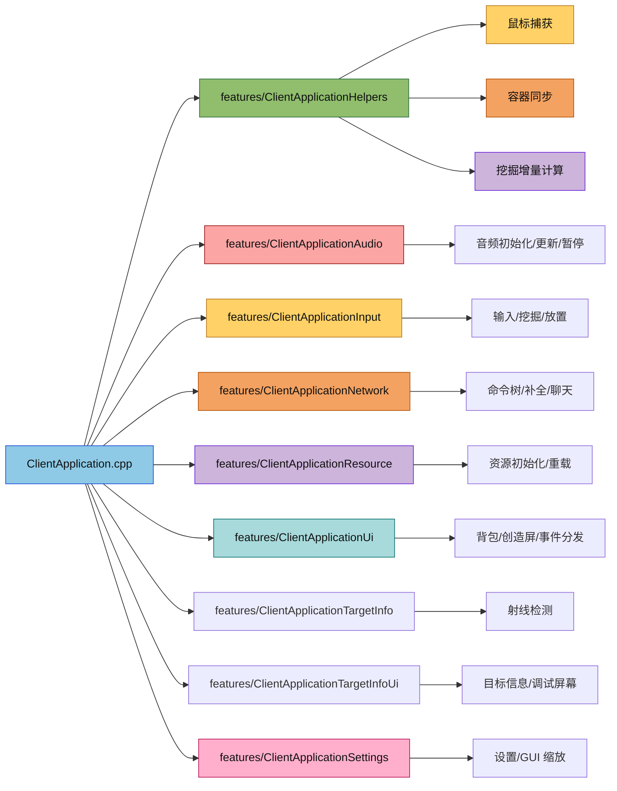

# Client Application Features

客户端应用功能模块目录，承载从 `ClientApplication` 中逐步拆分出来的功能域实现。

## 目录结构

```text
src/client/application/features/
├── ClientApplicationBootstrap.cpp
├── ClientApplicationHelpers.hpp
├── ClientApplicationHelpers.cpp
├── ClientApplicationAudio.cpp
├── ClientApplicationInput.cpp
├── ClientApplicationNetwork.cpp
├── ClientApplicationResource.cpp
├── ClientApplicationSession.cpp
├── ClientApplicationUi.cpp
├── ClientApplicationUiFrame.cpp
├── ClientApplicationTargetInfo.cpp
├── ClientApplicationTargetInfoUi.cpp
├── ClientApplicationSettings.cpp
└── README.md
```

## 文件介绍

- `ClientApplicationHelpers.hpp`：客户端应用的通用辅助函数声明，当前包含容器同步、鼠标捕获和方块挖掘增量计算等逻辑。
- `ClientApplicationHelpers.cpp`：上述非模板辅助函数的实现。
- `ClientApplicationBootstrap.cpp`：客户端应用初始化骨架，负责核心注册表、窗口/输入、渲染、游戏系统与 UI 的分层初始化调度。
- `ClientApplicationSession.cpp`：游戏会话管理，包含状态机回调、启动世界、销毁会话、返回主菜单等生命周期逻辑。创建世界时使用 `WorldNameSanitizer` 生成合法且不冲突的目录名。
- `ClientApplicationAudio.cpp`：音频初始化、玩家脚步/游泳音效、入水/出水提示音、听者同步与暂停状态逻辑。
- `ClientApplicationInput.cpp`：输入绑定、相机初始化、鼠标捕获、挖掘状态机、放置和玩家位置同步逻辑。
- `ClientApplicationNetwork.cpp`：网络回调、补全候选收集和聊天命令处理逻辑。包含实体状态处理（如驯服成功/失败粒子效果）。同时包含重生/维度切换的完整逻辑：
  - 维度切换检测（比较当前维度和目标维度）
  - 区块清空（`ClientWorld::clearChunks()`）
  - 实体清空（保留本地玩家）
  - 渲染器区块缓冲清理
  - 维度管理器状态更新
  - 云高度和渲染参数更新
  - 玩家状态重置（`keepData` 参数控制）
  - 客户端预测器重置
- `ClientApplicationResource.cpp`：资源初始化、资源重载和资源包变更回调逻辑。
- `ClientApplicationUi.cpp`：背包/创造屏、屏幕切换和事件分发逻辑。
- `ClientApplicationUiFrame.cpp`：每帧 UI 状态更新（ScreenStackWidget 输入换算、KageroEngine 更新等）。
- `ClientApplicationTargetInfo.cpp`：射线检测结果更新（更新 `m_raycastResult`）。
- `ClientApplicationTargetInfoUi.cpp`：准星目标信息与调试屏幕的每帧更新。
- `ClientApplicationSettings.cpp`：设置读取、应用、回调绑定和 GUI 缩放逻辑。
- `README.md`：本目录说明文档。

## 模块关系

- 该目录服务于 `src/client/application/ClientApplication.cpp`。
- 目前承载了无状态或低耦合的通用辅助逻辑，以及初始化骨架、音频、输入、网络、资源、UI、设置六个相对独立的功能域。
- 后续会继续拆出世界同步等更大的功能域。

## 整体职责

该目录的目标是把客户端应用中的横切逻辑拆成更小、更稳定的功能单元，降低 `ClientApplication.cpp` 的复杂度。

## 输入 / 输出

- 输入：玩家状态、方块状态、鼠标捕获状态、容器菜单与屏幕对象。
- 输出：容器内容同步结果、鼠标捕获状态切换、方块破坏进度增量。
- 输入：键盘鼠标状态、网络回调数据、资源包目录、聊天文本。
- 输出：玩家输入处理结果、网络事件处理结果、资源加载与重载结果。
- 输入：屏幕栈状态、聊天框状态、玩家游戏模式、GUI 缩放状态。
- 输出：屏幕打开/关闭、容器切换、鼠标捕获状态恢复。

## 依赖项

- `src/client/application/ClientApplication.cpp`
- `common/entity`、`common/item`、`common/world`、`common/screen`
- `common/world/storage/WorldStorageService.hpp`（会话管理：通过门面获取 saves 目录）
- `common/world/storage/list/WorldNameSanitizer.hpp`（会话管理：生成合法世界目录名）
- `client/input/InputManager`
- `client/network/NetworkClient`
- `client/resource/ResourceManager`
- `client/sound/AudioService`
- `client/world/ClientWorld`
- `client/renderer/trident/core/TridentEngine`
- `client/ui/minecraft/widgets/ChatWidget`
- `client/ui/screen/ScreenManager`
- `client/ui/screen/InventoryCraftingScreen`
- `client/ui/screen/CreativeScreen`
- `client/ui/minecraft/screens/DebugScreenWidget`

## 使用方法

示例：

```cpp
#include "client/application/features/ClientApplicationHelpers.hpp"

using namespace mc::client::application::features;

auto delta = calculateBlockBreakingDelta(player, state);
releaseMouseForScreen(input, mouseCaptured);
```

## 容易踩的坑

- 模板函数放在头文件中，非模板函数放在 `.cpp` 中。
- 该目录只放与客户端应用直接相关的通用功能，不要把子系统实现继续堆回来。
- 新模块加入后要同步更新 `src/client/CMakeLists.txt`。
- 中文注释要保留得足够详细，重构时不要把原有逻辑说明删薄。
- UI 事件分发文件要保留“为什么要这样分发”的注释，不要把屏幕切换逻辑写成无说明的条件块。
- `ClientApplication` 主文件已经不再保留 `setupInputBindings()` / `setupCamera()` 的实现，相关逻辑以 `features/` 内的同名成员函数为准。
- `ClientApplicationHelpers` 中的辅助函数位于 `mc::client::application::features` 命名空间，调用处要显式限定或引入对应作用域。

## 测试用例

- 目前没有独立测试文件，相关行为仍由客户端集成测试覆盖。
- 维度切换逻辑的相关测试见 `tests/client/world/ClientWorldClearChunksTest.cpp`。

## Mermaid 图表


```
