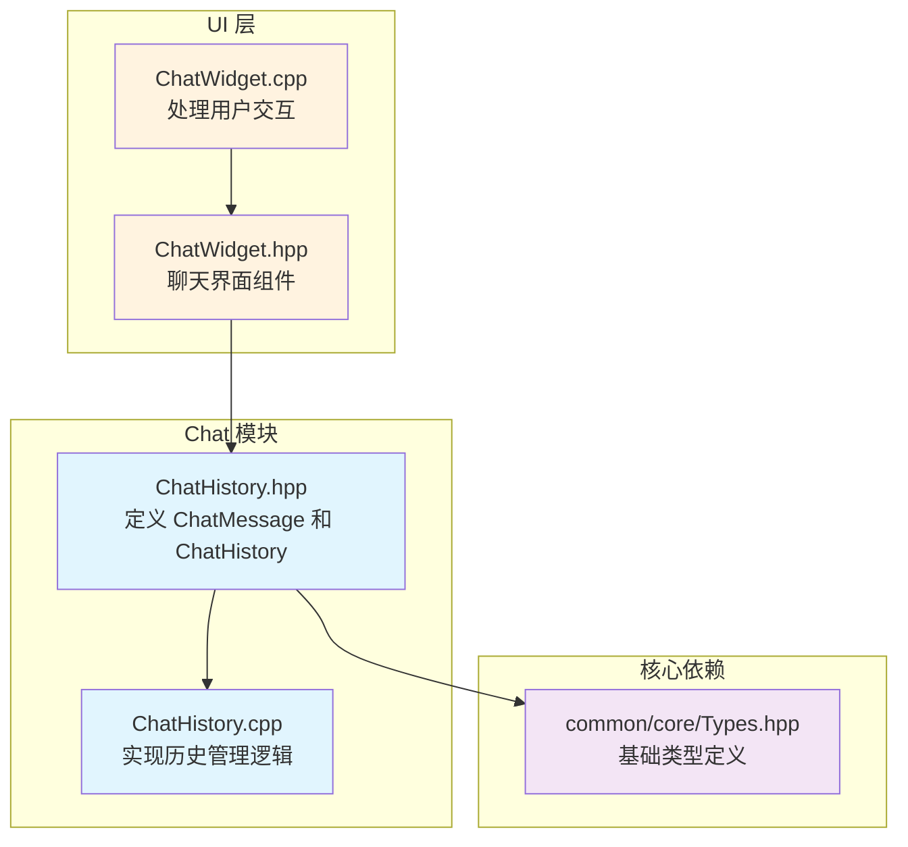
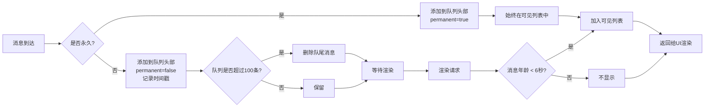

# Chat 模块

## 目录结构

```
src/client/chat/
├── ChatHistory.hpp    # 聊天历史管理器头文件
└── ChatHistory.cpp    # 聊天历史管理器实现
```

## 模块整体职责

Chat 模块负责管理客户端的聊天消息历史和输入历史，为聊天界面提供数据存储和检索功能。该模块是客户端 UI 系统的核心组件之一，与 `ChatWidget` 紧密配合，实现类似 Minecraft Java Edition 的聊天体验。

主要功能包括：
- 聊天消息存储与过期管理
- 消息可见性控制（基于时间和数量的双重限制）
- 输入历史记录与导航（上下箭头浏览历史命令）
- 永久消息支持（不会淡出的系统公告等）

---

## 文件详细介绍

### ChatHistory.hpp

**职责**：定义聊天消息数据结构和历史管理器接口。

**主要内容**：

#### 1. `ChatMessage` 结构体

```cpp
struct ChatMessage {
    std::string text;                              ///< 消息文本
    u32 color = 0xFFFFFFFF;                   ///< ARGB颜色
    std::chrono::steady_clock::time_point timestamp;  ///< 时间戳
    bool permanent = false;                   ///< 是否永久显示

    ChatMessage() = default;
    ChatMessage(const std::string& t, u32 c = 0xFFFFFFFF, bool perm = false);
};
```

- `text`: 聊天消息文本内容
- `color`: ARGB 格式的消息颜色（默认白色 `0xFFFFFFFF`）
- `timestamp`: 消息创建时间，用于计算淡出
- `permanent`: 永久消息标记，不会因时间而淡出

#### 2. `ChatHistory` 类

```cpp
class ChatHistory {
public:
    // 常量配置
    static constexpr size_t MAX_MESSAGES = 100;      ///< 最大消息数
    static constexpr size_t MAX_VISIBLE = 10;        ///< 最大可见消息数
    static constexpr size_t MAX_INPUT_HISTORY = 50;  ///< 最大输入历史
    static constexpr float MESSAGE_FADE_TIME = 5.0f; ///< 消息淡出时间（秒）

    // 消息管理接口
    void addMessage(const std::string& message, u32 color = 0xFFFFFFFF, bool permanent = false);
    void addSystemMessage(const std::string& message);
    void clear();
    std::vector<ChatMessage> getVisibleMessages(bool includeFading = true) const;
    const std::deque<ChatMessage>& allMessages() const;

    // 输入历史接口
    void addToInputHistory(const std::string& input);
    std::string getPreviousInput();
    std::string getNextInput();
    void resetInputNavigation();
    void clearInputHistory();
};
```

**关键设计决策**：

| 设计点 | 决策 | 原因 |
|--------|------|------|
| 消息存储 | `std::deque` | 头部插入高效，尾部删除高效 |
| 输入历史 | `std::vector` | 顺序访问，尾部插入 |
| 时间戳 | `steady_clock` | 单调时钟，不受系统时间调整影响 |
| 可见消息返回 | `std::vector` 副本 | 避免迭代器失效问题 |

---

### ChatHistory.cpp

**职责**：实现 `ChatHistory` 类的所有方法。

**核心逻辑**：

#### 消息添加与限制

```cpp
void ChatHistory::addMessage(const std::string& message, u32 color, bool permanent) {
    m_messages.emplace_front(message, color, permanent);

    // 限制消息数量
    while (m_messages.size() > MAX_MESSAGES) {
        m_messages.pop_back();
    }
}
```

- 新消息插入到队列头部（最新消息在前）
- 超过 `MAX_MESSAGES`（100条）时自动删除最旧消息

#### 可见消息过滤

```cpp
std::vector<ChatMessage> ChatHistory::getVisibleMessages(bool includeFading) const {
    std::vector<ChatMessage> result;
    auto now = std::chrono::steady_clock::now();

    size_t count = 0;
    for (const auto& msg : m_messages) {
        if (count >= MAX_VISIBLE) break;

        if (msg.permanent) {
            result.push_back(msg);
            count++;
        } else if (includeFading) {
            auto age = std::chrono::duration<float>(now - msg.timestamp).count();
            if (age < MESSAGE_FADE_TIME + 1.0f) {  // 额外1秒淡出时间
                result.push_back(msg);
                count++;
            }
        }
    }

    return result;
}
```

- 返回最多 `MAX_VISIBLE`（10条）消息
- 永久消息始终可见
- 非永久消息在 `MESSAGE_FADE_TIME`（5秒）+ 1秒淡出期内可见
- 总可见时间：6秒

#### 输入历史导航

```cpp
std::string ChatHistory::getPreviousInput() {
    if (m_inputHistory.empty()) return "";

    if (m_historyIndex == m_inputHistory.size()) {
        m_savedInput = "";  // 保存当前输入
    }

    if (m_historyIndex > 0) {
        m_historyIndex--;
        return m_inputHistory[m_historyIndex];
    }

    return m_inputHistory[0];
}

std::string ChatHistory::getNextInput() {
    if (m_inputHistory.empty()) return "";

    if (m_historyIndex < m_inputHistory.size() - 1) {
        m_historyIndex++;
        return m_inputHistory[m_historyIndex];
    }

    m_historyIndex = m_inputHistory.size();
    return m_savedInput;  // 返回保存的输入
}
```

- 上箭头：向上浏览历史（更旧的命令）
- 下箭头：向下浏览历史（更新的命令）
- 到达底部时恢复用户当前输入
- 支持重复检测，避免连续重复命令

---

## 文件关系图



---

## 输入与输出

### 输入

| 输入项 | 类型 | 来源 | 说明 |
|--------|------|------|------|
| 聊天消息 | `std::string` | 网络/本地 | 其他玩家发送或系统生成的消息 |
| 消息颜色 | `u32` (ARGB) | 消息类型 | 不同类型消息有不同颜色 |
| 永久标记 | `bool` | 系统设置 | 系统公告等不淡出的消息 |
| 用户输入 | `std::string` | UI 输入框 | 用户输入的聊天内容或命令 |

### 输出

| 输出项 | 类型 | 目标 | 说明 |
|--------|------|------|------|
| 可见消息列表 | `std::vector<ChatMessage>` | ChatWidget | 用于渲染聊天框的消息 |
| 历史输入 | `std::string` | ChatWidget | 用户浏览历史命令时获取 |

---

## 依赖项

### 外部依赖

```cpp
#include "common/core/Types.hpp"    // std::string, u32 等基础类型
#include <string>                   // std::string
#include <vector>                   // std::vector
#include <deque>                    // std::deque
#include <functional>               // std::function
#include <chrono>                   // std::chrono::steady_clock
```

### 被依赖

| 模块 | 文件 | 使用方式 |
|------|------|----------|
| UI | `ChatWidget.hpp` | 组合成员 `m_history` |

---

## 使用方法

### 基本使用

```cpp
#include "client/chat/ChatHistory.hpp"

using namespace mc::client::chat;

// 创建聊天历史管理器
ChatHistory history;

// 添加普通消息（白色，会淡出）
history.addMessage("Hello, world!");

// 添加彩色消息
history.addMessage("Player joined the game", 0xFF00FF00);  // 绿色

// 添加系统消息（灰色）
history.addSystemMessage("Server will restart in 5 minutes");

// 添加永久消息（不会淡出）
history.addMessage("Welcome to the server!", 0xFFFFFF00, true);

// 获取可见消息用于渲染
auto visible = history.getVisibleMessages();
for (const auto& msg : visible) {
    // 渲染消息...
    renderText(msg.text, msg.color);
}

// 输入历史管理
history.addToInputHistory("/gamemode survival");
history.addToInputHistory("/time set day");

// 浏览历史
std::string prev = history.getPreviousInput();  // "/time set day"
std::string prev2 = history.getPreviousInput(); // "/gamemode survival"
std::string next = history.getNextInput();       // "/time set day"

// 重置导航状态
history.resetInputNavigation();
```

### 与 ChatWidget 集成

```cpp
// ChatWidget 内部使用示例
class ChatWidget : public ContainerWidget {
public:
    void addMessage(const std::string& message, u32 color = 0xFFFFFFFF) {
        m_history.addMessage(message, color);
    }

    void sendInput() {
        if (!m_input.empty()) {
            m_history.addToInputHistory(m_input);
            if (m_commandCallback) {
                m_commandCallback(m_input);
            }
            clearInput();
        }
    }

    bool onKey(i32 key, i32 scanCode, i32 action, i32 mods) override {
        if (key == GLFW_KEY_UP && action == GLFW_PRESS) {
            setInput(m_history.getPreviousInput());
            return true;
        }
        if (key == GLFW_KEY_DOWN && action == GLFW_PRESS) {
            setInput(m_history.getNextInput());
            return true;
        }
        // ...
    }

private:
    ChatHistory m_history;
};
```

---

## 容易踩的坑

### 1. 消息时间戳精度问题

**问题**：使用 `system_clock` 可能因系统时间调整导致淡出计算错误。

**解决方案**：使用 `steady_clock` 单调时钟：

```cpp
// 正确 ✓
std::chrono::steady_clock::time_point timestamp;

// 错误 ✗ - 受系统时间调整影响
std::chrono::system_clock::time_point timestamp;
```

### 2. 输入历史导航状态未重置

**问题**：发送新命令后未重置导航索引，导致行为异常。

**解决方案**：发送命令后调用 `resetInputNavigation()`：

```cpp
void ChatWidget::sendInput() {
    if (!m_input.empty()) {
        m_history.addToInputHistory(m_input);
        m_history.resetInputNavigation();  // 重要！
        // 发送...
    }
}
```

### 3. 消息数量限制导致迭代器失效

**问题**：在遍历消息时添加新消息可能触发删除，导致迭代器失效。

**解决方案**：`getVisibleMessages()` 返回副本而非引用：

```cpp
// 返回副本，安全 ✓
std::vector<ChatMessage> getVisibleMessages() const;

// 如果返回引用，可能危险 ✗
const std::vector<ChatMessage>& getVisibleMessages() const;
```

### 4. 重复消息被意外过滤

**问题**：连续发送相同命令时第二条被过滤。

**解决方案**：`addToInputHistory()` 只检查最后一条，如果需要保留重复，需要修改逻辑：

```cpp
// 当前实现：过滤连续重复
if (!m_inputHistory.empty() && m_inputHistory.back() == input) return;

// 如果需要保留所有重复，移除此检查
```

### 5. 永久消息堆积

**问题**：大量永久消息可能挤占普通消息的显示位置。

**解决方案**：
- 限制永久消息数量
- 或调整 `MAX_VISIBLE` 以适应更多消息
- 或在 UI 层分开显示永久消息和普通消息

---

## 涉及的测试用例

**当前状态**：Chat 模块暂无独立的单元测试文件。

**相关测试**：
- `tests/common/test_network.cpp` 中包含 `ChatMessagePacket` 的序列化/反序列化测试，但这是网络层的测试，不涉及 ChatHistory 类。

**建议添加的测试**：

| 测试项 | 描述 |
|--------|------|
| `ChatHistory.AddMessage` | 测试消息添加和数量限制 |
| `ChatHistory.AddSystemMessage` | 测试系统消息的颜色 |
| `ChatHistory.GetVisibleMessages` | 测试可见消息过滤和时间淡出 |
| `ChatHistory.PermanentMessages` | 测试永久消息不会淡出 |
| `ChatHistory.InputHistory` | 测试输入历史添加和导航 |
| `ChatHistory.InputNavigationEdge` | 测试导航边界情况（空历史、到达顶部/底部） |
| `ChatHistory.DuplicateInput` | 测试连续重复输入的过滤 |
| `ChatHistory.ClearOperations` | 测试清除操作 |

---

## 消息生命周期图



---

## 配置参数参考

| 参数 | 值 | 说明 |
|------|-----|------|
| `MAX_MESSAGES` | 100 | 历史消息最大存储数量 |
| `MAX_VISIBLE` | 10 | 同时显示的最大消息数 |
| `MAX_INPUT_HISTORY` | 50 | 输入历史最大数量 |
| `MESSAGE_FADE_TIME` | 5.0秒 | 消息开始淡出的时间 |
| 淡出动画时间 | 1.0秒 | 消息完全消失的动画时间 |
| 总可见时间 | 6.0秒 | 消息从出现到完全消失 |

---

## 未来扩展方向

1. **消息格式化**：支持富文本格式（粗体、斜体、颜色代码等）
2. **消息搜索**：在历史消息中搜索关键词
3. **消息分类**：按频道、类型分类存储和显示
4. **消息持久化**：保存聊天历史到文件
5. **聊天宏**：支持预定义消息快捷发送
