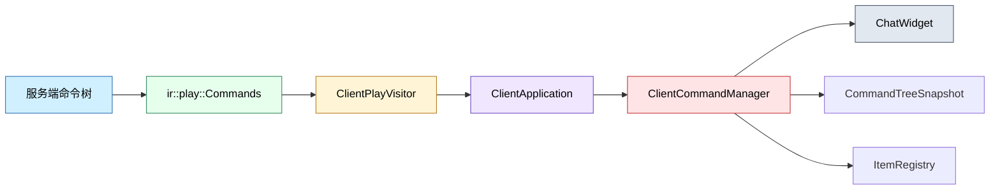

# Client Command 模块

客户端命令模块负责接收服务端同步的命令树快照，并在本地生成聊天框补全建议。它不执行命令本身，只维护客户端可见的命令结构、候选词来源和补全逻辑。

## 目录结构

```text
src/client/command/
├── ClientCommandManager.hpp  # 客户端命令树管理器接口
├── ClientCommandManager.cpp  # 命令树加载、遍历和补全实现
└── README.md                 # 本文档
```

## 模块关系



## 上下游依赖

### 上游依赖（谁调用了本模块）

| 调用方 | 接口 | 说明 |
|--------|------|------|
| ClientApplication | `applyCommandTreeJson()` | 接收服务端命令树包 |
| ChatWidget | `getSuggestions()` | 获取补全建议 |

### 下游依赖（本模块依赖了谁）

| 依赖项 | 用途 |
|--------|------|
| `common/command/CommandTreeSnapshot` | 命令树快照数据结构 |
| `common/command/StringReader` | 字符串解析 |
| `common/command/suggestions/Suggestions` | 建议类型 |
| `common/item/ItemRegistry` | 物品候选回退 |

### 外部依赖

- `nlohmann::json`：快照反序列化
- `spdlog`：日志输出

## 容易踩的坑

- 命令树必须来自服务端同步结果，不能靠客户端硬编码。
- 断开连接后必须清空本地树和候选缓存，否则会显示过期补全。
- 快照节点 `id` 必须连续，否则反序列化会失败。
- `getSuggestions()` 只处理以 `/` 开头的命令输入。
- 物品候选在没有外部提供器时会回退到全量物品注册表，初始化顺序要正确。
