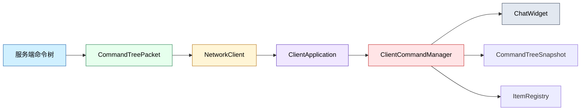
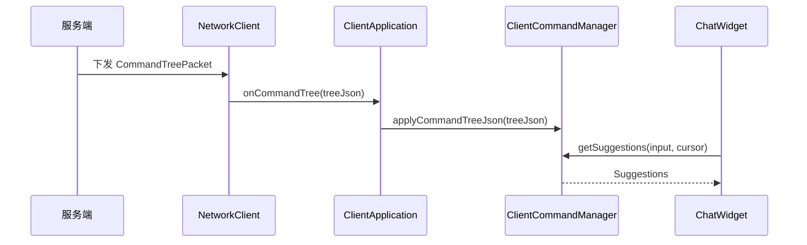

# Client Command 模块

客户端命令模块负责接收服务端同步的命令树快照，并在本地生成聊天框补全建议。它不执行命令本身，只维护客户端可见的命令结构、候选词来源和补全逻辑。

## 目录结构

```text
src/client/command/
├── ClientCommandManager.hpp  # 客户端命令树管理器接口
├── ClientCommandManager.cpp  # 命令树加载、遍历和补全实现
└── README.md                 # 本文档
```

## 文件介绍

### ClientCommandManager.hpp

定义 `ClientCommandManager`，负责：

- 接收服务端下发的命令树 JSON
- 维护当前命令树快照
- 根据输入光标位置生成本地补全建议
- 注入玩家名、实体名、物品名候选源

### ClientCommandManager.cpp

实现命令树解析与补全遍历逻辑，主要包括：

- JSON 反序列化到 `CommandTreeSnapshot`
- 命令名称去重与排序
- 固定候选、命令名、玩家名、实体名、物品名的建议生成
- 大小写不敏感的前缀匹配

## 模块关系



## 整体职责

客户端命令模块的职责是把服务端权威命令树转成适合本地 UI 使用的数据结构，并在聊天框中提供尽量接近原版 Minecraft 的命令补全体验。

## 输入 / 输出

| 类型 | 输入 | 输出 |
| ------ | ------ | ------ |
| 命令树 | 服务端 JSON 快照 | 本地 `CommandTreeSnapshot` |
| 候选源 | 玩家 / 实体 / 物品列表 | 补全候选词 |
| 聊天输入 | `/` 开头的输入内容 | `Suggestions` |
| 状态变化 | 登录、断开、重连 | 清空或重建本地缓存 |

## 依赖项

### 内部依赖

- `common/command/CommandTreeSnapshot.hpp`
- `common/command/StringReader.hpp`
- `common/command/suggestions/Suggestions.hpp`
- `common/item/core/Item.hpp`
- `common/item/core/ItemRegistry.hpp`

### 外部依赖

- `nlohmann::json` 用于快照序列化
- `spdlog` 由上层调用方负责日志输出

## 使用方法

```cpp
mc::client::command::ClientCommandManager manager;

manager.setPlayerNameProvider([]() {
    return std::vector<std::string>{"Steve", "Alex"};
});

auto applyResult = manager.applyCommandTreeJson(treeJson);
if (applyResult.success()) {
    auto suggestions = manager.getSuggestions("/tell A", 7);
}
```

## 容易踩的坑

- 命令树必须来自服务端同步结果，不能靠客户端硬编码。
- 断开连接后必须清空本地树和候选缓存，否则会显示过期补全。
- 快照节点 `id` 必须连续，否则反序列化会失败。
- `getSuggestions()` 只处理以 `/` 开头的命令输入。
- 物品候选在没有外部提供器时会回退到全量物品注册表，初始化顺序要正确。

## 测试用例

- [tests/client/command/ClientCommandManagerTest.cpp](../../../tests/client/command/ClientCommandManagerTest.cpp) 覆盖了命令树包往返、快照加载和补全候选生成。

## Mermaid 图表


