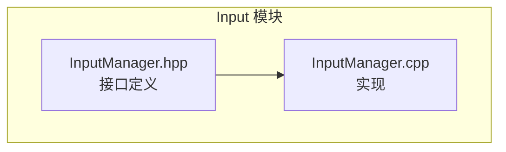

# Input 输入模块

## 目录结构

```
src/client/input/
├── InputManager.hpp    # 输入管理器头文件，管理键盘和鼠标输入
└── InputManager.cpp    # 输入管理器实现
```

## 内部模块关系

本模块仅包含一个 `InputManager` 类，负责统一管理所有输入相关功能：



## 上下游外部依赖关系

### 依赖项

| 依赖 | 用途 |
|------|------|
| GLFW | 窗口和输入事件（前向声明） |
| spdlog | 日志输出 |
| common/core/Types.hpp | 基础类型定义 (i32, f64 等) |
| common/profiler/TraceEvents.hpp | 性能追踪 |

### 使用者

| 使用者 | 用途 |
|--------|------|
| ClientApplication | 客户端主应用，初始化和每帧调用 |
| Kagero UI 引擎 | 字符输入回调、键盘事件回调 |

---

## 模块整体职责

InputManager 是客户端输入系统的核心组件，负责：

1. **原始输入捕获**：通过 GLFW 回调接收键盘、鼠标、滚轮事件
2. **状态管理**：维护按键/鼠标按钮的按下、刚按下、刚释放状态
3. **鼠标位置追踪**：实时追踪鼠标位置和移动增量
4. **鼠标锁定**：支持第一人称视角的鼠标锁定模式
5. **动作绑定系统**：提供按键到动作的映射机制
6. **事件分发**：通过回调将输入事件分发给 UI 系统

---

## 容易踩的坑

### 1. 忘记调用 endFrame()

**问题**：`justPressed` 和 `justReleased` 状态不会自动清理，导致持续检测到"刚按下"事件。

**解决方案**：每帧结束时必须调用 `endFrame()`。

### 2. update() 和 GLFW 回调的时序

**问题**：GLFW 回调在 `glfwPollEvents()` 期间触发，而 `update()` 需要在其后调用才能正确计算增量。

**正确时序**：
```cpp
glfwPollEvents();  // 触发回调，更新原始状态
input.update();     // 计算状态变化和增量
```

### 3. 鼠标按键状态在 update() 中更新

**问题**：鼠标按键的 `justPressed`/`justReleased` 状态在 `update()` 中计算，而非回调中直接设置。键盘状态则在回调中直接更新。这可能导致行为不一致。

### 4. GLFW 按键码范围检查

**问题**：GLFW 可能返回负数的 key 值（如未知按键），直接使用会导致 `unordered_set` 问题。

**解决方案**：代码已处理此情况，仅处理 `key >= 0` 的事件。

### 5. 键盘事件回调的消费机制

**问题**：`setKeyEventCallback` 的回调如果返回 `true` 会消费事件，阻止后续的 action 触发。

**注意**：如果 UI 需要拦截键盘输入（如文本框输入时），回调应返回 `true`。
