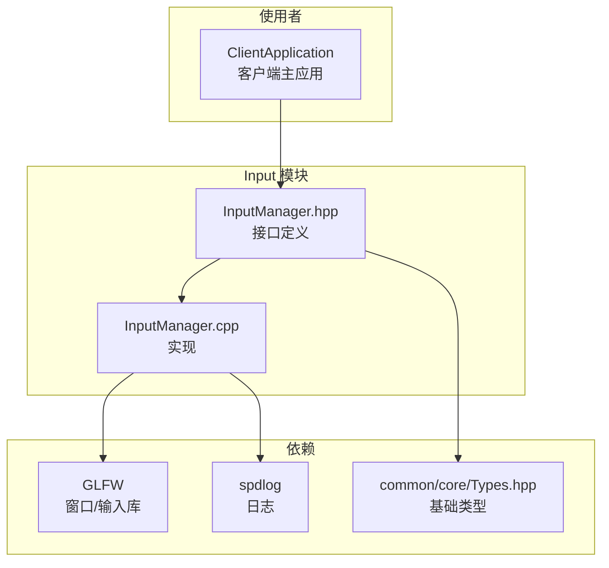
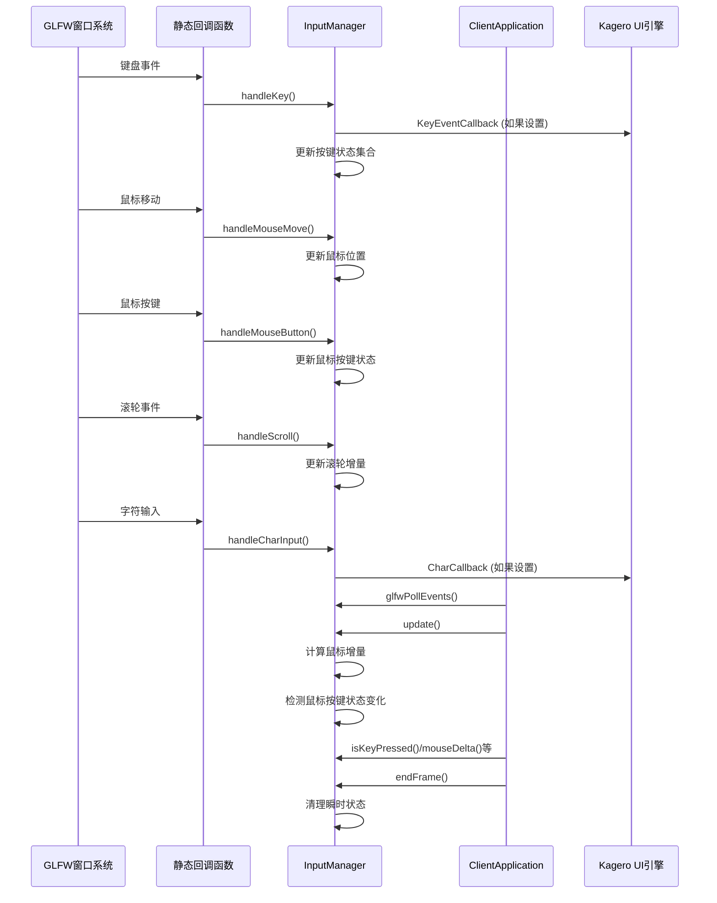
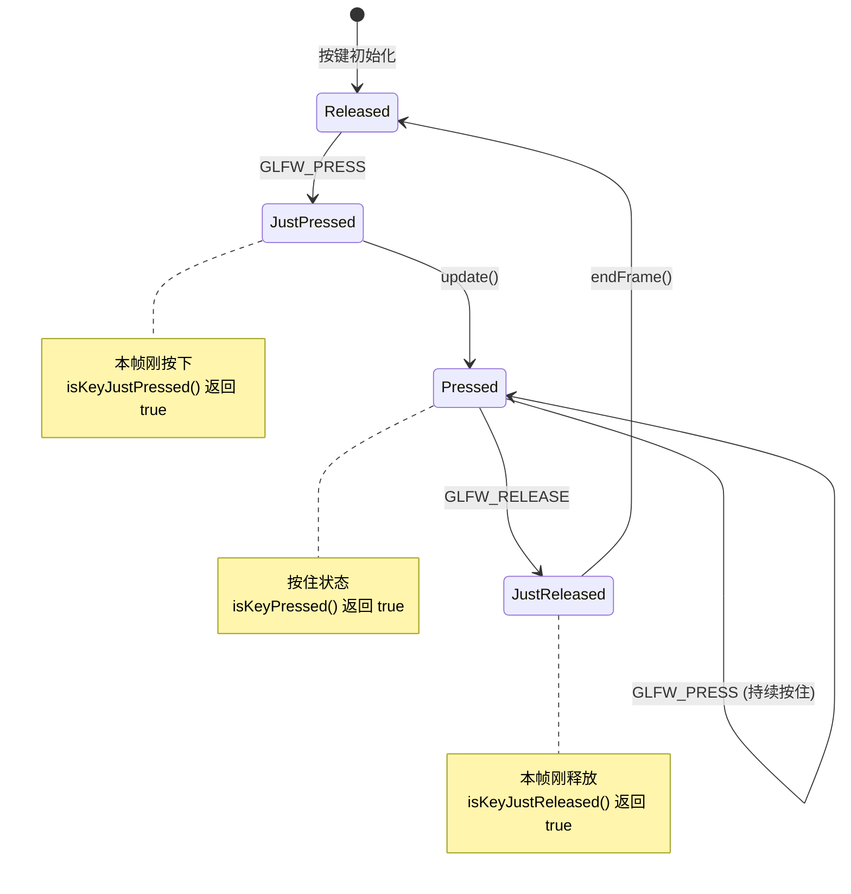
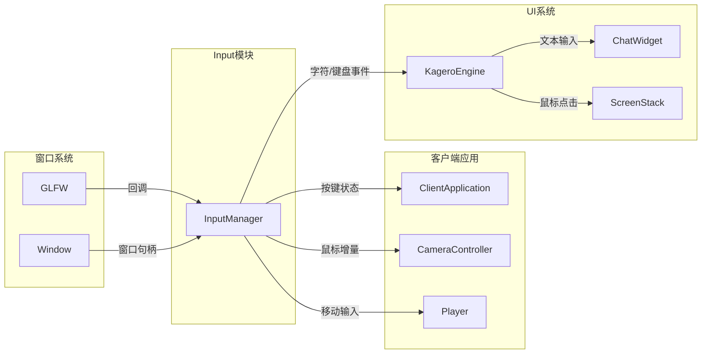

# Input 输入模块

## 目录结构

```
src/client/input/
├── InputManager.hpp    # 输入管理器头文件
└── InputManager.cpp    # 输入管理器实现
```

## 文件详解

### InputManager.hpp

**职责**: 定义输入管理器类，声明所有输入相关的接口和数据结构。

**主要内容**:

| 类/结构 | 描述 |
|---------|------|
| `InputManager` | 输入管理器主类，管理键盘和鼠标输入 |

**核心功能接口**:

```cpp
// 初始化与生命周期
void initialize(GLFWwindow* window);  // 绑定GLFW窗口和回调
void update();                         // 每帧更新输入状态
void endFrame();                       // 清理瞬时状态（如刚按下/刚释放）

// 键盘状态查询
bool isKeyPressed(i32 key) const;        // 按键是否按下
bool isKeyJustPressed(i32 key) const;    // 按键是否刚按下（本帧）
bool isKeyJustReleased(i32 key) const;   // 按键是否刚释放（本帧）

// 鼠标状态查询
bool isMouseButtonPressed(i32 button) const;
bool isMouseButtonJustPressed(i32 button) const;
bool isMouseButtonJustReleased(i32 button) const;

// 鼠标位置与移动
f64 mouseX() const;      // 当前鼠标X坐标
f64 mouseY() const;      // 当前鼠标Y坐标
f64 mouseDeltaX() const; // 本帧鼠标X增量
f64 mouseDeltaY() const; // 本帧鼠标Y增量

// 滚轮
f64 scrollDeltaX() const; // 滚轮X增量
f64 scrollDeltaY() const; // 滚轮Y增量

// 鼠标锁定（第一人称视角）
void setMouseLocked(bool locked);
bool isMouseLocked() const;

// 字符输入回调（用于文本输入）
void setCharCallback(CharCallback callback);
void clearCharCallback();

// 键盘事件回调（用于UI输入）
void setKeyEventCallback(KeyEventCallback callback);
void clearKeyEventCallback();

// 按键动作绑定系统
void bindKeyAction(i32 key, const std::string& action);
void bindActionCallback(const std::string& action, ActionCallback callback);
```

**状态数据成员**:

```cpp
// 按键状态（使用集合存储，支持O(1)查询）
std::unordered_set<i32> m_keysPressed;         // 当前按下的键
std::unordered_set<i32> m_keysJustPressed;      // 本帧刚按下的键
std::unordered_set<i32> m_keysJustReleased;     // 本帧刚释放的键

// 鼠标按键状态
std::unordered_set<i32> m_mouseButtonsPressed;
std::unordered_set<i32> m_mouseButtonsJustPressed;
std::unordered_set<i32> m_mouseButtonsJustReleased;
std::unordered_set<i32> m_previousMouseButtonsPressed;  // 用于检测状态变化

// 鼠标位置
f64 m_mouseX, m_mouseY;        // 当前位置
f64 m_lastMouseX, m_lastMouseY; // 上一帧位置
f64 m_mouseDeltaX, m_mouseDeltaY; // 本帧增量

// 滚轮
f64 m_scrollDeltaX, m_scrollDeltaY;

// 按键绑定系统
std::unordered_map<i32, std::string> m_keyBindings;           // 按键->动作映射
std::unordered_map<std::string, ActionCallback> m_actionCallbacks; // 动作->回调映射
```

---

### InputManager.cpp

**职责**: 实现输入管理器的所有功能。

**主要实现**:

1. **全局窗口-管理器映射**:
   ```cpp
   std::unordered_map<GLFWwindow*, InputManager*> g_inputManagers;
   ```
   用于将GLFW回调路由到正确的InputManager实例。

2. **静态回调函数**:
   - `keyCallback` - 键盘事件回调
   - `mouseCallback` - 鼠标移动回调
   - `mouseButtonCallback` - 鼠标按键回调
   - `scrollCallback` - 滚轮回调
   - `charCallback` - 字符输入回调

3. **状态管理**:
   - `update()` - 更新鼠标按键状态变化检测，计算鼠标增量
   - `endFrame()` - 清理 `justPressed`/`justReleased` 状态和滚轮增量

4. **鼠标锁定模式**:
   - `setMouseLocked()` - 切换光标可见性，重置鼠标状态避免跳跃

---

## 文件关系图



---

## 模块整体分析

### 整体职责

InputManager 是客户端输入系统的核心组件，负责：

1. **原始输入捕获**: 通过GLFW回调接收键盘、鼠标、滚轮事件
2. **状态管理**: 维护按键/鼠标按钮的按下、刚按下、刚释放状态
3. **鼠标位置追踪**: 实时追踪鼠标位置和移动增量
4. **鼠标锁定**: 支持第一人称视角的鼠标锁定模式
5. **动作绑定系统**: 提供按键到动作的映射机制
6. **事件分发**: 通过回调将输入事件分发给UI系统

### 输入和输出

| 输入 | 来源 |
|------|------|
| GLFW键盘事件 | GLFW回调 |
| GLFW鼠标移动事件 | GLFW回调 |
| GLFW鼠标按键事件 | GLFW回调 |
| GLFW滚轮事件 | GLFW回调 |
| GLFW字符输入事件 | GLFW回调 |

| 输出 | 目标 |
|------|------|
| 按键状态查询结果 | ClientApplication |
| 鼠标位置/增量 | ClientApplication |
| 字符输入回调 | Kagero UI引擎 |
| 键盘事件回调 | Kagero UI引擎 |
| 动作回调 | ClientApplication |

### 依赖项

| 依赖 | 用途 |
|------|------|
| GLFW | 窗口和输入事件 |
| spdlog | 日志输出 |
| common/core/Types.hpp | 基础类型定义 (i32, f64, String等) |
| std::unordered_set | 按键状态存储 |
| std::unordered_map | 按键绑定映射 |
| std::functional | 回调函数类型 |

### 使用方法

#### 1. 初始化

```cpp
#include "client/input/InputManager.hpp"

// 在客户端初始化时
InputManager input;
input.initialize(windowHandle);  // 传入GLFWwindow*
```

#### 2. 主循环中的使用

```cpp
void mainLoop() {
    while (running) {
        // 1. 处理事件（更新输入状态）
        glfwPollEvents();
        input.update();

        // 2. 查询输入状态
        if (input.isKeyPressed(GLFW_KEY_W)) {
            moveForward();
        }
        if (input.isKeyJustPressed(GLFW_KEY_SPACE)) {
            jump();
        }

        // 3. 鼠标控制（第一人称视角）
        if (input.isMouseLocked()) {
            f32 sensitivity = 0.1f;
            f32 yawDelta = input.mouseDeltaX() * sensitivity;
            f32 pitchDelta = input.mouseDeltaY() * sensitivity;
            rotateCamera(yawDelta, pitchDelta);
        }

        // 4. 滚轮处理
        if (input.scrollDeltaY() != 0.0) {
            selectNextSlot(input.scrollDeltaY() > 0 ? -1 : 1);
        }

        // 5. 帧结束清理
        input.endFrame();
    }
}
```

#### 3. 鼠标锁定控制

```cpp
// 进入第一人称模式
input.setMouseLocked(true);

// 退出第一人称模式（如打开菜单）
input.setMouseLocked(false);
```

#### 4. UI输入回调

```cpp
// 设置字符输入回调（用于文本框）
input.setCharCallback([](u32 codepoint) {
    handleTextChar(codepoint);
});

// 设置键盘事件回调（用于UI快捷键）
input.setKeyEventCallback([](i32 key, i32 action, i32 mods) {
    if (key == GLFW_KEY_ESCAPE && action == GLFW_PRESS) {
        closeMenu();
    }
});
```

#### 5. 动作绑定系统

```cpp
// 绑定按键到动作
input.bindKeyAction(GLFW_KEY_ESCAPE, "exit");
input.bindKeyAction(GLFW_KEY_E, "inventory");

// 设置动作回调
input.bindActionCallback("exit", []() {
    requestExit();
});
input.bindActionCallback("inventory", []() {
    toggleInventory();
});
```

---

### 容易踩的坑

#### 1. 忘记调用 endFrame()

**问题**: `justPressed` 和 `justReleased` 状态不会自动清理，导致持续检测到"刚按下"事件。

**解决方案**: 每帧结束时必须调用 `endFrame()`：
```cpp
// 正确做法
void mainLoop() {
    handleEvents();
    update();
    render();
    input.endFrame();  // 必须调用！
}
```

#### 2. 鼠标锁定切换时的跳跃问题

**问题**: 从锁定模式切换回正常模式时，鼠标可能"跳跃"到意外位置。

**解决方案**: `setMouseLocked()` 内部已处理此问题，切换时会重置位置状态。

#### 3. update() 和 GLFW回调的时序

**问题**: GLFW回调在 `glfwPollEvents()` 期间触发，而 `update()` 需要在其后调用才能正确计算增量。

**正确时序**:
```cpp
glfwPollEvents();  // 触发回调，更新原始状态
input.update();     // 计算状态变化和增量
```

#### 4. 鼠标按键状态在 update() 中更新

**问题**: 鼠标按键的 `justPressed`/`justReleased` 状态在 `update()` 中计算，而非回调中。

**注意**: 键盘状态在回调中直接更新，鼠标按键状态在 `update()` 中更新。这可能导致行为不一致。

#### 5. GLFW按键码范围检查

**问题**: GLFW可能返回负数的key值（如未知按键），直接使用会导致 `unordered_set` 问题。

**解决方案**: 代码已处理此情况：
```cpp
if (input && key >= 0) {
    input->handleKey(key, action);
}
```

#### 6. 多窗口场景

**问题**: 全局 `g_inputManagers` 映射支持多窗口，但当前实现假设单窗口。

**注意**: 如果将来支持多窗口，需要确保每个窗口有独立的InputManager。

---

## 数据流图



---

## 状态转换图



---

## 与其他模块的交互



---

## 涉及的测试用例

**当前状态**: 暂无针对 InputManager 的单元测试文件。

**建议测试用例**:

1. **按键状态测试**
   - 测试 `isKeyPressed()` 在按键按下时返回 true
   - 测试 `isKeyJustPressed()` 仅在按下帧返回 true
   - 测试 `isKeyJustReleased()` 仅在释放帧返回 true
   - 测试 `endFrame()` 正确清理瞬时状态

2. **鼠标按键状态测试**
   - 测试鼠标按键状态变化检测
   - 测试 `update()` 正确计算状态变化

3. **鼠标位置测试**
   - 测试 `mouseDeltaX/Y` 正确计算增量
   - 测试 `update()` 后增量被重置

4. **鼠标锁定测试**
   - 测试 `setMouseLocked()` 正确切换GLFW光标模式
   - 测试锁定切换后鼠标状态重置

5. **动作绑定测试**
   - 测试按键绑定和回调触发
   - 测试同一动作多按键绑定

6. **回调测试**
   - 测试字符输入回调触发
   - 测试键盘事件回调触发

---

## 代码示例

### 完整使用示例

```cpp
#include "client/input/InputManager.hpp"
#include <GLFW/glfw3.h>

class Game {
    mc::client::InputManager m_input;
    GLFWwindow* m_window;

public:
    void initialize() {
        // 创建窗口后初始化
        m_window = glfwCreateWindow(1920, 1080, "Game", nullptr, nullptr);
        m_input.initialize(m_window);

        // 设置按键绑定
        setupInputBindings();

        // 设置UI回调
        m_input.setCharCallback([this](u32 codepoint) {
            m_textInput.append(1, static_cast<char>(codepoint));
        });
    }

    void setupInputBindings() {
        m_input.bindKeyAction(GLFW_KEY_ESCAPE, "pause");
        m_input.bindActionCallback("pause", [this]() {
            togglePauseMenu();
        });
    }

    void mainLoop() {
        while (!glfwWindowShouldClose(m_window)) {
            // 处理GLFW事件
            glfwPollEvents();

            // 更新输入状态
            m_input.update();

            // 处理游戏输入
            handleInput();

            // 渲染
            render();

            // 帧结束清理
            m_input.endFrame();
        }
    }

    void handleInput() {
        // 第一人称控制
        if (m_input.isMouseLocked()) {
            float sensitivity = 0.002f;
            camera.rotate(
                m_input.mouseDeltaX() * sensitivity,
                m_input.mouseDeltaY() * sensitivity
            );
        }

        // 移动输入
        glm::vec3 moveDir(0.0f);
        if (m_input.isKeyPressed(GLFW_KEY_W)) moveDir.z += 1.0f;
        if (m_input.isKeyPressed(GLFW_KEY_S)) moveDir.z -= 1.0f;
        if (m_input.isKeyPressed(GLFW_KEY_A)) moveDir.x -= 1.0f;
        if (m_input.isKeyPressed(GLFW_KEY_D)) moveDir.x += 1.0f;
        player.move(moveDir);

        // 跳跃（仅触发一次）
        if (m_input.isKeyJustPressed(GLFW_KEY_SPACE)) {
            player.jump();
        }

        // 滚轮切换物品
        if (m_input.scrollDeltaY() != 0.0) {
            int slot = player.getSelectedSlot();
            slot += (m_input.scrollDeltaY() > 0) ? -1 : 1;
            player.setSelectedSlot(slot);
        }

        // 鼠标按键
        if (m_input.isMouseButtonJustPressed(GLFW_MOUSE_BUTTON_LEFT)) {
            player.attack();
        }
        if (m_input.isMouseButtonJustPressed(GLFW_MOUSE_BUTTON_RIGHT)) {
            player.useItem();
        }
    }
};
```
