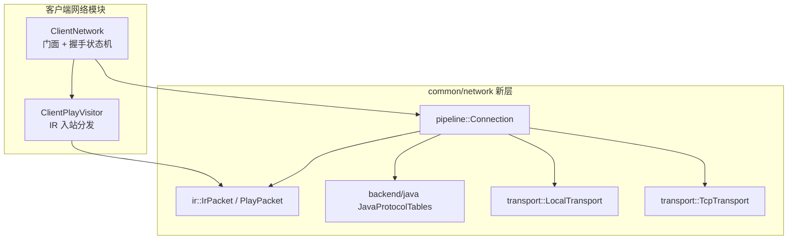

# 客户端网络模块

客户端网络门面 + 入站包 visitor。基于新网络层 `common/network` 的 `Connection<RegistryByteBuf>` 与 IR 中间表示，对齐 MC Java 1.21.11 线协议。

## 目录结构

```text
src/client/network/
├── ClientNetwork.hpp       # 客户端网络门面：持 Connection，驱动握手状态机 + 出站统一 send
├── ClientNetwork.cpp       # 实现：connectLocal/connectTcp/send/tick/onPacket + 握手编排
├── ClientPlayVisitor.hpp   # 入站 Play/Configuration 包 visitor（std::visit over IR 变体）
└── ClientPlayVisitor.cpp   # 各分支体：IR struct 字段 → 既有 ClientApplication 游戏方法
```

## 内部模块关系



**核心职责**：
- **连接管理**：`connectLocal`（集成服同进程零拷贝，走 `LocalTransport`）/ `connectTcp`（独立服远程，走 `TcpTransport`）。
- **握手编排**：内部状态机驱动 Handshake→Login→Configuration→Play（`ClientIntention`→`Hello`→`LoginCompression`→`LoginFinished`→`LoginAcknowledged`→Configuration 协商→Play）。
- **出站统一 send**：游戏逻辑只见 `send(ir::IrPacket)`。
- **入站分发**：`onPacket` 注册单一监听器，Play 阶段委托 `ClientPlayVisitor::handle`，Configuration 阶段委托 `ClientPlayVisitor::handleConfiguration`。

## 上下游外部依赖关系

**上游调用方**：`ClientApplication`（`ClientApplicationSession` 构造、`connectLocal`、disconnect；`ClientApplicationNetwork` 注册 visitor）。

**下游依赖**：
- `common/network/pipeline/Connection`：统一连接门面（Wire/Local 双模式 + 压缩/加密 handler）。
- `common/network/ir/`：协议无关中间表示。
- `common/network/backend/java/`：Java 1.21.11 wire codec + 协议表。
- `common/network/transport/{LocalTransport,TcpTransport}`：传输抽象。
- `common/entity/...`、`common/world/...`、`common/item/...`：游戏类型（visitor 分支体消费）。

## 容易踩的坑

### 1. connectLocal 是异步的

`connectLocal` 返回时握手尚未完成，玩家实体/身份在 Play 前不可用。所有读取 `m_clientPlayerId`/`m_clientEntityId` 的处须等 `_handleLogin`（Play 阶段首包）触发。

### 2. Configuration 阶段不可误转 PlayRouter

`handleInbound` 对 Configuration 阶段包必须 `return true`（已消费），而非判 `!m_playReady` 转发 `PlayRouter`——否则 `FinishConfiguration` 会被误当 Play 包导致 router 崩溃。

### 3. Local 模式 pump 顺序/重入

集成服每 tick pump 一次 Local 连接；handler 内禁止递归 pump。`ServerNetwork::tick` 注释明示此约束。

### 4. 统计字段供 DebugScreenWidget 读取

`packetsSent()`/`packetsReceived()`/`ping()` 由 `DebugScreenWidget` 经 `setClientNetwork(this)` 读取。重命名此 setter 会断开调试屏网络计数。

### 5. 复杂 opaque 包

`Commands`/`MapItemData` 等 IR 字段为 opaque `vector<u8>`（透传序列化字节），属我方互通自洽的 opaque 透传层，真 Java 互通需各自完整 codec（独立子项，不在本层范围）；`Explosion`/`LevelParticles`/`BlockEntityData` 已结构化。新接入的包类型应在 `ClientPlayVisitor` 加分支，不要回退到旧 packet 反序列化。
