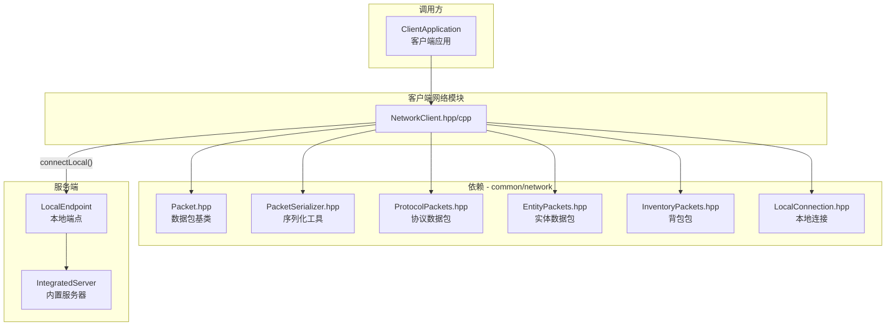
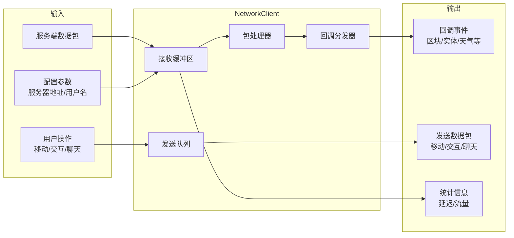
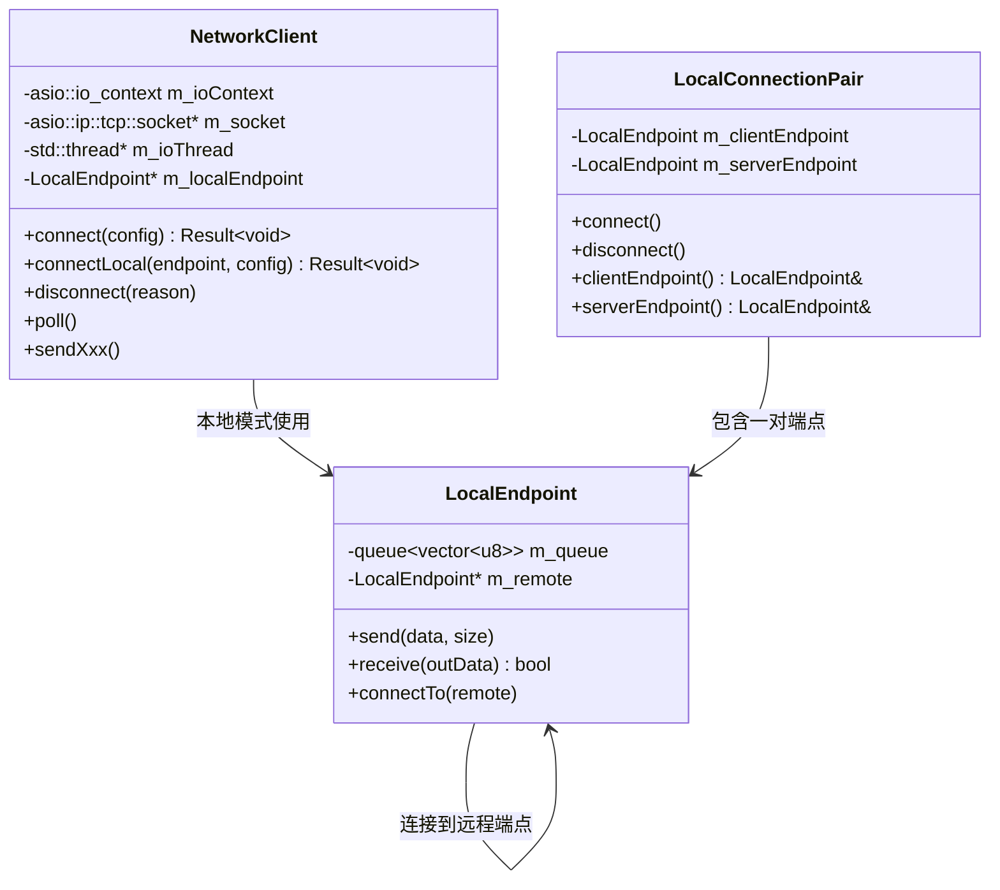
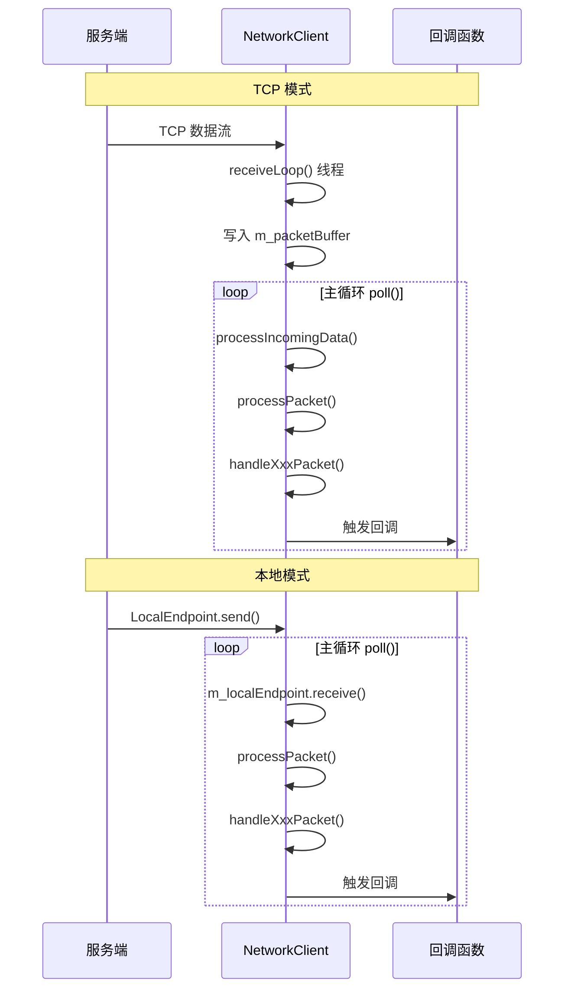

# NetworkClient 模块

客户端网络通信模块，负责客户端与服务端之间的所有网络交互，支持 TCP 远程连接和本地进程内连接两种模式。

## 目录结构

```
src/client/network/
├── NetworkClient.hpp    # 网络客户端头文件
└── NetworkClient.cpp    # 网络客户端实现
```

## 文件详细说明

### NetworkClient.hpp

**职责**: 网络客户端接口定义

**主要内容**:

#### 1. 客户端状态枚举 (`ClientState`)

| 状态 | 值 | 说明 |
|------|---|------|
| `Disconnected` | 0 | 已断开连接 |
| `Connecting` | 1 | 正在连接中 |
| `LoggingIn` | 2 | 正在登录 |
| `Playing` | 3 | 游戏中 |
| `Disconnecting` | 4 | 正在断开 |

#### 2. 客户端配置结构 (`NetworkClientConfig`)

| 字段 | 类型 | 默认值 | 说明 |
|------|------|--------|------|
| `serverAddress` | String | "127.0.0.1" | 服务器地址 |
| `serverPort` | u16 | 25565 | 服务器端口 |
| `username` | String | "Player" | 用户名 |
| `connectTimeoutMs` | u32 | 5000 | 连接超时（毫秒） |
| `keepAliveIntervalMs` | u32 | 15000 | 心跳间隔（毫秒） |
| `reconnectDelayMs` | u32 | 1000 | 重连延迟（毫秒） |
| `autoReconnect` | bool | true | 是否自动重连 |

#### 3. 网络事件回调结构 (`NetworkClientCallbacks`)

**连接事件**:
- `onConnected()`: 连接成功
- `onDisconnected(reason)`: 断开连接
- `onError(error)`: 发生错误

**登录事件**:
- `onLoginSuccess(playerId, username)`: 登录成功
- `onLoginFailed(reason)`: 登录失败

**游戏事件**:
- `onTeleport(x, y, z, yaw, pitch, teleportId)`: 传送
- `onChunkData(x, z, data)`: 区块数据
- `onChunkUnload(x, z)`: 卸载区块
- `onPlayerSpawn(playerId, username, x, y, z)`: 玩家生成
- `onPlayerDespawn(playerId)`: 玩家消失
- `onBlockUpdate(x, y, z, blockStateId)`: 方块更新
- `onChatMessage(message, senderId)`: 聊天消息
- `onPlayerMove(playerId, x, y, z, yaw, pitch)`: 玩家移动
- `onTimeUpdate(gameTime, dayTime, daylightCycleEnabled)`: 时间更新
- `onPlayerInventory(selectedSlot, items)`: 背包同步
- `onOpenContainer(packet)`: 打开容器
- `onContainerContent(packet)`: 容器内容
- `onContainerSlot(packet)`: 槽位更新
- `onCloseContainer(containerId)`: 关闭容器

**实体事件**:
- `onSpawnMob(entityId, typeId, x, y, z, yaw, pitch, headYaw)`: Mob 生成，初始元数据会随后通过 `onEntityMetadata` 应用
- `onSpawnEntity(entityId, typeId, x, y, z, yaw, pitch, itemStack)`: 实体生成
- `onEntityMove(entityId, deltaX, deltaY, deltaZ)`: 实体相对移动
- `onEntityVelocity(entityId, vx, vy, vz)`: 实体速度
- `onEntityTeleport(entityId, x, y, z, yaw, pitch)`: 实体传送
- `onEntityDestroy(entityIds)`: 实体销毁
- `onEntityAnimation(entityId, animation)`: 实体动画
- `onEntityHeadLook(entityId, headYaw)`: 头部朝向
- `onEntityStatus(entityId, status)`: 实体状态

**天气事件**:
- `onRainStrengthChange(strength)`: 雨量变化
- `onThunderStrengthChange(strength)`: 雷暴强度变化
- `onBeginRaining()`: 开始下雨
- `onEndRaining()`: 结束下雨

**其他事件**:
- `onGameModeChange(mode)`: 游戏模式变化
- `onPlayerAbilities(...)`: 玩家能力同步
- `onLightUpdate(...)`: 光照更新
- `onBlockBreakAnim(breakerEntityId, x, y, z, stage)`: 方块破坏动画
- `onEntityMetadata(entityId, metadata)`: 实体元数据，既用于 spawn 后的初始状态，也用于后续脏数据增量更新

#### 4. NetworkClient 类

**连接管理**:
```cpp
// 连接远程服务器
Result<void> connect(const NetworkClientConfig& config);

// 连接本地服务器（内置服务器模式）
Result<void> connectLocal(network::LocalEndpoint* endpoint,
                          const NetworkClientConfig& config = {});

// 断开连接
void disconnect(const String& reason = "Client disconnect");

// 查询状态
bool isConnected() const;
ClientState state() const;
bool isLocalConnection() const;
```

**发送数据包**:
```cpp
void sendLoginRequest();                    // 发送登录请求
void sendPlayerMove(pos, type);             // 发送玩家位置
void sendBlockInteraction(action, x, y, z, face);  // 方块交互
void sendBlockPlacement(x, y, z, face, hitX, hitY, hitZ, hand);  // 方块放置
void sendHotbarSelect(slot);                // 快捷栏选择
void sendTeleportConfirm(teleportId);       // 传送确认
void sendKeepAlive(id);                     // 心跳响应
void sendChatMessage(message);              // 聊天消息
void sendContainerClick(packet);            // 容器点击
void sendCloseContainer(containerId);       // 关闭容器
```

**统计信息**:
```cpp
u64 bytesReceived() const;    // 接收字节数
u64 bytesSent() const;        // 发送字节数
u64 packetsReceived() const;  // 接收包数
u64 packetsSent() const;      // 发送包数
u32 ping() const;             // 网络延迟（毫秒）
```

### NetworkClient.cpp

**职责**: 网络客户端实现

**主要内容**:

#### 1. TCP 连接模式

```cpp
Result<void> NetworkClient::connect(const NetworkClientConfig& config) {
    // 1. 解析服务器地址
    asio::ip::tcp::resolver resolver(m_ioContext);
    auto endpoints = resolver.resolve(config.serverAddress,
                                      std::to_string(config.serverPort));

    // 2. 建立连接
    asio::connect(*m_socket, endpoints);

    // 3. 设置 TCP 选项
    m_socket->set_option(asio::ip::tcp::no_delay(true));
    m_socket->set_option(asio::socket_base::keep_alive(true));

    // 4. 启动接收线程
    m_ioThread = std::make_unique<std::thread>([this]() {
        receiveLoop();
    });

    // 5. 发送登录请求
    sendLoginRequest();
}
```

#### 2. 本地连接模式

```cpp
Result<void> NetworkClient::connectLocal(network::LocalEndpoint* endpoint,
                                         const NetworkClientConfig& config) {
    // 本地连接不需要 IO 线程
    m_localEndpoint = endpoint;
    m_running = true;
    sendLoginRequest();
}
```

#### 3. 数据包接收流程

```
receiveLoop() [TCP模式]
    │
    ▼
m_socket->read_some() ──► m_packetBuffer
    │
    │  [主线程 poll()]
    ▼
processIncomingData()
    │
    ▼
解析包头 (12字节)
    │
    ▼
processPacket(data, size)
    │
    ▼
根据 PacketType 分发到 handleXxxPacket()
```

#### 4. 数据包处理函数

| 处理函数 | 数据包类型 | 说明 |
|---------|-----------|------|
| `handleKeepAlive` | KeepAlive | 心跳响应 |
| `handleLoginResponse` | LoginResponse | 登录响应 |
| `handleTeleport` | Teleport | 传送处理 |
| `handleChunkData` | ChunkData | 区块数据 |
| `handleUnloadChunk` | UnloadChunk | 卸载区块 |
| `handlePlayerSpawn` | PlayerSpawn | 玩家生成 |
| `handlePlayerDespawn` | PlayerDespawn | 玩家消失 |
| `handleBlockUpdate` | BlockUpdate | 方块更新 |
| `handleChatMessage` | ChatBroadcast | 聊天消息 |
| `handleTimeUpdate` | TimeUpdate | 时间同步 |
| `handlePlayerInventory` | PlayerInventory | 背包同步 |
| `handleOpenContainer` | OpenContainer | 打开容器 |
| `handleContainerContent` | ContainerContent | 容器内容 |
| `handleContainerSlot` | ContainerSlot | 槽位更新 |
| `handleCloseContainer` | CloseContainer | 关闭容器 |
| `handleSpawnEntity` | SpawnEntity | 实体生成 |
| `handleSpawnMob` | SpawnMob | Mob 生成 |
| `handleEntityDestroy` | EntityDestroy | 实体销毁 |
| `handleEntityMove` | EntityMove | 实体相对移动 |
| `handleEntityTeleport` | EntityTeleport | 实体传送 |
| `handleEntityVelocity` | EntityVelocity | 实体速度 |
| `handleEntityMetadata` | EntityMetadata | 实体元数据 |
| `handleEntityAnimation` | EntityAnimation | 实体动画 |
| `handleEntityHeadLook` | EntityHeadLook | 头部朝向 |
| `handleEntityStatus` | EntityStatus | 实体状态 |
| `handleGameStateChange` | GameStateChange | 游戏状态变化 |
| `handlePlayerAbilities` | PlayerAbilities | 玩家能力 |
| `handleLightUpdate` | LightUpdate | 光照更新 |
| `handleBlockBreakAnim` | BlockBreakAnim | 方块破坏动画 |

## 文件关系图



## 模块整体职责

### 职责概述

NetworkClient 模块负责客户端与服务端之间的所有网络通信：

1. **连接管理**: 建立、维护、断开连接
2. **协议处理**: 数据包的序列化和反序列化
3. **事件分发**: 将网络事件分发到上层回调
4. **心跳机制**: 定期发送心跳包维持连接
5. **双模式支持**: TCP 远程连接和本地进程内连接

### 输入和输出



### 依赖项

| 依赖模块 | 用途 |
|---------|------|
| `common/core/Types.hpp` | 基本类型定义 |
| `common/core/Result.hpp` | 错误处理 |
| `common/entity/Player.hpp` | 玩家类型 |
| `common/item/ItemStack.hpp` | 物品堆类型 |
| `common/network/packet/*` | 数据包定义 |
| `common/network/connection/LocalConnection.hpp` | 本地连接 |
| `asio` | 异步网络 I/O (TCP 模式) |
| `spdlog` | 日志输出 |
| `std::thread` | 接收线程 (TCP 模式) |

### 使用方法

#### 1. 连接远程服务器

```cpp
#include "client/network/NetworkClient.hpp"

mc::client::NetworkClient client;

// 设置回调
mc::client::NetworkClientCallbacks callbacks;
callbacks.onConnected = []() {
    spdlog::info("Connected to server!");
};
callbacks.onChunkData = [](mc::ChunkCoord x, mc::ChunkCoord z,
                           const std::vector<mc::u8>& data) {
    // 处理区块数据
};
callbacks.onPlayerSpawn = [](mc::PlayerId id, const mc::String& name,
                            mc::f64 x, mc::f64 y, mc::f64 z) {
    // 处理玩家生成
};

client.setCallbacks(callbacks);

// 连接
mc::client::NetworkClientConfig config;
config.serverAddress = "192.168.1.100";
config.serverPort = 25565;
config.username = "Player";

auto result = client.connect(config);
if (result.failed()) {
    spdlog::error("Failed to connect: {}", result.error().message());
    return;
}

// 主循环
while (running) {
    client.poll();  // 处理网络事件
    // ... 游戏逻辑
}

client.disconnect("Quit");
```

#### 2. 连接内置服务器（单机模式）

```cpp
#include "client/network/NetworkClient.hpp"
#include "common/network/connection/LocalConnection.hpp"

// 创建本地连接对
mc::network::LocalConnectionPair connectionPair;
connectionPair.connect();

// 服务端使用 serverEndpoint()
// 客户端使用 clientEndpoint()
mc::client::NetworkClient client;
mc::client::NetworkClientConfig config;
config.username = "Player";

auto result = client.connectLocal(&connectionPair.clientEndpoint(), config);

// 本地连接模式不需要 poll() 中的 IO 线程
while (running) {
    client.poll();  // 直接从队列读取
}
```

#### 3. 发送玩家移动

```cpp
// 在游戏循环中定期发送位置
void sendPlayerPosition() {
    if (!client.isLoggedIn()) return;

    mc::network::PlayerPosition pos;
    pos.x = player.x;
    pos.y = player.y;
    pos.z = player.z;
    pos.yaw = player.yaw;
    pos.pitch = player.pitch;
    pos.onGround = player.onGround;

    // 根据位置变化选择移动类型
    mc::network::PlayerMovePacket::MoveType type;
    if (positionChanged && rotationChanged) {
        type = mc::network::PlayerMovePacket::MoveType::Full;
    } else if (positionChanged) {
        type = mc::network::PlayerMovePacket::MoveType::Position;
    } else if (rotationChanged) {
        type = mc::network::PlayerMovePacket::MoveType::Rotation;
    } else {
        type = mc::network::PlayerMovePacket::MoveType::GroundOnly;
    }

    client.sendPlayerMove(pos, type);
}
```

#### 4. 发送方块交互

```cpp
// 开始挖掘
client.sendBlockInteraction(
    mc::network::BlockInteractionAction::StartDestroyBlock,
    blockPos.x, blockPos.y, blockPos.z, face
);

// 放置方块
client.sendBlockPlacement(
    blockPos.x, blockPos.y, blockPos.z, face,
    hitPos.x, hitPos.y, hitPos.z
);
```

### 容易踩的坑

#### 1. 忘记调用 poll()

**问题**: 网络事件不会自动处理，必须定期调用 `poll()`。

**解决方案**:
```cpp
// 在游戏主循环中调用
while (running) {
    client.poll();  // 必须调用
    // ... 其他游戏逻辑
}
```

#### 2. 回调中阻塞操作

**问题**: 在回调中执行阻塞操作会导致网络层卡死。

**解决方案**:
```cpp
// 错误做法
callbacks.onChunkData = [&](ChunkCoord x, ChunkCoord z, const std::vector<u8>& data) {
    // 不要在这里做耗时操作！
    std::this_thread::sleep_for(100ms);  // 错误
    heavyProcessing(data);  // 错误
};

// 正确做法：将数据放入队列，稍后处理
callbacks.onChunkData = [&](ChunkCoord x, ChunkCoord z, const std::vector<u8>& data) {
    std::lock_guard<std::mutex> lock(queueMutex);
    chunkQueue.push({x, z, data});  // 快速入队
};
```

#### 3. TCP 模式下线程安全

**问题**: TCP 模式使用独立的接收线程，回调在接收线程中执行。

**解决方案**:
```cpp
// 使用原子变量或互斥锁保护共享状态
std::atomic<bool> loggedIn{false};

callbacks.onLoginSuccess = [&](PlayerId id, const String& name) {
    loggedIn = true;  // 原子操作，安全
};
```

#### 4. 本地连接和 TCP 连接混淆

**问题**: 本地连接和 TCP 连接的 API 调用方式不同。

**解决方案**:
```cpp
// TCP 远程连接
client.connect(config);  // 使用 NetworkClientConfig

// 本地连接（内置服务器）
client.connectLocal(endpoint, config);  // 需要传入 LocalEndpoint

// 检查连接类型
if (client.isLocalConnection()) {
    // 本地连接处理
}
```

#### 5. 心跳包未响应

**问题**: 服务端发送心跳后，客户端必须在超时前回复。

**解决方案**:
```cpp
// NetworkClient 内部已处理心跳
// handleKeepAlive() 会自动调用 sendKeepAlive()
// 只需确保 poll() 被定期调用
```

#### 6. 数据包大小限制

**问题**: 接收到超大包可能导致缓冲区溢出。

**解决方案**:
```cpp
// NetworkClient 内部有最大包大小限制
constexpr size_t MAX_PACKET_SIZE = 2 * 1024 * 1024;  // 2MB

// 超过限制会自动断开连接
if (packetSize > MAX_PACKET_SIZE) {
    disconnect("Invalid packet size");
}
```

#### 7. 传送确认遗漏

**问题**: 收到传送包后必须确认，否则服务端可能重发。

**解决方案**:
```cpp
// NetworkClient::handleTeleport() 内部已自动调用
sendTeleportConfirm(packet.teleportId());

// 不需要手动处理
```

#### 8. 实体相对移动单位转换

**问题**: 实体相对移动使用 1/32 方块单位。

**解决方案**:
```cpp
// NetworkClient 内部已处理转换
m_callbacks.onEntityMove(
    packet.entityId(),
    packet.deltaX() / 32.0f,  // 转换为方块单位
    packet.deltaY() / 32.0f,
    packet.deltaZ() / 32.0f
);
```

### 涉及的测试用例

目前 `src/client/network` 目录下没有专门的单元测试文件，但相关测试位于 `tests/network/` 目录：

| 测试文件 | 测试内容 |
|---------|---------|
| `LocalServerConnectionTest.cpp` | 本地连接测试，验证 `LocalEndpoint` 和 `LocalConnectionPair` |
| `EntityPacketsTest.cpp` | 实体数据包序列化/反序列化测试 |

**测试覆盖场景**:

`LocalServerConnectionTest.cpp`:
- 本地端点连接/断开
- 双向消息收发
- 线程安全性
- 阻塞等待

`EntityPacketsTest.cpp`:
- `SpawnEntityPacket` 序列化/反序列化
- `SpawnMobPacket` 序列化/反序列化
- `EntityVelocityPacket` 速度同步
- `EntityTeleportPacket` 传送
- `EntityDestroyPacket` 销毁
- `EntityAnimationPacket` 动画
- `EntityMovePacket` 相对移动
- `EntityHeadLookPacket` 头部朝向
- `EntityStatusPacket` 状态
- `EntityMetadataPacket` 元数据

**运行测试**:
```powershell
# 运行网络测试
./build/bin/Release/mc_tests.exe --gtest_filter="Network*"

# 运行本地连接测试
./build/bin/Release/mc_tests.exe --gtest_filter="*LocalConnection*"
```

## 架构设计

### 双模式架构



### 数据包处理流程



## 性能考量

### 1. 接收缓冲区大小

```cpp
constexpr size_t RECEIVE_BUFFER_SIZE = 64 * 1024;  // 64KB
constexpr size_t MAX_PACKET_SIZE = 2 * 1024 * 1024; // 2MB
```

- 64KB 缓冲区足够处理大多数数据包
- 区块数据包可能较大，最大支持 2MB

### 2. 心跳间隔

```cpp
u32 keepAliveIntervalMs = 15000;  // 15 秒
```

- 15 秒心跳间隔与 Minecraft 原版一致
- 避免频繁心跳占用带宽

### 3. 位置同步频率

```cpp
static constexpr f32 POSITION_SEND_INTERVAL = 1.0f / 20.0f;  // 20 TPS
```

- 位置同步频率限制为 20 次/秒
- 与服务端 TPS 一致，避免浪费带宽

### 4. 本地连接优势

- 无需 TCP 协议栈开销
- 无需独立接收线程
- 零拷贝队列传输
- 适合单机模式和测试

## 相关文档

- [common/network/packet/README.md](../../common/network/packet/README.md) - 数据包模块文档
- [common/network/connection/LocalConnection.hpp](../../common/network/connection/LocalConnection.hpp) - 本地连接实现
- [server/application/IntegratedServer.hpp](../../server/application/IntegratedServer.hpp) - 内置服务器
- [client/README.md](../README.md) - 客户端模块总览
- [CLAUDE.md](../../../CLAUDE.md) - 项目总览
