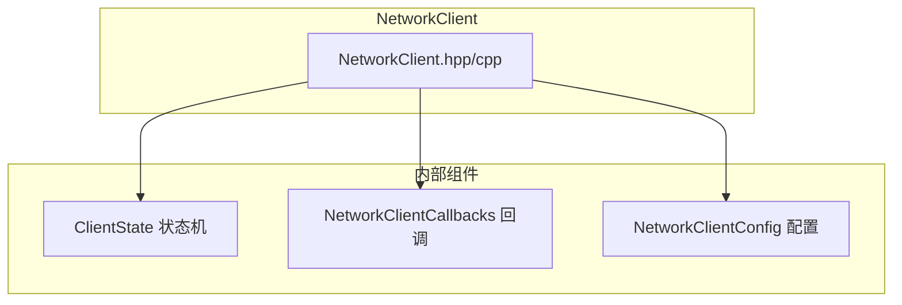
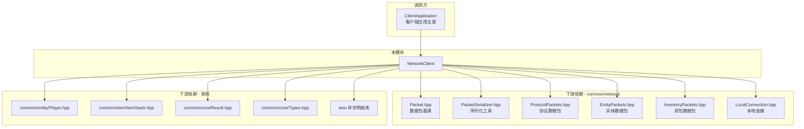

# NetworkClient 模块

客户端网络通信模块，负责客户端与服务端之间的所有网络交互，支持 TCP 远程连接和本地进程内连接两种模式。

## 目录结构

```text
src/client/network/
├── NetworkClient.hpp    # 网络客户端接口定义（连接管理、回调、发送接口）
└── NetworkClient.cpp    # 网络客户端实现（TCP/本地双模式、包解析、事件分发）
```

## 内部模块关系



**核心职责**：
- **连接管理**：建立、维护、断开连接（TCP 远程 / 本地进程内两种模式）
- **协议处理**：数据包的序列化和反序列化
- **事件分发**：将网络事件分发到上层回调
- **心跳机制**：定期发送心跳包维持连接

## 上下游外部依赖关系



**上游调用方**：`ClientApplication` 在主循环中调用 `poll()` 处理网络事件。

**下游依赖**：
- `common/network/packet/*`：各类数据包定义
- `common/network/connection/LocalConnection.hpp`：本地连接实现
- `common/entity/Player.hpp`、`common/item/ItemStack.hpp`：游戏类型
- `asio`：TCP 模式的异步网络 I/O

## 容易踩的坑

### 1. 忘记调用 poll()

网络事件不会自动处理，必须在主循环中定期调用：
```cpp
while (running) {
    client.poll();  // 必须调用
    // ... 游戏逻辑
}
```

### 2. 回调中执行阻塞操作

在回调中执行阻塞操作会导致网络层卡死。正确做法是将数据放入队列，稍后处理：
```cpp
callbacks.onChunkData = [&](auto x, auto z, const auto& data) {
    std::lock_guard<std::mutex> lock(queueMutex);
    chunkQueue.push({x, z, data});  // 快速入队，不阻塞
};
```

### 3. TCP 模式下的线程安全

TCP 模式使用独立的接收线程，回调在接收线程中执行。使用原子变量或互斥锁保护共享状态。

### 4. 本地连接和 TCP 连接 API 差异

```cpp
// TCP 远程连接
client.connect(config);

// 本地连接（内置服务器）
client.connectLocal(endpoint, config);

// 检查连接类型
if (client.isLocalConnection()) { /* 本地连接处理 */ }
```

### 5. 传送确认

收到传送包后必须确认，否则服务端可能重发。`handleTeleport()` 内部已自动调用 `sendTeleportConfirm()`，无需手动处理。

### 6. 实体相对移动单位转换

实体相对移动包使用 1/32 方块单位，`NetworkClient` 内部已处理转换（除以 32.0f）。

### 7. NetworkClientConfig 默认值

该结构体字段设置了默认值（如 `serverAddress = "127.0.0.1"`），使用时需注意是否符合预期。

### 8. 粒子同步回调

`NetworkClientCallbacks` 提供了一组粒子回调，由 `_handleParticle()` 根据 `ParticlePacket` 的可选数据类型分发：
- `onParticle` - 普通粒子（无附加数据）
- `onBlockParticle` - 方块粒子（携带 `BlockState&`，由 `decodeBlockState()` 解析）
- `onItemParticle` - 物品粒子（携带 `ItemStack&`，由 `decodeItemStack()` 解析；对应 Item/ItemSlime/ItemCobweb/ItemSnowball）
- `onVibrationParticle` / `onTrailParticle` - 振动/轨迹粒子（携带目标位置等参数）
- `onEntityEffectParticle` - 实体效果粒子（携带 ARGB 颜色）

分发顺序：先检查 `isBlockParticle()` → `isItemParticle()` → `isVibrationParticle()` → `isTrailParticle()` → `isEntityEffectParticle()`，均不匹配则走 `onParticle`。各回调由 `ClientApplicationNetwork` 注册，通过 `ParticleData` 走粒子数据管线创建粒子。

### 9. 方块实体数据同步回调（onBlockEntityData）

`NetworkClientCallbacks::onBlockEntityData` 是方块实体数据同步包（`PacketType::BlockEntityData = 237`）的客户端接收回调，对应 MC Java 的 `ClientPlayPacketListener.handleBlockEntityData()`。

**回调签名**：
```cpp
std::function<void(const network::BlockEntityDataPacket& packet)> onBlockEntityData;
```

**处理链路**：
1. `NetworkClient::_handleBlockEntityData(PacketDeserializer&)` 反序列化 `BlockEntityDataPacket`
2. 触发 `onBlockEntityData(packet)` 回调
3. `ClientApplicationNetwork` 中注册的回调转发给 `ClientWorld::onBlockEntityData(packet.pos(), packet.type(), packet.nbtData())`
4. `ClientWorld` 反序列化 NBT 字节流，通过 `BlockEntityRegistry` 查找/创建对应类型的 `BlockEntity` 实例
5. 调用 `BlockEntity::loadFromNBT(tag)` 更新状态

**使用场景**：
- 告示牌编辑器打开时，`ServerPlayer::openSignEditor()` 在发送 `OpenSignEditorPacket` 前先发送 `BlockEntityDataPacket`，客户端通过此回调读取当前告示牌文本
- 告示牌编辑完成后，`ServerPlayer::handleUpdateSignPacket()` 调用 `ServerWorld::broadcastBlockEntity()` 广播新文本，所有附近客户端通过此回调更新
- 其他方块实体数据变化（如命令方块内容、箱子物品等）的服务端→客户端同步

**与 `onSignEditorOpen` 的协作**：告示牌编辑器打开时需要先接收 BlockEntity 数据（当前文本），再接收 `OpenSignEditorPacket`（打开编辑器指令）。`ClientApplicationNetwork::onSignEditorOpen` 通过 `ClientWorld::getBlockEntity(pos)` 读取已同步的 BlockEntity 状态获取当前文本，避免编辑器打开时覆盖已有内容。

**注意事项**：
- NBT 反序列化失败时 `ClientWorld::onBlockEntityData` 会记录警告日志并跳过，不创建实体。
- 未注册类型的 BlockEntity（如 `BlockEntityType::Count`）会因 `BlockEntityRegistry::create()` 返回 `nullptr` 而跳过创建。
- 维度切换时 `ClientWorld::clearChunks()` 会一并清空所有客户端 BlockEntity 存储。
