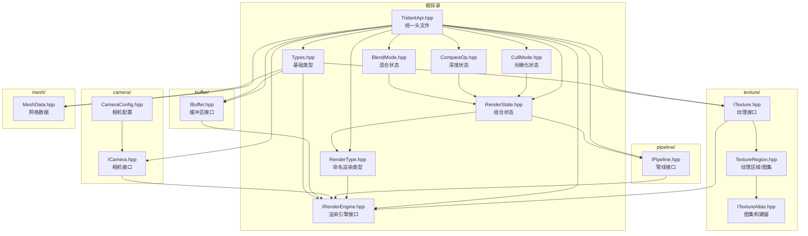

# Renderer API 模块

## 概述

`api` 目录是渲染系统的平台无关抽象层，为不同渲染后端（Vulkan、OpenGL、DirectX、Metal）提供统一的接口定义。该模块定义了渲染引擎的核心接口、数据结构和状态管理，是客户端渲染系统的基础。

## 目录结构

```
api/
├── BlendMode.hpp           # 混合因子、混合操作、混合状态
├── CompareOp.hpp           # 深度比较操作、深度状态
├── CullMode.hpp            # 面剔除模式、正面朝向、光栅化状态
├── IRenderEngine.hpp       # 渲染引擎主接口
├── TridentApi.hpp          # 统一头文件（包含所有 API）
├── Types.hpp               # 顶点格式、方块朝向、枚举类型
├── Types.cpp               # 方块几何辅助函数实现
├── buffer/
│   └── IBuffer.hpp         # 缓冲区接口（顶点、索引、Uniform、暂存）
├── camera/
│   ├── CameraConfig.hpp    # 相机配置结构
│   └── ICamera.hpp         # 相机接口
├── mesh/
│   └── MeshData.hpp        # 网格数据结构
├── pipeline/
│   ├── IPipeline.hpp       # 渲染管线、管线布局、描述符集接口
│   ├── RenderState.hpp     # 渲染状态（混合+深度+光栅化）
│   └── RenderType.hpp      # 命名渲染类型（MC 1.16.5 风格）
└── texture/
    ├── ITexture.hpp        # 纹理接口、纹理格式、采样器设置
    ├── ITextureAtlas.hpp   # 纹理图集构建器接口
    └── TextureRegion.hpp   # 纹理区域（UV 坐标）
```

## 文件详解

### 根目录文件

#### BlendMode.hpp

**职责**：定义颜色混合相关的类型和状态。

| 类型 | 说明 |
|------|------|
| `BlendFactor` | 混合因子枚举（Zero, One, SrcAlpha, OneMinusSrcAlpha 等 15 种） |
| `BlendOp` | 混合操作枚举（Add, Subtract, ReverseSubtract, Min, Max） |
| `BlendState` | 完整的混合状态结构体 |

**关键方法**：
```cpp
// 创建常用混合状态
static BlendState disabled();      // 禁用混合（不透明物体）
static BlendState alpha();         // 标准 Alpha 混合（半透明物体）
static BlendState additive();      // 加法混合（发光效果、粒子）
static BlendState premultiplied(); // 预乘 Alpha 混合
static BlendState multiply();      // 颜色叠加混合
```

**参考**：MC 1.16.5 `GlStateManager.BlendState`

---

#### CompareOp.hpp

**职责**：定义深度测试相关的类型和状态。

| 类型 | 说明 |
|------|------|
| `CompareOp` | 深度比较函数枚举（Never, Less, Equal, LessEqual, Greater, NotEqual, GreaterEqual, Always） |
| `DepthState` | 深度测试和深度写入状态 |

**关键方法**：
```cpp
static DepthState disabled();   // 禁用深度测试
static DepthState readOnly();   // 只读深度（透明物体）
static DepthState readWrite();  // 读写深度（不透明物体）
static DepthState equal();      // 深度相等测试（decals）
```

---

#### CullMode.hpp

**职责**：定义面剔除和光栅化相关的类型和状态。

| 类型 | 说明 |
|------|------|
| `CullMode` | 面剔除模式枚举（None, Front, Back, FrontAndBack） |
| `FrontFace` | 正面朝向枚举（CounterClockwise, Clockwise） |
| `PolygonMode` | 多边形填充模式枚举（Fill, Line, Point） |
| `RasterizerState` | 光栅化状态结构体 |

**关键方法**：
```cpp
static RasterizerState defaults();     // 默认状态（剔除背面）
static RasterizerState doubleSided();  // 双面渲染
static RasterizerState wireframe();    // 线框模式
```

---

#### Types.hpp / Types.cpp

**职责**：定义渲染系统的基础数据类型。

| 类型 | 说明 |
|------|------|
| `Vertex` | 顶点数据结构（位置、法线、UV、颜色、光照） |
| `Face` | 方块面朝向枚举（Bottom, Top, North, South, West, East） |
| `BufferUsage` | 缓冲区用途枚举（Vertex, Index, Uniform, Staging, Storage） |
| `MemoryType` | 内存类型枚举（DeviceLocal, HostVisible, HostCoherent） |
| `IndexType` | 索引类型枚举（U16, U32） |

**BlockGeometry 命名空间**：
```cpp
// 获取面的几何数据
std::array<f32, 3> getFaceNormal(Face face);      // 法线向量
std::array<f32, 12> getFaceVertices(Face face);   // 4个顶点位置
std::array<u32, 6> getFaceIndices();              // 2个三角形索引
std::array<i32, 3> getFaceDirection(Face face);   // 方向向量（整数）
bool shouldRenderFace(Face face, bool neighborOpaque); // 面剔除判断
```

---

#### IRenderEngine.hpp

**职责**：定义渲染引擎的主接口，是渲染系统的核心入口点。

**生命周期管理**：
```cpp
Result<void> initialize(void* window, const RenderEngineConfig& config);
void destroy();
bool isInitialized() const;
```

**帧渲染流程**：
```cpp
Result<void> beginFrame();  // 获取交换链图像，准备命令缓冲区
Result<void> endFrame();    // 提交命令缓冲区到 GPU
Result<void> present();     // 呈现到屏幕
```

**资源创建**：
```cpp
Result<std::unique_ptr<IVertexBuffer>> createVertexBuffer(u64 size, u32 stride);
Result<std::unique_ptr<IIndexBuffer>> createIndexBuffer(u64 size, IndexType type);
Result<std::unique_ptr<IUniformBuffer>> createUniformBuffer(u64 size, u32 frameCount);
Result<std::unique_ptr<ITexture>> createTexture(const TextureDesc& desc);
Result<std::unique_ptr<ITextureAtlas>> createTextureAtlas(u32 width, u32 height, u32 tileSize);
```

**渲染状态**：
```cpp
void setRenderType(const RenderType& type);
void bindTexture(u32 binding, const ITexture* texture);
void bindUniformBuffer(u32 binding, const IUniformBuffer* buffer);
```

**绘制命令**：
```cpp
void drawIndexed(u32 indexCount, u32 firstIndex = 0, i32 vertexOffset = 0);
void draw(u32 vertexCount, u32 firstVertex = 0);
void drawIndexedInstanced(u32 indexCount, u32 instanceCount, ...);
```

**辅助类型**：
- `RenderEngineConfig`：渲染引擎配置
- `FrameContext`：帧上下文（帧索引、相机矩阵等）
- `RenderBackend`：渲染后端枚举（Vulkan, OpenGL, DirectX, Metal）

---

#### TridentApi.hpp

**职责**：统一头文件，包含所有 API 定义。

```cpp
#include "TridentApi.hpp"  // 包含所有渲染 API 接口
```

---

### buffer/ 子目录

#### IBuffer.hpp

**职责**：定义缓冲区接口。

| 接口 | 说明 |
|------|------|
| `IBuffer` | 缓冲区基础接口（销毁、大小、用途、映射、上传） |
| `IVertexBuffer` | 顶点缓冲区接口（顶点数量、顶点步长、绑定） |
| `IIndexBuffer` | 索引缓冲区接口（索引类型、索引数量、绑定） |
| `IUniformBuffer` | Uniform 缓冲区接口（多帧轮换支持） |
| `IStagingBuffer` | 暂存缓冲区接口（CPU 到 GPU 数据传输） |

**核心方法**：
```cpp
void* map();                              // 映射到 CPU 内存
void unmap();                             // 取消映射
Result<void> upload(const void* data, u64 size, u64 offset = 0);  // 上传数据
void bind(void* commandBuffer);           // 绑定到管线
```

---

### camera/ 子目录

#### CameraConfig.hpp

**职责**：定义相机配置结构。

```cpp
struct CameraConfig {
    f32 fov = 70.0f;               // 视野角度
    f32 aspectRatio = 16.0f / 9.0f; // 宽高比
    f32 nearPlane = 0.1f;          // 近裁剪面
    f32 farPlane = 1000.0f;        // 远裁剪面
    f32 orthoSize = 10.0f;         // 正交投影大小
    f32 moveSpeed = 5.0f;          // 移动速度
    f32 mouseSensitivity = 0.1f;   // 鼠标灵敏度
    ProjectionMode projectionMode = ProjectionMode::Perspective;
};
```

#### ICamera.hpp

**职责**：定义相机接口。

**位置和旋转**：
```cpp
void setPosition(const glm::vec3& position);
void setRotation(const glm::vec3& rotation);  // 欧拉角（度）
glm::vec3 forward() const;  // 前向向量
glm::vec3 right() const;    // 右向向量
glm::vec3 up() const;       // 上向向量
```

**投影控制**：
```cpp
void setProjectionMode(ProjectionMode mode);
void setFOV(f32 fov);
void setAspectRatio(f32 aspectRatio);
const glm::mat4& viewMatrix() const;
const glm::mat4& projectionMatrix() const;
const glm::mat4& viewProjectionMatrix() const;
```

---

### mesh/ 子目录

#### MeshData.hpp

**职责**：定义网格数据结构。

```cpp
struct MeshData {
    std::vector<Vertex> vertices;  // 顶点数据
    std::vector<u32> indices;      // 索引数据

    void clear();
    void reserve(size_t vertexCount, size_t indexCount);
    void addFace(const std::array<Vertex, 4>& faceVertices, u32 baseIndex);
    size_t vertexDataSize() const;  // 顶点数据字节大小
    size_t indexDataSize() const;   // 索引数据字节大小
};

struct ChunkMeshData {
    MeshData solidMesh;       // 不透明网格
    MeshData translucentMesh; // 半透明网格
};
```

---

### pipeline/ 子目录

#### IPipeline.hpp

**职责**：定义渲染管线接口。

| 类型 | 说明 |
|------|------|
| `ShaderStage` | 着色器阶段枚举（Vertex, Fragment, Geometry 等） |
| `ShaderModuleDesc` | 着色器模块描述（SPIR-V 字节码） |
| `PipelineDesc` | 管线描述 |
| `IPipeline` | 渲染管线接口 |
| `IPipelineLayout` | 管线布局接口 |
| `IDescriptorSet` | 描述符集接口 |

---

#### RenderState.hpp

**职责**：组合混合、深度、光栅化状态。

```cpp
struct RenderState {
    BlendState blend;
    DepthState depth;
    RasterizerState rasterizer;

    static RenderState solid();         // 不透明物体
    static RenderState cutout();        // 镂空物体
    static RenderState cutoutMipped();  // 镂空+Mipmap
    static RenderState translucent();   // 半透明物体
    static RenderState lines();         // 线条
    static RenderState additive();      // 加法混合
};
```

---

#### RenderType.hpp

**职责**：定义命名渲染类型（MC 1.16.5 风格）。

渲染类型决定了：
1. 渲染状态（混合、深度、剔除）
2. 着色器
3. 纹理绑定
4. 排序优先级

**预定义渲染类型**：

| 方法 | 名称 | 排序索引 | 用途 |
|------|------|----------|------|
| `solid()` | "solid" | 0 | 不透明方块 |
| `cutout()` | "cutout" | 1 | 镂空方块 |
| `cutoutMipped()` | "cutout_mipped" | 2 | 镂空+Mipmap 方块 |
| `translucent()` | "translucent" | 100 | 半透明方块 |
| `lines()` | "lines" | 200 | 线条 |
| `entitySolid()` | "entity_solid" | 50 | 不透明实体 |
| `entityCutout()` | "entity_cutout" | 51 | 镂空实体 |
| `entityTranslucent()` | "entity_translucent" | 150 | 半透明实体 |
| `sky()` | "sky" | -100 | 天空 |
| `clouds()` | "clouds" | 90 | 云 |
| `particle()` | "particle" | 180 | 粒子 |
| `gui()` | "gui" | 1000 | GUI |
| `lightning()` | "lightning" | 190 | 闪电 |

**使用示例**：
```cpp
auto rt = RenderType::translucent();
if (rt.needsSorting()) {
    // 半透明物体需要按距离排序
}
if (rt.shouldRenderBefore(otherRt)) {
    // 当前类型应先于 otherRt 渲染
}
```

---

### texture/ 子目录

#### ITexture.hpp

**职责**：定义纹理接口和纹理描述。

| 类型 | 说明 |
|------|------|
| `TextureFormat` | 纹理格式枚举（R8_UNORM, R8G8B8A8_SRGB, BC7_SRGB 等） |
| `TextureFilter` | 纹理过滤模式（Nearest, Linear, 三线性等） |
| `TextureAddressMode` | 纹理寻址模式（Repeat, ClampToEdge 等） |
| `TextureDesc` | 纹理描述 |
| `ITexture` | 纹理接口 |

---

#### TextureRegion.hpp

**职责**：定义纹理区域（UV 坐标）和纹理图集接口。

```cpp
struct TextureRegion {
    f32 u0, v0;  // 左上角
    f32 u1, v1;  // 右下角

    f32 width() const;   // UV 宽度
    f32 height() const;  // UV 高度
    static TextureRegion full();  // 整个纹理
};

class ITextureAtlas {
    TextureRegion getRegion(u32 tileX, u32 tileY) const;
    TextureRegion getRegion(u32 tileIndex) const;
    ITexture* texture();
};
```

#### ITextureAtlas.hpp

**职责**：定义纹理图集构建器接口。

```cpp
struct AtlasBuildResult {
    std::vector<u8> pixelData;
    u32 width, height, tileSize;
    std::map<ResourceLocation, TextureRegion> regions;
};

class ITextureAtlasBuilder {
    Result<void> addTexture(const ResourceLocation& location, const u8* data, u32 width, u32 height);
    Result<AtlasBuildResult> build();
    void clear();
};
```

---

## 文件关系图



## 模块整体职责

**渲染抽象层**：为不同图形 API（Vulkan、OpenGL、DirectX、Metal）提供统一的接口定义，使得上层渲染代码可以独立于具体图形 API。

### 核心设计目标

1. **平台无关**：所有接口都是纯虚类，不依赖任何特定图形 API
2. **MC 1.16.5 兼容**：渲染状态系统参考 MC 1.16.5 的 RenderState 设计
3. **类型安全**：使用强类型枚举和结构体，避免原始整数和魔数
4. **易用性**：提供常用预设状态的静态工厂方法

## 输入和输出

### 输入

| 输入类型 | 来源 | 说明 |
|----------|------|------|
| 配置参数 | `RenderEngineConfig` | 窗口大小、验证层、VSync 等 |
| 几何数据 | `MeshData` / `Vertex` | 顶点、索引数据 |
| 纹理数据 | `TextureDesc` / 像素数据 | 纹理图像数据 |
| 渲染状态 | `RenderState` / `RenderType` | 混合、深度、剔除配置 |
| 相机参数 | `ICamera` / `CameraConfig` | 视图、投影矩阵 |

### 输出

| 输出类型 | 说明 |
|----------|------|
| GPU 缓冲区 | 顶点缓冲区、索引缓冲区、Uniform 缓冲区 |
| GPU 纹理 | 纹理、纹理图集 |
| 渲染结果 | 帧缓冲区图像 |
| 状态查询 | 帧索引、窗口大小、是否最小化 |

## 依赖项

### 外部依赖

| 依赖 | 用途 |
|------|------|
| `glm` | 数学库（vec3, mat4, quaternion） |
| `common/core/Types.hpp` | 基础类型定义（u8, u32, f32, String 等） |
| `common/core/Result.hpp` | 错误处理 |
| `common/resource/ResourceLocation.hpp` | 资源定位符 |
| `common/util/math/MathUtils.hpp` | 数学工具 |

### 内部依赖

该模块是渲染系统的最底层，不依赖其他渲染模块。被以下模块依赖：
- `client/renderer/trident/` - Vulkan 实现
- `client/renderer/` - 上层渲染器

## 使用方法

### 1. 包含头文件

```cpp
// 方式一：统一头文件
#include "client/renderer/api/TridentApi.hpp"

// 方式二：按需包含
#include "client/renderer/api/IRenderEngine.hpp"
#include "client/renderer/api/pipeline/RenderType.hpp"
```

### 2. 创建渲染引擎

```cpp
using namespace mc::client::renderer::api;

// 创建渲染引擎（当前仅支持 Vulkan）
auto engine = createRenderEngine(RenderBackend::Vulkan);

// 初始化
RenderEngineConfig config;
config.appName = "MyGame";
config.enableValidation = true;
config.enableVSync = true;

auto result = engine->initialize(window, config);
if (!result.success()) {
    // 处理错误
}
```

### 3. 帧渲染循环

```cpp
while (running) {
    auto beginResult = engine->beginFrame();
    if (!beginResult.success()) {
        // 可能窗口最小化，跳过此帧
        continue;
    }

    // 设置相机
    engine->setCamera(&camera);

    // 设置渲染类型
    engine->setRenderType(RenderType::solid());

    // 绑定资源和绘制
    engine->bindTexture(0, textureAtlas);
    engine->bindUniformBuffer(0, ubo);
    vertexBuffer->bind(commandBuffer);
    indexBuffer->bind(commandBuffer);
    engine->drawIndexed(indexCount);

    engine->endFrame();
    engine->present();
}

engine->destroy();
```

### 4. 使用渲染状态

```cpp
// 使用预设状态
RenderState solidState = RenderState::solid();
RenderState translucentState = RenderState::translucent();

// 自定义状态
BlendState customBlend;
customBlend.enabled = true;
customBlend.srcColor = BlendFactor::SrcAlpha;
customBlend.dstColor = BlendFactor::OneMinusSrcAlpha;

DepthState customDepth;
customDepth.testEnabled = true;
customDepth.writeEnabled = false;

RenderState customState{customBlend, customDepth, RasterizerState::defaults()};
```

### 5. 使用渲染类型

```cpp
// 获取预定义渲染类型
RenderType solid = RenderType::solid();
RenderType translucent = RenderType::translucent();

// 检查是否需要排序（半透明物体需要）
if (translucent.needsSorting()) {
    // 按距离排序
}

// 比较渲染顺序
if (solid.shouldRenderBefore(translucent)) {
    // solid 应该先渲染
}

// 创建带纹理的渲染类型
RenderType entity = RenderType::entitySolid(
    ResourceLocation("minecraft:textures/entity/pig.png")
);
```

## 容易踩的坑

### 1. 帧同步问题

**问题**：在多帧在飞（frames in flight）时，直接更新 Uniform 缓冲区可能导致数据竞争。

**解决方案**：使用 `IUniformBuffer` 的多帧轮换功能：
```cpp
// 创建时指定帧数
auto ubo = engine->createUniformBuffer(sizeof(UBO), 2);  // 双缓冲

// 每帧切换
engine->beginFrame();
ubo->advanceFrame();  // 切换到当前帧的缓冲区
ubo->upload(&data, sizeof(data));
```

### 2. 纹理格式不匹配

**问题**：上传的像素数据格式与纹理描述中的格式不匹配。

**解决方案**：
- `R8G8B8A8_UNORM` 需要 4 字节/像素
- `R8G8B8A8_SRGB` 需要 4 字节/像素，且会进行 gamma 校正
- 压缩格式（BC1-BC7）需要预压缩的数据

### 3. 渲染状态遗漏

**问题**：忘记设置某些渲染状态，导致渲染异常。

**解决方案**：使用 `RenderState` 预设，而不是手动设置每个状态：
```cpp
// 推荐
engine->setRenderType(RenderType::translucent());

// 不推荐 - 容易遗漏
// engine->setBlendState(BlendState::alpha());
// engine->setDepthState(DepthState::readOnly());
// ...
```

### 4. 面剔除顺序

**问题**：使用不同的坐标系约定导致面剔除方向错误。

**解决方案**：项目使用 Vulkan 约定（顺时针为正面），`FrontFace::Clockwise`。如果模型数据使用逆时针，需要调整：
```cpp
RasterizerState state;
state.frontFace = FrontFace::CounterClockwise;  // OpenGL 约定
```

### 5. 纹理图集 UV 坐标

**问题**：直接使用像素坐标而不是 UV 坐标。

**解决方案**：使用 `ITextureAtlas::getRegion()` 获取 UV 坐标：
```cpp
// 正确
TextureRegion region = atlas->getRegion(tileX, tileY);
vertex.u = region.u0;
vertex.v = region.v0;

// 错误 - 不要直接计算像素坐标
// vertex.u = pixelX / atlasWidth;  // 可能不精确
```

### 6. 顶点格式一致性

**问题**：CPU 端的顶点布局与着色器中的布局不匹配。

**解决方案**：确保着色器中的顶点输入布局与 `Vertex` 结构体一致：
```glsl
// GLSL
layout(location = 0) in vec3 inPosition;  // x, y, z
layout(location = 1) in vec3 inNormal;    // nx, ny, nz
layout(location = 2) in vec2 inTexCoord;  // u, v
layout(location = 3) in vec4 inColor;     // color (u32 packed)
layout(location = 4) in float inLight;    // light
```

### 7. 深度缓冲精度

**问题**：远距离物体出现深度冲突（z-fighting）。

**解决方案**：合理设置相机的近平面和远平面：
```cpp
CameraConfig config;
config.nearPlane = 0.1f;   // 不要设得太小
config.farPlane = 1000.0f; // 根据实际需要设置
```

## 涉及的测试用例

测试文件：`tests/client/renderer/test_trident_api.cpp`

### 测试覆盖

| 测试类 | 测试内容 |
|--------|----------|
| `TypesTest` | 顶点默认值、参数化构造、步长、Face 枚举值 |
| `BlockGeometryTest` | 法线向量、顶点位置、索引、方向向量、面剔除判断 |
| `BlendStateTest` | 禁用状态、Alpha 混合、加法混合、预乘混合、相等比较 |
| `DepthStateTest` | 禁用状态、只读状态、读写状态、相等测试 |
| `RasterizerStateTest` | 默认状态、双面状态、线框状态 |
| `RenderStateTest` | 不透明状态、半透明状态、线条状态 |
| `RenderTypeTest` | 不透明类型、半透明类型、类型比较、实体类型 |
| `TextureRegionTest` | 默认值、参数化构造、宽高计算、完整区域、相等比较 |
| `MeshDataTest` | 清空、预分配、添加面、数据大小计算 |
| `CameraConfigTest` | 默认值验证 |
| `ChunkMeshDataTest` | 清空、总计数 |

### 运行测试

```powershell
# 运行所有渲染器 API 测试
./build/bin/Release/mc_tests.exe --gtest_filter="*TridentApi*:*Types*:*BlendState*:*DepthState*:*RasterizerState*:*RenderState*:*RenderType*:*TextureRegion*:*MeshData*:*CameraConfig*:*ChunkMeshData*:*BlockGeometry*"
```

## 扩展指南

### 添加新的渲染类型

1. 在 `RenderType.hpp` 中添加新的名称常量和静态工厂方法：
```cpp
static constexpr const char* NAME_MY_NEW_TYPE = "my_new_type";

static RenderType myNewType() {
    return RenderType(NAME_MY_NEW_TYPE, RenderState::solid(), 75);
}
```

### 添加新的纹理格式

1. 在 `ITexture.hpp` 的 `TextureFormat` 枚举中添加新格式
2. 在 Vulkan 实现中添加格式映射

### 添加新的缓冲区类型

1. 在 `IBuffer.hpp` 中继承 `IBuffer` 创建新接口
2. 在 `IRenderEngine.hpp` 中添加创建方法
3. 在 Trident 实现中实现新接口

## 参考资料

- [Vulkan API](https://www.khronos.org/registry/vulkan/)
- [Minecraft 1.16.5 RenderState](https://github.com/Aizistral-Studios/No-Chat-Reports/blob/1.16.5/src/main/java/com/mojang/blaze3d/platform/GlStateManager.java)
- [OpenGL Blending](https://www.khronos.org/opengl/wiki/Blending)
