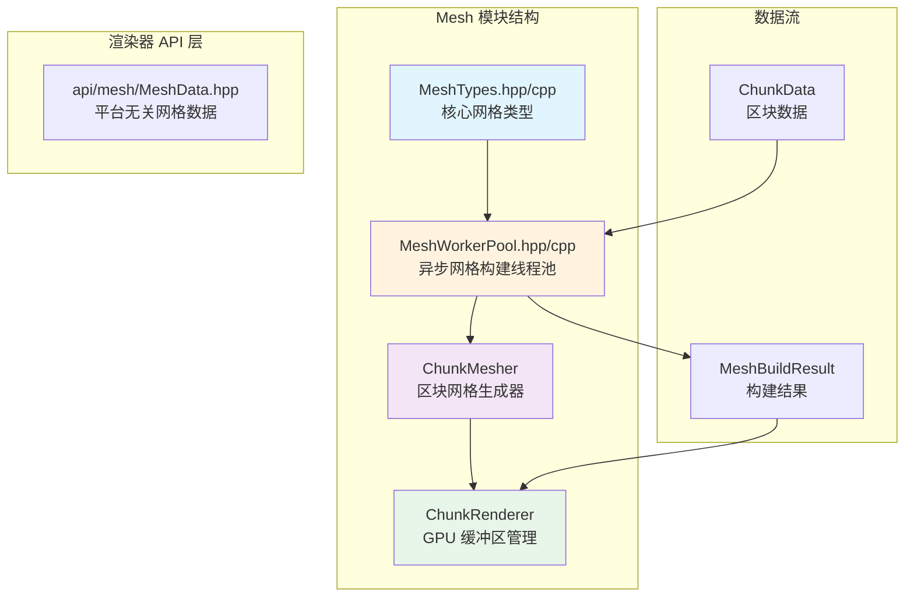
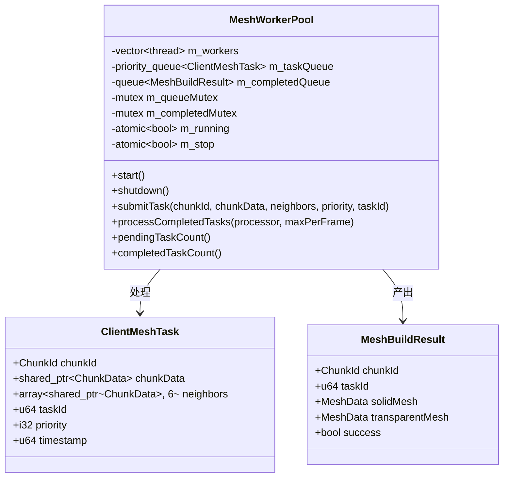
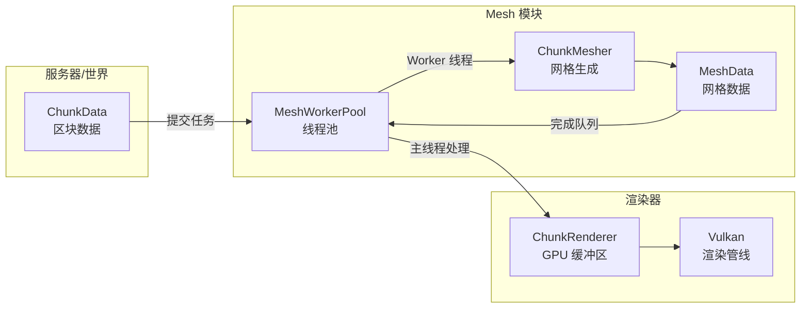
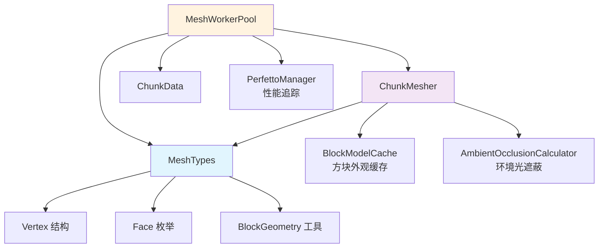

# Mesh 模块

本模块提供客户端网格数据类型和异步网格构建线程池，负责将区块数据转换为可渲染的网格数据。



## 目录结构

```
src/client/renderer/mesh/
├── MeshWorkerPool.hpp    # 异步网格构建线程池头文件
├── MeshWorkerPool.cpp    # 异步网格构建线程池实现
└── README.md             # 本文档

相关文件:
src/client/renderer/
├── MeshTypes.hpp         # 核心网格类型定义
├── MeshTypes.cpp         # 网格类型实现
└── api/mesh/
    └── MeshData.hpp      # 平台无关的网格数据接口
```

## 文件详解

### MeshTypes.hpp / MeshTypes.cpp

**职责**: 定义核心网格数据类型和方块几何常量。

**主要类型**:

| 类型 | 说明 |
|------|------|
| `Vertex` | 顶点数据结构，包含位置、法线、UV、颜色、光照 |
| `Face` | 方块朝向枚举 (Bottom/Top/North/South/West/East) |
| `MeshData` | 网格数据容器，存储顶点和索引数组 |
| `TextureRegion` | 纹理区域 UV 坐标 |
| `TextureAtlas` | 纹理图集，将纹理坐标转换为 UV |

**BlockGeometry 命名空间**:

```cpp
// 获取面的法线向量
std::array<f64, 3> getFaceNormal(Face face);

// 获取面的 4 个顶点位置 (相对于方块左下角)
std::array<f64, 12> getFaceVertices(Face face);

// 获取标准面的索引 (两个三角形)
std::array<u32, 6> getFaceIndices();

// 获取面的方向向量 (用于邻居检测)
std::array<i32, 3> getFaceDirection(Face face);

// 检查面是否应该渲染
bool shouldRenderFace(Face face, bool neighborOpaque);
```

**顶点数据格式**:

```cpp
struct Vertex {
    f64 x, y, z;           // 位置 (12 字节)
    f64 nx, ny, nz;        // 法线 (12 字节)
    f64 u, v;              // 纹理坐标 (8 字节)
    u32 color;             // 顶点颜色 RGBA (4 字节)
    u8 light;              // 光照 (高4位=天空光, 低4位=方块光)
};
// 总计: 37 字节/顶点
```

---

### MeshWorkerPool.hpp / MeshWorkerPool.cpp

**职责**: 管理多个 Worker 线程，异步执行区块网格构建任务，解决区块数据接收时的主线程卡顿问题。

**核心类型**:



**使用流程**:

```cpp
// 1. 创建线程池 (自动检测 CPU 核心数)
MeshWorkerPool pool(4);  // 4 个 Worker 线程
pool.start();

// 2. 提交任务 (非阻塞)
pool.submitTask(chunkId, chunkData, neighbors, priority, taskId);

// 3. 每帧处理完成的结果 (主线程调用)
pool.processCompletedTasks([](MeshBuildResult result) {
    if (result.success) {
        // 更新 GPU 缓冲区
        chunkRenderer.updateChunk(result.chunkId, result.solidMesh);
    }
}, 4);  // 每帧最多处理 4 个

// 4. 关闭
pool.shutdown();
```

**优先级队列**:

任务按优先级和提交时间排序，priority 越小优先级越高，相同优先级时先提交的先处理。

**线程安全保证**:
- 任务队列和完成队列使用 mutex 保护
- ChunkData 通过 `shared_ptr` 共享，创建后不可变
- MeshData 所有权从 Worker 转移到主线程
- `taskId` 用于在主线程过滤过期结果，避免卸载/重载后的旧任务污染新区块网格

---

### api/mesh/MeshData.hpp

**职责**: 定义平台无关的网格数据接口，为渲染抽象层提供统一的数据结构。

**主要类型**:

```cpp
struct MeshData {
    std::vector<Vertex> vertices;
    std::vector<u32> indices;
    void clear();
    void reserve(size_t vertexCount, size_t indexCount);
    void addFace(const std::array<Vertex, 4>& faceVertices, u32 baseIndex);
    size_t vertexDataSize() const;
    size_t indexDataSize() const;
};

struct ChunkMeshData {
    MeshData solidMesh;       // 不透明网格
    MeshData translucentMesh; // 半透明网格
};
```

---

## 模块整体分析

### 整体职责

1. **定义网格数据格式**: 标准化顶点结构、索引格式、纹理坐标
2. **异步网格构建**: 在后台线程执行耗时的网格生成，避免主线程卡顿
3. **优先级调度**: 按距离和重要性排序任务，优先处理玩家附近的区块

### 数据流图



### 输入和输出

| 方向 | 类型 | 说明 |
|------|------|------|
| **输入** | `ChunkData` | 区块数据，包含方块状态、光照信息 |
| **输入** | `ChunkData* neighbors[6]` | 相邻区块数据，用于边界面剔除 |
| **输出** | `MeshData solidMesh` | 实心方块网格数据 |
| **输出** | `MeshData transparentMesh` | 透明方块网格数据 |

### 依赖项



### 使用方法

**完整示例**:

```cpp
#include "client/renderer/mesh/MeshWorkerPool.hpp"
#include "client/renderer/trident/chunk/ChunkMesher.hpp"
#include "client/renderer/trident/chunk/ChunkRenderer.hpp"

// 初始化
mc::client::MeshWorkerPool meshPool(4);  // 4 个 Worker 线程
meshPool.start();

// 设置模型缓存 (必需)
mc::ChunkMesher::setModelCache(&blockModelCache);
mc::ChunkMesher::setLightingMode(mc::LightingMode::Smooth);

// 主循环中
void onChunkReceived(ChunkCoord x, ChunkCoord z, std::shared_ptr<ChunkData> data) {
    // 获取相邻区块
    std::array<std::shared_ptr<const ChunkData>, 6> neighbors = getNeighborChunks(x, z);
    
    // 计算优先级 (距离玩家越近优先级越高)
    i32 priority = calculatePriority(x, z, playerChunkX, playerChunkZ);
    
    // 提交异步构建任务
    meshPool.submitTask(ChunkId(x, z), data, neighbors, priority);
}

void onFrameRender() {
    // 处理完成的网格 (每帧最多 4 个)
    meshPool.processCompletedTasks([this](mc::client::MeshBuildResult result) {
        if (result.success) {
            // 上传到 GPU
            chunkRenderer.updateChunk(result.chunkId, result.solidMesh);
        }
    }, 4);
    
    // 处理延迟销毁的缓冲区
    chunkRenderer.processPendingDestroys(3);
}

// 清理
void onShutdown() {
    meshPool.shutdown();
    mc::ChunkMesher::setModelCache(nullptr);
}
```

### 容易踩的坑

#### 1. BlockModelCache 未初始化

**问题**: ChunkMesher 在没有 BlockModelCache 时会跳过所有方块渲染。

```cpp
// 错误: 未设置模型缓存
ChunkMesher::generateMesh(chunk, mesh, neighbors);  // 网格为空!

// 正确: 先设置模型缓存
ChunkMesher::setModelCache(&blockModelCache);
ChunkMesher::generateMesh(chunk, mesh, neighbors);
```

#### 2. 相邻区块数据缺失导致边界闪烁

**问题**: 边界面剔除需要相邻区块数据，缺失时可能导致面被错误剔除或渲染。

```cpp
// 错误: 邻居数据为空
std::array<std::shared_ptr<const ChunkData>, 6> neighbors = {};  // 全 nullptr
// 结果: 边界面可能显示异常

// 正确: 等待邻居区块加载
if (hasAllNeighbors(x, z)) {
    meshPool.submitTask(...);
}
```

#### 3. 光照数据未同步

**问题**: 网格生成时使用的光照数据可能与世界状态不同步。

```cpp
// 确保区块已完成光照计算
if (chunk.isLightCalculated()) {
    meshPool.submitTask(...);
}
```

#### 4. 线程池未启动

**问题**: 提交任务时线程池未启动，任务会被忽略。

```cpp
// 错误顺序
meshPool.submitTask(...);  // 被忽略!
meshPool.start();

// 正确顺序
meshPool.start();
meshPool.submitTask(...);
```

#### 5. 顶点颜色打包顺序

**问题**: 顶点颜色使用 RGBA 字节顺序，与小端内存布局配合。错误的打包会导致偏色。

```cpp
// 正确的颜色打包 (与小端布局对齐)
u32 packVertexColor(u8 r, u8 g, u8 b, u8 a) {
    return r | (g << 8) | (b << 16) | (a << 24);
}
```

#### 6. 光照打包格式

**问题**: 光照值打包为单字节，高4位为天空光，低4位为方块光。

```cpp
// 正确的光照打包
u8 packedLight = ((skyLight & 0x0F) << 4) | (blockLight & 0x0F);

// 着色器中解包
// float skyLight = float((light >> 4) & 0x0F) / 15.0;
// float blockLight = float(light & 0x0F) / 15.0;
```

#### 7. GPU 缓冲区延迟销毁

**问题**: 区块卸载时立即销毁 GPU 缓冲区可能导致 device lost（GPU 仍在使用）。

**解决方案**: ChunkRenderer 使用延迟销毁队列，保留缓冲区 3 帧后再销毁。

```cpp
// 每帧调用
chunkRenderer.processPendingDestroys(3);  // 保留 3 帧
```

---

## 测试用例

本模块有以下测试文件:

**tests/client/test_mesh_worker_pool.cpp**

| 测试名称 | 测试内容 |
|----------|----------|
| `StartStop` | 线程池启动和停止 |
| `MultipleStartStop` | 重复启动/停止的安全性 |
| `ThreadCount` | 线程数量配置 |
| `SubmitSingleTask` | 提交单个任务 |
| `SubmitMultipleTasks` | 提交多个任务 |
| `PriorityOrdering` | 优先级排序 |
| `ProcessCompletedTasksFrameLimit` | 每帧处理数量限制 |
| `NullChunkDataHandling` | 空数据处理 |
| `ConcurrentSubmissions` | 并发提交 |
| `ShutdownWithPendingTasks` | 有待处理任务时关闭 |
| `PendingTaskCount` | 待处理任务计数 |
| `ProcessEmptyQueue` | 空队列处理 |
| `ProcessWithoutStart` | 未启动时提交 |
| `ProcessWithNullProcessor` | 空处理器 |

---

## 性能优化建议

### 1. 网格预分配

```cpp
// ChunkMesher 会根据非空气方块数量预估面数
// 但对于特殊地形可能不准确，可以手动调整
mesh.reserve(estimatedVertices, estimatedIndices);
```

### 2. 每帧处理限制

```cpp
// 根据帧率动态调整
u32 maxPerFrame = isLowFps ? 2 : 4;
meshPool.processCompletedTasks(processor, maxPerFrame);
```

### 3. 任务优先级策略

```cpp
// 玩家位置附近的区块优先
i32 priority = std::abs(x - playerX) + std::abs(z - playerZ);

// 视锥内的区块额外提升优先级
if (isInFrustum(x, z)) {
    priority -= 100;
}
```

### 4. 区块卸载策略

```cpp
// 卸载远处的区块，减少 GPU 内存占用
if (distance > viewDistance + 2) {
    chunkRenderer.removeChunk(chunkId);
}
```

---

## 相关文件

| 文件 | 说明 |
|------|------|
| `trident/chunk/ChunkMesher.hpp/cpp` | 区块网格生成器 |
| `trident/chunk/AmbientOcclusionCalculator.hpp/cpp` | 环境光遮蔽计算 |
| `trident/chunk/ChunkRenderer.hpp/cpp` | GPU 缓冲区管理 |
| `resource/BlockModelCache.hpp/cpp` | 方块外观缓存 |
| `world/chunk/ChunkData.hpp` | 区块数据结构 |
