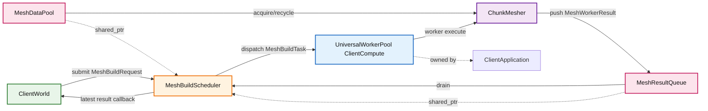

# Mesh 模块

本模块负责客户端区块网格构建的调度决策与任务执行。网格构建复用客户端统一计算池
`UniversalWorkerPool`（ClientCompute，由 `ClientApplication` 持有），本模块仅保留调度器
与配套的回收池/结果队列/任务类型。

## 目录结构树

```text
src/client/renderer/mesh/
├── MeshBuildScheduler.hpp      # 独立调度器（优先级/视锥/取消）
├── MeshBuildScheduler.cpp
├── MeshBuildTask.hpp           # ITask 子类：执行单区块网格构建并推结果
├── MeshBuildTask.cpp
├── MeshDataPool.hpp            # MeshData 回收池（单桶 free-list）
├── MeshDataPool.cpp
├── MeshResultQueue.hpp         # 线程安全结果队列（worker push / 主线程 drain）
├── MeshResultQueue.cpp
├── MeshWorkerTypes.hpp         # MeshWorkerResult 结构体
└── README.md
```

## 内部模块关系



模块分工：
- **MeshBuildScheduler**（调度器）：策略层，负责优先级排序、视锥剔除、任务取消、代际管理。
  持 `UniversalWorkerPool&`（非拥有）+ `shared_ptr<MeshDataPool>`/`shared_ptr<MeshResultQueue>`，
  并维护 `m_inflightTaskCount` 原子计数。
- **MeshBuildTask**（任务）：`ITask` 子类，携带 chunkData/neighbors，execute 内调
  `ChunkMesher::generateSplitMesh`，结果经 `weak_ptr<MeshResultQueue>` 推回主线程。取消令牌
  由调度器经 `pool.submit` 的 abortSignal 参数传入（execute 形参即该令牌），task 自身不持副本。
- **MeshDataPool**（回收池）：单桶 free-list，acquire 在 worker 线程、recycle 在主线程。
- **MeshResultQueue**（结果队列）：worker push / 主线程 drain 的线程安全队列。
- **UniversalWorkerPool**（计算池）：进程级，由 `ClientApplication` 持有，mesh 与皮肤等客户端
  计算任务共用；`MeshBuildScheduler` 仅持引用，不拥有。

## 上下游外部依赖关系

**上游依赖（依赖本模块）：**
- `ClientWorld`：提交网格构建请求、接收构建结果回调、回收 MeshData。
- `ClientApplication`：持有 `UniversalWorkerPool` 并注入 `ClientWorld`/`MeshBuildScheduler`。

**下游依赖（本模块依赖）：**
- `src/common/util/thread/UniversalWorkerPool.*`、`ITask.hpp`：通用任务池与任务接口。
- `src/client/renderer/trident/chunk/ChunkMesher.*`：执行实际的网格构建。
- `src/common/world/chunk/ChunkData.hpp`：区块数据结构。
- `src/client/renderer/MeshTypes.*`：网格类型定义。
- `spdlog`：日志。`glm`：视锥判定中的矩阵/向量。`perfetto`：性能追踪。

## 容易踩的坑

- 不要把策略逻辑塞进执行路径。`MeshBuildScheduler` 负责优先级/取消，`MeshBuildTask` 只负责
  "构建并推结果"，职责分离不可破。
- **在途计数必须在 `pool.submit` 之前自增**：回调可能在另一线程立即触发（任务被拒/秒完），
  回调只做减法，归零责任全在回调侧；`submit` 拒绝任务时回调仍会被调用，故计数不会泄漏。
- **UAF 纵深防护**：池的生命周期（进程级，`ClientApplication`）长于 `MeshBuildScheduler`
  （会话级）。`MeshBuildScheduler::shutdown()` 等 `m_inflightTaskCount` 归零后再析构；
  `MeshBuildTask` 持 `weak_ptr<MeshResultQueue>`，scheduler 析构后晚到的回调 lock 失败即丢弃，
  不会访问已释放的队列。`MeshDataPool` 由 `shared_ptr` 延长生命周期，acquire/recycle 永不悬垂。
- **预取消任务必须靠 `onCancel` 兜底推结果**：`UniversalWorkerPool` 在 `executeTask` 入口预检查
  abortSignal（`UniversalWorkerPool.cpp:522`），已取消的任务**不调用 execute** 而直接调 `onCancel`
  后回调。`cancelChunk`/`cancelAll` 在 `pool.submit` **之后**才置 abortSignal，若任务尚在队列则走
  预取消短路——此时必须由 `MeshBuildTask::onCancel` 推一个 `cancelled=true` 结果，否则 scheduler 的
  `m_tasks` 表收不到结果会泄漏条目、`m_dispatchedTaskCount` 插槽不释放、网格吞吐退化。`_pushResult()`
  用 `m_resultPushed` 保证全生命周期恰好推一次（execute 各出口与 onCancel 都调，幂等），execute 与
  onCancel 由同一 worker 串行调用故该标志无需原子。
- 调度器提交同区块新任务时，必须取消旧任务并更新"最新 taskId"，否则会出现旧结果回写。
- `MeshSchedulerViewState` 必须每帧更新后再 `tick()`，否则视锥优先和背后取消会滞后。
- `ChunkMesher` 取消信号要传透到深循环，仅在外层判断无法及时止损。
