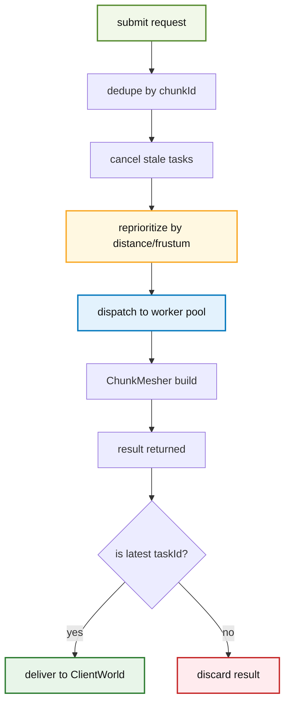

# Mesh 模块

本模块负责客户端区块网格构建的并行执行与调度决策，当前采用“独立调度器 + 纯执行器”双组件架构。

## 1. 目录结构树

```text
src/client/renderer/mesh/
├── MeshWorkerPool.hpp          # 纯执行线程池（FIFO）
├── MeshWorkerPool.cpp
├── MeshBuildScheduler.hpp      # 独立调度器（优先级/视锥/取消）
├── MeshBuildScheduler.cpp
└── README.md
```

## 2. 文件介绍

### MeshWorkerPool.hpp / MeshWorkerPool.cpp

职责：
- 仅执行任务，不做优先级排序。
- 消费 `MeshWorkerTask`，产出 `MeshWorkerResult`。
- 在执行前/执行后检查取消信号，配合 `ChunkMesher` 的协作取消中断长任务。

关键类型：
- `MeshWorkerTask`：`chunkId`、`taskId`、`chunkData`、邻居区块、`cancelSignal`。
- `MeshWorkerResult`：`chunkId`、`taskId`、实心/透明网格、`success`、`cancelled`。

### MeshBuildScheduler.hpp / MeshBuildScheduler.cpp

职责：
- 负责“哪些任务该先做、哪些任务该取消、何时派发到执行器”。
- 管理每个区块的最新任务代际，防止旧任务回写污染。
- 根据相机视图状态定期重排 pending 队列。

关键类型：
- `MeshSchedulerConfig`：并发上限、重排帧间隔、移动阈值、转向阈值、背后取消阈值等。
- `MeshSchedulerViewState`：相机位置、前向、VP 矩阵、视距、构建高度范围。
- `MeshBuildRequest`：调度器输入请求。
- `MeshSchedulerStats`：跟踪任务数、取消数、丢弃结果数等统计信息。

## 3. 模块关系


## 4. 整体职责

模块整体分工：
- 调度器：策略层（优先级、重排、剪枝、取消、代际管理）。
- 执行器：算力层（线程池执行、结果回收、取消检查）。

设计目标：
- 让玩家附近且可见区块优先完成。
- 在视角变化后及时取消过期任务。
- 避免“旧结果覆盖新状态”。

## 5. 输入/输出

输入：
- 区块数据与邻居数据（`MeshBuildRequest` / `MeshWorkerTask`）。
- 相机状态（`MeshSchedulerViewState`）。
- 取消信号（`std::atomic<bool>`）。

输出：
- `MeshWorkerResult`（可能成功、失败或取消）。
- 供上层消费的“最新代际结果”回调。

## 6. 依赖项

内部依赖：
- `src/client/renderer/trident/chunk/ChunkMesher.*`
- `src/common/world/chunk/ChunkData.hpp`
- `src/client/renderer/MeshTypes.*`

外部依赖：
- `spdlog`（日志）
- `glm`（视锥判定中的矩阵/向量）
- `perfetto`（线程命名与追踪事件）

## 7. 使用方法

典型接入方式（由 `ClientWorld` 驱动）：

```cpp
MeshSchedulerConfig config;
config.maxDispatchedTaskCount = 64;
config.reprioritizeIntervalFrames = 6;
config.cameraMoveThreshold = 2.0f;
config.cameraDirectionDotThreshold = 0.96f;
config.behindCancelDotThreshold = -0.35f;
config.behindCancelDistanceChunks = 8.0f;

MeshWorkerPool pool(-1);
pool.start();

MeshBuildScheduler scheduler(pool, config);

MeshSchedulerViewState viewState;
viewState.cameraPosition = cameraPos;
viewState.cameraForward = cameraForward;
viewState.viewProjectionMatrix = vp;
viewState.renderDistanceChunks = renderDistance;
viewState.minBuildHeight = 0;
viewState.maxBuildHeight = 256;

scheduler.setViewState(viewState);
scheduler.tick();

scheduler.drainCompleted(
    [](MeshWorkerResult&& result) {
        // 仅会收到当前区块最新任务的成功结果
    },
    8
);
```

## 8. 容易踩的坑

- 不要把策略逻辑塞回 `MeshWorkerPool`。
  - 执行器应保持“提交即执行”的简单职责。
- 调度器提交同区块新任务时，必须取消旧任务并更新“最新 taskId”。
  - 否则会出现旧结果回写。
- `MeshSchedulerViewState` 必须每帧更新后再 `tick()`。
  - 否则视锥优先和背后取消会滞后。
- `ChunkMesher` 取消信号要传透到深循环。
  - 仅在外层判断无法及时止损。

## 9. 测试用例

相关测试：
- `tests/client/test_mesh_worker_pool.cpp`
  - 启停、并发提交、结果分批 drain、预取消任务。
- `tests/client/test_mesh_build_scheduler.cpp`
  - 最新任务胜出、视锥优先、超视距 pending 取消。

建议命令：

```powershell
ctest --test-dir build -C RelWithDebInfo -R "MeshWorkerPoolTest|MeshBuildSchedulerTest" --output-on-failure
```

## 10. Mermaid 图表


