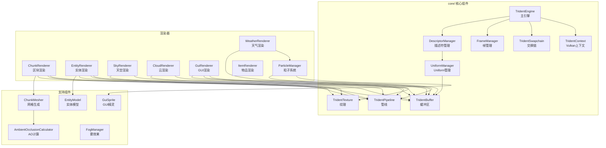

# Trident 渲染引擎

Trident 是 Minecraft Reborn 客户端的 Vulkan 渲染引擎，实现了完整的 3D 渲染管线，包括区块渲染、实体渲染、天空渲染、粒子系统、GUI 渲染等功能。

## 目录结构

```
trident/
├── core/                    # 核心组件
│   ├── Trident.hpp          # 统一头文件
│   ├── TridentContext.hpp/cpp   # Vulkan 上下文
│   ├── TridentEngine.hpp/cpp    # 主引擎类（实现 IRenderEngine）
│   ├── TridentSwapchain.hpp/cpp # 交换链管理
│   ├── buffer/              # 缓冲区
│   │   └── TridentBuffer.hpp/cpp    # 顶点/索引/Uniform/暂存缓冲区
│   ├── pipeline/            # 管线
│   │   └── TridentPipeline.hpp/cpp  # 图形管线
│   ├── render/              # 渲染管理
│   │   ├── DescriptorManager.hpp/cpp # 描述符管理
│   │   ├── FrameManager.hpp/cpp      # 帧同步管理
│   │   ├── RenderPassManager.hpp/cpp # 渲染通道管理（支持 MSAA + resolve）
│   │   └── UniformManager.hpp/cpp    # Uniform 缓冲区管理
│   └── texture/             # 纹理
│       ├── TridentTexture.hpp/cpp    # 纹理/纹理图集
│       ├── AnimatedSprite.hpp/cpp    # 动画精灵（帧动画）
│       └── TextureAtlasTicker.hpp/cpp # 图集动画tick管理
├── chunk/                   # 区块渲染
│   ├── AmbientOcclusionCalculator.hpp/cpp # 环境光遮蔽计算
│   ├── ChunkMesher.hpp/cpp  # 区块网格生成
│   ├── ChunkRenderer.hpp/cpp # 区块 GPU 渲染
│   └── README.md             # 区块模块文档
├── cloud/                   # 云渲染
│   └── CloudRenderer.hpp/cpp # 云层渲染器（Fast/Fancy 模式）
├── entity/                  # 实体渲染
│   ├── EntityRenderer.hpp/cpp       # 实体渲染器基类
│   ├── EntityRendererManager.hpp/cpp # 实体渲染器管理
│   ├── EntityPipeline.hpp/cpp       # 实体渲染管线
│   ├── EntityTextureAtlas.hpp/cpp   # 实体纹理图集
│   ├── ItemEntityRenderer.hpp/cpp   # 物品实体渲染器
│   ├── LivingRenderer.hpp           # 生物渲染器模板
│   ├── AnimalRenderers.hpp          # 动物渲染器
│   └── model/                # 实体模型
│       ├── EntityModel.hpp/cpp      # 模型基类
│       ├── ModelRenderer.hpp/cpp    # 模型部件渲染
│       └── AnimalModels.hpp/cpp     # 动物模型
├── fog/                     # 雾效果
│   └── FogManager.hpp/cpp   # 雾管理器（Linear/Exp2）
├── firstperson/             # 第一人称渲染
│   ├── FirstPersonRenderer.hpp/cpp  # 第一人称渲染器（手部、手持物品）
│   ├── PlayerModel.hpp/cpp          # 玩家模型（双足模型扩展）
│   ├── ItemInHandRenderer.hpp/cpp   # 手持物品渲染器
│   ├── MatrixStack.hpp/cpp          # 矩阵栈（变换层级管理）
│   ├── ItemCameraTransforms.hpp/cpp # 物品相机变换
│   ├── ArmPose.hpp                  # 手臂姿态枚举
│   └── README.md                    # 模块文档
├── gui/                     # GUI 渲染
│   ├── GuiRenderer.hpp/cpp  # GUI 渲染器
│   ├── GuiTextureAtlas.hpp/cpp  # GUI 纹理图集
│   ├── GuiTextureLoader.hpp/cpp  # GUI 纹理加载器
│   ├── GuiTextureManager.hpp/cpp # GUI 纹理管理
│   ├── GuiSprite.hpp        # GUI 精灵定义
│   ├── GuiSpriteAtlas.hpp/cpp    # GUI 精灵图集
│   ├── GuiSpriteManager.hpp/cpp  # GUI 精灵管理
│   ├── GuiSpriteParser.hpp/cpp   # GUI 精灵解析
│   ├── GuiSpriteRegistry.hpp/cpp # GUI 精灵注册表
│   └── GuiAtlasRegistry.hpp # 多图集注册表
├── item/                    # 物品渲染
│   └── ItemRenderer.hpp/cpp # 物品图标渲染
├── particle/                # 粒子系统
│   ├── Particle.hpp/cpp     # 粒子基类
│   ├── ParticleManager.hpp/cpp # 粒子管理器
│   └── particles/           # 粒子类型
│       ├── RainParticle.hpp/cpp # 雨滴粒子
│       └── SnowParticle.hpp/cpp # 雪花粒子
├── sky/                     # 天空渲染
│   ├── SkyRenderer.hpp/cpp  # 天空盒渲染器
│   └── CelestialCalculations.hpp/cpp # 天体计算
├── util/                    # 工具
│   └── VulkanUtils.hpp      # Vulkan 辅助函数
├── weather/                 # 天气渲染
│   └── WeatherRenderer.hpp/cpp # 雨雪渲染器
├── block/                   # 方块渲染
│   ├── BreakProgressManager.hpp/cpp # 破坏进度管理
│   └── BreakProgressRenderer.hpp/cpp # 破坏进度渲染
└── blockentity/             # 方块实体渲染器
    ├── IBlockEntityRenderer.hpp    # 渲染器接口模板
    ├── BlockEntityRenderer.hpp/cpp # 渲染器基类
    ├── BlockEntityRendererDispatcher.hpp/cpp # 渲染器调度器
    ├── README.md                   # 模块文档
    ├── model/                      # 方块实体模型
    └── renderers/                  # 具体渲染器
        └── PistonRenderer.hpp/cpp  # 活塞渲染器
```

## 核心组件详解

### 1. core/ - 核心组件

#### TridentContext

Vulkan 上下文管理，负责：
- Vulkan 实例创建与验证层配置
- 物理设备选择与队列族查询
- 逻辑设备创建
- 命令池管理
- 单次命令缓冲区辅助

```cpp
// 使用示例
TridentContext context;
TridentConfig config;
config.enableValidation = true;
auto result = context.initialize(window, config);
```

#### TridentEngine

主引擎类，实现 `IRenderEngine` 接口：
- 管理所有渲染器（区块、实体、天空、GUI 等）
- 协调帧渲染流程
- 处理窗口大小变化
- 提供渲染资源访问
- 根据客户端抗锯齿设置和物理设备能力选择实际 sample count，并把它传给渲染通道和主通道渲染器

#### TridentSwapchain

交换链管理：
- 创建/重建交换链
- 管理交换链图像和图像视图
- 处理窗口大小变化

#### buffer/TridentBuffer

缓冲区类型：
- `TridentVertexBuffer` - 顶点缓冲区（设备本地内存）
- `TridentIndexBuffer` - 索引缓冲区（设备本地内存）
- `TridentUniformBuffer` - Uniform 缓冲区（主机可见内存）
- `TridentStagingBuffer` - 暂存缓冲区（用于数据传输）

#### pipeline/TridentPipeline

图形管线封装：
- 着色器加载（SPIR-V）
- 管线状态配置（混合、深度、光栅化）
- 管线布局管理

#### render/DescriptorManager

描述符管理：
- 相机描述符集布局
- 纹理描述符集布局
- 雾效果描述符集布局
- 描述符池管理

#### render/FrameManager

帧同步管理：
- 帧信号量
- 帧栅栏
- 命令缓冲区池
- 双缓冲/三缓冲支持

#### render/UniformManager

Uniform 缓冲区管理：
- CameraUBO（相机矩阵）
- LightingUBO（光照参数）
- FogUBO（雾参数）
- 多帧数据同步

#### render/RenderPassManager

渲染通道管理器负责把主通道的采样模式真正落到 Vulkan 资源上：
- 单采样时使用传统颜色附件 + 深度附件路径
- 多采样时创建 multisampled color/depth attachment，并通过 resolve attachment 写回交换链图像
- 由 `TridentEngine` 统一注入 sample count，避免窗口层和管线层各自做出不一致的判断

#### pipeline/TridentPipeline

管线封装保留 1x 作为通用默认值，但主通道管线会被 `TridentEngine` 覆盖成当前实际 sample count；新增主渲染器时必须沿用同一份采样配置。

#### texture/TridentTexture

纹理和纹理图集：
- 2D 纹理创建和上传
- Mipmap 生成
- 纹理采样器配置
- 纹理图集（用于区块/实体/GUI）

#### texture/AnimatedSprite

动画精灵：
- 存储多帧纹理数据
- tick 驱动帧切换
- 支持帧间颜色插值
- GPU 纹理子区域更新

#### texture/TextureAtlasTicker

纹理图集动画管理器：
- 管理所有动画精灵
- 每游戏 tick 更新动画状态
- 渲染前上传待更新帧

### 2. chunk/ - 区块渲染

#### AmbientOcclusionCalculator

环境光遮蔽计算（AO）：
- 计算方块顶点的 AO 值
- 四种 AO 级别（0-3）
- 参考 MC 1.16.5 光照系统

#### ChunkMesher

区块网格生成：
- 遍历区块方块生成网格
- 面剔除（剔除被遮挡的面）
- AO 计算
- 光照值嵌入
- 分离实心和半透明网格
- 支持协作取消信号（`generateMesh/generateSplitMesh/generateSectionMesh` 均接收 `cancelSignal`）

#### ChunkRenderer

区块 GPU 渲染：
- 管理 GPU 缓冲区（VBO/IBO）
- 异步网格上传
- 批量渲染
- 区块加载/卸载

### 3. cloud/ - 云渲染

#### CloudRenderer

云层渲染器，支持两种模式：
- **Fast 模式**：仅渲染云底面（性能优化）
- **Fancy 模式**：渲染完整 3D 立方体云

特性：
- 云高度根据维度动态设置：
  - 主世界：192 格（有云）
  - 下界：无云
  - 末地：无云
- 云随时间缓慢移动
- 云颜色随时间和天气变化

**维度云高度获取：**
- 通过 `TridentEngine::setCloudHeight(cloudHeight, hasClouds)` 设置当前维度的云高度
- 使用 `hasClouds` 布尔字段判断是否渲染云（注意：由于 `-ffast-math`，NaN 检测不可靠）
- 参考 MC 1.16.5 `WorldRenderer.renderClouds()` 和 `DimensionRenderInfo.func_239213_a_()`

### 4. entity/ - 实体渲染

#### EntityRenderer

实体渲染器基类：
- 定义渲染接口 `render()`
- 支持阴影渲染
- 支持名称标签渲染

#### EntityRendererManager

管理所有实体类型的渲染器：
- 渲染器注册和查询
- 按实体类型分发渲染

#### EntityPipeline

实体渲染管线：
- 管线状态配置
- 描述符集绑定
- 实例化渲染支持

#### EntityTextureAtlas

实体纹理图集：
- 加载实体纹理
- 支持多种路径格式（MC 1.12/1.13+）
- UV 坐标计算

#### model/EntityModel

实体模型系统：
- **EntityModel**：模型基类
- **ModelRenderer**：模型部件（头、身体、腿等）
- **QuadrupedModel**：四足动物模型
- **BipedModel**：双足动物模型
- **AnimalModels**：猪、牛、羊、鸡模型

### 5. fog/ - 雾效果

#### FogManager

雾效果管理：
- 支持 Linear 和 Exp2 雾模式
- 水下雾效果
- 熔岩雾效果
- 通过 UBO 更新雾参数

### 6. gui/ - GUI 渲染

#### GuiRenderer

2D GUI 渲染：
- 文本渲染（支持 Unicode）
- 矩形渲染
- 纹理渲染
- 多图集支持

#### GuiSprite

精灵定义：
- UV 坐标
- 像素尺寸
- 九宫格拉伸支持
- 状态变体（悬停、禁用）

#### GuiAtlasRegistry

多图集注册表：
- 槽位 0：字体纹理
- 槽位 1：物品纹理图集
- 槽位 2+：GUI 图集

### 7. particle/ - 粒子系统

#### ParticleManager

粒子管理器：
- 粒子生命周期管理
- 按渲染类型分组
- GPU 缓冲区更新

#### particles/RainParticle

雨滴粒子：
- 下落动画
- 随机位置分布
- 下落速度变化

#### particles/SnowParticle

雪花粒子：
- 缓慢下落
- 水平漂移
- 旋转动画

### 8. sky/ - 天空渲染

#### SkyRenderer

天空盒渲染器：
- 天空颜色渐变
- 太阳/月亮渲染
- 星星渲染
- 日出/日落颜色

#### CelestialCalculations

天体计算：
- 太阳角度计算
- 月亮相位计算
- 天空颜色计算

### 9. weather/ - 天气渲染

#### WeatherRenderer

天气效果渲染：
- 雨滴层渲染
- 雪花层渲染
- 根据生物群系温度决定类型
- 强度渐变

### 10. item/ - 物品渲染

#### ItemRenderer

物品图标渲染：
- 2D 物品图标
- 物品模型渲染
- 附魔光效（计划中）

### 11. block/ - 方块渲染

#### BreakProgressManager

破坏进度管理：
- 跟踪玩家正在破坏的方块
- 计算破坏阶段

#### BreakProgressRenderer

破坏进度渲染：
- 渲染破坏动画纹理
- 10 个破坏阶段

### 12. util/ - 工具

#### VulkanUtils

Vulkan 辅助函数：
- 内存类型查找
- 图像布局转换
- 单次命令执行
- 格式查找

## 模块关系图



## 整体职责

Trident 渲染引擎作为 Minecraft Reborn 客户端的渲染后端，负责：

1. **Vulkan 资源管理**
   - 设备、队列、命令池管理
   - 缓冲区、纹理、管线生命周期
   - 描述符集管理

2. **渲染管线**
   - 帧同步（双缓冲/三缓冲）
   - 渲染通道配置
   - 图形管线状态管理

3. **场景渲染**
   - 区块网格生成与渲染（带 AO）
   - 实体模型渲染（骨骼动画）
   - 天空盒、太阳、月亮、星星
   - 云层（Fast/Fancy 模式）
   - 天气效果（雨/雪）
   - 粒子系统

4. **GUI 渲染**
   - 2D 文本和图形
   - 多纹理图集支持
   - 精灵系统（九宫格拉伸）

## 输入和输出

### 输入

| 输入类型 | 来源模块 | 描述 |
|---------|---------|------|
| ChunkData | common/world | 区块方块数据 |
| BlockState | common/world | 方块状态 |
| Entity | common/entity | 实体数据 |
| Camera | client/renderer | 相机参数 |
| WorldInfo | client/world | 世界信息（时间、天气） |
| ResourcePack | common/resource | 纹理、模型资源 |
| Font | client/ui | 字体数据 |

### 输出

| 输出类型 | 目标 | 描述 |
|---------|------|------|
| 渲染帧 | 屏幕 | 最终渲染的图像 |
| 性能指标 | 调试系统 | FPS、渲染统计 |

## 依赖项

### 外部依赖

- **Vulkan SDK** - 图形 API
- **VulkanMemoryAllocator** - GPU 内存管理
- **GLFW** - 窗口系统
- **GLM** - 数学库
- **spdlog** - 日志
- **stb_image** - 图像加载

### 内部依赖

- `common/core` - 基础类型
- `common/world` - 世界数据
- `common/entity` - 实体数据
- `common/resource` - 资源加载
- `common/util` - 工具函数
- `client/renderer/api` - 渲染 API 接口
- `client/ui` - UI 系统

## 使用方法

### 初始化引擎

```cpp
#include "client/renderer/trident/core/Trident.hpp"

// 创建配置
mc::client::renderer::trident::TridentConfig config;
config.appName = "Minecraft Reborn";
config.enableValidation = true;
config.enableVSync = true;
config.maxFramesInFlight = 2;

// 初始化上下文
auto context = std::make_unique<TridentContext>();
auto result = context->initialize(window, config);
if (!result.success()) {
    // 处理错误
}

// 创建引擎
auto engine = std::make_unique<TridentEngine>();
result = engine->initialize(context.get());
```

### 渲染循环

```cpp
void renderFrame() {
    // 开始帧
    auto result = engine->beginFrame();
    if (!result.success()) {
        // 处理窗口大小变化
        return;
    }

    // 获取命令缓冲区
    VkCommandBuffer cmd = engine->currentCommandBuffer();

    // 渲染场景
    engine->renderScene(camera, world);

    // 结束帧
    engine->endFrame();
}
```

### 注册实体渲染器

```cpp
// 创建渲染器
auto pigRenderer = std::make_unique<PigRenderer>();

// 注册到管理器
entityManager->registerRenderer(
    EntityType::Pig,
    std::move(pigRenderer)
);
```

## 容易踩的坑

### 1. Vulkan 资源生命周期

**问题**：在设备销毁后访问 Vulkan 对象会导致崩溃。

**解决方案**：确保资源销毁顺序正确：
```cpp
// 错误：先销毁设备
vkDestroyDevice(device, nullptr);
texture.destroy(); // 崩溃！

// 正确：先销毁资源
texture.destroy();
vkDestroyDevice(device, nullptr);
```

### 2. 描述符集更新时机

**问题**：在渲染过程中更新描述符集可能导致闪烁。

**解决方案**：使用帧同步，只在帧开始时更新：
```cpp
void beginFrame() {
    // 等待上一帧完成
    waitForFrameFence();

    // 更新描述符集
    updateDescriptors();

    // 重置栅栏
    resetFrameFence();
}
```

### 3. 纹理图集溢出

**问题**：图集空间不足导致纹理加载失败。

**解决方案**：
- 使用足够大的图集尺寸（如 4096x4096）
- 实现动态图集扩展
- 监控图集使用率

### 4. 区块网格内存泄漏

**问题**：频繁加载/卸载区块可能导致内存增长。

**解决方案**：使用对象池管理 GPU 缓冲区：
```cpp
// ChunkRenderer 使用缓冲区池
class ChunkBufferPool {
    std::vector<VkBuffer> m_freeBuffers;
public:
    VkBuffer acquire();
    void release(VkBuffer buffer);
};
```

### 5. 验证层性能影响

**问题**：Debug 模式下验证层会显著降低性能。

**解决方案**：
- 开发时启用验证层
- Release 构建禁用验证层
- 使用 `MC_ENABLE_VULKAN_VALIDATION` CMake 选项控制

### 6. 窗口大小变化处理

**问题**：窗口大小变化时交换链需要重建，否则渲染崩溃。

**解决方案**：
```cpp
void onWindowResize(int width, int height) {
    m_swapchain.recreate(width, height);

    // 更新所有依赖交换链的资源
    m_renderPassManager.onResize(width, height);
    m_frameManager.onResize(width, height);
}
```

### 7. 雾效果参数对齐

**问题**：UBO 数据对齐不正确导致渲染异常。

**解决方案**：使用 `alignas` 确保正确对齐：
```cpp
struct FogUBO {
    alignas(4)  f32 fogStart;
    alignas(4)  f32 fogEnd;
    alignas(4)  f32 fogDensity;
    alignas(4)  i32 fogMode;
    alignas(16) glm::vec4 fogColor;
};
```

### 8. 多线程区块网格生成

**问题**：多线程访问共享资源导致竞争。

**解决方案**：使用互斥锁保护共享数据：
```cpp
std::mutex m_meshMutex;

void uploadMesh(ChunkId id, const MeshData& mesh) {
    std::lock_guard<std::mutex> lock(m_meshMutex);
    // 安全上传
}
```

## 涉及的测试用例

### test_trident_api.cpp

测试渲染 API 类型定义：
- `Vertex` 结构体和默认值
- `Face` 枚举值
- `BlockGeometry` 几何常量
- `BlendState` 混合状态
- `DepthState` 深度状态
- `RasterizerState` 光栅化状态
- `RenderState` 渲染状态
- `RenderType` 渲染类型
- `TextureRegion` 纹理区域
- `MeshData` 网格数据
- `CameraConfig` 相机配置

### test_trident_engine.cpp

测试 Trident 核心组件：
- **TridentConfig**：配置验证、扩展检查
- **VulkanVersion**：版本字符串
- **QueueFamilyIndices**：队列族完整性检查
- **TridentContext**：
  - 初始化成功
  - 队列有效
  - 队列族完整
  - 设备属性有效
  - 内存属性有效
  - 交换链支持查询
  - 内存类型查找
  - 深度格式查找
  - 单次命令执行
- **TridentBuffer**：
  - 顶点缓冲区创建/上传
  - 索引缓冲区创建/上传
  - Uniform 缓冲区创建/帧同步
  - 暂存缓冲区上传/复制
  - 移动语义
- **TridentTexture**：
  - 2D 纹理创建
  - Mipmap 纹理
  - 纹理上传
  - 格式转换
- **TridentTextureAtlas**：
  - 图集创建
  - 区域获取
  - 数据上传
- **FrameManager**：帧索引循环
- **UniformManager**：UBO 大小验证

## 架构设计原则

### 1. 平台无关 API 层

Trident 实现了 `client/renderer/api/` 中定义的平台无关接口：
- `IRenderEngine` → `TridentEngine`
- `IVertexBuffer` → `TridentVertexBuffer`
- `IIndexBuffer` → `TridentIndexBuffer`
- `IUniformBuffer` → `TridentUniformBuffer`
- `ITexture` → `TridentTexture`
- `ITextureAtlas` → `TridentTextureAtlas`

### 2. 职责分离

每个组件专注于单一职责：
- `TridentContext`：Vulkan 上下文管理
- `TridentPipeline`：管线状态管理
- `FrameManager`：帧同步
- `DescriptorManager`：描述符管理

### 3. 资源生命周期管理

使用 RAII 模式管理 Vulkan 资源：
```cpp
class TridentTexture : public ITexture {
public:
    ~TridentTexture() override {
        destroy();  // 自动清理
    }

    void destroy() override {
        if (m_imageView != VK_NULL_HANDLE) {
            vkDestroyImageView(m_device, m_imageView, nullptr);
            m_imageView = VK_NULL_HANDLE;
        }
        // ... 其他资源
    }
};
```

### 4. 错误处理

使用 `Result<T>` 处理错误：
```cpp
[[nodiscard]] Result<void> create(TridentContext* context, ...);

auto result = texture.create(context, desc);
if (!result.success()) {
    spdlog::error("Failed to create texture: {}", result.error().message());
    return result.error();
}
```

## 性能优化建议

1. **使用 Release 构建**：Debug 模式下验证层会显著降低性能

2. **启用 VSync**：避免画面撕裂，节省 GPU 资源
   ```cpp
   config.enableVSync = true;
   ```

3. **合理设置帧数**：`maxFramesInFlight = 2` 平衡延迟和吞吐

4. **区块网格缓存**：避免重复生成相同区块的网格

5. **纹理图集优化**：使用大图集减少绑定切换

6. **实例化渲染**：实体渲染使用实例化减少 draw call

## 扩展阅读

- [Vulkan 教程](https://vulkan-tutorial.com/)
- [Minecraft 1.16.5 渲染系统](https://minecraft.wiki/w/Rendering)
- [实体模型系统设计](./entity/model/README.md)（计划中）
