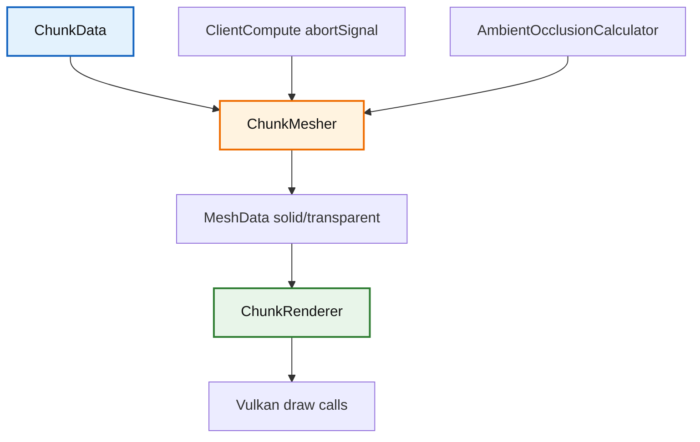

# Trident Chunk 模块

该目录负责区块网格生成与区块 GPU 渲染，是客户端地形渲染链路的核心。

## 1. 目录结构树

```text
src/client/renderer/trident/chunk/
├── AmbientOcclusionCalculator.hpp/cpp   # AO 采样与顶点明暗计算
├── ChunkMesher.hpp/cpp                  # 区块网格构建（实心/透明分层）
├── ChunkRenderer.hpp/cpp                # 区块 GPU 缓冲区管理与绘制
└── README.md
```

## 2. 内部模块关系



## 3. 上下游外部依赖关系

**上游依赖**（本目录依赖）：
- `src/client/renderer/MeshTypes.*`
- `src/client/resource/BlockModelCache.*`
- `src/client/world/color/blend/*`
- `src/common/world/chunk/ChunkData.*`
- `spdlog`, `glm`

**下游依赖**（依赖本目录）：
- `src/client/renderer/trident/core/TridentEngine.*` - 主渲染引擎持有 ChunkRenderer
- `src/client/renderer/trident/particle/particles/block/DiggingParticle.cpp` - 使用 ChunkMesher::modelCache() 获取模型
- `src/client/renderer/trident/entity/layer/entity/HeldBlockLayer.cpp` - 使用 ChunkMesher 获取方块着色

## 4. 容易踩的坑

- **取消信号必传**：忘记传递取消信号会导致长任务无法及时终止，在异步构建场景下造成资源浪费。
- **邻居数组顺序**：邻居数组顺序固定为 `-X, +X, -Z, +Z, -Y, +Y`，顺序错误会导致边界面剔除和跨区块光照采样出错。
- **BlockModelCache 依赖**：在没有 `BlockModelCache` 时，`ChunkMesher` 不会生成有效几何。
- **贪婪网格 AO 回退**：贪婪网格在平滑 AO 路径会回退到逐面路径，这是预期行为，不是 bug。
- **液体面剔除逻辑**：液体面剔除不能只看透明度；像海草、海带茎这类没有实体碰撞体积的水下植物也要吞掉相邻水面，否则会出现多余的水贴图边缘。
- **默认着色颜色**：`ChunkMesher::getDefaultBlockTintColor()` 用于没有世界/位置信息时的颜色解析（如末馆人持有方块），参考 MC 1.16.5 `BlockColors.getColor(state, null, null, 0)`。
- **顶点/索引格式**：`Vertex` 用 f32（位置+UV，28B/顶点），`MeshData::indices` 用 u16。单区块顶点数上限远低于 65535，u16 安全；改大区块尺寸或放开 reserve 上限时须复核。顶点位置是区块局部坐标，大世界偏移由 f32 推送常量 `chunkRelativeOffset` 承担，不要再改回 f64。
- **mega-buffer 子分配**：`ChunkRenderer` 不再为每个区块独占 `VkBuffer`+`VkDeviceMemory`，而是在统一的 vertex（128MB/段）/index（32MB/段）mega-buffer 段内用 OffsetAllocator 子分配一段连续区间。`ChunkGpuBuffer` 只保存所属段的 `VkBuffer` + 段内 `vertexOffset`/`indexOffset`。`updateChunk` 每次都重新子分配新区间（不复用旧区间，避免原地覆写与在飞帧并发访问的 device lost），旧区间入 `m_pendingDestroys` 延迟归还。段 `VkBuffer`/`VkDeviceMemory` 仅在 `destroy()` 释放，子分配区间由 OffsetAllocator 复用——容量不足时追加新段（OffsetAllocator 不可 resize，多段规避数据迁移）。
- **延迟归还与守恒断言**：旧子分配区间不在 `updateChunk`/`removeChunk`/`clearChunks` 时立即 free，而是入队等过 `framesToKeep` 帧（`TridentEngine` 传 32，远超 `MAX_FRAMES_IN_FLIGHT`）后由 `processPendingDestroys` 归还。`_freeAllocation` 内有守恒断言 `storageReport().totalFreeSpace == localFreeBytes`，运行期真实泄漏在此暴露（致命）。`destroy()` 先回收所有活跃区块区间再销毁段，关闭期零泄漏告警。
- **统一暂存上传**：`_createChunkBuffer` 经 `m_context->stagingPool()` 同步上传（`stage`→`memcpy`→`copyToBuffer`→`release`），不再自建 staging buffer。`initialize` 首参为 `TridentContext*`，由 `TridentEngine` 注入 `context()`。池未就绪时报 `staging pool not available` 错误，无 fallback。
- **Tracy GPU 内存追踪改段级**：不再按每个 `VkDeviceMemory` 成员追踪（旧 free-list 路径的句柄跨对象转移已移除），改为每段一次 `MC_TRACE_MEM_ALLOC`（`ChunkVtx`/`ChunkIdx` 池），与 `destroy()` 段销毁的 `MC_TRACE_MEM_FREE` 严格一对一（同一 `&segment.memory` 地址）。子分配级靠 OffsetAllocator 守恒断言覆盖。
- **无需锁**：`updateChunk`/`processPendingDestroys`/`render` 均在主线程（CPU 网格构建在 `UniversalWorkerPool`/ClientCompute，但 GPU 上传在主线程 `forEachDirtyMesh`），故 mega-buffer 子分配路径无锁。旧的 `std::recursive_mutex` 已删除。
