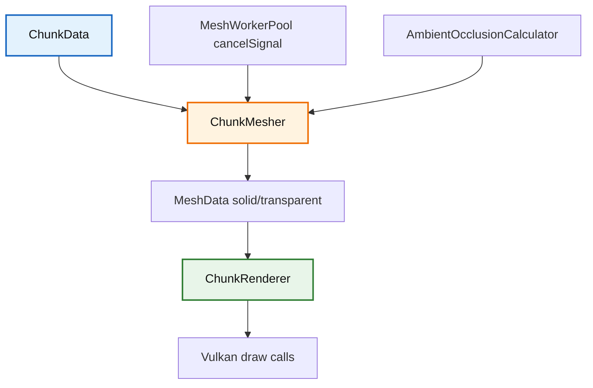

# Trident Chunk 模块

该目录负责区块网格生成与区块 GPU 渲染，是客户端地形渲染链路的核心。

## 1. 目录结构树

```text
src/client/renderer/trident/chunk/
├── AmbientOcclusionCalculator.hpp/cpp   # AO 采样与顶点明暗计算
├── ChunkMesher.hpp/cpp                  # 区块网格构建（实心/透明分层）
├── ChunkRenderer.hpp/cpp                # 区块 GPU 缓冲区管理与绘制
└── README.md
```

## 2. 内部模块关系



## 3. 上下游外部依赖关系

**上游依赖**（本目录依赖）：
- `src/client/renderer/MeshTypes.*`
- `src/client/resource/BlockModelCache.*`
- `src/client/world/color/blend/*`
- `src/common/world/chunk/ChunkData.*`
- `spdlog`, `glm`

**下游依赖**（依赖本目录）：
- `src/client/renderer/trident/core/TridentEngine.*` - 主渲染引擎持有 ChunkRenderer
- `src/client/renderer/trident/particle/particles/block/DiggingParticle.cpp` - 使用 ChunkMesher::modelCache() 获取模型
- `src/client/renderer/trident/entity/layer/entity/HeldBlockLayer.cpp` - 使用 ChunkMesher 获取方块着色

## 4. 容易踩的坑

- **取消信号必传**：忘记传递取消信号会导致长任务无法及时终止，在异步构建场景下造成资源浪费。
- **邻居数组顺序**：邻居数组顺序固定为 `-X, +X, -Z, +Z, -Y, +Y`，顺序错误会导致边界面剔除和跨区块光照采样出错。
- **BlockModelCache 依赖**：在没有 `BlockModelCache` 时，`ChunkMesher` 不会生成有效几何。
- **贪婪网格 AO 回退**：贪婪网格在平滑 AO 路径会回退到逐面路径，这是预期行为，不是 bug。
- **液体面剔除逻辑**：液体面剔除不能只看透明度；像海草、海带茎这类没有实体碰撞体积的水下植物也要吞掉相邻水面，否则会出现多余的水贴图边缘。
- **默认着色颜色**：`ChunkMesher::getDefaultBlockTintColor()` 用于没有世界/位置信息时的颜色解析（如末馆人持有方块），参考 MC 1.16.5 `BlockColors.getColor(state, null, null, 0)`。
