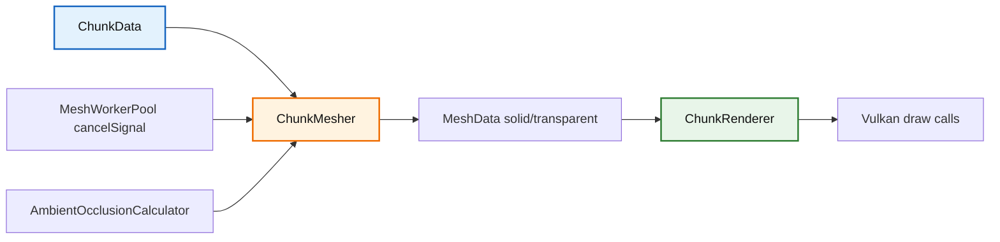
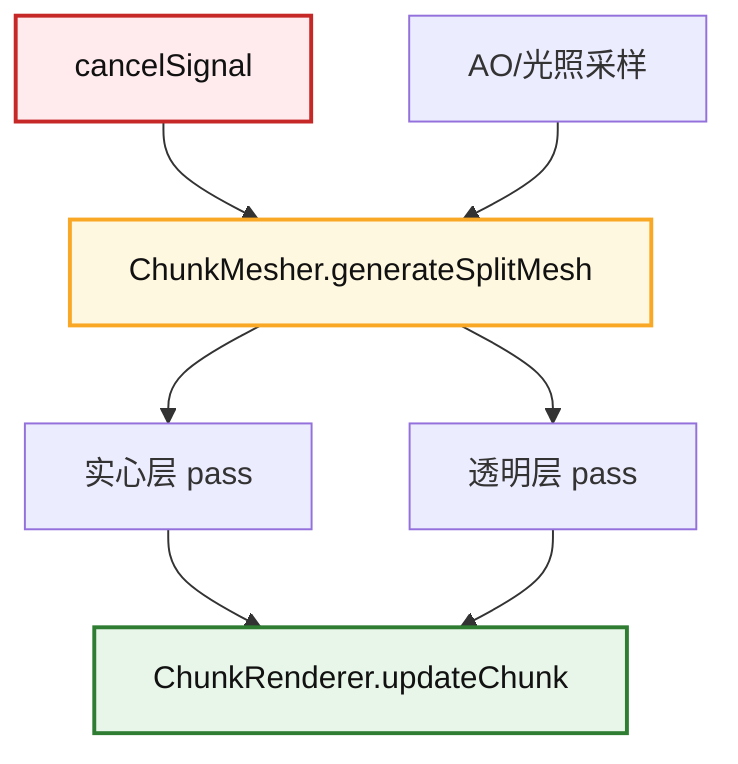

# Trident Chunk 模块

该目录负责区块网格生成与区块 GPU 渲染，是客户端地形渲染链路的核心。

## 1. 目录结构树

```text
src/client/renderer/trident/chunk/
├── AmbientOcclusionCalculator.hpp/cpp   # AO 采样与顶点明暗计算
├── ChunkMesher.hpp/cpp                  # 区块网格构建（实心/透明分层）
├── ChunkRenderer.hpp/cpp                # 区块 GPU 缓冲区管理与绘制
└── README.md
```

## 2. 文件介绍

### AmbientOcclusionCalculator

职责：
- 按面和顶点采样周边方块遮挡关系。
- 输出 AO 系数并参与最终顶点颜色/亮度。

### ChunkMesher

职责：
- 把 `ChunkData` 转换为 `MeshData`。
- 支持 `generateMesh` 与 `generateSplitMesh`。
- 在简单网格与贪婪网格路径中处理透明层、液体面、AO、光照采样。
- 新增协作取消信号参数：
  - `generateMesh(..., neighbors, cancelSignal)`
  - `generateSplitMesh(..., neighbors, cancelSignal)`
  - `generateSectionMesh(..., neighbors, cancelSignal)`

### ChunkRenderer

职责：
- 管理每个区块的 VBO/IBO 生命周期。
- 接收 `ClientWorld` 标记的 dirty mesh，上传 GPU 并参与绘制。

## 3. 模块关系



## 4. 整体职责

目录整体负责：
- 将区块逻辑数据映射到可渲染几何。
- 控制区块绘制的性能质量平衡（简单/贪婪网格）。
- 支持异步构建场景下的可取消中断。

## 5. 输入/输出

输入：
- 当前区块 `ChunkData`。
- 邻居区块数组（用于边界面剔除与跨区块光照采样）。
- 可选取消信号。

输出：
- `MeshData`（实心层和透明层）。
- 供 `ChunkRenderer` 上传的顶点/索引数据。

## 6. 依赖项

内部依赖：
- `src/client/renderer/MeshTypes.*`
- `src/client/resource/BlockModelCache.*`
- `src/client/world/color/blend/*`
- `src/common/world/chunk/ChunkData.*`

外部依赖：
- `spdlog`
- `glm`

## 7. 使用方法

```cpp
const ChunkData* neighbors[6] = {nullptr, nullptr, nullptr, nullptr, nullptr, nullptr};

MeshData solidMesh;
MeshData transparentMesh;

std::atomic<bool> cancelSignal{false};

ChunkMesher::generateSplitMesh(
    chunk,
    solidMesh,
    transparentMesh,
    neighbors,
    &cancelSignal
);

if (!cancelSignal.load(std::memory_order_acquire)) {
    chunkRenderer.updateChunk(chunkId, solidMesh, transparentMesh);
}
```

## 8. 容易踩的坑

- 忘记传递取消信号会导致长任务无法及时终止。
- 邻居数组顺序固定：`-X, +X, -Z, +Z, -Y, +Y`。
- 在没有 `BlockModelCache` 时，`ChunkMesher` 不会生成有效几何。
- 贪婪网格在平滑 AO 路径会回退到逐面路径，这是预期行为。
- 液体面剔除不能只看透明度；像海草、海带茎这类没有实体碰撞体积的水下植物也要吞掉相邻水面，否则会出现多余的水贴图边缘。

## 9. 测试用例

相关测试：
- `tests/client/renderer/test_renderer.cpp`
  - 覆盖 `ChunkMesher` 的简单/贪婪、透明层、液体、形状回退等行为。
- `tests/client/test_mesh_worker_pool.cpp`
  - 间接验证 mesher 在异步线程池中的执行路径。

## 10. Mermaid 图表


