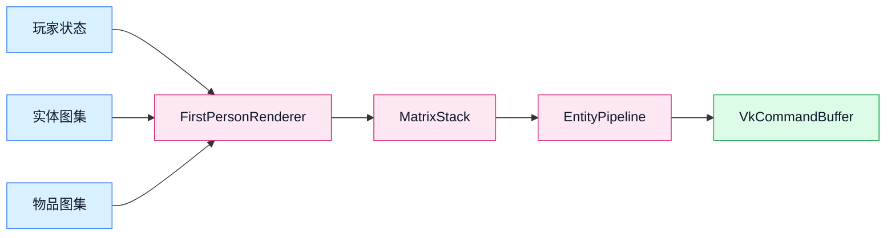

# First Person Renderer

第一人称手部渲染器模块，负责渲染玩家视角下的手部和手持物品。

## 目录结构

```
firstperson/
├── README.md                    # 本文档
├── FirstPersonRenderer.hpp/cpp  # 第一人称渲染器主类
├── PlayerModel.hpp/cpp          # 玩家模型（双足模型扩展）
├── ItemInHandRenderer.hpp/cpp   # 手持物品渲染器
├── MatrixStack.hpp/cpp          # 矩阵栈（变换层级管理）
├── ItemCameraTransforms.hpp/cpp # 物品相机变换
└── ArmPose.hpp                  # 手臂姿态枚举
```

## 模块职责

### FirstPersonRenderer

主渲染器类，负责：
- 渲染玩家手部（第一人称视角）
- 管理手持物品动画
- 处理挥动手臂动画
- 处理使用物品动画（吃食物、拉弓等）

参考 MC 1.16.5 `FirstPersonRenderer`

### PlayerModel

玩家模型类，继承自 `BipedModel`：
- 头部、身体、手臂、腿部
- 衣服外层（hat/jacket/sleeves/pants）
- 手臂姿态（空手、持物品、拉弓、格挡等）

参考 MC 1.16.5 `PlayerModel`

### ItemInHandRenderer

手持物品渲染器：
- 渲染玩家手中的物品
- 处理物品变换（根据 TransformType）
- 处理物品动画

参考 MC 1.16.5 `ItemInHandRenderer`

### MatrixStack

矩阵栈，用于管理变换层级：
- push/pop 栈操作
- translate/rotate/scale 变换
- 矩阵乘法优化

参考 MC 1.16.5 `MatrixStack`

### ItemCameraTransforms

物品相机变换类型：
- `NONE` - 无变换
- `THIRD_PERSON_LEFT_HAND` - 第三人称左手
- `THIRD_PERSON_RIGHT_HAND` - 第三人称右手
- `FIRST_PERSON_LEFT_HAND` - 第一人称左手
- `FIRST_PERSON_RIGHT_HAND` - 第一人称右手
- `HEAD` - 头部位置
- `GUI` - GUI 显示
- `GROUND` - 地面掉落物
- `FIXED` - 固定位置

参考 MC 1.16.5 `ItemCameraTransforms`

## 渲染流程

```
TridentEngine::render()
  └── FirstPersonRenderer::renderItemInFirstPerson()
        ├── 更新手部动画状态
        ├── 渲染主手
        │     ├── 计算手部变换
        │     ├── 如果手持物品
        │     │     └── ItemInHandRenderer::renderItem()
        │     └── 否则
        │           └── renderArmFirstPerson()
        └── 渲染副手
              └── (同上)
```

    ## 模块关系

    - `TridentEngine` 负责初始化第一人称渲染器，并在每帧传入相机描述符集与部分 tick。
    - `FirstPersonRenderer` 读取 `Player`、`PlayerInventory` 和 `ItemStack`，决定手臂姿态与手持物品表现。
    - `EntityPipeline` 负责创建、绑定和销毁手臂/物品对应的 Vulkan 网格资源。
    - `EntityTextureAtlas` 提供玩家皮肤区域，`ItemTextureAtlas` 提供物品 UV 区域。
    - `MatrixStack` 负责把相机朝向、挥手动画和持物变换组合成最终模型矩阵。

    ## 输入输出

    ### 输入

    - 玩家位置、视角朝向和主副手物品。
    - `partialTick` 和挥动/装备动画状态。
    - 相机描述符集、玩家皮肤图集和物品图集。

    ### 输出

    - 写入命令缓冲区的手臂与物品绘制命令。
    - 短生命周期的 GPU 网格缓存：当前实现会按手位分别缓存物品网格，并在若干帧后延迟回收旧网格。

    ## 资源生命周期

    当前实现避免了“主手和副手共用一个物品网格”的做法。每只手都有独立缓存，旧网格不会立即销毁，而是进入退休队列，等待至少 `maxFramesInFlight` 帧后再释放。这样可以避免：

    - 主副手物品不同导致缓存互相踢掉。
    - 仍在飞行中的命令缓冲区引用已释放的 Vulkan 缓冲区。
    - 物品频繁切换时，`vkAllocateMemory` 反复增长。

## 手部动画

### 挥动动画 (Swing)

当玩家攻击或使用物品时触发：
- `swingProgress`: 0.0 - 1.0，表示挥动进度
- 使用三角函数计算手臂旋转角度

### 装备动画 (Equip)

当切换手持物品时触发：
- `equippedProgress`: 0.0 - 1.0，表示装备进度
- 物品从下方升起

### 使用物品动画 (Use)

根据物品类型不同：
- **食物/药水**: 移向嘴边
- **弓**: 拉弓姿势
- **弩**: 装填姿势
- **盾牌**: 格挡姿势
- **三叉戟**: 投掷姿势

## 变换系统

手部和物品的变换通过矩阵栈实现：

```cpp
MatrixStack matrix;
matrix.push();
    matrix.translate(x, y, z);
    matrix.rotateX(angle);
    matrix.rotateY(angle);
    matrix.rotateZ(angle);
    matrix.scale(sx, sy, sz);
    
    // 渲染手部或物品
    renderItem(matrix, ...);
matrix.pop();
```

实现约束（已与 MC 1.16.5 对齐）：
- `renderArmFirstPerson`、`transformSideFirstPerson`、`transformFirstPerson` 的系数与调用顺序参考原版实现。
- 第一人称根矩阵使用“相机朝向基向量”构造，遵循 MC 前向定义：
    `forward = (-sin(yaw)*cos(pitch), sin(pitch), cos(yaw)*cos(pitch))`。
- `MatrixStack` 采用后乘语义：`current = current * transform`（PoseStack 语义）。

## 依赖项

- **BipedModel**: 双足模型基类
- **ModelRenderer**: 模型部件渲染器
- **ItemRenderer**: 物品渲染器（GUI）
- **EntityTextureAtlas**: 实体纹理图集
- **TridentEngine**: 渲染引擎

## 使用方法

```cpp
// 初始化
FirstPersonRenderer renderer;
renderer.initialize(&engine, &resourceManager);

// 每帧渲染
void render(f64 partialTick) {
    renderer.renderItemInFirstPerson(player, partialTick);
}

// tick 更新
void tick() {
    renderer.tick();
}
```

## 容易踩的坑

1. **矩阵栈不平衡**: 每次 push 必须有对应的 pop，否则渲染错乱
2. **动画插值**: 必须使用 partialTick 进行插值，否则动画会卡顿
3. **主手/副手判断**: 需要根据玩家的主手设置来决定渲染位置
4. **物品变换覆盖**: 某些物品（地图）有特殊渲染逻辑
5. **透明度混合**: 手部和物品渲染顺序很重要
6. **变换顺序**: 不能手写“行列就地改值”去替代矩阵后乘，否则会出现水平转头时手臂自转
7. **物品网格不要共享缓存**: 主手和副手可能在同一帧持有不同物品，单缓存会导致每帧反复重建 GPU 网格。
8. **旧网格不能立即销毁**: 需要按帧延迟回收，否则在飞帧可能仍在使用旧的 Vulkan 缓冲区。

## 测试用例

测试文件位于 `tests/client/renderer/firstperson/`:
- `MatrixStackTest.cpp` - 矩阵栈测试
- `FirstPersonRendererTest.cpp` - 渲染器测试
- `PlayerModelTest.cpp` - 玩家模型测试
- `ItemCameraTransformsTest.cpp` - 物品变换测试

## Mermaid 图表


