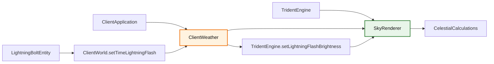

# 天空渲染器 (SkyRenderer)

该模块负责渲染天空、太阳、月亮和星星，并处理天气效果（包括闪电闪烁）。

## 目录结构

```text
src/client/renderer/trident/sky/
├── SkyRenderer.hpp/cpp           # 天空渲染器主类
├── CelestialCalculations.hpp/cpp # 天体计算工具类
└── README.md                     # 本文档
```

## 文件介绍

### SkyRenderer.hpp / SkyRenderer.cpp

职责：
- 渲染天空穹顶、太阳、月亮、星星。
- 根据时间计算天体位置和颜色。
- 处理天气效果（雨、雷暴）对天空的影响。
- 实现闪电击中时的天空闪烁效果。

核心接口：
- `initialize()` - 初始化渲染器（VBO、管线、Uniform缓冲区）
- `update(dayTime, gameTime, partialTick, rainStrength, thunderStrength)` - 更新天空状态
- `setLightningFlashBrightness(f64 brightness)` - 设置闪电闪烁亮度 (0.0-1.0)
- `render(cmd, projection, view, cameraPos, cameraForward, frameIndex)` - 渲染天空

闪电闪烁效果：
- 当闪电击中时，天空颜色和雾颜色会向白色混合
- 亮度因子通过 `setLightningFlashBrightness()` 设置
- 参考 MC 1.16.5 WorldRenderer.renderSky()

### CelestialCalculations.hpp / CelestialCalculations.cpp

职责：
- 计算天体角度、月相、太阳方向。
- 计算天空颜色、雾颜色、日出/日落颜色。
- 计算星星亮度。

核心接口：
- `calculateCelestialAngle(i64 dayTime)` - 计算天体角度 (0.0-1.0)
- `calculateMoonPhase(i64 gameTime)` - 计算月相 (0-7)
- `calculateSunDirection(f64 celestialAngle)` - 计算太阳方向向量
- `calculateSkyColor(f64 celestialAngle, f64 rainStrength, f64 thunderStrength)` - 计算天空颜色
- `calculateFogColor(f64 celestialAngle, f64 rainStrength, f64 thunderStrength)` - 计算雾颜色
- `calculateStarBrightness(f64 celestialAngle)` - 计算星星亮度

## 模块关系



## 整体职责

模块整体完成以下工作：
- 根据游戏时间计算太阳、月亮、星星的位置。
- 根据天气状态调整天空颜色和能见度。
- 实现闪电击中时天空短暂变亮的效果。

## 输入/输出

输入：
- `dayTime` - 当前一天内的时间 (0-23999)
- `gameTime` - 游戏总 tick 数
- `partialTick` - 部分 tick (用于插值)
- `rainStrength` - 雨强度 (0.0-1.0)
- `thunderStrength` - 雷暴强度 (0.0-1.0)
- `lightningFlashBrightness` - 闪电闪烁亮度 (0.0-1.0)

输出：
- 天空穹顶网格渲染
- 太阳/月亮/星星渲染
- 天空颜色和雾颜色（供其他渲染器使用）

## 依赖项

外部依赖：
- `vulkan/vulkan.hpp`
- `glm/glm.hpp`
- `spdlog`

内部依赖：
- `common/core/Types.hpp`
- `common/util/math/MathConstants.hpp`
- `common/util/math/MathUtils.hpp`
- `common/util/math/random/Random.hpp`

## 使用方法

```cpp
// 在渲染循环中
skyRenderer.update(dayTime, gameTime, partialTick, rainStrength, thunderStrength);

// 当闪电击中时
skyRenderer.setLightningFlashBrightness(1.0);

// 渲染天空
skyRenderer.render(cmd, projection, view, cameraPos, cameraForward, frameIndex);

// 获取天空颜色供其他渲染器使用
const glm::vec4& skyColor = skyRenderer.skyColor();
const glm::vec4& fogColor = skyRenderer.fogColor();
```

## 闪电闪烁效果

当闪电击中时：
1. `LightningBoltEntity::tick()` 调用 `m_world->setTimeLightningFlash(2)`
2. `ClientWeather` 设置 `m_lightningFlashTime = 2`
3. `ClientApplication::updateTimeAndWeather()` 每帧递减闪烁时间
4. `TridentEngine::setLightningFlashBrightness()` 传递亮度到渲染器
5. `SkyRenderer::updateUniformBuffer()` 将天空颜色向白色混合
6. 2 tick 后闪烁结束

参考 MC 1.16.5:
- `LightningBoltEntity.tick()`: `world.setTimeLightningFlash(2)`
- `Minecraft.runTick()`: `world.setTimeLightningFlash(time - 1)`
- `WorldRenderer.renderSky()`: 闪烁时天空变亮

## 容易踩的坑

- 天空颜色计算必须考虑天气影响，否则雨天天空颜色不正确。
- 闪电闪烁亮度应该在天空颜色计算后应用，否则会覆盖天气效果。
- 星星亮度应该根据天体角度计算，白天不可见。

## 测试用例

间接相关：
- `tests/client/renderer/test_trident_engine.cpp` - TridentEngine 初始化测试
