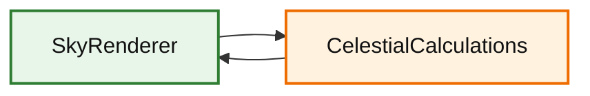

# 天空渲染器 (SkyRenderer)

该模块负责渲染天空、太阳、月亮和星星，并处理天气效果（包括闪电闪烁）。

## 目录结构

```text
src/client/renderer/trident/sky/
├── SkyRenderer.hpp/cpp           # 天空渲染器主类（穹顶、天体、闪电闪烁）
├── CelestialCalculations.hpp/cpp # 天体计算工具类（角度、月相、颜色）
└── README.md                     # 本文档
```

## 内部模块关系



- `SkyRenderer` 调用 `CelestialCalculations` 计算天体角度、月相、天空颜色、雾颜色等。
- `SkyRenderer` 持有天空状态（天体角度、月相、天气强度、闪电亮度等）。

## 上下游外部依赖关系

上游依赖：
- `TridentEngine` - 创建并持有 `SkyRenderer`，调用 `update()` 和 `render()`
- `ClientWeather` - 提供雨强度、雷暴强度
- `LightningBoltEntity` - 触发闪电闪烁（通过 `ClientWorld.setTimeLightningFlash()`）
- `ClientApplication` - 调用 `setLightningFlashBrightness()` 传递闪烁亮度

下游被依赖：
- 其他渲染器通过 `skyColor()` 和 `fogColor()` 获取天空/雾颜色
- 光照系统通过 `sunDirection()` 和 `sunIntensity()` 获取太阳方向和强度

## 容易踩的坑

- **天空颜色计算必须考虑天气影响**：否则雨天天空颜色不正确。
- **闪电闪烁亮度应该在天空颜色计算后应用**：否则会覆盖天气效果。
- **星星亮度应该根据天体角度计算**：白天不可见。
- **dayTime 范围是 0-23999**：不是游戏总 tick 数。
- **天体角度 0.0 = 正午**：不是日出，计算时注意 MC 的时间系统 conventions。
- **月相 0 = 满月，4 = 新月**：影响夜间亮度。
