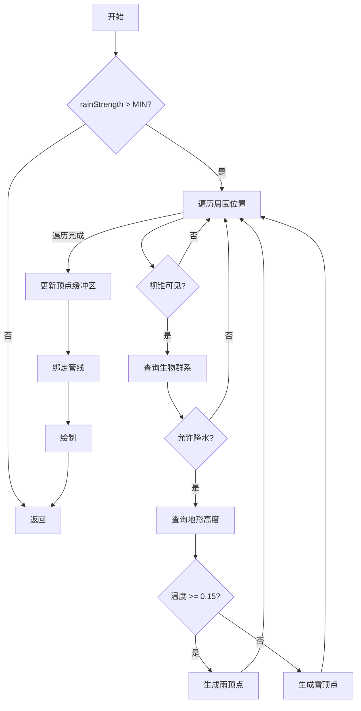
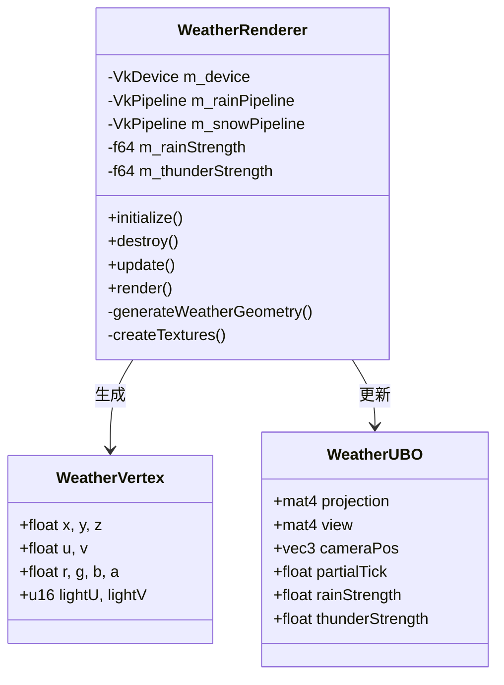

# 天气渲染模块 (Weather Renderer)

## 目录结构

```
weather/
├── README.md              # 本文件
├── WeatherRenderer.hpp    # 天气渲染器头文件
└── WeatherRenderer.cpp    # 天气渲染器实现
```

## 模块职责

天气渲染器负责渲染雨雪效果，参考 MC 1.16.5 `WorldRenderer.renderRainSnow()`。

### 核心功能

1. **雨/雪层渲染**：使用纹理层而非单独粒子渲染大量雨雪
2. **生物群系感知**：根据温度决定降水类型（雨/雪）
3. **地形感知**：根据地形高度调整渲染范围
4. **光照采样**：从世界采样光照以正确照亮雨雪

## 文件介绍

### WeatherRenderer.hpp

定义天气渲染器类和常量：

- `WeatherRenderConstants` 命名空间
  - `MIN_RENDER_STRENGTH`：最小渲染强度阈值
  - `MAX_RAIN_VERTICES`：最大雨顶点数
  - `TEXTURE_SIZE`：纹理尺寸
  - `SNOW_TEMPERATURE_THRESHOLD`：雪温度阈值 (0.15)
  - `CLOUD_HEIGHT`：云层高度 (192)
  - `RAIN_PILLAR_HEIGHT`：雨柱高度 (20)

- `WeatherRenderer` 类
  - 初始化/销毁方法
  - `setFancyGraphics()`：设置图形模式（Fast=5，Fancy=10）
  - `update()`：更新天气状态
  - `render()`：渲染天气效果（多个重载）

### WeatherRenderer.cpp

实现天气渲染逻辑：

- 生成雨/雪几何体
- 光照采样
- Vulkan 资源管理

## 输入/输出

### 输入

- `rainStrength`：降雨强度 (0.0 - 1.0)
- `thunderStrength`：雷暴强度 (0.0 - 1.0)
- `ticks`：游戏 tick
- `partialTick`：部分 tick（用于插值）
- `ClientWorld`：世界引用（用于生物群系、高度、光照查询）

### 输出

- 渲染雨/雪纹理层到场景

## 依赖项

### 内部依赖

- `ClientWorld`：世界查询接口
- `Biome`：生物群系温度和降水类型
- `VulkanUtils`：Vulkan 工具函数
- `Random`：随机数生成

### 外部依赖

- Vulkan：图形 API
- GLM：数学库
- spdlog：日志

## 使用方法

```cpp
// 初始化
WeatherRenderer weatherRenderer;
weatherRenderer.initialize(device, physicalDevice, commandPool,
                           graphicsQueue, renderPass, extent, sampleCount);

// 每帧更新
weatherRenderer.update(rainStrength, thunderStrength, ticks, partialTick);

// 渲染
weatherRenderer.render(cmd, projection, view, cameraPos, frameIndex, world, frustum);

// 销毁
weatherRenderer.destroy();
```

## 渲染算法

### 雨层渲染

参考 MC 1.16.5 `WorldRenderer.renderRainSnow()`：

1. 遍历玩家周围半径内的位置
2. 查询每个位置的生物群系温度
3. 温度 >= 0.15 渲染雨，< 0.15 渲染雪
4. 查询地形高度确定雨柱范围
5. UV 动画：`(ticks & 31 + partialTick) / 32.0 * 3.0`
6. 根据距离淡出

### 雪层渲染

与雨类似，但：

1. UV 动画较慢：`(ticks & 511 + partialTick) / 512.0`
2. 正弦漂移：`sin(ticks * 0.01) * 0.5`
3. 光照增强：`(light * 3 + 240) / 4`

## 容易踩的坑

### 1. 光照采样位置

MC 在地面高度 `l2` 处采样光照，而非相机高度。错误的采样位置会导致雨雪看起来过暗或过亮。

### 2. 温度阈值判断

MC 使用 `biome.getTemperature(pos) >= 0.15f` 判断雨/雪。注意温度是基于位置的（高海拔更冷）。

### 3. 生物群系降水类型

即使温度足够，某些生物群系（沙漠、下界）也不降水：
```cpp
if (biome->climate().precipitation == BiomeClimate::Precipitation::None) {
    continue;  // 跳过不降水的生物群系
}
```

### 4. 随机偏移数组

MC 使用固定的 32x32 随机偏移数组保证帧间一致性：
```cpp
f64 m_rainOffsetX[RAIN_SIZE * RAIN_SIZE];
f64 m_rainOffsetZ[RAIN_SIZE * RAIN_SIZE];
```

## 测试用例

相关测试位于 `tests/client/renderer/weather/`：
- `WeatherRendererTest.cpp`：基本渲染测试

## Mermaid 图表

### 渲染流程



### 类结构


