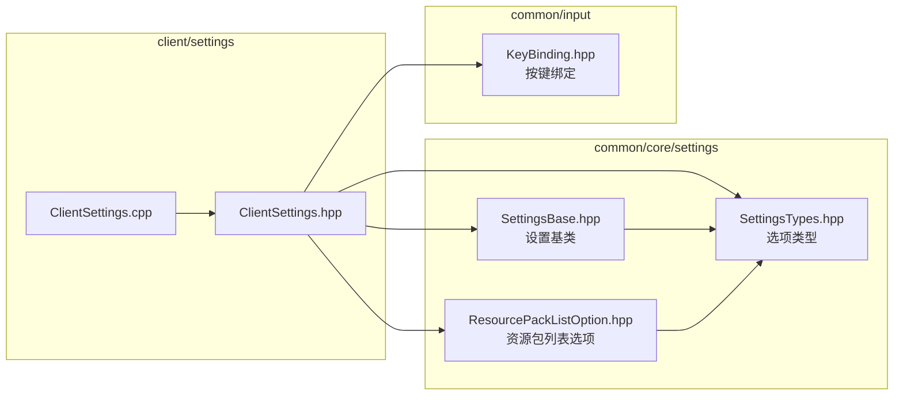
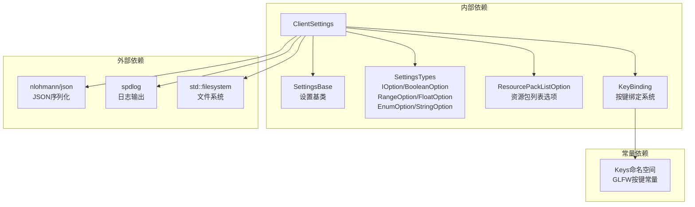
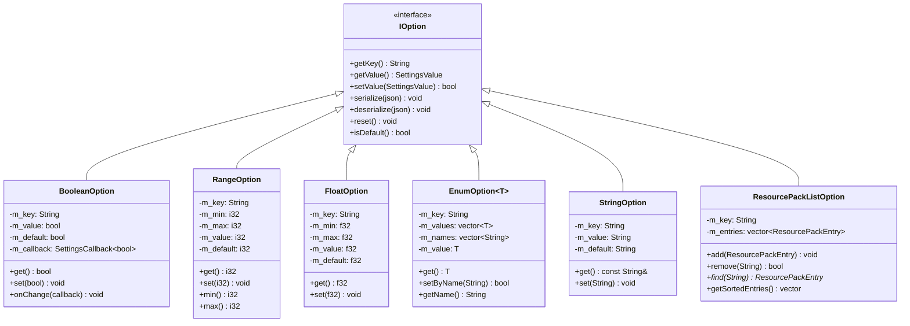
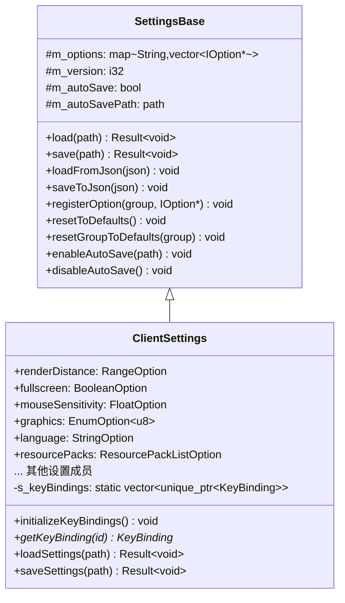

# Client Settings 模块

客户端设置模块，管理 Minecraft 客户端的所有用户配置选项，包括视频、音频、控制、游戏、网络等设置，以及按键绑定管理。

## 目录结构

```
src/client/settings/
├── ClientSettings.hpp    # 客户端设置类定义
└── ClientSettings.cpp    # 客户端设置类实现
```

## 文件详细介绍

### ClientSettings.hpp

**职责**: 定义客户端设置类和相关枚举类型。

**主要内容**:

#### 枚举类型

| 枚举 | 值 | 说明 |
|------|-----|------|
| `GraphicsMode` | Fast, Fancy | 图形质量模式 |
| `CloudMode` | Off, Fast, Fancy | 云渲染模式 |
| `ParticleMode` | Minimal, Decreased, All | 粒子效果模式 |
| `AmbientOcclusionMode` | Off, Min, Max | 环境光遮蔽模式 |

#### 设置分组

```mermaid
graph TB
    subgraph ClientSettings
        V[视频设置<br/>video]
        A[音频设置<br/>audio]
        C[控制设置<br/>control]
        G[游戏设置<br/>game]
        N[网络设置<br/>network]
        L[日志设置<br/>log]
        R[资源包设置<br/>resourcePacks]
    end

    V --> V1[renderDistance<br/>渲染距离 2-32]
    V --> V2[framerateLimit<br/>帧率限制 0-260]
    V --> V3[fullscreen/vsync<br/>全屏/垂直同步]
    V --> V4[graphics/clouds<br/>图形/云模式]
    V --> V5[mipmapLevels<br/>Mipmap等级 0-4]
    V --> V6[fovEffectScale<br/>FOV效果强度]
    V --> V7[screenShakeScale<br/>屏幕抖动强度]
    V --> V8[fogDensity<br/>雾效果密度]
    V --> V9[ambientOcclusion<br/>环境光遮蔽]
    V --> V10[antiAliasing<br/>抗锯齿开关]

    A --> A1[masterVolume<br/>主音量]
    A --> A2[musicVolume<br/>音乐音量]
    A --> A3[soundVolume<br/>音效音量]
    A --> A4[ambientVolume<br/>环境音量]

    C --> C1[mouseSensitivity<br/>鼠标灵敏度]
    C --> C2[invertMouse<br/>反转鼠标Y轴]
    C --> C3[rawMouseInput<br/>原始鼠标输入]
    C --> C4[mouseWheelSensitivity<br/>滚轮灵敏度]
    C --> C5[autoJump<br/>自动跳跃]

    G --> G1[viewBobbing<br/>视角摇晃]
    G --> G2[fov<br/>视野 30-110]
    G --> G3[showFps<br/>显示FPS]
    G --> G4[showDebug<br/>调试屏幕]
    G --> G5[language<br/>语言代码]

    N --> N1[serverAddress<br/>服务器地址]
    N --> N2[serverPort<br/>端口 1-65535]
    N --> N3[username<br/>玩家名称]

    L --> L1[logLevel<br/>日志级别]

    R --> R1[resourcePacks<br/>资源包列表]
    R --> R2[resourcePackDir<br/>资源包目录]
```



#### 按键绑定管理

提供静态方法管理全局按键绑定:

- `initializeKeyBindings()` - 初始化所有默认按键绑定
- `getKeyBinding(id)` - 通过 ID 获取按键绑定
- `getAllKeyBindings()` - 获取所有按键绑定

### ClientSettings.cpp

**职责**: 实现客户端设置类的具体逻辑。

**主要内容**:

#### 构造函数

初始化所有设置选项并注册到对应分组:

```cpp
ClientSettings::ClientSettings()
    : renderDistance("renderDistance", 2, 32, 12)  // 范围 2-32, 默认 12
    , framerateLimit("framerateLimit", 0, 260, 120) // 0 = 无限制
    , fullscreen("fullscreen", false)
    // ... 其他设置初始化
{
    registerOption("video", &renderDistance);
    registerOption("video", &framerateLimit);
    // ... 其他选项注册
}
```

#### 默认按键绑定

| 分类 | ID | 默认按键 | 说明 |
|------|-----|---------|------|
| movement | key.forward | W | 前进 |
| movement | key.left | A | 左移 |
| movement | key.back | S | 后退 |
| movement | key.right | D | 右移 |
| movement | key.jump | Space | 跳跃 |
| movement | key.sneak | LeftShift | 潜行 |
| movement | key.sprint | LeftControl | 疾跑 |
| gameplay | key.inventory | E | 物品栏 |
| gameplay | key.use | Mouse::Right | 使用 |
| gameplay | key.attack | Mouse::Left | 攻击 |
| gameplay | key.pickItem | Mouse::Middle | 拾取物品 |
| gameplay | key.chat | T | 聊天 |
| gameplay | key.playerlist | Tab | 玩家列表 |
| inventory | key.hotbar.1-9 | D1-D9 | 快捷栏选择 |
| misc | key.screenshot | F2 | 截图 |
| misc | key.toggleDebug | F3 | 调试屏幕 |
| misc | key.fullscreen | F11 | 全屏切换 |
| misc | key.smoothCamera | F8 | 平滑摄像机 |

## 文件关系图



## 模块整体分析

### 整体职责

1. **配置管理**: 集中管理客户端所有用户可配置选项
2. **持久化**: 提供 JSON 格式的配置文件加载/保存功能
3. **按键绑定**: 管理游戏内所有按键映射，支持重映射和持久化
4. **分组组织**: 按功能分组管理设置（视频、音频、控制等）
5. **变更通知**: 支持设置值变更时的回调通知机制

### 输入和输出

#### 输入

| 来源 | 数据 | 说明 |
|------|------|------|
| 配置文件 | JSON | 从 `options.json` 加载用户设置 |
| 用户交互 | 设置值 | 通过 UI 或代码修改设置 |
| 键盘/鼠标 | 按键事件 | 更新按键绑定状态 |

#### 输出

| 目标 | 数据 | 说明 |
|------|------|------|
| 配置文件 | JSON | 保存设置到 `options.json` |
| 渲染引擎 | 视频设置 | 应用渲染距离、帧率限制等 |
| 音频系统 | 音量设置 | 应用各音轨音量 |
| 输入系统 | 按键绑定 | 查询按键状态 |

### 依赖项



### 使用方法

#### 基本使用

```cpp
#include "client/settings/ClientSettings.hpp"

// 创建设置实例
mc::client::ClientSettings settings;

// 加载配置文件
settings.loadSettings("options.json");

// 访问设置值
int distance = settings.renderDistance.get();
bool isFullscreen = settings.fullscreen.get();
float sensitivity = settings.mouseSensitivity.get();

// 修改设置
settings.renderDistance.set(16);
settings.fullscreen.set(true);

// 设置变更回调
settings.renderDistance.onChange([](int value) {
    spdlog::info("渲染距离变更为: {}", value);
    // 更新渲染引擎配置...
});

// 保存配置
settings.saveSettings("options.json");
```

#### 按键绑定使用

```cpp
// 初始化按键绑定
settings.initializeKeyBindings();

// 获取按键绑定
auto* forward = mc::client::ClientSettings::getKeyBinding("key.forward");
if (forward && forward->isPressed()) {
    player.moveForward();
}

// 重映射按键
forward->setKey(mc::Keys::E);

// 重置为默认
forward->resetToDefault();

// 每帧更新按键状态
std::vector<i32> pressed = { /* 当前按下的键 */ };
std::vector<i32> justPressed = { /* 本帧刚按下的键 */ };
std::vector<i32> justReleased = { /* 本帧刚释放的键 */ };
mc::KeyBinding::updateAll(pressed, justPressed, justReleased);
```

#### 枚举类型设置

```cpp
// 设置图形模式
settings.graphics.set(static_cast<u8>(GraphicsMode::Fancy));

// 通过名称设置
settings.graphics.setByName("fast");

// 获取当前值名称
std::string modeName = settings.graphics.getName(); // "fast" 或 "fancy"
```

#### 资源包管理

```cpp
// 添加资源包
settings.resourcePacks.add(mc::ResourcePackEntry{
    "packs/fancy.zip",  // 路径
    true,               // 启用
    10                  // 优先级（高优先级覆盖低优先级）
});

// 获取排序后的资源包列表（高优先级在前）
auto sorted = settings.resourcePacks.getSortedEnabledEntries();

// 移除资源包
settings.resourcePacks.remove("packs/fancy.zip");
```

### 容易踩的坑

#### 1. 按键绑定必须先初始化

```cpp
// 错误：未初始化就获取按键绑定
auto* key = ClientSettings::getKeyBinding("key.forward"); // 返回 nullptr

// 正确：先初始化
settings.initializeKeyBindings();
auto* key = ClientSettings::getKeyBinding("key.forward"); // 返回有效指针
```

#### 2. 按键绑定是静态全局的

```cpp
// 注意：KeyBinding 使用静态注册表，所有 ClientSettings 实例共享
ClientSettings settings1;
ClientSettings settings2;

settings1.initializeKeyBindings();
// settings2 不需要再次初始化，按键绑定已注册

// 修改按键绑定会影响全局
auto* key = ClientSettings::getKeyBinding("key.forward");
key->setKey(Keys::E);  // 所有地方都会生效
```

#### 3. 设置变更回调只在值真正改变时触发

```cpp
BooleanOption option("test", false);
int callCount = 0;
option.onChange([&](bool) { callCount++; });

option.set(false);  // 相同值，回调不会触发
EXPECT_EQ(callCount, 0);

option.set(true);   // 不同值，回调触发
EXPECT_EQ(callCount, 1);
```

#### 4. RangeOption 和 FloatOption 会自动 clamp

```cpp
RangeOption distance("distance", 2, 32, 12);

distance.set(100);  // 自动 clamp 到 32
EXPECT_EQ(distance.get(), 32);

distance.set(-5);   // 自动 clamp 到 2
EXPECT_EQ(distance.get(), 2);
```

#### 5. EnumOption 只接受预定义值

```cpp
EnumOption<u8> mode("mode", {0, 1, 2}, 1, {"low", "medium", "high"});

mode.set(5);  // 无效值，不会生效
EXPECT_EQ(mode.get(), 1);  // 保持原值
```

#### 6. FloatOption 使用 epsilon 比较

```cpp
FloatOption option("test", 0.0f, 1.0f, 0.5f);
option.set(0.5f);  // 与默认值差异小于 epsilon，视为相等
EXPECT_TRUE(option.isDefault());
```

#### 7. 资源包优先级顺序

```cpp
// MC 资源加载顺序：先加载低优先级，后加载高优先级
// 高优先级资源会覆盖低优先级同名资源
// getSortedEntries() 返回高优先级在前（用于显示）
// 实际加载应该反过来遍历
```

#### 8. 自动保存需要手动启用

```cpp
ClientSettings settings;

// 修改设置不会自动保存
settings.renderDistance.set(20);

// 需要启用自动保存
settings.enableAutoSave("options.json");
settings.renderDistance.set(24);  // 现在会自动保存

// 或手动保存
settings.saveSettings("options.json");
```

### 涉及的测试用例

测试文件位于 `tests/common/SettingsTest.cpp`，包含以下测试:

#### SettingsTypes 测试

| 测试名 | 覆盖内容 |
|--------|----------|
| `BooleanOption_DefaultValue` | 布尔选项默认值 |
| `BooleanOption_SetValue` | 布尔选项值设置 |
| `BooleanOption_Reset` | 布尔选项重置 |
| `BooleanOption_Callback` | 布尔选项回调触发 |
| `BooleanOption_CallbackNotCalledOnSameValue` | 相同值不触发回调 |
| `BooleanOption_Serialize` | 布尔选项序列化 |
| `BooleanOption_Deserialize` | 布尔选项反序列化 |
| `RangeOption_DefaultValue` | 范围选项默认值 |
| `RangeOption_ClampValue` | 范围选项自动 clamp |
| `RangeOption_SetValue` | 范围选项值设置 |
| `RangeOption_Callback` | 范围选项回调 |
| `RangeOption_Serialize` | 范围选项序列化 |
| `RangeOption_Deserialize` | 范围选项反序列化 |
| `FloatOption_DefaultValue` | 浮点选项默认值 |
| `FloatOption_ClampValue` | 浮点选项自动 clamp |
| `FloatOption_Callback` | 浮点选项回调 |
| `FloatOption_Serialize` | 浮点选项序列化 |
| `EnumOption_DefaultValue` | 枚举选项默认值 |
| `EnumOption_SetValue` | 枚举选项值设置 |
| `EnumOption_SetByName` | 枚举选项通过名称设置 |
| `EnumOption_InvalidValue` | 枚举选项无效值处理 |
| `EnumOption_Serialize` | 枚举选项序列化 |
| `EnumOption_Deserialize` | 枚举选项反序列化 |
| `StringOption_DefaultValue` | 字符串选项默认值 |
| `StringOption_SetValue` | 字符串选项值设置 |
| `StringOption_Serialize` | 字符串选项序列化 |

#### SettingsBase 测试

| 测试名 | 覆盖内容 |
|--------|----------|
| `SaveAndLoad` | 设置保存和加载 |
| `LoadNonExistentFile` | 加载不存在的文件 |
| `ResetToDefaults` | 重置所有设置为默认 |
| `ResetGroupToDefaults` | 重置特定分组为默认 |
| `GetSettingsPath` | 获取设置文件路径 |

#### KeyBinding 测试

| 测试名 | 覆盖内容 |
|--------|----------|
| `CreateBinding` | 创建按键绑定 |
| `SetKey` | 设置按键 |
| `ResetToDefault` | 重置为默认按键 |
| `FindBinding` | 查找按键绑定 |
| `UpdateAll` | 更新所有按键状态 |
| `SerializeAndDeserialize` | 序列化和反序列化 |

#### ClientSettings 测试

| 测试名 | 覆盖内容 |
|--------|----------|
| `DefaultValues` | 默认值验证 |
| `InitializeKeyBindings` | 按键绑定初始化 |
| `SaveAndLoadSettings` | 设置保存和加载（含按键绑定） |

## 架构设计说明

### 设置类型系统



### 设置继承关系



## 配置文件格式

保存的 JSON 格式示例:

```json
{
    "renderDistance": 12,
    "framerateLimit": 120,
    "guiScale": 0,
    "fullscreen": false,
    "vsync": true,
    "graphics": "fancy",
    "clouds": "fancy",
    "mipmapLevels": 4,
    "fovEffectScale": 1.0,
    "screenShakeScale": 1.0,
    "fogDensity": 1.0,
    "ambientOcclusion": "max",
    "masterVolume": 1.0,
    "musicVolume": 0.5,
    "soundVolume": 1.0,
    "ambientVolume": 1.0,
    "mouseSensitivity": 0.5,
    "invertMouse": false,
    "rawMouseInput": true,
    "mouseWheelSensitivity": 1.0,
    "autoJump": false,
    "viewBobbing": true,
    "fov": 70.0,
    "showFps": false,
    "showDebug": false,
    "language": "zh_cn",
    "serverAddress": "127.0.0.1",
    "serverPort": 19132,
    "username": "Player",
    "logLevel": "info",
    "resourcePacks": [
        {
            "path": "packs/fancy.zip",
            "enabled": true,
            "priority": 10
        }
    ],
    "resourcePackDir": "resourcepacks",
    "keyBindings": {
        "key.forward": 87,
        "key.jump": 32
    }
}
```
