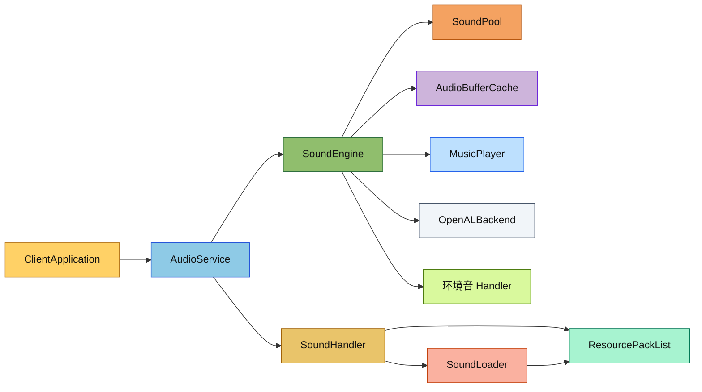

# 音频模块

客户端音频系统。当前实现已经改成"独立音频引擎线程"模型，由 `AudioService` 统一接收主线程命令并在音频线程内驱动 `SoundEngine`、`SoundHandler`、环境音与音乐逻辑。

## 目录结构

```text
src/client/sound/
├── AudioService.hpp/cpp          # 音频线程入口与命令队列
├── SoundEngine.hpp/cpp           # 声音播放核心
├── SoundHandler.hpp/cpp          # sounds.json 解析与声音定义管理
├── SoundLoader.hpp/cpp           # OGG 解码与资源包读取
├── SoundPool.hpp/cpp             # 活动声音实例池
├── MusicPlayer.hpp/cpp           # 背景音乐调度
├── AudioBufferCache.hpp/cpp      # 音频缓冲区缓存
├── StbVorbisImpl.cpp             # stb_vorbis 适配实现
├── backend/                      # 音频后端
│   ├── IAudioBackend.hpp
│   ├── AudioBuffer.hpp/cpp
│   └── OpenALBackend.hpp/cpp
├── handler/                      # 环境音处理器
│   ├── IAmbientSoundHandler.hpp
│   ├── BiomeAmbientHandler.hpp/cpp
│   └── UnderwaterAmbientHandler.hpp/cpp
├── instance/                     # 声音实例定义
│   ├── ISoundInstance.hpp
│   ├── SoundInstance.hpp/cpp
│   └── EntitySoundInstance.hpp/cpp
└── resource/                     # 声音资源注册表
    ├── SoundDefinition.hpp/cpp
    └── SoundRegistry.hpp/cpp
```

## 文件介绍

- `AudioService`：客户端唯一音频入口，负责启动音频线程、投递命令、初始化/关闭、暂停、listener 更新、重载声音定义。
- `SoundEngine`：声音播放核心，实际持有 OpenAL 状态、声音池、缓冲区缓存、音乐播放器和环境音 handler。
- `SoundHandler`：加载并合并所有启用资源包中的 `sounds.json`。
- `SoundLoader`：从 `ResourcePackList` 中读取 `.ogg` 音频并解码。
- `AudioBufferCache`：缓存解码后的音频缓冲区，避免重复加载。
- `SoundPool`：管理活动声音实例的生命周期和索引。
- `MusicPlayer`：处理背景音乐的延迟、随机选择和淡入淡出。支持维度、创造模式、Boss战、水下、菜单等状态切换。
- `backend/`：OpenAL 相关抽象与实现。
- `handler/`：生物群系、水下等环境音逻辑。
- `instance/`：各类可播放声音实例。
- `resource/`：声音事件定义与注册表。

## 模块关系

- `ClientApplication` 只持有 `AudioService`，不直接持有 `SoundEngine`。
- `AudioService` 在音频线程里独占调用 `SoundEngine`。
- `SoundHandler` / `SoundLoader` 直接依赖共享的 `ResourcePackList`。
- `SoundEngine` 依赖 `SoundPool`、`MusicPlayer`、`AudioBufferCache` 和 `IAudioBackend`。
- 环境音 handler 只修改状态，不在主线程直接碰 OpenAL。

## 整体职责

1. 统一管理客户端所有音频入口。
2. 在独立线程内完成音频初始化、加载、播放、停止、暂停和恢复。
3. 统一处理音乐、环境音和常规音效。
4. 通过命令队列把主线程音频请求异步化，减轻主线程负担。

## 输入 / 输出

- 输入：
  - 主线程投递的播放/停止/暂停/更新 listener 命令
  - 共享 `ResourcePackList` 中的 `sounds.json` 和 `.ogg`
  - 客户端设置中的音量、音乐开关等配置
- 输出：
  - OpenAL 播放结果
  - 活动声音状态、音乐状态、环境音状态
  - 日志与性能追踪事件

## 依赖项

- 内部依赖：
  - `common/resource/ResourcePackList.hpp`
  - `common/sound/SoundCategory.hpp`
  - `client/settings/ClientSettings.hpp`
  - `client/sound/backend/IAudioBackend.hpp`
- 外部依赖：
  - OpenAL
  - `glm`
  - `stb_vorbis`
  - `spdlog`

## 使用方法

```cpp
mc::client::sound::AudioService audioService(resourcePackList, settings);

auto initResult = audioService.initialize();
if (initResult.success()) {
    audioService.play(std::make_unique<mc::client::sound::SoundInstance>(...));
    audioService.updateListener(glm::vec3{0.0f}, glm::vec3{0.0f, 0.0f, -1.0f}, glm::vec3{0.0f, 1.0f, 0.0f});
}
```

接入时的原则：
- 只通过 `AudioService` 调用音频能力。
- 不要在主线程直接调用 `SoundEngine`。
- 资源包变更后由 `AudioService::reloadSoundDefinitions()` 重新加载声音定义。

## 音乐播放器 (MusicPlayer)

音乐播放器根据游戏状态选择合适的背景音乐：

### 音乐类型选择逻辑 (MC 1.16.5)

1. **菜单界面** - 播放 `minecraft:music.menu`
2. **末地维度** - 播放 `minecraft:music.end`，Boss战时播放 `minecraft:music.dragon`
3. **下界维度** - 从下界群系音乐列表随机选择
4. **水下** - 播放 `minecraft:music.under_water`
5. **创造模式** - 从创造模式音乐列表随机选择
6. **主世界** - 从游戏音乐列表随机选择

### 延迟机制

- 每首音乐播放后，随机延迟 6000-24000 ticks (5-20分钟) 后播放下一首
- 菜单音乐和 Boss 战音乐立即播放 (`replaceCurrent = true`)

### 相关方法

```cpp
// 更新音乐状态（由 ClientApplication 每帧调用）
audioService.updateMusicState(dimension, inCreative, inBossFight);
audioService.setInMenu(inMenu);
audioService.setUnderwater(inWater);
```

## 环境音处理器

### 水下环境音 (UnderwaterAmbientHandler)

MC 1.16.5 水下环境音实现三档概率系统：

| 音效类型 | 音效ID | 概率/tick |
|---------|--------|-----------|
| 普通 | `ambient.underwater.loop.additions` | 0.9% |
| 稀有 | `ambient.underwater.loop.additions.rare` | 0.09% |
| 超稀有 | `ambient.underwater.loop.additions.ultra_rare` | 0.01% |

**注意**: 每tick都检查概率，无冷却延迟。

### 群系环境音 (BiomeAmbientHandler)

MC 1.16.5 群系环境音实现三种类型：

1. **循环音效 (Loop Sound)** - 持续播放的背景音效（待实现，需要 TickableSound 支持）
2. **心境音效 (Mood Sound)** - 在黑暗环境中根据光照等级触发
   - 默认心境音效：`ambient.cave`
   - 心境计时器在黑暗中积累，光照中减少
   - 光照计算：`skyLight/15 * 0.001` 或 `(blockLight-1) / tickDelay`
3. **附加音效 (Additions Sound)** - 按概率随机播放
   - 下界群系典型概率：`0.0111` (~1.11%/tick)

### 群系环境音数据结构

定义在 `common/world/biome/BiomeAmbientSounds.hpp`：

```cpp
// 心境音效配置
MoodSoundAmbience(
    soundEvent,     // 声音事件ID
    tickDelay,      // 光照计算除数（默认6000）
    blockSearchExtent, // 随机位置范围（默认8格）
    offset          // 距玩家偏移距离（默认2.0格）
);

// 附加音效配置
SoundAdditionsAmbience(
    soundEvent,     // 声音事件ID
    tickChance      // 每tick播放概率
);
```

### 更新环境音处理器

```cpp
// 在 ClientApplication::updateWorldAudio() 中每帧调用
audioService.setBiomeId(biomeId);
audioService.setUnderwater(inWater);
audioService.setAmbientLightLevel(skyLight, blockLight);
audioService.setAmbientPlayerPosition(x, y, z);
```

## 容易踩的坑

- 不要在主线程持有 `SoundEngine` 或 OpenAL 资源。
- `SoundHandler` 会并发读取 `ResourcePackList`，资源包读侧必须保持线程安全。
- 启动阶段如果额外添加资源包，会触发资源重载回调，注意初始化顺序。
- `AudioBufferCache` 和 `SoundPool` 只应在音频线程内使用。
- 群系需要配置 `BiomeAmbientSounds` 才能播放环境音效，否则使用默认心境音效。
- 菜单状态通过 `ScreenManager::instance().hasScreen()` 判断，需在 UI 更新后调用。

## 测试用例

- `tests/common/resource/ResourcePackListSelfContainedTest.cpp`：验证资源包读取链路，间接覆盖音频资源加载依赖。
- `tests/common/test_block.cpp`：覆盖若干会触发音效的方块行为。
- 全量回归：`ctest --test-dir build -C RelWithDebInfo --output-on-failure`

## Mermaid 图表


