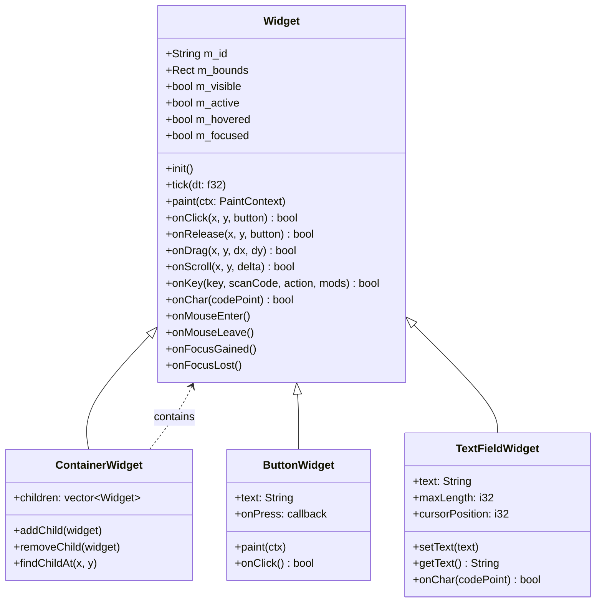
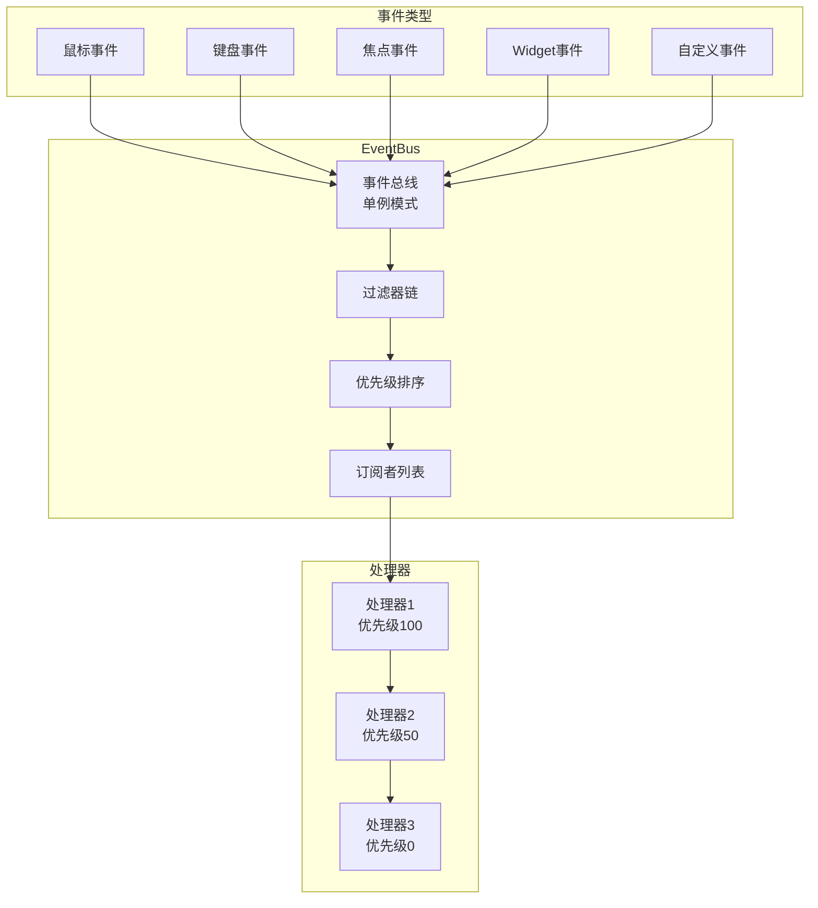
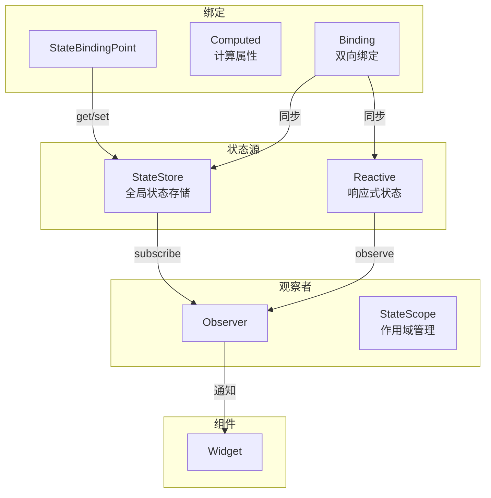
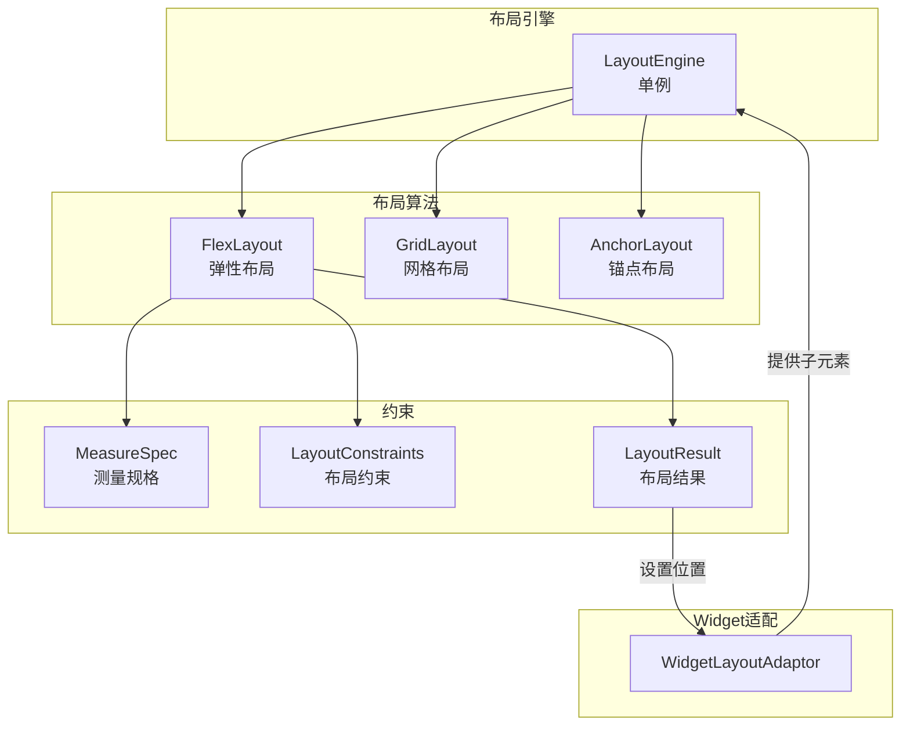
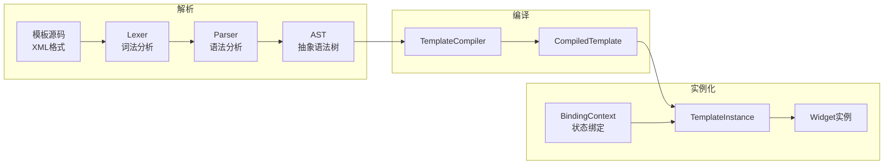
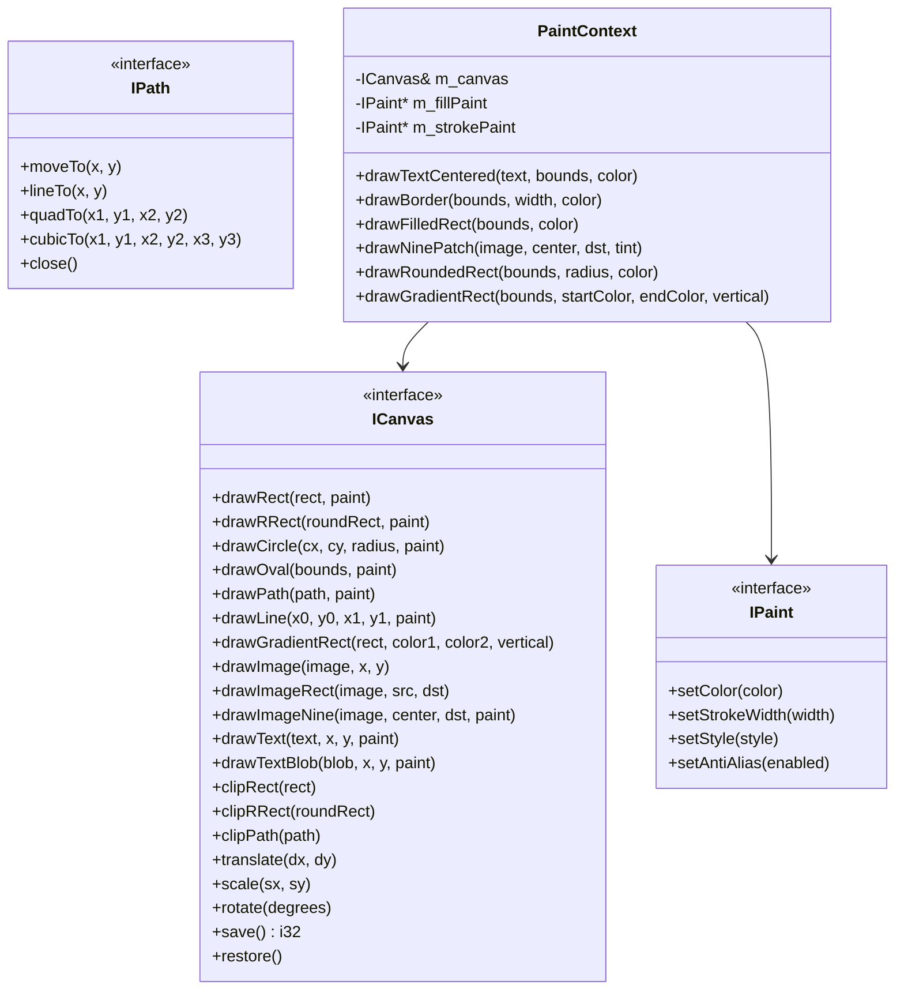
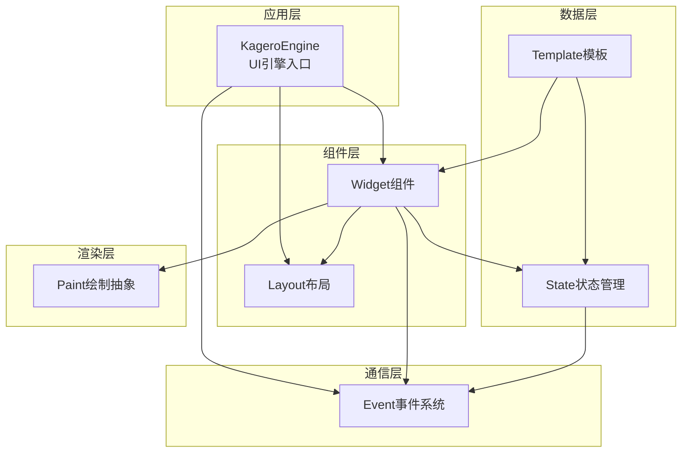
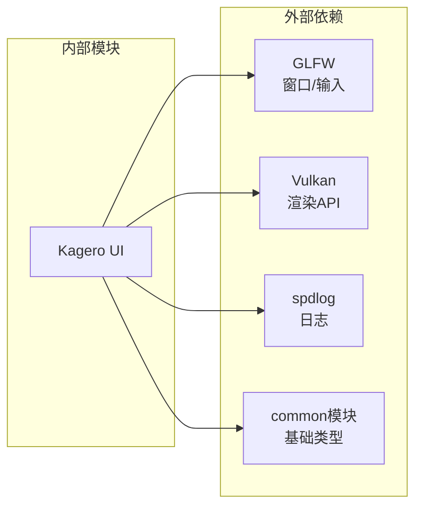

# Kagero UI 引擎

**Kagero**（陽炎，かげろう）是 Minecraft Reborn 项目的现代化 UI 引擎，采用声明式模板、响应式状态管理和组件化架构。

## 目录结构

```
kagero/
├── Types.hpp                    # 基础类型定义（Rect, Margin, Padding, Anchor等）
├── KageroEngine.hpp/cpp         # UI引擎核心类，统一管理所有UI组件
├── README.md                    # 本文档
│
├── event/                       # 事件系统
│   ├── Event.hpp                # 事件基类、EventType枚举、SimpleEvent模板
│   ├── EventBus.hpp             # 事件总线，支持订阅/发布、优先级、过滤
│   ├── InputEvents.hpp          # 输入事件（鼠标、键盘）
│   ├── UIEvents.hpp             # UI事件（焦点、屏幕切换）
│   └── WidgetEvents.hpp         # Widget事件（值变化、按钮点击、滑动条等）
│
├── state/                       # 状态管理
│   ├── ReactiveState.hpp        # 响应式状态包装器（Reactive<T>）、Computed<T>、Binding<T>
│   ├── StateStore.hpp           # 全局状态存储，支持订阅、中间件、批量更新
│   ├── StateBinding.hpp         # 状态绑定工具、StateScope、StateContext
│   └── StateObserver.hpp        # 观察者辅助类
│
├── widget/                      # Widget组件
│   ├── Widget.hpp               # Widget基类，所有UI组件的基类
│   ├── IWidgetContainer.hpp     # 容器接口，CRTP模板
│   ├── ContainerWidget.hpp/cpp  # 通用容器组件
│   ├── ButtonWidget.hpp         # 按钮组件（ButtonWidget, ImageButtonWidget）
│   ├── TextWidget.hpp           # 文本显示组件
│   ├── RichTextWidget.hpp       # 富文本组件，支持ITextComponent渲染
│   ├── TextFieldWidget.hpp      # 文本输入框组件
│   ├── CheckboxWidget.hpp       # 复选框组件
│   ├── SliderWidget.hpp         # 滑动条组件
│   ├── ListWidget.hpp           # 列表组件
│   ├── ScrollableWidget.hpp     # 可滚动容器组件
│   ├── SlotWidget.hpp           # 物品槽组件（用于背包等）
│   ├── Viewport3DWidget.hpp     # 3D视口组件（用于物品预览等）
│   └── PaintContext.hpp/cpp     # 绘图上下文，封装ICanvas操作
│
├── layout/                      # 布局系统
│   ├── LayoutSystem.hpp         # 布局系统统一入口
│   ├── core/
│   │   ├── MeasureSpec.hpp      # 测量规格（UNSPECIFIED, EXACTLY, AT_MOST）
│   │   ├── LayoutResult.hpp     # 布局结果（位置、尺寸、FlexItem配置）
│   │   └── LayoutEngine.hpp/cpp # 布局引擎，支持Flex/Grid/Anchor布局
│   ├── constraints/
│   │   └── LayoutConstraints.hpp # 布局约束（最小/最大尺寸）
│   ├── algorithms/
│   │   ├── FlexLayout.hpp/cpp   # 弹性布局算法（类似CSS Flexbox）
│   │   ├── GridLayout.hpp/cpp   # 网格布局算法
│   │   └── AnchorLayout.hpp/cpp # 锚点布局算法
│   └── integration/
│       └── WidgetLayoutAdaptor.hpp/cpp # Widget适配器，连接Widget和布局引擎
│
├── template/                    # 模板系统
│   ├── Template.hpp             # 模板入口文件
│   ├── TemplateSystem.hpp/cpp   # 模板系统初始化/关闭
│   ├── core/
│   │   ├── TemplateConfig.hpp   # 模板配置（版本、特性开关）
│   │   └── TemplateError.hpp    # 模板错误类型
│   ├── parser/
│   │   ├── Lexer.hpp/cpp        # 词法分析器
│   │   ├── Parser.hpp/cpp       # 语法分析器
│   │   ├── Ast.hpp/cpp          # 抽象语法树定义
│   │   └── AstVisitor.hpp/cpp   # AST访问者模式
│   ├── compiler/
│   │   └── TemplateCompiler.hpp/cpp # 模板编译器（AST -> 可执行模板）
│   ├── binder/
│   │   └── BindingContext.hpp/cpp   # 绑定上下文（状态绑定、事件回调）
│   ├── runtime/
│   │   ├── TemplateInstance.hpp/cpp # 模板实例化运行时
│   │   └── UpdateScheduler.hpp/cpp  # 更新调度器（批量更新、防抖）
│   └── bindings/
│       ├── BuiltinWidgets.hpp/cpp   # 内置Widget工厂
│       └── BuiltinEvents.hpp/cpp    # 内置事件绑定器
│
├── paint/                       # 绘制抽象层
│   ├── Color.hpp                # 颜色定义和工具函数
│   ├── Geometry.hpp/cpp         # 几何类型（Rect, RRect, Point, Size, Matrix）
│   ├── PaintContext.hpp/cpp     # 绘图上下文（封装ICanvas）
│   ├── TextureImage.hpp/cpp     # 纹理图像封装
│   └── contracts/
│       ├── ICanvas.hpp          # 画布接口（绘图操作）
│       ├── IPaint.hpp           # 画笔接口（样式配置）
│       ├── IPath.hpp            # 路径接口（矢量图形）
│       ├── IImage.hpp           # 图像接口
│       ├── ISurface.hpp         # 绘图表面接口
│       ├── ITypeface.hpp        # 字体接口
│       └── ITextBlob.hpp        # 文本块接口
│
└── docs/                        # 文档目录
    ├── README.md                # 文档索引
    ├── 01-quick-start.md        # 快速开始
    ├── 02-template-system.md    # 模板系统详解
    ├── 03-state-system.md       # 状态系统详解
    ├── 04-event-system.md       # 事件系统详解
    └── 05-built-in-widgets.md   # 内置组件详解
```

## 核心模块详解

### 1. Widget 组件系统 (`widget/`)

Widget 是所有 UI 组件的基类，提供：



**内置组件列表：**

| 组件 | 文件 | 说明 |
|------|------|------|
| `ButtonWidget` | `ButtonWidget.hpp` | 标准按钮，支持文本、图标、禁用状态 |
| `ImageButtonWidget` | `ButtonWidget.hpp` | 图片按钮，使用纹理渲染 |
| `TextWidget` | `TextWidget.hpp` | 文本显示，支持多行、对齐 |
| `RichTextWidget` | `RichTextWidget.hpp` | 富文本显示，支持颜色、样式、点击/悬停事件 |
| `TextFieldWidget` | `TextFieldWidget.hpp` | 文本输入，支持选择、复制粘贴 |
| `CheckboxWidget` | `CheckboxWidget.hpp` | 复选框，支持选中状态 |
| `SliderWidget` | `SliderWidget.hpp` | 滑动条，支持范围选择 |
| `ListWidget` | `ListWidget.hpp` | 列表容器，支持动态添加子项 |
| `ScrollableWidget` | `ScrollableWidget.hpp` | 可滚动容器，支持水平和垂直滚动 |
| `SlotWidget` | `SlotWidget.hpp` | 物品槽（用于背包界面） |
| `Viewport3DWidget` | `Viewport3DWidget.hpp` | 3D视口（用于物品预览） |
| `ContainerWidget` | `ContainerWidget.hpp` | 通用容器组件 |

### 2. 事件系统 (`event/`)

事件系统采用发布-订阅模式，支持类型安全的事件处理。



**事件类型枚举：**

```cpp
enum class EventType : u32 {
    // 鼠标事件 (1-7)
    MouseClick = 1, MouseRelease = 2, MouseDrag = 3,
    MouseScroll = 4, MouseMove = 5, MouseEnter = 6, MouseLeave = 7,

    // 键盘事件 (10-13)
    KeyPress = 10, KeyRelease = 11, KeyRepeat = 12, CharInput = 13,

    // 焦点事件 (20-21)
    FocusGained = 20, FocusLost = 21,

    // 值变化事件 (30-31)
    ValueChange = 30, TextChange = 31,

    // Widget事件 (40-45)
    WidgetInit = 40, WidgetResize = 41, WidgetShow = 42,
    WidgetHide = 43, WidgetEnable = 44, WidgetDisable = 45,

    // 自定义事件
    Custom = 1000
};
```

**使用示例：**

```cpp
// 订阅事件
auto id = EventBus::instance().subscribe<MouseClickEvent>(
    [](const MouseClickEvent& e) {
        std::cout << "Click at (" << e.x() << ", " << e.y() << ")" << std::endl;
    },
    100  // 优先级
);

// 发布事件
EventBus::instance().publish(MouseClickEvent(100, 200, 0));

// 取消订阅
EventBus::instance().unsubscribe(id);

// RAII自动取消订阅
{
    EventSubscription<MouseClickEvent> subscription([](const MouseClickEvent& e) {
        // 处理事件
    });
    // 离开作用域自动取消订阅
}
```

### 3. 状态管理系统 (`state/`)

状态管理系统提供响应式数据绑定能力。



**StateStore 使用示例：**

```cpp
auto& store = StateStore::instance();

// 设置状态
store.set("player.health", 100);
store.set("player.name", String("Steve"));

// 获取状态
i32 health = store.get<i32>("player.health", 0);
String name = store.get<String>("player.name", "");

// 订阅变化
u64 id = store.subscribe("player.health", []() {
    i32 h = StateStore::instance().get<i32>("player.health");
    std::cout << "Health changed to " << h << std::endl;
});

// 批量更新（只触发一次通知）
store.batchUpdate([](StateStore& s) {
    s.set("player.health", 90);
    s.set("player.mana", 50);
    s.set("player.stamina", 100);
});
```

**Reactive 使用示例：**

```cpp
// 创建响应式状态
Reactive<i32> count(0);

// 添加观察者
auto observerId = count.observe([](i32 oldValue, i32 newValue) {
    std::cout << "Count changed from " << oldValue << " to " << newValue << std::endl;
});

// 修改值（触发观察者）
count.set(10);  // 输出: Count changed from 0 to 10
count.set(10);  // 不输出（值相同）

// 双向绑定到 StateStore
auto binding = binding::bindReactive(count, "player.count");
```

### 4. 布局系统 (`layout/`)

布局系统采用类似 CSS Flexbox 的设计，支持多种布局算法。



**Flex布局配置：**

```cpp
FlexConfig config;
config.direction = Direction::Row;           // 主轴方向
config.justifyContent = JustifyContent::Center; // 主轴对齐
config.alignItems = Align::Center;           // 交叉轴对齐
config.wrap = Wrap::Wrap;                    // 换行方式
config.gap = 10;                             // 间距

// 快捷配置
auto centerRow = centerRowFlexConfig();      // 水平居中
auto centerColumn = centerColumnFlexConfig(); // 垂直居中
auto spaceBetween = spaceBetweenFlexConfig(); // 两端对齐
```

**布局执行：**

```cpp
auto& engine = LayoutEngine::instance();

// 使用Flex布局
engine.layoutFlex(containerAdaptor, Rect(0, 0, 800, 600), config);

// 使用指定算法布局
engine.layoutWith("flex", containerAdaptor, Rect(0, 0, 800, 600));

// 增量布局（只处理dirty节点）
engine.layoutDirty(rootAdaptor);
```

### 5. 模板系统 (`template/`)

模板系统支持声明式UI定义，采用编译时验证。



**模板语法示例：**

```xml
<screen id="main" width="800" height="600">
    <text id="title" x="300" y="50" text="Hello Kagero!"/>
    <button id="btn_start" x="300" y="200" width="200" height="40"
            text="Start Game" on:click="onStart"/>
    <text id="score" bind:text="player.score"/>
    <container id="inventory" for:item="item in player.inventory.items">
        <slot id="$item.slot" bind:item="$item"/>
    </container>
</screen>
```

**编译和实例化：**

```cpp
// 初始化模板系统
tpl::initializeTemplateSystem();

// 编译模板
tpl::compiler::TemplateCompiler compiler;
auto compiled = compiler.compile(templateSource);

// 创建绑定上下文
state::StateStore& store = state::StateStore::instance();
event::EventBus& eventBus = event::EventBus::instance();
tpl::binder::BindingContext ctx(store, eventBus);

// 注册回调
ctx.exposeCallback("onStart", [](widget::Widget* w, const event::Event& e) {
    std::cout << "Start button clicked!" << std::endl;
});

// 实例化模板
tpl::runtime::TemplateInstance instance(compiled.get(), ctx);
instance.registerDefaultFactories();
auto root = instance.instantiate();

// 关闭模板系统
tpl::shutdownTemplateSystem();
```

### 6. 绘制抽象层 (`paint/`)

绘制抽象层提供平台无关的绘图接口，设计参考 Chromium Skia。



## 整体架构



## 输入输出

### 输入

| 输入类型 | 来源 | 说明 |
|----------|------|------|
| 用户输入 | GLFW | 鼠标、键盘事件 |
| 状态数据 | StateStore | 全局状态、响应式数据 |
| 模板源码 | XML字符串 | 声明式UI定义 |
| 资源文件 | TextureAtlas | 图像、字体资源 |

### 输出

| 输出类型 | 目标 | 说明 |
|----------|------|------|
| 渲染指令 | ICanvas | 绘图操作 |
| 事件通知 | EventBus | 状态变化、用户交互 |
| Widget树 | 内存 | 实例化的组件树 |

## 依赖关系



**依赖项：**

- `common/core/Types.hpp` - 基础类型定义（i32, u32, String等）
- `common/core/Result.hpp` - 错误处理
- `client/ui/Glyph.hpp` - 字形渲染
- `client/renderer/api/` - 渲染抽象接口

## 使用方法

### 1. 初始化引擎

```cpp
#include "client/ui/kagero/KageroEngine.hpp"
#include "client/ui/kagero/template/TemplateSystem.hpp"
#include "client/ui/kagero/layout/LayoutSystem.hpp"

using namespace mc::client::ui::kagero;

// 初始化模板系统
tpl::initializeTemplateSystem();

// 初始化布局系统
layout::initLayoutSystem();

// 创建引擎
auto engine = std::make_unique<KageroEngine>();
engine->initialize(*canvas, {1920, 1080});
```

### 2. 创建简单界面

```cpp
// 创建容器
auto container = std::make_unique<ContainerWidget>("main");
container->setBounds(Rect(0, 0, 800, 600));

// 添加按钮
auto button = std::make_unique<ButtonWidget>(
    "btn_submit",
    300, 250, 200, 40,
    "Submit",
    [](ButtonWidget& btn) {
        std::cout << "Button clicked!" << std::endl;
    }
);
container->addChild(std::move(button));

// 添加到引擎
engine->addLayer(std::move(container), 0);
```

### 3. 使用模板系统

```cpp
const char* templateSource = R"(
    <screen id="menu" width="800" height="600">
        <text id="title" x="300" y="50" text="Main Menu"/>
        <button id="btn_play" x="300" y="200" width="200" height="40"
                text="Play" on:click="onPlay"/>
        <button id="btn_quit" x="300" y="260" width="200" height="40"
                text="Quit" on:click="onQuit"/>
    </screen>
)";

tpl::compiler::TemplateCompiler compiler;
auto compiled = compiler.compile(templateSource);

state::StateStore& store = state::StateStore::instance();
event::EventBus& eventBus = event::EventBus::instance();
tpl::binder::BindingContext ctx(store, eventBus);

ctx.exposeCallback("onPlay", [](widget::Widget*, const event::Event&) {
    // 开始游戏
});

ctx.exposeCallback("onQuit", [](widget::Widget*, const event::Event&) {
    // 退出游戏
});

tpl::runtime::TemplateInstance instance(compiled.get(), ctx);
instance.registerDefaultFactories();
auto root = instance.instantiate();
```

### 4. 主循环渲染

```cpp
while (running) {
    f32 deltaTime = timer.getDeltaTime();

    // 更新UI
    engine->update(deltaTime);

    // 处理输入
    processInput();

    // 渲染UI
    engine->render();
}
```

### 5. 清理资源

```cpp
engine.reset();
tpl::shutdownTemplateSystem();
```

## 容易踩的坑

### 1. EventBus 线程安全

```cpp
// 错误：在多线程中直接操作EventBus
std::thread t([]() {
    EventBus::instance().publish(event);  // 可能导致竞态条件
});

// 正确：EventBus是线程安全的，但要注意回调中的数据竞争
EventBus::instance().subscribe<MouseClickEvent>([](const MouseClickEvent& e) {
    // 回调可能在任意线程执行，需要保护共享数据
    std::lock_guard<std::mutex> lock(sharedDataMutex);
    sharedData.clickCount++;
});
```

### 2. Reactive 循环依赖

```cpp
// 错误：双向绑定可能导致无限循环
Reactive<i32> a(0);
Reactive<i32> b(0);

a.observe([&b](i32, i32 newVal) { b.set(newVal); });  // a -> b
b.observe([&a](i32, i32 newVal) { a.set(newVal); });  // b -> a
// 这会导致无限递归！

// 正确：使用值比较避免循环
a.observe([&b](i32 oldVal, i32 newVal) {
    if (b.get() != newVal) b.set(newVal);
});
b.observe([&a](i32 oldVal, i32 newVal) {
    if (a.get() != newVal) a.set(newVal);
});

// 或使用 binding::bindReactive 自动处理
binding::bindReactive(a, "shared.a");
binding::bindReactive(b, "shared.b");
```

### 3. Widget 生命周期

```cpp
// 错误：在回调中捕获Widget的裸指针，Widget可能已被销毁
button->setOnPress([buttonPtr]() {
    buttonPtr->setText("Clicked");  // 悬空指针！
});

// 正确：使用智能指针或确保生命周期
auto button = std::make_shared<ButtonWidget>(...);
button->setOnPress([weakButton = std::weak_ptr(button)]() {
    if (auto btn = weakButton.lock()) {
        btn->setText("Clicked");
    }
});
```

### 4. 布局时机

```cpp
// 错误：在Widget添加到容器前就获取布局结果
auto container = std::make_unique<ContainerWidget>();
container->addChild(button);
i32 width = button->width();  // 可能还是0！

// 正确：添加后手动触发布局，或使用布局引擎
container->addChild(button);
layout::LayoutEngine::instance().layout(adaptor, Rect(0, 0, 800, 600));
i32 width = button->width();  // 现在是正确的
```

### 5. 模板绑定路径错误

```cpp
// 错误：绑定路径不存在
// bind:text="player.nonexistent.field"
// 运行时会静默失败

// 正确：确保StateStore中有对应的键
store.set("player.name", String("Steve"));
// bind:text="player.name"
```

### 6. 状态批量更新

```cpp
// 错误：多次单独更新，触发多次重绘
store.set("player.health", 90);
store.set("player.mana", 50);
store.set("player.stamina", 100);
// 触发3次订阅者回调，可能导致3次重绘

// 正确：使用批量更新
store.batchUpdate([](StateStore& s) {
    s.set("player.health", 90);
    s.set("player.mana", 50);
    s.set("player.stamina", 100);
});
// 只触发1次回调
```

## 测试用例

测试文件位于 `tests/ui/kagero/` 目录：

| 测试文件 | 测试内容 |
|----------|----------|
| `event/event_test.cpp` | 事件系统测试（1200+行） |
| `template/template_test.cpp` | 模板系统测试 |

**事件系统测试覆盖：**

- `EventType` 枚举值验证
- `Event` 基类功能（取消、时间戳、冒泡、目标）
- 输入事件（鼠标点击、释放、拖动、滚动、移动、进入、离开）
- 键盘事件（按键、释放、重复、修饰键）
- 字符输入事件（Unicode、UTF-8转换）
- UI事件（焦点、Widget生命周期）
- Widget事件（值变化、文本变化、按钮点击、滑动条、复选框、选择、槽点击）
- `EventBus` 功能（订阅、取消订阅、优先级、取消事件、过滤器）
- `EventSubscription` RAII（自动取消订阅、移动语义）
- 线程安全性测试（并发发布、并发订阅/取消订阅）
- 自定义事件测试

## 参考资料

本项目参考了以下资源：

- Minecraft 1.16.5 `net.minecraft.client.gui.widget` - Widget系统设计
- CSS Flexbox 规范 - Flex布局算法
- React/Vue - 响应式状态管理理念
- Chromium Skia - 绘制抽象接口设计

## 版本信息

- **版本**: 1.0.0
- **命名空间**: `mc::client::ui::kagero`
- **C++ 标准**: C++17
- **许可证**: 与项目主许可证一致
