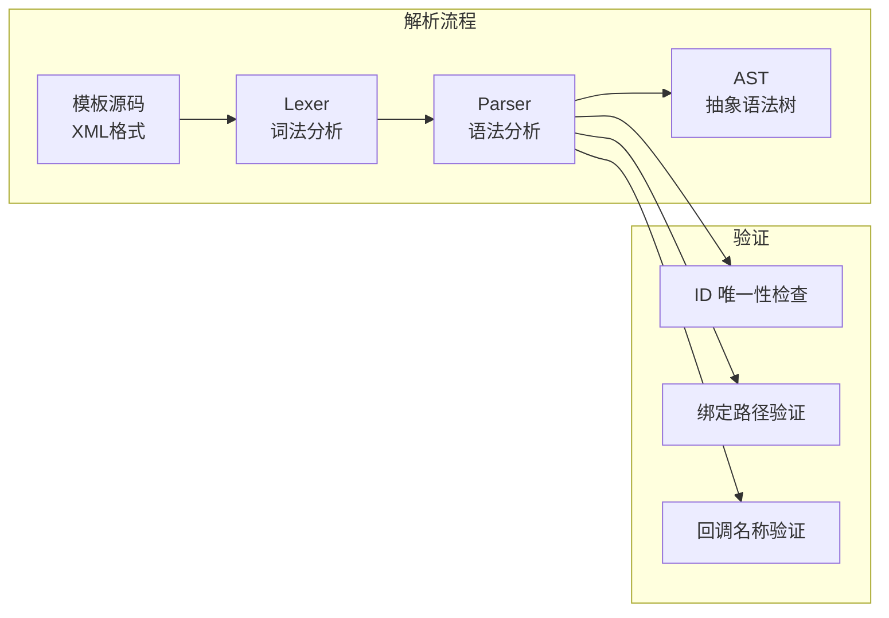
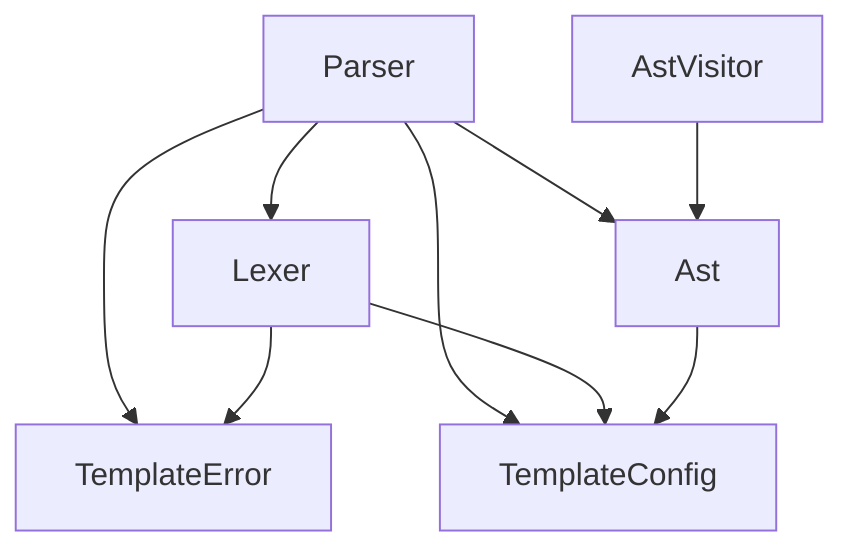

# Kagero 模板解析器

本目录包含 Kagero UI 引擎的模板解析器组件，负责将声明式模板文本解析为抽象语法树（AST）。

## 目录结构

```
parser/
├── Lexer.hpp/cpp    # 词法分析器，将源码分解为 Token 流
├── Parser.hpp/cpp   # 语法分析器，将 Token 流解析为 AST
├── Ast.hpp/cpp      # 抽象语法树节点定义
└── AstVisitor.hpp/cpp # AST 访问者模式和遍历工具
```

## 文件介绍

### Lexer.hpp/cpp

词法分析器，负责将模板源码字符串分解为 Token 序列。

**主要功能：**
- 扫描 XML 风格的标签语法（`<tag>`, `</tag>`, `<tag/>`）
- 识别属性绑定语法（`bind:xxx`, `on:xxx`, `for:xxx`, `if:xxx`）
- 处理字符串字面量、标识符、数字
- 支持注释解析（`<!-- ... -->`）
- 提供位置信息追踪（行号、列号、偏移量）

**Token 类型：**
- `OpenTag`, `CloseTag`, `SelfCloseTag` - 标签结构
- `OpenCloseTag` - 闭合标签开始（`</`）
- `Identifier`, `StringLiteral`, `NumberLiteral` - 内容
- `Equals`, `Colon` - 分隔符
- `Text`, `Comment` - 内容
- `Whitespace`, `Newline` - 空白
- `EndOfFile`, `Error` - 特殊标记

### Parser.hpp/cpp

语法分析器，将 Token 流解析为 AST 文档节点。

**主要功能：**
- 递归下降解析算法
- 支持嵌套元素解析
- 属性分类（静态、绑定、事件）
- 指令提取（循环、条件）
- 语义验证（ID 唯一性、绑定路径、回调名称）

**验证功能：**
- **ID 唯一性检查**：解析过程中收集所有 ID，检测重复并报告 `DuplicateId` 错误
- 绑定路径格式验证
- 回调名称格式验证
- 严格模式下的内联表达式检查

**错误收集模式：**
- 不抛出异常，收集所有错误
- 支持错误恢复继续解析
- 提供完整的错误位置信息

### Ast.hpp/cpp

抽象语法树节点定义。

**节点类型：**
- `DocumentNode` - 文档根节点
- `ElementNode` - 元素节点（标签）
- `TextNode` - 文本内容节点
- `CommentNode` - 注释节点

**属性类型：**
- `Static` - 静态属性（`attr="value"`）
- `Binding` - 绑定属性（`bind:attr="path"`）
- `Event` - 事件属性（`on:click="callback"`）
- `Loop` - 循环指令（`for:item="item in items"`）
- `Condition` - 条件指令（`if:condition="path"`）

### AstVisitor.hpp/cpp

AST 访问者模式和遍历工具。

**访问者基类：**
- `AstVisitor` - 可变访问者
- `ConstAstVisitor` - 只读访问者

**遍历工具（traversal 命名空间）：**
- `preorder()` - 前序遍历
- `postorder()` - 后序遍历
- `levelOrder()` - 层序遍历（广度优先）
- `findFirst()` - 查找第一个匹配节点
- `findAll()` - 查找所有匹配节点
- `findById()` - 通过 ID 查找元素
- `findByTagName()` - 通过标签名查找元素
- `getDepth()` - 获取节点深度
- `countNodes()` - 统计节点数量

## 模块关系



## 使用示例

### 基本解析

```cpp
#include "client/ui/kagero/template/parser/Lexer.hpp"
#include "client/ui/kagero/template/parser/Parser.hpp"
#include "client/ui/kagero/template/core/TemplateConfig.hpp"

using namespace mc::client::ui::kagero::tpl;

// 词法分析
parser::Lexer lexer(R"(
    <screen id="main">
        <text id="title" bind:text="player.name"/>
        <button id="submit" on:click="handleSubmit"/>
    </screen>
)", "<template>");

if (!lexer.tokenize()) {
    // 处理词法错误
    for (const auto& error : lexer.errors()) {
        std::cerr << error.format() << std::endl;
    }
    return;
}

// 语法分析
parser::Parser parser(lexer, core::TemplateConfig::defaults());
auto document = parser.parse();

if (parser.hasErrors()) {
    // 处理语法错误（包括重复 ID）
    for (const auto& error : parser.errors()) {
        std::cerr << error.format() << std::endl;
    }
    return;
}

// 使用 AST
if (auto* root = document->rootElement()) {
    std::cout << "Root element: " << root->tagName << std::endl;
    std::cout << "Root ID: " << root->id << std::endl;
}
```

### AST 遍历

```cpp
#include "client/ui/kagero/template/parser/AstVisitor.hpp"

// 使用访问者模式遍历
class IdCollector : public parser::ConstAstVisitor {
public:
    void visitElement(const parser::ElementNode& element) override {
        if (!element.id.empty()) {
            m_ids.push_back(element.id);
        }
        traverseChildren(element);
    }
    
    const std::vector<std::string>& getIds() const { return m_ids; }
    
private:
    std::vector<std::string> m_ids;
};

IdCollector collector;
collector.visit(*document);
for (const auto& id : collector.getIds()) {
    std::cout << "Found ID: " << id << std::endl;
}

// 或使用 traversal 工具
parser::traversal::preorderConst(*document, [](const parser::Node& node) {
    if (auto* elem = dynamic_cast<const parser::ElementNode*>(&node)) {
        std::cout << "Element: " << elem->tagName;
        if (!elem->id.empty()) {
            std::cout << " (id: " << elem->id << ")";
        }
        std::cout << std::endl;
    }
    return true; // 继续遍历
});
```

## 错误处理

### 错误类型

定义在 `core/TemplateError.hpp` 中：

```cpp
enum class TemplateErrorType : u8 {
    // 词法错误
    LexerError = 1,
    UnexpectedCharacter,
    UnterminatedString,
    InvalidEscapeSequence,

    // 语法错误
    ParserError = 10,
    UnexpectedToken,
    MissingClosingTag,
    MismatchedClosingTag,

    // 语义错误
    SemanticError = 20,
    UnknownTag,
    UnknownAttribute,
    DuplicateId,          // ID 重复
    InvalidBindingPath,
    InvalidCallbackName,

    // 编译错误
    CompileError = 30,
    // ...

    // 运行时错误
    RuntimeError = 40,
    // ...
};
```

### ID 唯一性检查

解析器在解析过程中自动检测重复 ID：

```cpp
// 模板中有重复 ID
parser::Lexer lexer(R"(
    <screen>
        <text id="duplicate"/>
        <text id="duplicate"/>
    </screen>
)", "<test>");
lexer.tokenize();

parser::Parser parser(lexer, core::TemplateConfig::defaults());
auto doc = parser.parse();

// parser.hasErrors() 返回 true
// parser.errors()[0].type == TemplateErrorType::DuplicateId
// parser.errors()[0].message 包含 "Duplicate ID: 'duplicate'"
```

## 测试用例

测试文件位于 `tests/ui/kagero/template/template_test.cpp`。

**Parser 测试覆盖：**
- 简单元素解析
- 属性解析（静态、绑定、事件）
- 嵌套元素
- 文本内容
- 注释解析
- 循环/条件指令提取
- ID 唯一性检查（9 个测试用例）
- 错误处理（缺失闭合标签、不匹配闭合标签等）

## 依赖关系



**依赖项：**
- `core/TemplateConfig.hpp` - 配置选项
- `core/TemplateError.hpp` - 错误类型定义
- 标准库：`<string>`, `<vector>`, `<map>`, `<memory>`, `<optional>`, `<unordered_set>`

## 容易踩的坑

### 1. ID 唯一性检查时机

ID 唯一性检查在 `validateElement()` 中进行，该方法在每个元素解析完成后调用。这意味着：
- 重复 ID 错误会立即被检测
- 解析过程不会因重复 ID 而中断
- 可以收集多个重复 ID 错误

### 2. 属性分类需要手动调用

元素解析完成后，需要调用 `categorizeAttributes()` 将属性分类到 `staticAttrs`、`bindingAttrs`、`eventAttrs`：

```cpp
element->categorizeAttributes(); // 必须手动调用
```

### 3. 绑定路径解析

绑定路径 `$item.field` 会被解析为：
- `isLoopVariable = true`
- `loopVarName = "item"`
- `property = "field"`

而 `player.name` 会被解析为：
- `isLoopVariable = false`
- `path = "player.name"`

### 4. 错误恢复

解析器使用 `synchronize()` 方法从错误中恢复：
- 跳过 Token 直到找到同步点（`<`, `</`, EOF）
- 允许继续解析并收集更多错误

### 5. Token 类型检查

检查 Token 类型时，注意 `bind:`、`on:` 等前缀是标识符的一部分，不是单独的 Token：

```cpp
// 错误！bind: 是标识符的一部分
if (check(TokenType::Colon)) { ... }

// 正确！在属性名中检查前缀
if (attr.name.substr(0, 5) == "bind:") { ... }
```

## 版本信息

- **版本**: 1.0.0
- **命名空间**: `mc::client::ui::kagero::tpl::parser`
- **C++ 标准**: C++20
