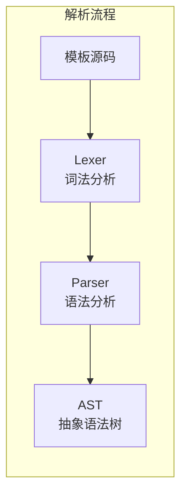

# Kagero 模板解析器

本目录包含 Kagero UI 引擎的模板解析器组件，负责将声明式模板文本解析为抽象语法树（AST）。

## 目录结构

```
parser/
├── Lexer.hpp/cpp       # 词法分析器，将源码分解为 Token 流
├── Parser.hpp/cpp      # 语法分析器，将 Token 流解析为 AST
├── Ast.hpp/cpp         # 抽象语法树节点定义
└── AstVisitor.hpp/cpp  # AST 访问者模式和遍历工具
```

## 内部模块关系



## 上下游外部依赖关系

**上游依赖（本模块依赖）：**
- `core/TemplateConfig.hpp` - 配置选项
- `core/TemplateError.hpp` - 错误类型定义
- 标准库：`<string>`, `<vector>`, `<map>`, `<memory>`, `<optional>`, `<unordered_set>`

**下游依赖（依赖本模块）：**
- `compiler/TemplateCompiler.hpp` - 使用 Parser 解析模板后进行编译

## 容易踩的坑

### 1. ID 唯一性检查时机

ID 唯一性检查在 `_validateElement()` 中进行，每个元素解析完成后立即调用。重复 ID 错误会立即被检测，但解析过程不会因此中断，可以收集多个重复 ID 错误。

### 2. 属性分类需要手动调用

元素解析完成后，需要调用 `categorizeAttributes()` 将属性分类到 `staticAttrs`、`bindingAttrs`、`eventAttrs`：

```cpp
element->categorizeAttributes(); // 必须手动调用
```

### 3. 绑定路径解析

绑定路径 `$item.field` 会被解析为 `isLoopVariable = true`，而 `player.name` 会被解析为 `isLoopVariable = false`。

### 4. 错误恢复

解析器使用 `_synchronize()` 方法从错误中恢复：跳过 Token 直到找到同步点（`<`, `</`, EOF），允许继续解析并收集更多错误。

### 5. Token 类型检查

检查 Token 类型时，注意 `bind:`、`on:` 等前缀是标识符的一部分，不是单独的 Token。应该在属性名中检查前缀，而不是检查 `TokenType::Colon`。
