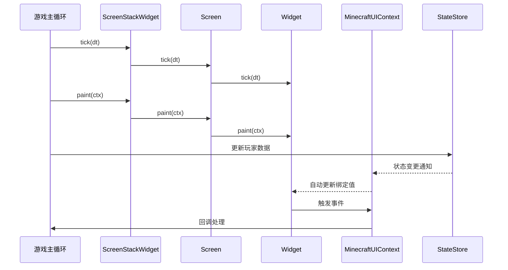
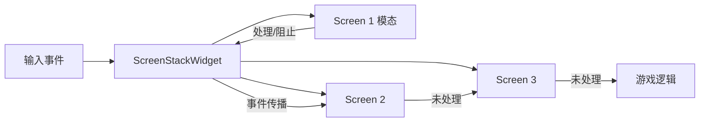
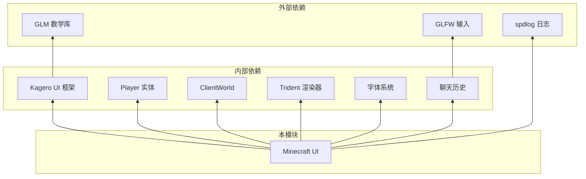

# Minecraft UI 模块

Minecraft 游戏特定的 UI 组件和屏幕实现，基于 Kagero UI 框架构建。

## 目录结构

```
minecraft/
├── MinecraftUIContext.hpp/cpp     # UI 上下文，状态绑定和资源管理
├── resources/                     # UI 资源
│   ├── MinecraftTypeface.hpp/cpp  # Minecraft 字体封装
│   └── ResourceProvider.hpp/cpp   # GUI 资源提供者（纹理图集等）
├── screens/                       # 屏幕/界面
│   ├── Screen.hpp/cpp             # 屏幕基类
│   ├── ScreenManager.hpp/cpp      # 屏幕栈管理
│   ├── MainMenuScreen.hpp/cpp     # 主菜单
│   ├── OptionsScreen.hpp/cpp      # 设置界面
│   ├── PauseScreen.hpp/cpp        # 暂停菜单
│   ├── InventoryScreen.hpp/cpp    # 物品栏界面
│   ├── ContainerScreen.hpp/cpp    # 容器界面
│   └── DebugScreenWidget.hpp/cpp  # F3 调试屏幕
├── widgets/                       # UI 控件
│   ├── HudWidget.hpp/cpp          # HUD 主控件（生命值、饥饿值等）
│   ├── HotbarWidget.hpp/cpp       # 快捷栏
│   ├── HealthBarWidget.hpp/cpp    # 生命值条
│   ├── HungerBarWidget.hpp/cpp    # 饥饿值条
│   ├── ExperienceBar.hpp/cpp      # 经验条
│   ├── ChatWidget.hpp/cpp         # 聊天框
│   ├── CrosshairWidget.hpp/cpp    # 准星
│   ├── SlotWidget.hpp/cpp         # 物品槽基类
│   ├── InventorySlot.hpp/cpp      # 物品栏槽位
│   ├── ScreenStackWidget.hpp/cpp  # 屏幕栈控件
│   └── Viewport3DWidget.hpp/cpp   # 3D 视口控件
└── templates/                     # UI 模板文件
    ├── main_menu.tpl              # 主菜单模板
    ├── options.tpl                # 设置界面模板
    ├── pause_menu.tpl             # 暂停菜单模板
    └── inventory.tpl              # 物品栏模板
```

## 架构概览

```mermaid
graph TB
    subgraph "UI 框架层 Kagero"
        KW[Widget 基类]
        KE[EventBus 事件总线]
        KS[StateStore 状态存储]
        KT[TemplateCompiler 模板编译器]
    end

    subgraph "Minecraft UI 模块"
        subgraph "核心"
            MUC[MinecraftUIContext]
            RP[ResourceProvider]
            MT[MinecraftTypeface]
        end

        subgraph "屏幕系统"
            SM[ScreenManager]
            Screen[Screen 基类]
            MMS[MainMenuScreen]
            OPS[OptionsScreen]
            PS[PauseScreen]
            IS[InventoryScreen]
            CS[ContainerScreen]
            DSW[DebugScreenWidget]
        end

        subgraph "Widget 系统"
            HUD[HudWidget]
            HW[HotbarWidget]
            HBW[HealthBarWidget]
            HGW[HungerBarWidget]
            XP[ExperienceBar]
            CW[ChatWidget]
            XR[CrosshairWidget]
            SW[SlotWidget]
            InS[InventorySlot]
            SSW[ScreenStackWidget]
            V3D[Viewport3DWidget]
        end
    end

    subgraph "模板系统"
        TPL[.tpl 模板文件]
    end

    KW --> Screen
    KW --> HUD
    Screen --> MMS
    Screen --> OPS
    Screen --> PS
    Screen --> IS
    Screen --> CS
    Screen --> DSW
    SM --> Screen

    MUC --> RP
    MUC --> MT
    MUC --> KE
    MUC --> KS
    MUC --> KT

    TPL --> KT

    HUD --> HW
    HUD --> HBW
    HUD --> HGW
    HUD --> XP
```



## 模块职责

### 核心组件

#### MinecraftUIContext

UI 业务上下文，提供状态绑定和资源管理：

- **状态绑定**：暴露玩家数据（生命值、饥饿值、经验值、名称）到模板系统
- **事件绑定**：注册回调函数（关闭、点击槽位等）
- **资源管理**：管理字体和 GUI 渲染器引用
- **模板加载**：从 `.tpl` 文件创建屏幕实例

```cpp
// 创建 UI 上下文
MinecraftUIContext context(font, guiRenderer, stateStore, eventBus);

// 从模板创建屏幕
auto screen = context.createScreen("templates/main_menu.tpl");

// 访问绑定上下文
auto& binding = context.bindingContext();
binding.exposeWritable("player.health", &healthValue);
```

#### ResourceProvider

UI 资源提供者：

- 管理 GUI 纹理图集（`GuiTextureAtlas`）
- 提供字体引用
- 提供渲染器引用

#### MinecraftTypeface

Minecraft 字体封装，包装 `ITypeface` 接口。

### 屏幕系统

#### Screen（基类）

所有游戏屏幕的基类，继承自 `ContainerWidget`：

```cpp
class Screen : public ContainerWidget {
public:
    explicit Screen(String id);

    virtual void onOpen();      // 屏幕打开时调用
    virtual void onClose();     // 屏幕关闭时调用
    void paint(PaintContext& ctx) override;
    void updateHover(i32 mouseX, i32 mouseY);

    bool isModal() const;       // 是否为模态屏幕
    void setModal(bool modal);
};
```

#### ScreenManager

屏幕栈管理器，支持多个屏幕堆叠：

```cpp
ScreenManager manager;
manager.push(std::make_unique<PauseScreen>());  // 打开暂停菜单
manager.pop();                                    // 关闭当前屏幕
Screen* top = manager.top();                     // 获取顶部屏幕
manager.paint(ctx);                              // 绘制所有可见屏幕
manager.updateHover(mouseX, mouseY);             // 更新悬停状态
```

#### 具体屏幕实现

| 屏幕 | 职责 |
|------|------|
| `MainMenuScreen` | 主菜单界面（单人游戏、多人游戏、设置） |
| `OptionsScreen` | 游戏设置界面 |
| `PauseScreen` | 暂停菜单（继续、设置、退出） |
| `InventoryScreen` | 玩家物品栏界面 |
| `ContainerScreen` | 容器界面（箱子、熔炉等） |
| `DebugScreenWidget` | F3 调试屏幕（FPS、坐标、生物群系等） |

### Widget 系统

#### HudWidget

HUD 主控件，整合多个 HUD 元素：

```cpp
HudWidget hud;
hud.setPlayer(player);
hud.setGuiRenderer(gui);
hud.setItemRenderer(itemRenderer);
hud.setIconsAtlas(iconsAtlas);   // 心形、饥饿、盔甲图标
hud.setWidgetsAtlas(widgetsAtlas); // 快捷栏纹理
hud.paint(ctx);
```

渲染内容：
- 快捷栏（Hotbar）
- 生命值心形图标
- 盔甲值图标
- 饥饿值图标
- 经验条和等级数字

#### ChatWidget

聊天框控件：

```cpp
ChatWidget chat;
chat.setFont(&font);
chat.setGuiRenderer(&gui);
chat.setCommandCallback([](const String& msg) {
    // 处理聊天消息
});
chat.open();        // 打开聊天框
chat.open(true);    // 以命令模式打开（自动填入 /）
chat.tick(dt);      // 更新光标闪烁
chat.paint(ctx);    // 渲染消息和输入框
```

功能：
- 消息显示（带淡出效果）
- 文本输入和编辑
- 光标和选区支持
- 命令历史导航
- 快捷键（Ctrl+A 全选、方向键移动等）

#### CrosshairWidget

准星控件：

```cpp
CrosshairWidget crosshair;
crosshair.setColor(0xFFFFFFFF);  // 白色
crosshair.setSize(10.0f);        // 十字线长度
crosshair.setThickness(1.0f);    // 线宽
```

#### ScreenStackWidget

屏幕栈控件，同时支持新的 `Screen` Widget 和旧的 `IScreen` 接口：

```cpp
ScreenStackWidget stack;
stack.push(std::make_unique<MainMenuScreen>());      // 推入新 Screen
stack.pushIScreen(std::make_unique<OldScreen>());   // 推入旧 IScreen
stack.pop();                                          // 弹出栈顶
stack.paint(ctx);                                     // 绘制所有屏幕
stack.shouldPauseGame();                             // 检查是否暂停游戏
```

#### DebugScreenWidget

F3 调试屏幕，显示详细游戏信息：

```cpp
DebugScreenWidget debug;
debug.setCamera(&camera);
debug.setWorld(&world);
debug.setEntityManager(&entityManager);
debug.setNetworkClient(&networkClient);
debug.setPlayer(&player);
debug.setGpuInfo(gpuInfo);
debug.setTextWidthCallback([](const std::string& text) {
    return font->getTextWidth(text);
});
debug.tick(dt);   // 更新 FPS 和系统信息
debug.paint(ctx); // 渲染左右面板
```

显示信息：
- **左侧面板**：版本、FPS、坐标、面向方向、光照、生物群系、种子
- **右侧面板**：CPU、内存、GPU、显示器信息、目标方块

### 模板系统

模板使用 XML 风格语法：

```xml
<!-- main_menu.tpl -->
<screen id="mainMenu" title="Minecraft Reborn">
    <text id="title" text="Minecraft Reborn" pos="100,40"/>
    <button id="singlePlayer" text="Singleplayer" pos="100,90" size="180,20"/>
    <button id="multiPlayer" text="Multiplayer" pos="100,120" size="180,20"/>
    <button id="options" text="Options" pos="100,150" size="180,20"/>
</screen>
```

模板特性：
- **数据绑定**：`bind:text="player.name"` 绑定状态数据
- **事件绑定**：`on:click="onClose"` 绑定回调函数
- **布局控件**：`<grid>` 网格布局

## 数据流



## 事件处理



事件从顶层屏幕向下传播，模态屏幕会阻止事件继续传播。

## 依赖关系



## 使用方法

### 1. 初始化 UI 上下文

```cpp
// 创建状态存储和事件总线
kagero::state::StateStore stateStore;
kagero::event::EventBus eventBus;

// 创建 UI 上下文
MinecraftUIContext uiContext(font, guiRenderer, stateStore, eventBus);

// 暴露状态数据
uiContext.bindingContext().exposeWritable("player.health", &playerHealth);
uiContext.bindingContext().exposeWritable("player.hunger", &playerHunger);
```

### 2. 创建屏幕栈

```cpp
ScreenStackWidget screenStack;
screenStack.setGuiRenderer(&guiRenderer);

// 打开主菜单
screenStack.push(std::make_unique<MainMenuScreen>());

// 游戏循环中
screenStack.tick(dt);
screenStack.paint(ctx);
```

### 3. 处理输入事件

```cpp
// 键盘事件
screenStack.onKey(key, scanCode, action, mods);

// 字符输入
screenStack.onChar(codePoint);

// 鼠标事件
screenStack.onClick(mouseX, mouseY, button);
screenStack.onRelease(mouseX, mouseY, button);
screenStack.onDrag(mouseX, mouseY, deltaX, deltaY);
screenStack.onScroll(mouseX, mouseY, delta);
```

### 4. 使用 HUD

```cpp
HudWidget hud;
hud.setPlayer(&player);
hud.setGuiRenderer(&guiRenderer);
hud.setItemRenderer(&itemRenderer);
hud.setIconsAtlas(&iconsAtlas);
hud.setWidgetsAtlas(&widgetsAtlas);

// 游戏循环中
hud.tick(dt);
hud.paint(ctx);
```

### 5. 使用调试屏幕

```cpp
DebugScreenWidget debugScreen;
debugScreen.setCamera(&camera);
debugScreen.setWorld(&world);
debugScreen.setEntityManager(&entityManager);
debugScreen.setTextWidthCallback([&](const std::string& text) {
    return font.getTextWidth(String(text.begin(), text.end()));
});

// 按 F3 切换显示
if (input.isKeyPressed(GLFW_KEY_F3)) {
    debugScreen.setVisible(!debugScreen.isVisible());
}
```

## 容易踩的坑

### 1. 模态屏幕事件传播

**问题**：模态屏幕会阻止事件向下传播，导致底层控件无法接收事件。

**解决方案**：
```cpp
// 如果需要事件穿透，设置屏幕为非模态
screen->setModal(false);
```

### 2. Widget 生命周期

**问题**：Widget 使用原始指针引用外部资源，资源销毁后会导致悬空指针。

**解决方案**：
```cpp
// 确保外部资源生命周期长于 Widget
// 或者在销毁资源前重置 Widget 的引用
hud.setPlayer(nullptr);  // 玩家销毁前
```

### 3. 光标闪烁同步

**问题**：ChatWidget 的光标闪烁依赖 `tick()` 调用，如果游戏暂停可能导致光标状态不一致。

**解决方案**：
```cpp
// 即使游戏暂停也要更新 ChatWidget 的 tick
if (chatWidget.isOpen()) {
    chatWidget.tick(dt);  // 使用实际 dt，不是游戏 dt
}
```

### 4. 调试屏幕性能

**问题**：DebugScreenWidget 每帧收集大量数据，可能影响性能。

**解决方案**：
```cpp
// DebugScreenWidget 内部已经做了优化：
// - FPS 每 0.5 秒更新一次
// - 系统信息每 1 秒更新一次
// 默认启用这些优化
```

### 5. 屏幕栈内存管理

**问题**：`ScreenStackWidget::push()` 后，屏幕所有权转移给栈，外部不能再访问。

**解决方案**：
```cpp
// 如果需要后续访问，保存原始指针
auto* screenPtr = screen.get();
screenStack.push(std::move(screen));
// 之后可以通过 screenPtr 访问（但要注意生命周期）
```

### 6. 模板路径

**问题**：模板文件路径相对于工作目录，可能导致找不到文件。

**解决方案**：
```cpp
// 使用绝对路径或确保工作目录正确
auto screen = uiContext.createScreen("resources/templates/main_menu.tpl");
// 或
std::filesystem::path templatePath = getExeDir() / "templates/main_menu.tpl";
```

### 7. 悬停状态更新

**问题**：Screen 需要手动调用 `updateHover()` 更新子组件悬停状态。

**解决方案**：
```cpp
// 在输入处理中更新悬停状态
void onMouseEvent(int x, int y) {
    screenStack.updateHover(x, y);
}
```

## 测试用例

目前本模块没有专门的单元测试。相关的 UI 框架测试位于：

- `tests/ui/kagero/event/event_test.cpp` - 事件系统测试
- `tests/ui/kagero/template/template_test.cpp` - 模板系统测试

### 建议添加的测试

1. **ScreenManager 测试**
   - 测试屏幕栈推入/弹出
   - 测试模态屏幕事件阻断
   - 测试屏幕生命周期回调

2. **Widget 测试**
   - 测试 HudWidget 数据绑定
   - 测试 ChatWidget 输入处理
   - 测试 CrosshairWidget 尺寸设置

3. **模板加载测试**
   - 测试模板文件解析
   - 测试数据绑定正确性
   - 测试事件绑定触发

## 文件详细说明

### resources/ 目录

| 文件 | 职责 | 主要内容 |
|------|------|----------|
| `MinecraftTypeface.hpp/cpp` | Minecraft 字体封装 | 包装 `ITypeface` 接口，提供字体访问 |
| `ResourceProvider.hpp/cpp` | 资源提供者 | 管理 `GuiTextureAtlas`、字体和渲染器引用 |

### screens/ 目录

| 文件 | 职责 | 主要内容 |
|------|------|----------|
| `Screen.hpp/cpp` | 屏幕基类 | 模态控制、生命周期回调、悬停状态管理 |
| `ScreenManager.hpp/cpp` | 屏幕栈管理 | push/pop/clear、绘制顺序、事件传播 |
| `MainMenuScreen.hpp/cpp` | 主菜单 | 深色背景，简单绘制 |
| `OptionsScreen.hpp/cpp` | 设置界面 | 深色背景，简单绘制 |
| `PauseScreen.hpp/cpp` | 暂停菜单 | 半透明背景覆盖 |
| `InventoryScreen.hpp/cpp` | 物品栏 | 带边框的深色背景 |
| `ContainerScreen.hpp/cpp` | 容器界面 | 容器风格的背景 |
| `DebugScreenWidget.hpp/cpp` | F3 调试屏幕 | 左右面板、FPS 统计、坐标显示、系统信息 |

### widgets/ 目录

| 文件 | 职责 | 主要内容 |
|------|------|----------|
| `HudWidget.hpp/cpp` | HUD 主控件 | 整合快捷栏、生命值、饥饿值、经验条渲染 |
| `HotbarWidget.hpp/cpp` | 快捷栏 | 简单边框绘制（实际渲染在 HudWidget 中） |
| `HealthBarWidget.hpp/cpp` | 生命值条 | 红色渐变条 |
| `HungerBarWidget.hpp/cpp` | 饥饿值条 | 橙色渐变条 |
| `ExperienceBar.hpp/cpp` | 经验条 | 绿色渐变条 |
| `ChatWidget.hpp/cpp` | 聊天框 | 消息显示、输入处理、光标闪烁、命令历史 |
| `CrosshairWidget.hpp/cpp` | 准星 | 屏幕中心十字线 |
| `SlotWidget.hpp/cpp` | 物品槽基类 | 悬停高亮 |
| `InventorySlot.hpp/cpp` | 物品栏槽位 | 槽位分组标识 |
| `ScreenStackWidget.hpp/cpp` | 屏幕栈控件 | 支持新旧两种屏幕接口、事件分发 |
| `Viewport3DWidget.hpp/cpp` | 3D 视口 | 边框装饰 |

### templates/ 目录

| 文件 | 用途 |
|------|------|
| `main_menu.tpl` | 主菜单布局 |
| `options.tpl` | 设置界面布局 |
| `pause_menu.tpl` | 暂停菜单布局 |
| `inventory.tpl` | 物品栏布局 |

## 颜色常量

`HudWidget` 中定义的 HUD 颜色常量：

```cpp
namespace HudColors {
    // 快捷栏
    constexpr u32 HOTBAR_SLOT = 0xFF8B8B8B;           // 槽位背景
    constexpr u32 HOTBAR_SLOT_HIGHLIGHT = 0xFFFFFFFF; // 选中槽位高亮
    constexpr u32 HOTBAR_BACKGROUND = 0xFF000000;     // 背景
    constexpr u32 HOTBAR_BORDER = 0xFF373737;         // 边框

    // 生命值
    constexpr u32 HEALTH_RED = 0xFFFF0000;            // 红心
    constexpr u32 HEALTH_YELLOW = 0xFFFFF600;         // 黄心（吸收）
    constexpr u32 HEALTH_EMPTY = 0xFF2A0A0A;          // 空心

    // 饥饿值
    constexpr u32 HUNGER_FULL = 0xFFE0A010;           // 满饥饿
    constexpr u32 HUNGER_EMPTY = 0xFF1A0A00;          // 空饥饿

    // 经验条
    constexpr u32 XP_BACKGROUND = 0xFF202020;         // 背景
    constexpr u32 XP_FOREGROUND = 0xFF7FFF00;         // 前景
    constexpr u32 XP_TEXT = 0xFF7FFF00;               // 文字

    // 物品提示
    constexpr u32 TOOLTIP_BACKGROUND = 0xF0100010;    // 背景带透明
    constexpr u32 TOOLTIP_BORDER = 0xFF5000FF;        // 边框
    constexpr u32 TOOLTIP_TEXT = 0xFFFFFFFF;          // 文字
}
```

## 版本历史

- **当前版本**：基于 Kagero UI 框架的重构版本
- **主要变更**：
  - 使用 `PaintContext` 绘图抽象，不再直接依赖 `IRenderBackend`
  - 支持 Widget 树形结构和事件传播
  - 模板系统支持数据绑定和事件绑定
  - 屏幕栈支持新旧两种接口

## 参考文档

- Kagero UI 框架：`src/client/ui/kagero/`
- MC 1.16.5 参考：`net.minecraft.client.gui` 包
