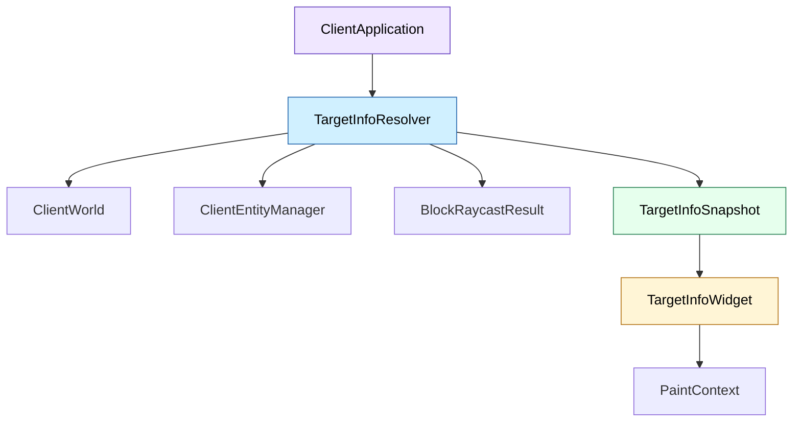
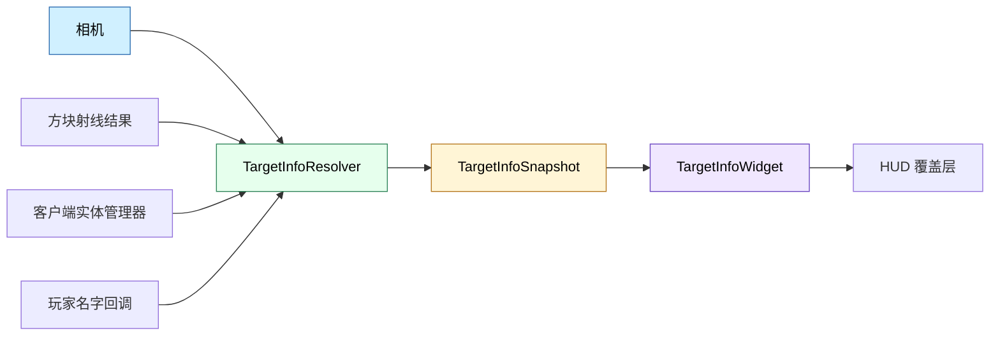

# TargetInfo 模块

本目录实现 Minecraft Reborn 客户端的 HWYLA 风格目标信息覆盖层，用于显示玩家准星指向的方块或实体名称、类型和附加信息。

## 目录结构

```text
src/client/ui/minecraft/targetinfo/
├── TargetInfo.hpp            # 目标信息模型与格式化辅助函数
├── TargetInfo.cpp            # 模型和格式化函数实现
├── TargetInfoResolver.hpp    # 目标解析入口
├── TargetInfoResolver.cpp    # 方块/实体命中解析
├── TargetInfoWidget.hpp      # HUD 覆盖层 Widget
├── TargetInfoWidget.cpp      # 覆盖层渲染
└── README.md                 # 本文档
```

## 文件介绍

### TargetInfo.hpp / TargetInfo.cpp

定义目标信息快照 `TargetInfoSnapshot`，并提供一组纯格式化辅助函数：

- `humanizeIdentifier()`：把 `minecraft:experience_orb`、`oak_log` 之类的标识符转成可读标题
- `humanizeResourceLocation()`：把资源位置转换成标题文本
- `formatDistance()`：格式化射线距离
- `formatBlockPos()`：格式化方块坐标
- `formatDirection()`：格式化命中的面方向

### TargetInfoResolver.hpp / TargetInfoResolver.cpp

负责从相机、方块射线结果和客户端实体管理器中解析当前准星目标。

解析策略：

- 优先比较实体命中与方块命中的距离
- 选择更近的目标作为最终结果
- 方块目标输出方块名称、坐标、命中面和状态信息
- 实体目标输出类型、实体 ID、距离，并对玩家、物品实体、经验球做专门处理

### TargetInfoWidget.hpp / TargetInfoWidget.cpp

负责把目标信息绘制成 HUD 覆盖层。

渲染风格：

- 顶部居中显示
- 圆角深色背景
- 左侧高亮色条区分目标类型
- 标题 + 多行详情的经典 tooltip 布局

## 模块关系



## 整体职责

该模块的职责是把“准星下目标是什么”拆成两步：先解析，再渲染。这样 UI 层不需要直接关心实体碰撞检测和方块状态拼装，后续扩展更多目标来源时也不会污染 HUD 代码。

## 输入 / 输出

| 类型 | 输入 | 输出 |
| ------ | ------ | ------ |
| 方块目标 | 相机位置、方向、方块射线结果、世界数据 | 方块目标快照 |
| 实体目标 | 相机位置、方向、实体管理器、玩家名字回调 | 实体目标快照 |
| 渲染目标 | 目标快照、画布尺寸、字体测量能力 | HUD 覆盖层 |

## 依赖项

### 内部依赖

- `client/world/ClientWorld.hpp`
- `client/world/entity/ClientEntityManager.hpp`
- `client/world/entity/ClientEntity.hpp`
- `client/ui/kagero/widget/Widget.hpp`
- `client/ui/kagero/paint/PaintContext.hpp`
- `common/core/BlockRaycastResult.hpp`
- `common/world/block/Block.hpp`
- `common/item/core/ItemStack.hpp`
- `common/util/AxisAlignedBB.hpp`

### 外部依赖

- C++20 标准库：`<vector>`, `<functional>`, `<optional>`, `<cmath>`

## 使用方法

```cpp
auto snapshot = mc::client::ui::minecraft::targetinfo::TargetInfoResolver::resolve(
    camera.position(),
    camera.forward(),
    world,
    world.entityManager(),
    raycastResult,
    5.0f,
    [this](mc::EntityId entityId) {
        const auto it = m_knownPlayerNames.find(static_cast<mc::PlayerId>(entityId));
        return it == m_knownPlayerNames.end() ? mc::String{} : it->second;
    });

targetInfoWidget.setTargetInfo(std::move(snapshot));
```

## 容易踩的坑

- 解析实体目标时必须使用客户端实体管理器，不能复用服务端世界接口。
- 只在鼠标捕获时更新目标快照，否则切出 GUI 后会继续显示旧目标。
- 目标标题不要直接展示 `minecraft:stone` 这种原始 ID，否则 UI 会显得像调试信息而不是玩家提示。
- 玩家实体的显示名来自客户端缓存，不要假设实体本身已经携带用户名。

## 测试用例

- [tests/client/ui/minecraft/targetinfo/TargetInfoFormatterTest.cpp](../../../../../tests/client/ui/minecraft/targetinfo/TargetInfoFormatterTest.cpp)

当前测试主要覆盖纯格式化辅助函数，便于在不启动完整客户端的情况下验证标题拼装逻辑。

## Mermaid 图表


