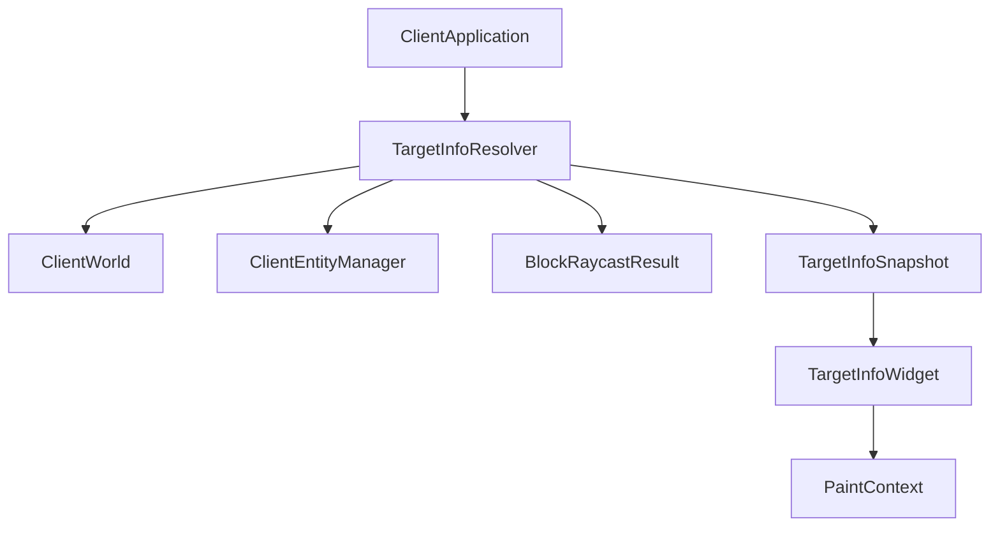

# TargetInfo 模块

本目录实现 Cubium 客户端的 HWYLA 风格目标信息覆盖层，用于显示玩家准星指向的方块或实体名称、类型和附加信息。

## 目录结构

```text
src/client/ui/minecraft/targetinfo/
├── TargetInfo.hpp/cpp            # 目标信息快照与格式化辅助函数
├── TargetInfoResolver.hpp/cpp    # 目标解析入口（方块/实体命中解析）
├── TargetInfoWidget.hpp/cpp      # HUD 覆盖层 Widget
└── README.md                     # 本文档
```

## 内部模块关系



该模块的职责是把"准星下目标是什么"拆成两步：先解析（`TargetInfoResolver`），再渲染（`TargetInfoWidget`）。这样 UI 层不需要直接关心实体碰撞检测和方块状态拼装。

## 上下游外部依赖关系

**上游依赖（本模块依赖）：**
- `client/world/ClientWorld.hpp`
- `client/world/entity/ClientEntityManager.hpp`
- `client/world/entity/ClientEntity.hpp`
- `client/ui/kagero/widget/Widget.hpp`
- `client/ui/kagero/paint/PaintContext.hpp`
- `common/core/BlockRaycastResult.hpp`
- `common/world/block/Block.hpp`
- `common/item/core/ItemStack.hpp`
- `common/util/AxisAlignedBB.hpp`

**下游依赖（被谁依赖）：**
- `src/client/application/` - 在 HUD 渲染流程中调用

## 容易踩的坑

- 解析实体目标时必须使用客户端实体管理器，不能复用服务端世界接口。
- 只在鼠标捕获时更新目标快照，否则切出 GUI 后会继续显示旧目标。
- 目标标题不要直接展示 `minecraft:stone` 这种原始 ID，否则 UI 会显得像调试信息而不是玩家提示。
- 玩家实体的显示名来自客户端缓存，不要假设实体本身已经携带用户名。
