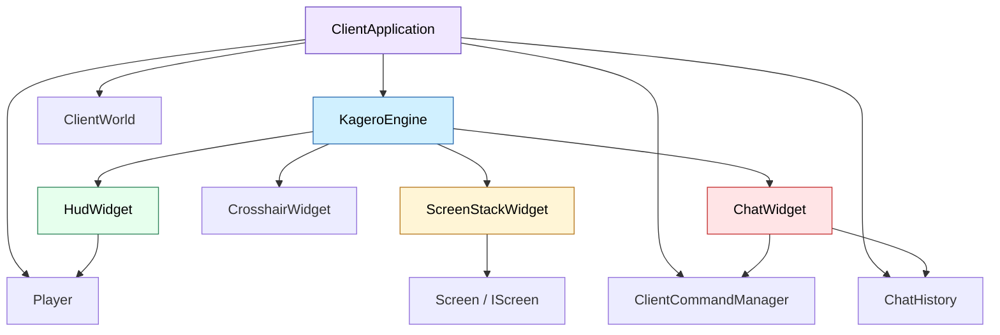
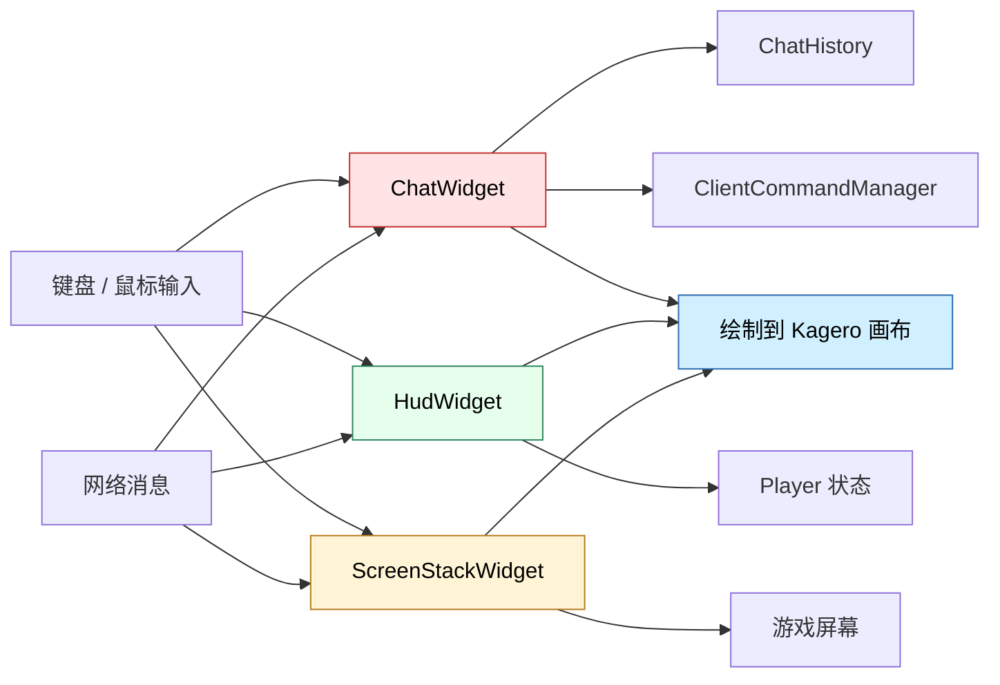

# Minecraft Widgets 模块

本目录包含 Minecraft Reborn 客户端的游戏内专用 Widget。它们基于 Kagero UI 框架构建，负责渲染 HUD、聊天框、准星、快捷栏、容器层和 3D 视口等游戏内界面。

## 目录结构

```text
src/client/ui/minecraft/widgets/
├── ChatWidget.hpp/cpp         # 聊天框与命令补全
├── CrosshairWidget.hpp/cpp    # 准星
├── ExperienceBar.hpp/cpp      # 经验条
├── HealthBarWidget.hpp/cpp    # 生命值条
├── HotbarWidget.hpp/cpp       # 快捷栏
├── HudWidget.hpp/cpp          # HUD 总控件
├── HungerBarWidget.hpp/cpp    # 饥饿值条
├── InventorySlot.hpp/cpp      # 背包槽位展示
├── ScreenStackWidget.hpp/cpp  # 屏幕栈桥接层
├── SlotWidget.hpp/cpp         # 通用槽位组件
├── TitleWidget.hpp/cpp        # 标题显示（/title 命令）
├── Viewport3DWidget.hpp/cpp   # 3D 视口
└── README.md                  # 本文档
```

## 文件介绍

### ChatWidget

聊天框控件，负责：

- 输入和编辑聊天文本
- 维护聊天历史和命令历史
- 渲染消息列表、输入框和光标
- 接收 `ClientCommandManager` 提供的命令补全结果
- 支持 `Tab` 接受补全建议

### HudWidget

HUD 总控件，负责组合生命值、饥饿值、经验条、快捷栏等基础 HUD 元素。

### CrosshairWidget

渲染准星，通常作为最上层的轻量提示控件。

### HotbarWidget

渲染快捷栏槽位、当前选中槽位高亮和热键提示。

### HealthBarWidget

渲染生命值心形图标和受伤闪烁状态。

### HungerBarWidget

渲染饥饿值和饱和度状态。

### ExperienceBar

渲染经验条与等级数字。

### TitleWidget

标题显示控件，负责：

- 渲染主标题（屏幕中央大字）
- 渲染副标题（标题下方小字）
- 渲染动作栏（快捷栏上方通知）
- 淡入/停留/淡出动画
- 处理 `/title` 命令的各种动作（title、subtitle、actionbar、times、clear、reset）

### InventorySlot

把玩家背包槽位映射成可渲染的 UI 元素。

### SlotWidget

通用槽位控件，容器界面和 HUD 槽位都依赖它。

### ScreenStackWidget

连接旧屏幕接口和新的 `Screen` 体系，负责屏幕栈切换、模态屏幕处理和事件转发。

### Viewport3DWidget

用于在 UI 中展示 3D 内容的视口控件。

## 模块关系



## 整体职责

Widgets 模块负责把游戏状态转换成玩家可见的 UI 表达。它既承担 HUD、聊天和准星这类常驻控件，也承担容器与屏幕切换所需的交互桥接。

## 输入 / 输出

| 类型 | 输入 | 输出 |
| ------ | ------ | ------ |
| 玩家状态 | 生命值、饥饿值、经验值、持有物品 | HUD 渲染 |
| 网络状态 | 聊天消息、命令树快照、玩家名单 | 聊天历史与补全建议 |
| 用户输入 | 鼠标、键盘、文本输入 | 焦点切换、编辑和命令提交 |
| 屏幕状态 | 打开 / 关闭容器、菜单、调试界面 | 屏幕栈渲染 |

## 依赖项

### 内部依赖

- `client/ui/kagero/` 下的 Widget、布局和绘制系统
- `client/chat/ChatHistory.hpp`
- `client/command/ClientCommandManager.hpp`
- `client/world/ClientWorld.hpp`
- `client/application/ClientApplication.hpp`

### 外部依赖

- `spdlog` 用于少量运行时日志
- `glm` 和 Vulkan 相关渲染上下文通过上层注入

## 使用方法

```cpp
auto chatWidget = std::make_unique<mc::client::ui::minecraft::widgets::ChatWidget>();
chatWidget->setCommandManager(commandManager);
chatWidget->setCommandCallback([](const mc::std::string& input) {
    // 发送聊天或命令
});
chatWidget->open(true);
```

## 容易踩的坑

- `ChatWidget` 必须在命令管理器绑定后再进入交互状态，否则补全不会刷新。
- 断开连接或切换世界后，聊天补全需要同步清空，不能继续使用旧命令树。
- `ScreenStackWidget` 同时兼容旧屏幕接口和新 `Screen` 类型，迁移时不要把两套栈混用。
- HUD 组件依赖渲染资源和玩家状态都已初始化，否则会出现空白或闪烁。
- 3D 视口和实体渲染器共享相机状态，更新顺序不能颠倒。

## 测试用例

- [tests/client/ui/kagero/widget/WidgetTest.cpp](../../../../../tests/client/ui/kagero/widget/WidgetTest.cpp)
- [tests/client/ui/kagero/widget/TextFieldWidgetTest.cpp](../../../../../tests/client/ui/kagero/widget/TextFieldWidgetTest.cpp)
- [tests/client/ui/kagero/widget/SlotWidgetTest.cpp](../../../../../tests/client/ui/kagero/widget/SlotWidgetTest.cpp)
- [tests/client/command/ClientCommandManagerTest.cpp](../../../../../tests/client/command/ClientCommandManagerTest.cpp) 覆盖了 `ChatWidget` 依赖的命令补全引擎

当前还没有单独的 `ChatWidget` 直测文件，`ChatWidget` 的回归主要依赖上层应用集成测试和命令管理器测试。

## Mermaid 图表


