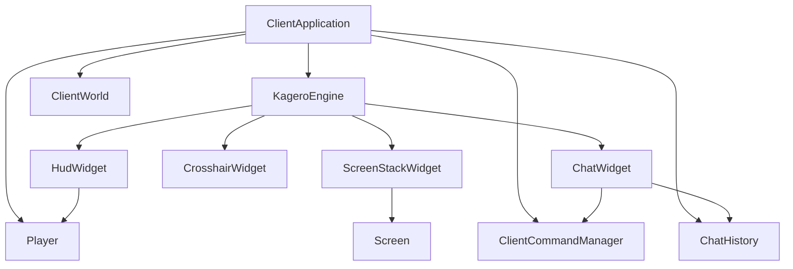

# Minecraft Widgets 模块

本目录包含 Cubium 客户端的游戏内专用 Widget。它们基于 Kagero UI 框架构建，负责渲染 HUD、聊天框、准星、快捷栏、容器层和 3D 视口等游戏内界面。

## 目录结构

```text
src/client/ui/minecraft/widgets/
├── ChatWidget.hpp/cpp         # 聊天框与命令补全
├── CrosshairWidget.hpp/cpp    # 准星
├── ExperienceBar.hpp/cpp      # 经验条
├── HealthBarWidget.hpp/cpp    # 生命值条
├── HotbarWidget.hpp/cpp       # 快捷栏
├── HudWidget.hpp/cpp          # HUD 总控件（直接渲染所有 HUD 元素）
├── HungerBarWidget.hpp/cpp    # 饥饿值条
├── InventorySlot.hpp/cpp      # 背包槽位展示
├── ScreenStackWidget.hpp/cpp  # 屏幕栈桥接层
├── SlotWidget.hpp/cpp         # 通用槽位组件
├── TitleWidget.hpp/cpp        # 标题显示（/title 命令）
├── Viewport3DWidget.hpp/cpp   # 3D 视口
└── README.md                  # 本文档
```

## 内部模块关系



Widgets 模块负责把游戏状态转换成玩家可见的 UI 表达。它既承担 HUD、聊天和准星这类常驻控件，也承担容器与屏幕切换所需的交互桥接。`HudWidget` 直接渲染快捷栏、生命值、饥饿值、经验条等元素；`ScreenStackWidget` 管理 kagero `Screen` 屏幕栈（push/pop/clear + 事件分发 + 屏幕变化回调）。

## HUD 渲染细节

`HudWidget` 的饥饿条渲染（`_renderHunger`）已实现完整的 MC 原版行为：
- **饥饿效果变体**：玩家受饥饿效果（`EffectType::Hunger`）影响时，切换为绿色变体精灵图标（`hunger_saturated_*`），对应资源包中的 `food_*_hunger.png`。
- **饱和度抖动动画**：当饱和度 ≤ 0 时，饥饿图标随机上下偏移 ±1px，抖动频率与饥饿值成反比（`tickCount % (foodLevel * 3 + 1) == 0`），使用确定性随机种子（`tickCount * 312871`）确保帧内一致性。
- **图标间距**：心形、饥饿、盔甲图标均使用 9×9px 尺寸、8px 间距，与原版一致。

`HealthBarWidget` 和 `HungerBarWidget` 为简化矩形后备版本，仅用于独立调试；完整的图标渲染由 `HudWidget` 直接完成。

`HudWidget` 的所有 HUD 元素均支持纹理/纯色双重渲染：优先使用 `GuiSpriteAtlas` 纹理绘制（如 `iconsAtlas` 的心形、饥饿图标），纹理不可用时自动回退到纯色矩形绘制（如快捷栏背景使用 `HudColors::HOTBAR_BACKGROUND`/`HOTBAR_BORDER`）。

## 上下游外部依赖关系

**上游依赖（本模块依赖）：**
- `client/ui/kagero/` - Widget 基类、布局和绘制系统
- `client/chat/ChatHistory.hpp`
- `client/command/ClientCommandManager.hpp`
- `client/world/ClientWorld.hpp`
- `client/application/ClientApplication.hpp`

**下游依赖（被谁依赖）：**
- `src/client/application/` - 初始化并接入 UI 层

## 容易踩的坑

- **命名空间不一致**：本目录下存在两个命名空间。`ChatWidget`、`CrosshairWidget`、`HudWidget`、`ScreenStackWidget`、`TitleWidget` 位于 `mc::client::ui::minecraft::widgets`；而 `HealthBarWidget`、`HotbarWidget`、`HungerBarWidget`、`ExperienceBar`、`InventorySlot`、`SlotWidget`、`Viewport3DWidget` 位于 `mc::client::ui::minecraft`（少一层 widgets）。引用时需注意。
- `ChatWidget` 必须在命令管理器绑定后再进入交互状态，否则补全不会刷新。
- `ChatWidget` 光标移动、删除和宽度计算均基于码点索引（使用 `util::text::Utf8.hpp`），而非字节偏移。修改时务必使用 `utf8NextCodepointIndex`、`utf8PrevCodepointIndex`、`utf8CodepointToByteOffset` 等工具函数操作字符串，避免截断多字节字符。
- `ChatWidget` 根据 `ChatMessageType` 路由消息：`Chat`/`System` 进入聊天历史并渲染，`Actionbar`/`GameInfo` 通过 `ActionbarCallback` 路由到 `TitleWidget` 的动作栏区域。
- 断开连接或切换世界后，聊天补全需要同步清空，不能继续使用旧命令树。
- `ScreenStackWidget` 同时兼容旧屏幕接口和新 `Screen` 类型，迁移时不要把两套栈混用。
- HUD 组件依赖渲染资源和玩家状态都已初始化，否则会出现空白或闪烁。
- 3D 视口和实体渲染器共享相机状态，更新顺序不能颠倒。
- `HudWidget` 采用直接渲染方式，并非组合子 Widget，修改 HUD 元素需直接改 HudWidget 内部。
