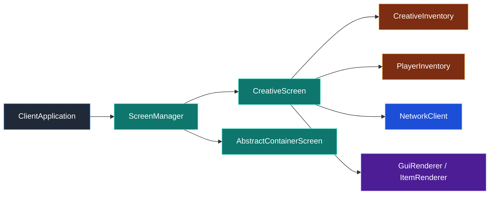

# Screen 模块（旧版兼容层）

本目录承载基于 `common/screen/IScreen` 的旧版屏幕系统。当前工程已经有 Kagero Widget 体系，但背包、工作台、创造模式等交互仍然依赖这里的屏幕实现。

## 目录结构

```text
src/client/ui/screen/
├── ScreenManager.hpp/cpp           # 旧版屏幕栈管理器
├── AbstractContainerScreen.hpp     # 容器屏幕模板基类
├── CraftingScreen.hpp/cpp          # 合成屏幕
├── ChestScreen.hpp/cpp             # 箱子屏幕
├── FurnaceScreen.hpp/cpp           # 熔炉屏幕
└── CreativeScreen.hpp/cpp          # 创造模式物品库屏幕
```

## 文件介绍

### ScreenManager.hpp / ScreenManager.cpp

负责旧屏幕栈的打开、关闭、渲染和输入分发。它是 `ClientApplication` 和具体 `IScreen` 之间的桥接层。

### AbstractContainerScreen.hpp

容器类屏幕的模板基类，负责槽位渲染、点击处理、拖拽、物品悬停提示和鼠标持有物品的绘制。`CraftingScreen`、`ChestScreen`、`FurnaceScreen` 都在它的基础上实现。

### CraftingScreen.hpp / CraftingScreen.cpp

玩家合成屏幕，通常用于生存模式下的 2x2 个人合成网格，也可作为工作台逻辑的基础。

### ChestScreen.hpp / ChestScreen.cpp

箱子类容器屏幕，展示服务端同步下来的箱子槽位，并把点击写回容器菜单。

### FurnaceScreen.hpp / FurnaceScreen.cpp

熔炉族容器屏幕，负责燃料、原料、结果槽位的渲染与交互。

### CreativeScreen.hpp / CreativeScreen.cpp

创造模式物品库屏幕，负责本地物品条目搜索、滚动、垃圾槽、玩家背包槽位编辑和创造库存动作包发送。

## 模块关系

- `ClientApplication` 负责决定打开哪个屏幕，并把输入和滚轮事件转发进屏幕系统。
- `ScreenManager` 持有当前活动屏幕，旧屏幕只会在顶层接收输入。
- `AbstractContainerScreen` 依赖服务端容器同步包，适合普通容器类交互。
- `CreativeScreen` 不走普通容器点击流，而是直接编辑本地 `PlayerInventory`，再通过 `CreativeInventoryActionPacket` 回写服务端。

## 整体职责

本模块的职责是把“按键/鼠标输入”转换成具体 GUI 行为，并把容器型交互和创造模式交互落到稳定的屏幕实现上。它保留了旧体系的直接性，适合当前仍在迁移中的背包与容器交互路径。

## 输入 / 输出

### 输入
- 键盘输入：`E`、`ESC`、字符输入、数字键等
- 鼠标输入：点击、拖拽、滚轮
- `PlayerInventory` 和容器菜单状态
- 渲染器对象：GUI 画布、纹理管理器、物品渲染器

### 输出
- 屏幕渲染结果
- 容器点击包、关闭包
- 创造库存动作包
- 当前屏幕状态变化

## 依赖项

### 内部依赖
- `common/screen/IScreen.hpp`
- `common/entity/inventory/PlayerInventory.hpp`
- `common/entity/inventory/CreativeInventory.hpp`
- `common/entity/inventory/AbstractContainerMenu.hpp`
- `common/network/packet/InventoryPackets.hpp`
- `client/renderer/trident/*`
- `client/application/ClientApplication.hpp`

### 外部依赖
- GLFW：键盘和鼠标常量
- C++20 标准库：`<memory>`, `<vector>`, `<functional>`

## 使用方法

### 打开创造模式屏幕

```cpp
auto creativeScreen = std::make_unique<mc::client::CreativeScreen>(
    playerInventory,
    [&](mc::i32 slotIndex, const mc::ItemStack& stack) {
        networkClient.sendCreativeInventoryAction(slotIndex, stack);
    }
);

creativeScreen->setRenderers(guiRenderer, textureManager, itemRenderer);
creativeScreen->setScreenSize(windowWidth, windowHeight);
mc::client::ScreenManager::instance().openScreen(std::move(creativeScreen));
```

### 打开普通容器屏幕

```cpp
auto craftingScreen = std::make_unique<mc::client::CraftingScreen>(std::move(menu));
craftingScreen->setRenderers(guiRenderer, textureManager, itemRenderer);
mc::client::ScreenManager::instance().openScreen(std::move(craftingScreen));
```

## 容易踩的坑

- `CreativeScreen` 必须先设置渲染器和尺寸，再进入渲染，否则不会绘制任何内容。
- 创造模式屏幕不会暂停游戏，`isPauseScreen()` 返回 `false`。
- `E` 键在创造模式下不是“关闭背包”，而是进入创造库存界面；模式切换时要由上层决定应该打开哪个屏幕。
- 滚轮事件必须显式转发到当前屏幕，否则创造物品库的滚动区不会响应。
- 创造库存条目依赖完整的方块和物品注册顺序，测试或启动时必须先初始化 `VanillaBlocks`，再初始化 `Items` 和 `BlockItemRegistry`。

## 测试用例

- `tests/common/test_container.cpp`
- `tests/client/ui/GuiScaleTest.cpp`

当前还没有专门的创造屏幕快照测试，相关行为主要通过容器、创造库存和客户端构建验证覆盖。

## Mermaid 图表


