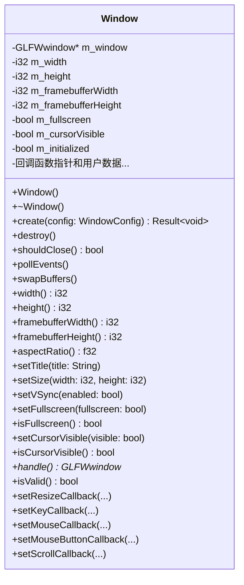
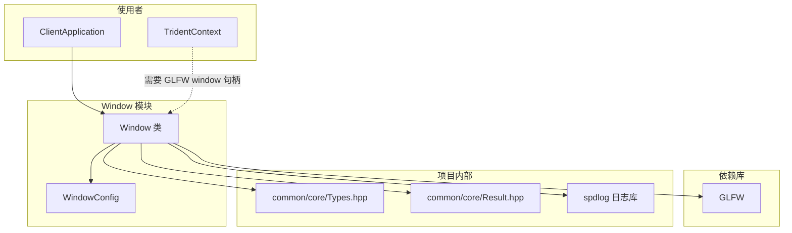

# Window 模块

窗口管理模块，封装 GLFW 提供跨平台的窗口创建和管理功能。

## 目录结构

```
src/client/window/
├── Window.hpp    # 窗口类头文件
└── Window.cpp    # 窗口类实现
```

## 文件详解

### Window.hpp

窗口类的头文件，定义了以下核心组件：

#### WindowConfig 结构体

窗口配置结构体，用于创建窗口时传递参数：

| 字段 | 类型 | 默认值 | 说明 |
|------|------|--------|------|
| `width` | `i32` | 1280 | 窗口宽度（像素） |
| `height` | `i32` | 720 | 窗口高度（像素） |
| `title` | `String` | "Minecraft Reborn" | 窗口标题 |
| `fullscreen` | `bool` | false | 是否全屏模式 |
| `vsync` | `bool` | true | 是否启用垂直同步 |
| `resizable` | `bool` | true | 窗口是否可调整大小 |
| `decorated` | `bool` | true | 是否有窗口装饰（标题栏、边框） |
| `monitorIndex` | `i32` | 0 | 全屏时使用的显示器索引 |

#### Window 类

主窗口类，提供完整的窗口管理功能：



**核心功能分组：**

| 分组 | 方法 | 说明 |
|------|------|------|
| **生命周期** | `create()`, `destroy()` | 创建和销毁窗口 |
| **状态查询** | `shouldClose()`, `isValid()` | 检查窗口状态 |
| **事件处理** | `pollEvents()` | 轮询窗口事件 |
| **渲染相关** | `swapBuffers()` | 交换前后缓冲区 |
| **属性获取** | `width()`, `height()`, `aspectRatio()` | 获取窗口尺寸信息 |
| **属性设置** | `setTitle()`, `setSize()`, `setVSync()`, `setFullscreen()` | 设置窗口属性 |
| **光标控制** | `setCursorVisible()`, `isCursorVisible()` | 控制光标可见性 |
| **回调注册** | `setResizeCallback()`, `setKeyCallback()`, `setMouseCallback()`, `setMouseButtonCallback()`, `setScrollCallback()` | 注册事件回调 |

#### 回调类型定义

```cpp
using ResizeCallback = void (*)(i32 width, i32 height, void* userData);
using KeyCallback = void (*)(i32 key, i32 scancode, i32 action, i32 mods, void* userData);
using MouseCallback = void (*)(f64 x, f64 y, void* userData);
using MouseButtonCallback = void (*)(i32 button, i32 action, i32 mods, void* userData);
using ScrollCallback = void (*)(f64 xoffset, f64 yoffset, void* userData);
```

### Window.cpp

窗口类的实现文件，主要实现细节：

#### GLFW 初始化管理

使用静态计数器 `s_glfwInitCount` 管理 GLFW 初始化，支持多个 Window 实例共享 GLFW：

```cpp
static int s_glfwInitCount = 0;

// 创建时
if (s_glfwInitCount == 0) {
    glfwInit();  // 首次初始化
}
++s_glfwInitCount;

// 销毁时
--s_glfwInitCount;
if (s_glfwInitCount == 0) {
    glfwTerminate();  // 最后一个窗口销毁时终止
}
```

#### Vulkan 兼容配置

创建窗口时设置 GLFW 为 Vulkan 无 API 模式，只负责窗口本身的尺寸、装饰和事件回调；多重采样不在窗口层配置，而是在渲染器的 Vulkan 渲染通路中按设备能力单独处理。

```cpp
glfwWindowHint(GLFW_CLIENT_API, GLFW_NO_API);  // Vulkan 不需要 OpenGL 上下文
glfwWindowHint(GLFW_RESIZABLE, config.resizable ? GLFW_TRUE : GLFW_FALSE);
glfwWindowHint(GLFW_DECORATED, config.decorated ? GLFW_TRUE : GLFW_FALSE);
```

#### 回调转发机制

使用 GLFW 用户指针实现静态回调到成员函数的转发：

```cpp
void Window::framebufferSizeCallback(GLFWwindow* window, int width, int height) {
    auto* win = static_cast<Window*>(glfwGetWindowUserPointer(window));
    if (win && win->m_resizeCallback) {
        win->m_resizeCallback(width, height, win->m_resizeUserData);
    }
}
```

## 模块架构



## 整体职责

Window 模块作为客户端最底层的平台抽象层，负责：

1. **窗口生命周期管理** - 创建、销毁窗口，管理 GLFW 初始化
2. **事件系统** - 提供键盘、鼠标、滚轮、窗口大小变化的回调机制
3. **窗口状态控制** - 全屏切换、VSync、光标显隐
4. **跨平台抽象** - 封装 GLFW，提供统一的平台无关接口

## 输入和输出

### 输入

| 输入项 | 类型 | 说明 |
|--------|------|------|
| `WindowConfig` | 结构体 | 窗口创建配置 |
| 用户事件 | GLFW 回调 | 键盘、鼠标、窗口事件 |

### 输出

| 输出项 | 类型 | 说明 |
|--------|------|------|
| `GLFWwindow*` | 原生句柄 | 供 Vulkan 渲染器创建 Surface |
| 回调通知 | 函数调用 | 通过注册的回调通知应用层事件 |
| 窗口状态 | 属性访问 | 尺寸、全屏状态、光标状态等 |

## 依赖项

### 外部依赖

| 依赖 | 版本 | 用途 |
|------|------|------|
| **GLFW** | 3.x | 跨平台窗口和输入管理 |

### 内部依赖

| 依赖 | 用途 |
|------|------|
| `common/core/Types.hpp` | 基础类型定义 (i32, f32, String 等) |
| `common/core/Result.hpp` | 错误处理 |

## 使用方法

### 基本使用

```cpp
#include "client/window/Window.hpp"

using namespace mc::client;

// 1. 创建窗口配置
WindowConfig config;
config.width = 1920;
config.height = 1080;
config.title = "My Game";
config.vsync = true;
config.fullscreen = false;

// 2. 创建窗口
Window window;
auto result = window.create(config);
if (!result.success()) {
    // 处理错误
    return;
}

// 3. 设置事件回调
window.setKeyCallback([](i32 key, i32 scancode, i32 action, i32 mods, void* userData) {
    if (key == GLFW_KEY_ESCAPE && action == GLFW_PRESS) {
        // 处理 ESC 键
    }
});

window.setMouseCallback([](f64 x, f64 y, void* userData) {
    // 处理鼠标移动
});

// 4. 主循环
while (!window.shouldClose()) {
    window.pollEvents();
    
    // 渲染...
    
    window.swapBuffers();
}

// 5. 窗口会在析构时自动销毁
```

### 与 ClientApplication 集成

```cpp
// 在 ClientApplication::initialize() 中
WindowConfig windowConfig;
windowConfig.width = 1280;
windowConfig.height = 720;
windowConfig.title = "Minecraft Reborn";
windowConfig.vsync = m_settings.vsync.get();

auto result = m_window.create(windowConfig);
if (!result.success()) {
    return Error(ErrorCode::InitializationFailed, "Failed to create window");
}

// 设置窗口大小回调
m_window.setResizeCallback([](i32 width, i32 height, void* userData) {
    auto* app = static_cast<ClientApplication*>(userData);
    if (app && app->m_renderer) {
        app->m_renderer->onResize(width, height);
    }
}, this);

// 设置输入回调
m_window.setKeyCallback(...);
m_window.setMouseCallback(...);
m_window.setMouseButtonCallback(...);
m_window.setScrollCallback(...);
```

### 全屏切换

```cpp
// 切换全屏
void toggleFullscreen(Window& window) {
    window.setFullscreen(!window.isFullscreen());
}
```

### 隐藏/显示光标（第一人称视角）

```cpp
// 捕获鼠标
window.setCursorVisible(false);

// 释放鼠标
window.setCursorVisible(true);
```

## 容易踩的坑

### 1. 多窗口实例的 GLFW 初始化

**问题**: 多个 Window 实例可能导致 GLFW 重复初始化或过早终止。

**解决**: 使用静态计数器 `s_glfwInitCount` 管理引用计数，确保只在第一个窗口创建时初始化，最后一个窗口销毁时终止。

```cpp
// 正确: 引用计数确保安全
Window window1;
window1.create(config);  // GLFW 初始化

Window window2;
window2.create(config);  // GLFW 已初始化，计数++

window1.destroy();  // 计数--，不终止 GLFW
window2.destroy();  // 计数--，为 0，终止 GLFW
```

### 2. 窗口尺寸 vs 帧缓冲尺寸

**问题**: 在高 DPI 显示器上，窗口尺寸和帧缓冲尺寸可能不同。

**解决**: 使用正确的尺寸查询方法：

```cpp
// 窗口逻辑尺寸（用于 UI 布局）
i32 windowWidth = window.width();
i32 windowHeight = window.height();

// 帧缓冲尺寸（用于渲染）
i32 fbWidth = window.framebufferWidth();
i32 fbHeight = window.framebufferHeight();

// 计算 DPI 缩放比例
f32 scale = static_cast<f32>(fbWidth) / windowWidth;
```

### 3. 回调中的 this 指针

**问题**: 静态回调函数无法直接访问类成员。

**解决**: 使用 GLFW 用户指针存储 this，通过 userData 传递：

```cpp
// 设置回调时传递 this
window.setResizeCallback([](i32 width, i32 height, void* userData) {
    auto* app = static_cast<ClientApplication*>(userData);
    app->handleResize(width, height);
}, this);
```

### 4. 移动语义

**问题**: Window 支持移动，但移动后原对象处于无效状态。

**解决**: 移动后检查有效性或使用移动语义正确转移所有权：

```cpp
Window window1;
window1.create(config);

// 移动构造
Window window2 = std::move(window1);

// window1 现在处于无效状态
// window1.isValid() == false
// window1.handle() == nullptr
```

### 5. 全屏切换时的窗口位置

**问题**: 当前实现中，全屏切换时窗口位置恢复使用固定值 (100, 100)。

**代码位置**: `Window.cpp::setFullscreen()`

```cpp
// 当前实现 - 位置信息丢失
glfwSetWindowMonitor(
    m_window,
    nullptr,
    100, 100,  // 固定位置
    m_width, m_height,
    GLFW_DONT_CARE
);
```

**改进建议**: 在类中保存窗口化模式下的位置：

```cpp
// 改进方案
i32 m_windowedX = 100;  // 窗口化时的 X 位置
i32 m_windowedY = 100;  // 窗口化时的 Y 位置

// 进入全屏前保存位置
glfwGetWindowPos(m_window, &m_windowedX, &m_windowedY);

// 退出全屏时恢复位置
glfwSetWindowMonitor(m_window, nullptr, m_windowedX, m_windowedY, ...);
```

### 6. VSync 设置时机

**问题**: `setVSync()` 在没有上下文的情况下可能无效。

**解决**: 确保在窗口创建后调用，且需要在主线程：

```cpp
// 正确顺序
window.create(config);
window.setVSync(true);  // 在创建后设置
```

## 涉及的测试用例

### 间接测试

Window 模块没有专门的单元测试文件，但在其他测试中作为基础设施被使用：

| 测试文件 | 测试内容 |
|----------|----------|
| `tests/client/renderer/test_trident_engine.cpp` | 使用 GLFW 创建测试窗口，测试 Trident 渲染引擎 |

**测试中的使用模式**:

```cpp
// test_trident_engine.cpp
class TridentTestBase : public ::testing::Test {
protected:
    static GLFWwindow* s_window;
    
    static void SetUpTestSuite() {
        // 初始化 GLFW
        ASSERT_TRUE(glfwInit()) << "Failed to initialize GLFW";
        
        // 创建无上下文窗口（仅用于 Vulkan surface）
        glfwWindowHint(GLFW_CLIENT_API, GLFW_NO_API);
        glfwWindowHint(GLFW_VISIBLE, GLFW_FALSE);  // 隐藏窗口
        
        s_window = glfwCreateWindow(800, 600, "TridentTest", nullptr, nullptr);
    }
    
    static void TearDownTestSuite() {
        glfwDestroyWindow(s_window);
        glfwTerminate();
    }
};
```

### 建议添加的测试

1. **WindowConfig 默认值测试** - 验证配置结构体的默认值
2. **窗口创建/销毁测试** - 验证基本生命周期
3. **回调触发测试** - 验证事件回调正确触发
4. **多窗口测试** - 验证引用计数正确性
5. **全屏切换测试** - 验证全屏模式切换
6. **光标显隐测试** - 验证光标状态切换
7. **移动语义测试** - 验证移动构造和赋值

## 相关文件

| 文件路径 | 关系 |
|----------|------|
| `src/client/application/ClientApplication.hpp` | Window 的主要使用者 |
| `src/client/application/ClientApplication.cpp` | Window 的初始化和事件处理 |
| `src/client/input/InputManager.hpp` | 接收 Window 的输入事件 |
| `src/client/renderer/trident/core/TridentContext.cpp` | 使用 Window 句柄创建 Vulkan Surface |

## 更新历史

| 日期 | 更新内容 |
|------|----------|
| 2026-03-26 | 创建初始文档 |
