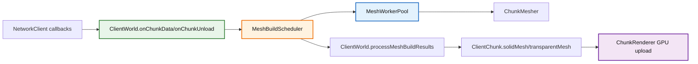
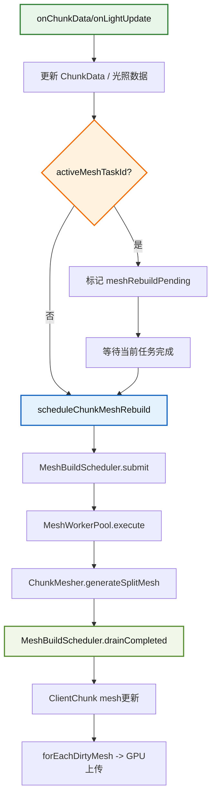

# Client World 模块

该模块负责客户端世界状态维护，包括区块数据接入、网格任务调度、天气时间同步和基础查询接口。

## 1. 目录结构树

```text
src/client/world/
├── ClientWorld.hpp/cpp                 # 客户端世界核心管理器
├── ClientWeather.hpp                   # 天气插值状态
├── color/
│   ├── BiomeColors.hpp/cpp             # 生物群系颜色解析
│   ├── blend/                          # 颜色混合缓存与访问器
│   └── README.md
├── entity/
│   ├── ClientEntity.hpp/cpp            # 客户端实体代理
│   ├── ClientEntityManager.hpp/cpp     # 客户端实体容器与更新
│   └── ...
└── README.md
```

## 2. 文件介绍

### ClientWorld.hpp / ClientWorld.cpp

职责：
- 接收服务端区块包并维护 `ClientChunk` 映射。
- 驱动“独立调度器 + 纯执行器”的网格构建管线。
- 回收最新代际网格结果并标记 GPU 上传。
- 处理时间、天气、光照同步与方块查询，并在光照连发时按区块合并重建请求。

核心接口：
- 生命周期：`initialize(seed)`、`destroy()`。
- 每帧驱动：`update(const MeshSchedulerViewState&)`。
- 网格系统：`initializeMeshSystem(threadCount, config)`、`shutdownMeshSystem()`、`processMeshBuildResults(maxPerFrame)`。
- 区块同步：`onChunkData(...)`、`onChunkUnload(...)`。
- 维度切换：`clearChunks()` - 清空所有区块数据，用于维度切换时重置世界状态。

### ClientWeather.hpp

职责：
- 维护雨强、雷强和状态过渡。
- 为渲染侧提供插值后的天气参数。
- 维护闪电闪烁时间，实现闪电击中时的天空闪烁效果。

核心接口：
- `setRainStrength(f32)` / `rainStrength(f32 partialTick)` - 设置/获取雨强度
- `setThunderStrength(f32)` / `thunderStrength(f32 partialTick)` - 设置/获取雷暴强度
- `setTimeLightningFlash(i32)` / `lightningFlashTime()` - 设置/获取闪电闪烁时间
- `tickLightningFlash()` - 每 tick 递减闪烁时间
- `lightningFlashBrightness()` - 获取闪烁亮度因子 (0.0-1.0)
- `hasLightningFlash()` - 检查是否有闪烁效果

### entity/ClientEntityManager.hpp / ClientEntityManager.cpp

职责：
- 管理客户端实体（接收服务端实体数据、位置插值、动画更新）。
- 提供两种插值机制：
  - **平滑插值**：`updateInterpolation(deltaTime)` - 每帧调用，向目标位置平滑移动
  - **帧间插值**：`getInterpolatedPosition(partialTick)` - 渲染时在 prev 和 current 之间插值

核心接口：
- `tick()` - 每 tick 调用，更新实体状态和保存 prev 位置
- `updateInterpolation(deltaTime)` - 每帧调用，平滑网络位置更新
- `updateAnimations(partialTick)` - 每帧调用，更新动画状态

### entity/ClientEntity.hpp / ClientEntity.cpp

职责：
- 客户端实体代理，维护位置、旋转、动画等状态。
- 提供基于 `partialTick` 的插值方法。

核心插值方法：
```cpp
// 位置插值
Vector3 getInterpolatedPosition(f32 partialTick) const;

// 旋转插值
f32 getInterpolatedYaw(f32 partialTick) const;
f32 getInterpolatedPitch(f32 partialTick) const;
f32 getInterpolatedHeadYaw(f32 partialTick) const;

// 动画插值
f32 getInterpolatedSwingProgress(f32 partialTick) const;
```

**partialTick 使用说明**：
- `partialTick` 范围：`[0.0, 1.0)`
- `0.0` = 返回 prev 值（上一 tick 结束时的状态）
- `1.0` = 返回当前值
- `0.5` = 返回中点值

## 3. 模块关系



## 4. 整体职责

模块整体完成以下工作：
- 把网络层的区块二进制数据转成 `ChunkData` 并进入世界状态。
- 依据视图状态动态调度网格重建任务。
- 只接受最新任务代际结果，避免卸载/重载竞态污染。
- 向渲染层提供“需要上传”的网格数据。

## 5. 输入/输出

输入：
- 区块包、卸载包、光照包、时间包、天气包（来自网络回调）。
- 相机/视锥状态（`MeshSchedulerViewState`）。

输出：
- `ClientChunk` 中最新 `solidMesh` 与 `transparentMesh`。
- `needsMeshUpdate=true` 的区块迭代输出（供渲染上传）。
- 时间/天气插值查询结果。

## 6. 依赖项

内部依赖：
- `src/client/renderer/mesh/MeshBuildScheduler.*`
- `src/client/renderer/mesh/MeshWorkerPool.*`
- `src/client/renderer/trident/chunk/ChunkMesher.*`
- `src/common/network/sync/ChunkSync.*`

外部依赖：
- `spdlog`
- `glm`

## 7. 使用方法

```cpp
ClientWorld world;
auto initResult = world.initialize(12345);

MeshSchedulerConfig config;
config.maxDispatchedTaskCount = 64;
config.reprioritizeIntervalFrames = 6;
config.cameraMoveThreshold = 2.0f;
config.cameraDirectionDotThreshold = 0.96f;
config.behindCancelDotThreshold = -0.35f;
config.behindCancelDistanceChunks = 8.0f;

world.initializeMeshSystem(-1, config);

MeshSchedulerViewState viewState;
viewState.cameraPosition = cameraPos;
viewState.cameraForward = cameraForward;
viewState.viewProjectionMatrix = vp;
viewState.renderDistanceChunks = renderDistance;
viewState.minBuildHeight = world.getMinBuildHeight();
viewState.maxBuildHeight = world.getMaxBuildHeight();

world.update(viewState);
world.processMeshBuildResults(4);

world.forEachDirtyMesh([](const ChunkId& id, ClientChunk& chunk) {
    // 上传 chunk.solidMesh / chunk.transparentMesh
    chunk.needsMeshUpdate = false;
});
```

## 8. 容易踩的坑

- `update()` 不再接收“仅相机位置”。
  - 必须传完整 `MeshSchedulerViewState`，否则视锥优先与取消策略失效。
- 区块卸载时要先取消调度任务。
  - 已在 `onChunkUnload()` 中调用 `MeshBuildScheduler::cancelChunk`。
- 不要假设每次 `onChunkData` 都是新建区块。
  - 同一坐标重发时会替换 `ChunkData` 并触发新代际网格任务。
- `processMeshBuildResults()` 只处理最新任务结果。
  - 旧结果会在调度器层丢弃。
- 被调度器提前取消的 pending 任务不会产生 worker 结果。
  - `ClientWorld::update()` 会用 `MeshBuildScheduler::isTaskTracked()` 回收失效 `activeMeshTaskId`，并对“视锥内且尚无 mesh 结果”的区块进行补提，避免区块长期不出网格。
- 光照包不要直接当成“立即重建”事件处理。
  - `onLightUpdate()` 现在会先标记 `meshRebuildPending`，如果同一 chunk 的网格任务还在路上，就等当前任务结束后再补提，避免单个 chunk 被光照更新线性打爆。
- `ClientWorld` 不是 `IWorld` 实现。
  - 它只提供自己的 xyz 查询接口，调试屏幕和客户端工具代码不要假设这里存在 `BlockPos` overload；如果需要统一入口，必须另外补包装层。

## 9. 测试用例

直接相关：
- `tests/client/test_mesh_build_scheduler.cpp`
- `tests/client/test_mesh_worker_pool.cpp`
- `tests/client/world/ClientWorldLightUpdateTest.cpp`
- `tests/client/world/ClientWorldClearChunksTest.cpp` - 区块清空和维度切换测试
- `tests/client/world/ClientWeatherLightningFlashTest.cpp` - 闪电闪烁效果测试

间接相关：
- `tests/client/renderer/test_renderer.cpp`（`ChunkMesher` 构建路径）

建议命令：

```powershell
ctest --test-dir build -C RelWithDebInfo -R "MeshBuildSchedulerTest|MeshWorkerPoolTest|ClientWorldLightUpdateTest|ClientWorldClearChunksTest|ClientWeatherLightningFlashTest|ChunkMesher" --output-on-failure
```

## 10. Mermaid 图表


