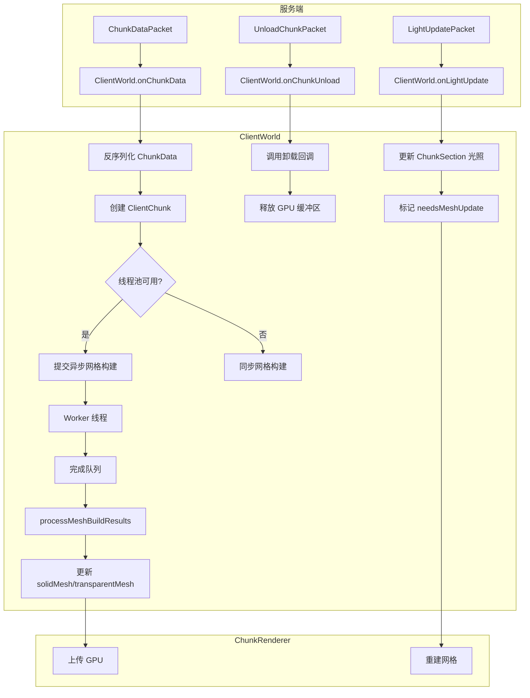
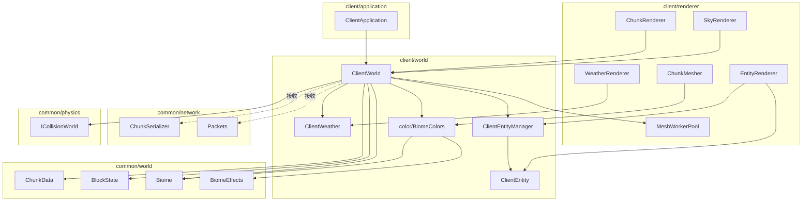

# Client World 模块

客户端世界管理模块，负责管理客户端的区块数据、实体状态和天气效果。

## 目录结构

```
src/client/world/
├── ClientWorld.hpp           # 客户端世界管理器（头文件）
├── ClientWorld.cpp           # 客户端世界管理器（实现）
├── ClientWeather.hpp         # 客户端天气状态
├── color/                    # 颜色解析系统
│   ├── ColorResolver.hpp     # 颜色解析器接口
│   ├── BiomeColors.hpp       # 生物群系颜色解析器
│   ├── BiomeColors.cpp       # 实现文件
│   └── README.md             # 模块文档
└── entity/
    ├── ClientEntity.hpp      # 客户端实体代理类（头文件）
    ├── ClientEntity.cpp      # 客户端实体代理类（实现）
    ├── ClientEntityManager.hpp # 客户端实体管理器（头文件）
    └── ClientEntityManager.cpp # 客户端实体管理器（实现）
```

## 文件详细说明

### ClientWorld.hpp / ClientWorld.cpp

**职责**：客户端世界的核心管理器，管理区块的加载、卸载、网格构建和渲染数据。

**主要类**：

#### `ClientChunk` 结构体

存储客户端区块的完整数据：

| 字段 | 类型 | 说明 |
|------|------|------|
| `chunkId` | `ChunkId` | 区块标识符 |
| `data` | `shared_ptr<ChunkData>` | 区块方块数据 |
| `solidMesh` | `MeshData` | 实心方块网格 |
| `transparentMesh` | `MeshData` | 透明方块网格 |
| `needsMeshUpdate` | `bool` | 是否需要更新网格 |
| `isGenerating` | `bool` | 是否正在生成 |
| `isLoaded` | `bool` | 是否已加载 |
| `meshBuilding` | `bool` | 是否正在构建网格 |

#### `ClientWorld` 类

**核心功能**：

1. **区块管理**
   - `loadChunk()` / `unloadChunk()` - 区块加载/卸载
   - `onChunkData()` - 接收服务端区块数据
   - `onChunkUnload()` - 处理服务端卸载通知
   - `getChunk()` / `getBlockState()` - 区块和方块查询
   - `forEachChunk()` / `forEachDirtyMesh()` - 区块迭代

2. **网格构建**
   - `initializeMeshWorkerPool()` - 初始化异步网格构建线程池
   - `processMeshBuildResults()` - 处理完成的网格构建结果
   - `rebuildChunkMesh()` / `scheduleChunkMeshRebuild()` - 网格重建

3. **光照查询**
   - `getSkyLight()` - 获取天空光照
   - `getBlockLight()` - 获取方块光照
   - `onLightUpdate()` - 处理服务端光照更新

4. **时间管理**
   - `onTimeUpdate()` - 接收服务端时间更新
   - `getInterpolatedCelestialAngle()` - 获取插值天体角度（用于渲染）

5. **天气同步**
   - `onRainStrengthChange()` / `onThunderStrengthChange()` - 天气强度更新
   - `onBeginRaining()` / `onEndRaining()` - 天气状态变化

6. **碰撞检测**（实现 `ICollisionWorld` 接口）
   - `isWithinWorldBounds()` - 检查世界边界
   - `getChunkAt()` - 获取区块数据
   - `getMinBuildHeight()` / `getMaxBuildHeight()` - 世界高度范围

**关键设计**：

- **异步网格构建**：使用 `MeshWorkerPool` 在后台线程构建区块网格，避免主线程卡顿
- **服务端驱动的区块生命周期**：客户端不主动卸载区块，由服务端统一控制
- **优先级队列**：区块加载按距离相机的远近排序



---

### ClientWeather.hpp

**职责**：存储和维护客户端的天气状态，用于渲染雨雪、闪电等效果。

**主要类**：`ClientWeather`

**核心功能**：

| 方法 | 说明 |
|------|------|
| `setRainStrength(f32)` | 设置降雨强度 (0.0-1.0) |
| `setThunderStrength(f32)` | 设置雷暴强度 (0.0-1.0) |
| `beginRain()` | 开始下雨 |
| `endRain()` | 雨停 |
| `rainStrength(partialTick)` | 获取插值后的降雨强度 |
| `thunderStrength(partialTick)` | 获取插值后的雷暴强度 |
| `isRaining()` | 是否正在下雨 |
| `isThundering()` | 是否正在雷暴 |
| `skyDarkenFactor(partialTick)` | 天空暗化因子 |
| `celestialVisibility(partialTick)` | 太阳/月亮可见度 |
| `skyLightLimit()` | 天空光照上限 |

**关键设计**：

- **双缓冲插值**：维护当前值和前一帧值，支持平滑过渡渲染
- **阈值判断**：使用 `WeatherConstants::RAIN_THRESHOLD` 和 `THUNDER_THRESHOLD` 判断天气状态

---

### color/ 模块

**职责**：客户端颜色解析系统，负责从生物群系获取各种颜色值（草、树叶、水体等）。

详细文档请参阅 [`color/README.md`](color/README.md)。

**主要类型**：

| 类型 | 描述 |
|------|------|
| `ColorResolver` | 颜色解析器抽象接口 |
| `GrassColorResolver` | 草颜色解析器 |
| `FoliageColorResolver` | 树叶颜色解析器 |
| `WaterColorResolver` | 水颜色解析器 |
| `BiomeColors` | 颜色常量和工具函数 |

**核心功能**：

1. **颜色解析**：根据生物群系类型和位置计算颜色值
2. **特殊生物群系处理**：沼泽双色噪声混合、黑森林深绿色、恶地黄褐色
3. **颜色覆盖**：支持生物群系自定义颜色覆盖

**使用示例**：

```cpp
#include "client/world/color/BiomeColors.hpp"

// 获取水体颜色
const Biome& biome = ...;
u32 waterColor = BiomeColors::waterColorResolver().getColor(biome, x, z);

// 获取草颜色（可能需要 colormap）
u32 grassColor = BiomeColors::grassColorResolver().getColor(biome, x, z);
if (grassColor == 0xFFFFFFFF) {
    // 从 grass colormap 计算
    grassColor = getColorFromGrassColormap(biome.temperature(), biome.humidity());
}
```

---

### entity/ClientEntity.hpp / ClientEntity.cpp

**职责**：客户端实体代理类，存储渲染所需的位置、旋转、动画状态。

**主要类**：`ClientEntity`

**核心功能**：

1. **基本信息**
   - `id()` - 实体ID
   - `typeId()` - 实体类型标识符（如 "pig", "cow"）
   - `uuid()` - 实体UUID

2. **位置与插值**
   - `position()` / `prevPosition()` / `targetPosition()` - 位置状态
   - `setPosition()` / `setTargetPosition()` - 设置位置
   - `getInterpolatedPosition(partialTick)` - 获取插值位置

3. **旋转与插值**
   - `yaw()` / `pitch()` / `headYaw()` - 旋转角度
   - `prevYaw()` / `prevPitch()` / `prevHeadYaw()` - 前一帧旋转
   - `getInterpolatedYaw()` / `getInterpolatedPitch()` / `getInterpolatedHeadYaw()` - 插值旋转

4. **动画状态**
   - `limbSwing()` - 腿部摆动进度（用于行走动画）
   - `limbSwingAmount()` - 腿部摆动强度
   - `updateAnimation(distanceMoved)` - 更新动画

5. **物品支持**（用于 ItemEntity）
   - `hasItem()` / `itemStack()` / `setItemStack()` - 物品堆操作

**关键设计**：

- **位置插值**：服务端每 tick 发送位置更新，客户端使用 `prevPosition` 和 `position` 进行插值，实现平滑移动
- **动画状态**：`limbSwing` 和 `limbSwingAmount` 用于动物行走动画

---

### entity/ClientEntityManager.hpp / ClientEntityManager.cpp

**职责**：管理客户端所有实体的创建、更新、销毁和查询。

**主要类**：`ClientEntityManager`

**核心功能**：

| 方法 | 说明 |
|------|------|
| `spawnEntity(id, typeId)` | 创建实体 |
| `removeEntity(id)` | 移除实体 |
| `getEntity(id)` | 获取实体 |
| `hasEntity(id)` | 检查实体是否存在 |
| `clear()` | 移除所有实体 |
| `forEachEntity(func)` | 遍历所有实体 |
| `getEntitiesByType(typeId)` | 按类型获取实体 |
| `getEntitiesInRange(x, y, z, radius)` | 获取范围内实体 |
| `tick()` | 更新所有实体 |
| `updateAnimations(partialTick)` | 更新动画状态 |

**关键设计**：

- **延迟删除**：实体被标记为移除后，在 `removeDeadEntities()` 中统一清理，避免迭代时修改容器
- **动画更新**：`tick()` 方法计算每个实体的移动距离并更新动画状态

---

## 模块关系图



---

## 模块整体说明

### 整体职责

`client/world` 模块是客户端的核心世界状态管理层，负责：

1. **区块管理**：接收服务端区块数据，维护本地区块缓存，触发网格构建
2. **实体管理**：管理客户端实体状态，支持位置插值和动画
3. **天气状态**：维护天气效果状态，支持平滑过渡
4. **时间同步**：接收服务端时间更新，计算天体角度
5. **碰撞检测**：实现 `ICollisionWorld` 接口，提供物理碰撞查询
6. **颜色解析**：从生物群系获取各种颜色值（草、树叶、水体等）

### 输入和输出

**输入**：

| 来源 | 数据类型 | 说明 |
|------|----------|------|
| 服务端网络包 | `ChunkDataPacket` | 区块数据 |
| 服务端网络包 | `UnloadChunkPacket` | 区块卸载通知 |
| 服务端网络包 | `SpawnEntityPacket` | 实体生成 |
| 服务端网络包 | `EntityMovePacket` | 实体移动 |
| 服务端网络包 | `DestroyEntityPacket` | 实体销毁 |
| 服务端网络包 | `TimeUpdatePacket` | 时间更新 |
| 服务端网络包 | `GameStateChangePacket` | 天气变化 |
| 服务端网络包 | `LightUpdatePacket` | 光照更新 |
| 主循环 | `cameraPosition`, `renderDistance` | 相机位置和渲染距离 |

**输出**：

| 目标 | 数据类型 | 说明 |
|------|----------|------|
| ChunkRenderer | `ClientChunk` | 区块数据 + 网格数据 |
| EntityRenderer | `ClientEntity` | 实体渲染数据 |
| WeatherRenderer | `ClientWeather` | 天气状态 |
| SkyRenderer | `celestialAngle` | 天体角度 |
| PhysicsEngine | `ICollisionWorld` | 碰撞检测接口 |

### 依赖项

**内部依赖**：

| 模块 | 用途 |
|------|------|
| `common/world/chunk/ChunkData` | 区块数据结构 |
| `common/world/block/BlockState` | 方块状态 |
| `common/world/biome/BiomeRegistry` | 生物群系注册表 |
| `common/world/biome/BiomeEffects` | 生物群系视觉效果（颜色） |
| `common/network/sync/ChunkSerializer` | 区块序列化/反序列化 |
| `common/physics/PhysicsEngine` | 碰撞检测接口 |
| `client/renderer/mesh/MeshWorkerPool` | 异步网格构建 |
| `client/renderer/MeshTypes` | 网格数据类型 |
| `client/renderer/trident/chunk/ChunkMesher` | 区块网格生成 |

**外部依赖**：

| 库 | 用途 |
|-----|------|
| `glm` | 数学库（向量、矩阵） |
| `spdlog` | 日志 |

### 使用方法

```cpp
#include "client/world/ClientWorld.hpp"
#include "client/world/entity/ClientEntityManager.hpp"
#include "client/world/ClientWeather.hpp"

// 创建客户端世界
mc::client::ClientWorld world;
world.initialize(seed);
world.initializeMeshWorkerPool(4);  // 4 个工作线程

// 主循环
void gameLoop(float deltaTime, float partialTick) {
    // 更新世界
    world.update(cameraPosition, renderDistance);
    
    // 处理异步网格构建结果
    world.processMeshBuildResults(4);  // 每帧最多处理 4 个
    
    // 更新实体
    world.entityManager().tick();
    
    // 获取天气状态用于渲染
    auto& weather = world.weather();
    if (weather.isRaining()) {
        f32 rainAmount = weather.rainStrength(partialTick);
        // 渲染雨滴...
    }
    
    // 获取天体角度用于天空渲染
    f32 celestialAngle = world.getInterpolatedCelestialAngle(partialTick);
    // 渲染太阳/月亮...
}

// 接收服务端数据
void onChunkData(ChunkCoord x, ChunkCoord z, std::vector<u8> data) {
    world.onChunkData(x, z, std::move(data));
}

void onEntitySpawn(EntityId id, const String& typeId) {
    world.entityManager().spawnEntity(id, typeId);
}

void onEntityMove(EntityId id, f32 x, f32 y, f32 z) {
    auto* entity = world.entityManager().getEntity(id);
    if (entity) {
        entity->setTargetPosition(x, y, z);
    }
}

// 清理
world.destroy();
```

### 容易踩的坑

1. **区块生命周期由服务端控制**
   
   客户端不应该主动卸载区块。如果客户端按距离卸载区块，会与服务端的已发送集合产生状态漂移，导致回头后部分旧区块无法重新下发。
   
   ```cpp
   // 错误：客户端不应该主动卸载区块
   void update(...) {
       unloadChunksOutOfRange(position, range);  // 危险！
   }
   ```

2. **网格构建的线程安全**
   
   `ChunkData` 使用 `shared_ptr` 是为了支持异步网格构建。在工作线程访问区块数据时，必须确保数据不被主线程修改。
   
   ```cpp
   // 正确：使用 shared_ptr 共享数据
   auto chunkData = std::shared_ptr<ChunkData>(std::move(result.value()));
   // ...
   m_meshWorkerPool->submitTask(id, chunkData, neighbors, priority);
   ```

3. **边界方块的网格更新**

   当方块位于区块边界时，修改方块需要同时更新相邻区块的网格，否则会出现渲染空洞。

   ```cpp
   // setBlock 后检查边界
   if (localX == 0) scheduleChunkMeshRebuild(ChunkId(chunkX - 1, chunkZ));
   if (localX == CHUNK_WIDTH - 1) scheduleChunkMeshRebuild(ChunkId(chunkX + 1, chunkZ));
   ```

   **区块加载时同样需要处理**：当新区块加载时，需要通知已存在的邻居区块重建网格，以修复边界面剔除问题。

   ```cpp
   // onChunkData 中
   m_meshWorkerPool->submitTask(id, chunkData, neighbors, priority);
   scheduleNeighborMeshRebuild(id);  // 通知邻居重建
   ```

   这是因为：
   - 区块 A 先加载时，邻居 B 不存在，A 的边界面被渲染
   - 区块 B 后加载时，B 能正确剔除靠近 A 的边界面
   - 但 A 的网格没有重建，A 靠近 B 的边界面仍然渲染
   - 结果：边界处出现重复面或穿模

4. **异步网格构建时的邻居重建竞态**

   当邻居区块正在异步构建网格时，不能立即重建它。解决方案是使用 `needsNeighborRebuild` 标志：

   ```cpp
   struct ClientChunk {
       // ...
       bool meshBuilding = false;         // 是否正在构建网格
       bool needsNeighborRebuild = false; // 是否需要因邻居加载而重建
   };
   ```

   ```cpp
   // scheduleNeighborMeshRebuild 中
   if (neighbor->meshBuilding) {
       // 邻居正在构建，标记需要在构建完成后重建
       neighbor->needsNeighborRebuild = true;
   } else {
       // 邻居未在构建，立即安排重建
       scheduleChunkMeshRebuildAsync(neighborId, priority);
   }
   ```

   ```cpp
   // processMeshBuildResults 中
   chunk->meshBuilding = false;
   if (chunk->needsNeighborRebuild) {
       chunk->needsNeighborRebuild = false;
       scheduleChunkMeshRebuildAsync(result.chunkId, priority);
   }
   ```

4. **实体位置插值**
   
   实体位置更新应该是 `setTargetPosition()` 而不是 `setPosition()`。`setPosition()` 是立即传送，`setTargetPosition()` 才是平滑移动。
   
   ```cpp
   // 正确：网络包使用 setTargetPosition
   entity->setTargetPosition(x, y, z);
   
   // 仅用于传送
   entity->setPosition(x, y, z);
   ```

5. **天体角度的计算**
   
   `getInterpolatedCelestialAngle()` 需要处理 dayTime 循环（23999 → 0）的情况，否则午夜时分太阳会跳跃。

6. **光照数据大小验证**
   
   接收光照更新时，必须验证数据大小是否等于 `NibbleArray::BYTE_SIZE`（2048 字节），否则会导致内存越界。

### 涉及的测试用例

| 测试文件 | 测试内容 |
|----------|----------|
| `tests/client/test_mesh_worker_pool.cpp` | MeshWorkerPool 线程池测试 |
| - | 启动/停止测试 |
| - | 单任务/多任务提交测试 |
| - | 优先级排序测试 |
| - | 结果处理帧限制测试 |
| - | 并发提交测试 |
| - | 待处理任务计数测试 |
| `tests/client/world/color/BiomeColorsTest.cpp` | 颜色模块测试 |
| - | BiomeEffectsTest.DefaultColors |
| - | BiomeEffectsTest.BuilderPattern |
| - | BiomeEffectsTest.SpecialBiomeColors |
| - | BiomeColorsTest.ColorConstants |
| - | BiomeColorsTest.SwampColorCalculation |
| - | BiomeColorsTest.ResolverSingletons |
| - | WaterColorResolverTest.BasicResolution |
| - | GrassColorResolverTest.BasicResolution |
| - | GrassColorResolverTest.SwampModifier |
| - | GrassColorResolverTest.DarkForestModifier |
| - | GrassColorResolverTest.BadlandsModifier |
| - | FoliageColorResolverTest.BasicResolution |
| - | FoliageColorResolverTest.SwampFoliage |
| - | FoliageColorResolverTest.BadlandsFoliage |
| - | ColorResolverTest.OverridePriority |
| - | ColorResolverTest.Polymorphism |

**注意**：`ClientWorld`、`ClientEntity`、`ClientEntityManager`、`ClientWeather` 目前没有专门的单元测试，主要集成测试通过客户端运行时验证。
