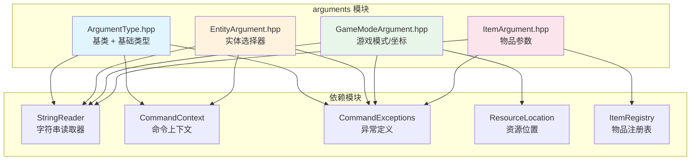

# Command Arguments 模块

命令参数解析模块，为 Minecraft 命令系统提供类型安全的参数解析器。

## 目录结构

```
src/common/command/arguments/
├── ArgumentType.hpp        # 参数类型基类 + 基础参数类型（字符串、整数、浮点、布尔、枚举）
├── BlockStateArgument.hpp  # 方块状态参数类型（支持属性解析）
├── EntityArgument.hpp      # 实体选择器参数类型（@p, @a, @e, @r, @s）
├── GameModeArgument.hpp    # 游戏模式、资源位置、坐标参数类型
└── ItemArgument.hpp        # 物品参数类型
```

## 文件详解

### ArgumentType.hpp

**职责**：定义参数类型基类和基础参数类型实现。

**核心类**：

#### `ArgumentType<T>` - 参数类型基类模板

```cpp
template<typename T>
class ArgumentType {
public:
    virtual ~ArgumentType() = default;

    // 核心方法：解析参数值
    [[nodiscard]] virtual T parse(StringReader& reader) = 0;

    // 获取参数类型名称（用于帮助信息）
    [[nodiscard]] virtual std::string getTypeName() const = 0;

    // 获取示例值列表（用于命令提示）
    [[nodiscard]] virtual std::vector<std::string> getExamples() const;
};
```

#### 内置参数类型

| 类名 | 解析类型 | 说明 | 示例 |
|------|---------|------|------|
| `StringArgumentType` | `std::string` | 三种模式：SingleWord、QuotablePhrase、GreedyPhrase | `"hello"`, `"\"hello world\""` |
| `IntegerArgumentType` | `i32` | 支持范围检查 | `123`, `-456` |
| `FloatArgumentType` | `f32` | 支持范围检查 | `3.14`, `-2.5` |
| `BoolArgumentType` | `bool` | 布尔值解析 | `true`, `false` |
| `EnumArgumentType<T>` | `T` | 枚举类型模板 | 自定义枚举值 |

**工厂方法模式**：

每个参数类型都提供静态工厂方法：

```cpp
// 字符串参数
auto word = StringArgumentType::word();        // 单词模式
auto phrase = StringArgumentType::string();    // 可引号短语
auto greedy = StringArgumentType::greedyString(); // 贪婪模式

// 整数参数（支持范围限制）
auto anyInt = IntegerArgumentType::integer();
auto positiveInt = IntegerArgumentType::integer(0);  // >= 0
auto rangeInt = IntegerArgumentType::integer(0, 100); // [0, 100]

// 浮点数参数（支持范围限制）
auto anyFloat = FloatArgumentType::floatArg();
auto rangeFloat = FloatArgumentType::floatArg(0.0f, 1.0f);

// 布尔参数
auto boolArg = BoolArgumentType::boolArg();
```

**枚举参数使用示例**：

```cpp
enum class Color { Red, Green, Blue };

auto colorArg = std::make_shared<EnumArgumentType<Color>>();
colorArg->add("red", Color::Red);
colorArg->add("green", Color::Green);
colorArg->add("blue", Color::Blue);
```

---

### EntityArgument.hpp

**职责**：处理实体选择器和玩家名称解析。

**核心类**：

#### `EntitySelector` - 实体选择器

封装实体选择逻辑，包含以下属性：

| 属性 | 类型 | 说明 |
|------|------|------|
| `type` | `EntitySelectorType` | 选择器类型 |
| `limit` | `i32` | 最大选择数量 |
| `isSelf` | `bool` | 是否选择自己 |
| `includesNonPlayers` | `bool` | 是否包含非玩家实体 |
| `single` | `bool` | 是否选择单个实体 |
| `username` | `std::string` | 玩家名称（直接指定时） |

**选择器类型**：

| 类型 | 符号 | 说明 |
|------|------|------|
| `SinglePlayer` | `@p` | 最近的单个玩家 |
| `AllPlayers` | `@a` | 所有玩家 |
| `AllEntities` | `@e` | 所有实体 |
| `RandomPlayer` | `@r` | 随机玩家 |
| `Self` | `@s` | 自己（命令执行者） |

#### `EntityArgumentType` - 实体参数类型

支持四种模式：

| 模式 | 说明 |
|------|------|
| `SingleEntity` | 单个实体 |
| `MultipleEntities` | 多个实体 |
| `SinglePlayer` | 单个玩家 |
| `MultiplePlayers` | 多个玩家 |

**解析示例**：

```cpp
auto playerArg = EntityArgumentType::player();   // 单个玩家
auto playersArg = EntityArgumentType::players(); // 多个玩家
auto entityArg = EntityArgumentType::entity();   // 单个实体
auto entitiesArg = EntityArgumentType::entities(); // 多个实体

// 解析
StringReader reader("@p[type=cow,limit=5]");
EntitySelector selector = entityArg->parse(reader);
```

**选择器参数**：

支持 `[参数=值,...]` 格式的选择器参数：

| 参数 | 别名 | 说明 |
|------|------|------|
| `limit` | `c` | 限制选择数量 |
| `distance` | - | 距离范围（支持 `min..max` 格式） |
| `level` | - | 经验等级范围（仅玩家） |
| `x`, `y`, `z` | - | 坐标偏移 |
| `dx`, `dy`, `dz` | - | 体积尺寸 |
| `sort` | - | 排序方式（nearest/furthest/random/arbitrary） |
| `type` | - | 实体类型（支持 `!` 取反） |
| `tag` | - | 实体标签（支持 `!` 取反，可多次使用） |
| `name` | - | 实体名称（支持 `!` 取反） |
| `gamemode` | `m` | 游戏模式（支持 `!` 取反，仅玩家） |
| `team` | - | 队伍（支持 `!` 取反） |
| `x_rotation` | - | 俯仰角范围（pitch，-90 到 90 度） |
| `y_rotation` | - | 偏航角范围（yaw，-180 到 180 度） |
| `scores` | - | 记分板分数条件（如 `{deaths=1..5,kills=10..}`） |
| `advancements` | - | 进度条件（如 `{minecraft:story/root=true}`） |
| `nbt` | - | NBT 数据条件（如 `{CustomName:"Test"}`，支持 `!` 取反） |
| `predicate` | - | 战利品表谓词（如 `minecraft:example`，支持 `!` 取反） |

#### `FloatRange` - 浮点数范围

用于 `distance`、`x_rotation`、`y_rotation` 参数的范围筛选。

```cpp
FloatRange range;
range.setMin(10.0f);
range.setMax(50.0f);

// 普通范围测试
bool inRange = range.test(25.0f);  // true

// 距离平方测试（用于 distance 参数）
bool inDistanceSq = range.testSquared(900.0f);  // 30^2 = 900

// 角度范围测试（处理 -180/180 边界环绕）
FloatRange angleRange;
angleRange.setMin(170.0f);
angleRange.setMax(-170.0f);  // 跨越正北方向
bool matches = angleRange.testAngle(175.0f);  // true
```

**角度范围测试说明**：

`testAngle()` 方法专门处理角度环绕问题：
- 角度会被规范化到 [-180, 180) 范围
- 当 `min > max` 时，表示范围跨越 -180/180 边界，使用 OR 逻辑
- 例如 `[170..-170]` 表示接近正北方向（170° 到 -170°，跨越 180°）

#### `IntRange` - 整数范围

用于 `level` 参数的范围筛选。

```cpp
IntRange range;
range.setMin(10);
range.setMax(30);

bool inRange = range.test(20);  // true
```

---

### GameModeArgument.hpp

**职责**：定义游戏模式、资源位置、坐标等参数类型。

**包含的参数类型**：

#### `GameModeArgumentType` - 游戏模式参数

解析游戏模式名称，支持多种格式：

| 模式 | 完整名称 | 缩写 | 数字 |
|------|---------|------|------|
| Survival | `survival` | `s` | `0` |
| Creative | `creative` | `c` | `1` |
| Adventure | `adventure` | `a` | `2` |
| Spectator | `spectator` | `sp` | `3` |

```cpp
auto gameModeArg = GameModeArgumentType::gameMode();
StringReader reader("creative");
GameMode mode = gameModeArg->parse(reader); // GameMode::Creative
```

#### `ResourceLocationArgumentType` - 资源位置参数

解析命名空间资源标识符：

```cpp
auto locArg = ResourceLocationArgumentType::resourceLocation();

// minecraft:stone -> ResourceLocation("minecraft", "stone")
// stone -> ResourceLocation("minecraft", "stone")  // 默认命名空间
```

#### `BlockPosArgumentType` - 方块位置参数

支持三种坐标格式：

| 格式 | 示例 | 说明 |
|------|------|------|
| 绝对坐标 | `100 64 -200` | 固定坐标 |
| 相对坐标 | `~ ~ ~` | 相对于执行位置 |
| 局部坐标 | `^ ^ ^` | 相对于视线方向 |

```cpp
auto posArg = BlockPosArgumentType::blockPos();
StringReader reader("100 64 -200");
Vector3i pos = posArg->parse(reader);
```

#### `Vec3ArgumentType` - 向量位置参数

与 `BlockPosArgumentType` 类似，但返回浮点坐标：

```cpp
auto vecArg = Vec3ArgumentType::vec3();
StringReader reader("~1.5 ~-0.5 ~5");
Vector3d pos = vecArg->parse(reader);
```

#### `RotationArgumentType` - 旋转参数

解析 yaw 和 pitch 角度：

```cpp
auto rotArg = RotationArgumentType::rotation();
StringReader reader("90 -45");
Vector2f rot = rotArg->parse(reader); // yaw=90, pitch=-45
```

---

### BlockStateArgument.hpp

**职责**：解析方块状态参数，支持完整的方块ID和属性解析。

**核心类**：

#### `BlockStateInput` - 方块状态输入结果

封装解析后的方块状态：

```cpp
class BlockStateInput {
public:
    [[nodiscard]] const BlockState* state() const;  // 获取方块状态
    [[nodiscard]] bool isValid() const;              // 检查是否有效
    [[nodiscard]] const Block& getBlock() const;     // 获取方块对象
    [[nodiscard]] u32 stateId() const;               // 获取状态ID
};
```

#### `BlockStateArgumentType` - 方块状态参数类型

支持解析格式：
- `stone` - 简单方块名
- `minecraft:stone` - 带命名空间的方块名
- `furnace[facing=north]` - 带单个属性的方块状态
- `oak_stairs[facing=east,half=top,waterlogged=false]` - 带多个属性的方块状态

```cpp
auto blockArg = BlockStateArgumentType::blockState();

StringReader reader("oak_stairs[facing=north,half=top]");
BlockStateInput input = blockArg->parse(reader);

if (input.isValid()) {
    const BlockState* state = input.state();
    // 使用方块状态...
}
```

**解析流程**：

1. 解析方块ID（支持 `minecraft:stone` 或 `stone` 格式）
2. 解析属性字符串 `[key=value,key2=value2]`
3. 查找方块并验证属性是否存在
4. 遍历状态表查找匹配的 BlockState

**错误处理**：

| 错误情况 | 异常消息 |
|---------|---------|
| 方块不存在 | `Unknown block: <block_id>` |
| 属性不存在 | `Unknown property '<prop>' for block <block>` |
| 属性值无效 | `Invalid value '<value>' for property '<prop>'` |
| 属性重复 | `Duplicate property '<prop>' in block state` |

**与 MC 1.16.5 对应**：

| MC 类 | 本项目类 |
|-------|---------|
| `BlockStateParser` | `BlockStateArgumentType` |
| `BlockStateInput` | `BlockStateInput` |

---

### ItemArgument.hpp

**职责**：处理物品相关的参数解析。

**核心类**：

#### `ItemInput` - 物品输入包装器

封装物品ID和可选的NBT数据：

```cpp
class ItemInput {
public:
    ItemId itemId() const;          // 获取物品ID
    bool isValid() const;           // 检查是否有效
    const Item* getItem() const;    // 获取物品对象
    std::unique_ptr<ItemStack> createStack(i32 count) const; // 创建物品堆
};
```

#### `ItemArgumentType` - 物品参数类型

解析物品标识符：

```cpp
auto itemArg = ItemArgumentType::item();

// minecraft:stone -> ItemInput(stone的ItemId)
// diamond_sword -> ItemInput(diamond_sword的ItemId)
```

#### `ItemPredicateArgumentType` - 物品谓词参数类型

用于检查物品是否匹配特定条件（当前与 `ItemArgumentType` 相同，预留扩展）：

```cpp
auto predArg = ItemPredicateArgumentType::itemPredicate();
```

---

## 模块架构



---

## 整体职责

### 输入

- `StringReader`：命令字符串读取器，提供游标式解析
- 原始命令字符串片段

### 输出

- 解析后的类型化值（`T` 模板参数）
- 解析失败时抛出 `CommandException`

### 依赖项

| 模块 | 用途 |
|------|------|
| `common/command/StringReader` | 游标式字符串读取 |
| `common/command/CommandContext` | 存储解析后的参数 |
| `common/command/exceptions/CommandExceptions` | 定义错误类型和异常 |
| `common/core/Types` | 基础类型定义 |
| `common/resource/ResourceLocation` | 资源位置解析 |
| `common/item/ItemRegistry` | 物品查找 |

---

## 使用方法

### 1. 定义命令参数

```cpp
#include "common/command/arguments/ArgumentType.hpp"
#include "common/command/arguments/EntityArgument.hpp"
#include "common/command/arguments/GameModeArgument.hpp"

// 创建命令节点
auto rootNode = std::make_shared<LiteralCommandNode<ServerPlayer>>("gamemode");

// 添加参数节点
auto modeArg = std::make_shared<ArgumentCommandNode<ServerPlayer, GameMode>>(
    "mode",
    GameModeArgumentType::gameMode()
);

modeArg->setCommand([](CommandContext<ServerPlayer>& ctx) {
    GameMode mode = GameModeArgumentType::getGameMode(ctx, "mode");
    ctx.getSource().setGameMode(mode);
    return 1;
});

rootNode->addChild(modeArg);
```

### 2. 从命令上下文获取参数

```cpp
// 方式一：通过参数类型静态方法
GameMode mode = GameModeArgumentType::getGameMode(context, "mode");
Vector3i pos = BlockPosArgumentType::getBlockPos(context, "pos");
ItemInput item = ItemArgumentType::getItem(context, "item");

// 方式二：通过上下文模板方法
GameMode mode = context.getArgument<GameMode>("mode");
```

### 3. 自定义参数类型

```cpp
class ColorArgumentType : public ArgumentType<Color> {
public:
    [[nodiscard]] Color parse(StringReader& reader) override {
        i32 start = reader.getCursor();
        std::string name = reader.readUnquotedString();

        if (name == "red") return Color::Red;
        if (name == "green") return Color::Green;
        if (name == "blue") return Color::Blue;

        reader.setCursor(start);
        throw CommandException(
            CommandErrorType::Unknown,
            "Unknown color: " + name,
            start
        );
    }

    [[nodiscard]] std::string getTypeName() const override {
        return "color";
    }

    [[nodiscard]] std::vector<std::string> getExamples() const override {
        return {"red", "green", "blue"};
    }
};
```

---

## 容易踩的坑

### 1. 游标回退

**问题**：解析失败时必须回退游标到起始位置。

**正确做法**：

```cpp
[[nodiscard]] T parse(StringReader& reader) override {
    i32 start = reader.getCursor();  // 记录起始位置

    // ... 解析逻辑 ...

    if (解析失败) {
        reader.setCursor(start);  // 回退游标！
        throw CommandException(..., start);
    }

    return result;
}
```

### 2. 选择器模式验证

**问题**：`@e` 选择器不能用于只接受玩家的参数。

**解决**：`EntityArgumentType` 会在 `validateSelector` 中检查：

```cpp
// 这会抛出 PlayerTooMany 异常
auto playerArg = EntityArgumentType::player();
StringReader reader("@e[limit=1]");
playerArg->parse(reader);  // 抛出异常
```

### 3. 相对坐标和局部坐标

**问题**：`BlockPosArgumentType` 当前实现只返回绝对坐标，未实现相对/局部坐标的计算。

**注意**：`~` 和 `^` 前缀的坐标需要在命令执行时根据执行者位置/朝向进行计算，这需要额外的上下文信息。

### 4. 物品解析失败

**问题**：物品ID不存在时会抛出异常。

**解决**：确保物品已在 `ItemRegistry` 中注册，或捕获异常进行处理。

### 5. 枚举参数的生命周期

**问题**：`EnumArgumentType` 使用链式调用配置，注意对象生命周期。

**正确做法**：

```cpp
// 方式一：分开创建和配置
auto enumArg = std::make_shared<EnumArgumentType<Color>>();
enumArg->add("red", Color::Red);
enumArg->add("green", Color::Green);

// 方式二：使用 shared_ptr 确保生命周期
auto enumArg = std::shared_ptr<EnumArgumentType<Color>>(
    (new EnumArgumentType<Color>())
        ->add("red", Color::Red)
        ->add("green", Color::Green)
);
```

---

## 测试用例

相关测试：

| 测试文件 | 测试内容 |
|----------|----------|
| `tests/common/command/test_command_dispatcher.cpp` | StringReader、CommandNode、ArgumentType、CommandResult、CommandException、Suggestions、CommandDispatcher |
| `tests/common/command/arguments/EntityArgumentTest.cpp` | FloatRange、IntRange、EntitySelector、选择器解析、角度范围解析和测试 |

**EntityArgumentTest 测试覆盖**：

| 测试套件 | 测试数量 | 测试内容 |
|----------|----------|----------|
| `FloatRangeTest` | 6 | 默认无界、最小/最大边界、范围测试、平方测试 |
| `IntRangeTest` | 3 | 默认无界、边界设置、范围测试 |
| `EntitySelectorTest` | 15 | 工厂方法、属性设置（距离、等级、坐标、尺寸、排序、类型、标签、游戏模式、队伍） |
| `EntitySelectorRotationTest` | 3 | x_rotation/y_rotation 默认无界、设置值 |
| `EntityArgumentParseTest` | 25 | 选择器类型解析（@p/@a/@e/@r/@s）、参数解析（distance、level、limit、sort、坐标、尺寸、name、gamemode、type、tag、team、x_rotation、y_rotation） |
| `EntityArgumentRotationParseTest` | 11 | x_rotation/y_rotation 解析（范围、单边界、精确值、跨越边界、与其他参数组合） |
| `EntityArgumentScoresParseTest` | 4 | scores 参数解析（单个分数、分数范围、多个分数、includesNonPlayers 设置） |
| `EntityArgumentAdvancementsParseTest` | 5 | advancements 参数解析（完成状态、未完成状态、准则条件、多个进度、includesNonPlayers 设置） |
| `EntityArgumentPredicateParseTest` | 3 | predicate 参数解析（基本格式、取反格式、无命名空间格式） |
| `EntityArgumentNbtParseTest` | 6 | nbt 参数解析（简单 NBT、取反、复杂 NBT、嵌套 NBT、空 NBT、数字类型） |
| `EntityArgumentEdgeCaseTest` | 20 | 边界和异常场景（空参数、多参数组合、引号包围、空白处理、负坐标、无效值、重复参数、多标签、多记分板目标等） |

**示例测试代码**：

```cpp
TEST_F(ArgumentTypeTest, IntegerArgument) {
    auto intArg = IntegerArgumentType::integer(0, 100);

    StringReader reader1("50");
    EXPECT_EQ(intArg->parse(reader1), 50);

    StringReader reader2("150");
    EXPECT_THROW(intArg->parse(reader2), CommandException);

    StringReader reader3("-10");
    EXPECT_THROW(intArg->parse(reader3), CommandException);
}

TEST_F(ArgumentTypeTest, EnumArgument) {
    enum class TestEnum { A, B, C };

    auto enumArg = std::make_shared<EnumArgumentType<TestEnum>>();
    enumArg->add("a", TestEnum::A);
    enumArg->add("b", TestEnum::B);
    enumArg->add("c", TestEnum::C);

    StringReader reader1("a");
    EXPECT_EQ(enumArg->parse(reader1), TestEnum::A);

    StringReader reader3("invalid");
    EXPECT_THROW(enumArg->parse(reader3), CommandException);
}
```

---

## 与 Minecraft 1.16.5 的对应关系

| MC 类 | 本项目类 | 说明 |
|-------|---------|------|
| `ArgumentType<T>` | `ArgumentType<T>` | 完全对应 |
| `StringArgumentType` | `StringArgumentType` | 三种模式对应 |
| `IntegerArgumentType` | `IntegerArgumentType` | 范围检查对应 |
| `FloatArgumentType` | `FloatArgumentType` | 范围检查对应 |
| `BoolArgumentType` | `BoolArgumentType` | 对应 |
| `EntityArgument` | `EntityArgumentType` | 选择器解析对应 |
| `EntitySelector` | `EntitySelector` | 选择器封装对应 |
| `GameModeArgument` | `GameModeArgumentType` | 游戏模式对应 |
| `BlockPosArgument` | `BlockPosArgumentType` | 坐标解析对应 |
| `Vec3Argument` | `Vec3ArgumentType` | 向量解析对应 |
| `ItemArgument` | `ItemArgumentType` | 物品解析对应 |
| `ResourceLocationArgument` | `ResourceLocationArgumentType` | 资源位置对应 |

---

## 扩展计划

当前模块已实现核心参数类型，未来可扩展：

1. **NBT 过滤逻辑**：当前仅实现参数解析，过滤逻辑需要 Entity 类支持 NBT 序列化
2. **谓词过滤逻辑**：当前仅实现参数解析，过滤逻辑需要 LootConditionManager 支持
3. **组件参数类型**：解析文本组件（JSON）
4. **时间参数类型**：解析时间字符串（如 `10s`, `5m`, `1h`）
5. **角度参数类型**：解析角度（支持度数和弧度）

---

## NbtPath 参数类型

### NbtPath.hpp / NbtPathArgumentType.hpp

**职责**：解析和操作 NBT 路径，支持 `/data` 命令的各种操作。

**核心类**：

#### `NbtPath` - NBT 路径

表示完整的 NBT 路径，由多个节点组成。支持路径解析、获取、设置、删除操作。

**支持的路径语法**：

| 语法 | 说明 | 示例 |
|------|------|------|
| `"foo"` | 访问复合标签的键 | `foo` |
| `"foo.bar"` | 访问嵌套键 | `Items[0].id` |
| `"foo[0]"` | 访问列表的第一个元素 | `Items[0]` |
| `"foo[-1]"` | 访问列表的最后一个元素 | `Items[-1]` |
| `"foo[]"` | 访问列表的所有元素 | `Items[]` |
| `"{foo:bar}"` | 复合过滤器 | `{id:"diamond"}` |
| `"foo{bar:1}"` | 键名 + 复合过滤器 | `Items{id:"diamond"}` |
| `"foo[{id:'diamond'}]"` | 列表过滤器 | `Items[{id:"diamond"}]` |

**使用示例**：

```cpp
// 解析路径
StringReader reader("Items[0].tag.display.Name");
NbtPath path = NbtPathArgumentType::nbtPath()->parse(reader);

// 获取值
auto results = path.get(compoundTag);

// 设置值
path.set(compoundTag, []() {
    return std::make_unique<nbt::tags::string_tag>("Custom Name");
});

// 删除值
path.remove(compoundTag);

// 合并值
path.merge(compoundTag, mergeData);

// 列表操作
path.insert(compoundTag, 1, values);
path.append(compoundTag, values);
path.prepend(compoundTag, values);
```

#### `NbtPathNode` - 路径节点基类

抽象基类，所有路径节点类型的接口：

| 方法 | 说明 |
|------|------|
| `get(tag)` | 从标签获取匹配的所有值 |
| `set(tag, supplier)` | 设置路径指向的值 |
| `remove(tag)` | 删除路径指向的值 |
| `getOrCreate(tag, creator)` | 获取或创建目标标签 |
| `toString()` | 获取节点描述字符串 |

**节点实现类**：

| 类名 | 说明 | 示例 |
|------|------|------|
| `NbtPathStringNode` | 字符串节点 | `foo` |
| `NbtPathIndexNode` | 索引节点 | `[0]`, `[-1]` |
| `NbtPathAllElementsNode` | 所有元素节点 | `[]` |
| `NbtPathCompoundFilterNode` | 复合过滤节点 | `{foo:bar}` |
| `NbtPathListFilterNode` | 列表过滤节点 | `[{id:"diamond"}]` |
| `NbtPathKeyFilterNode` | 键名过滤器节点 | `foo{bar:1}` |

#### `NbtPathArgumentType` - NBT 路径参数类型

```cpp
auto nbtPathArg = NbtPathArgumentType::nbtPath();
StringReader reader("Items[0].tag");
NbtPath path = nbtPathArg->parse(reader);
```

#### `NbtCompoundArgumentType` - NBT 复合标签参数类型

解析 Mojangson 格式的 NBT 复合标签：

```cpp
auto nbtCompoundArg = NbtCompoundArgumentType::nbtCompound();
StringReader reader("{foo:bar,count:42}");
auto compound = nbtCompoundArg->parse(reader);
```

#### `NbtTagArgumentType` - NBT 标签参数类型

解析任意 NBT 标签：

```cpp
auto nbtTagArg = NbtTagArgumentType::nbtTag();

// 字符串
StringReader reader1("\"hello\"");
auto strTag = nbtTagArg->parse(reader1);

// 数字
StringReader reader2("42");
auto intTag = nbtTagArg->parse(reader2);

// 列表
StringReader reader3("[1,2,3]");
auto listTag = nbtTagArg->parse(reader3);
```

**NBT 值格式支持**：

| 类型 | 格式 | 示例 |
|------|------|------|
| 字符串 | `"text"` 或 `text` | `"hello"`, `hello` |
| 字节 | `数字b` 或 `数字B` | `10b`, `-5B` |
| 短整型 | `数字s` 或 `数字S` | `100s`, `1000S` |
| 整型 | `数字` | `42`, `-100` |
| 长整型 | `数字l` 或 `数字L` | `100000L` |
| 浮点 | `数字f` 或 `数字F` | `3.14f` |
| 双精度 | `数字d` 或 `数字D` 或 `数字.` | `3.14159d`, `2.5` |
| 布尔 | `true` 或 `false` | `true`, `false` |
| 复合标签 | `{key:value,...}` | `{foo:bar,count:1}` |
| 列表 | `[value,...]` | `[1,2,3]` |
| 字节数组 | `[B;value,...]` | `[B;1,2,3]` |
| 整型数组 | `[I;value,...]` | `[I;1,2,3]` |
| 长整型数组 | `[L;value,...]` | `[L;1,2,3]` |

---

## 更新历史

| 日期 | 版本 | 变更 |
|------|------|------|
| 2024-01 | 1.0 | 初始版本，包含基础参数类型 |
| 2024-02 | 1.1 | 添加实体选择器参数支持 |
| 2024-03 | 1.2 | 添加坐标和旋转参数类型 |
| 2024-05 | 1.3 | 添加 BlockStateArgumentType，支持方块状态属性解析 |
| 2026-05 | 1.4 | 实现 x_rotation/y_rotation 角度范围解析；添加 FloatRange::testAngle() 方法；修复 readSelectorArgumentToken() 支持 `!` 取反前缀；完善选择器参数支持（distance、level、x/y/z、dx/dy/dz、sort、type、tag、name、gamemode、team、x_rotation、y_rotation） |
| 2026-05 | 1.5 | 实现 scores/advancements/nbt/predicate 参数解析；添加 EntitySelector::NbtCondition、PredicateCondition、AdvancementCondition 结构；在 PlayerResolver 中实现 scores 和 advancements 过滤逻辑；nbt 和 predicate 过滤逻辑待完善（依赖 Entity NBT 序列化和 LootConditionManager）；修复 scores/advancements 参数解析 bug |
| 2026-05 | 1.6 | 修复 scores/advancements 参数解析 bug：新增 readScoresKey/readAdvancementKey/readCriteriaKey 方法正确处理分隔符和 ResourceLocation 格式 |
| 2026-05 | 1.7 | 添加 NbtPath、NbtPathArgumentType、NbtCompoundArgumentType、NbtTagArgumentType；支持完整的 NBT 路径解析和操作；实现所有路径节点类型（String、Index、AllElements、CompoundFilter、ListFilter、KeyFilter）；支持 Mojangson 格式 NBT 解析 |
