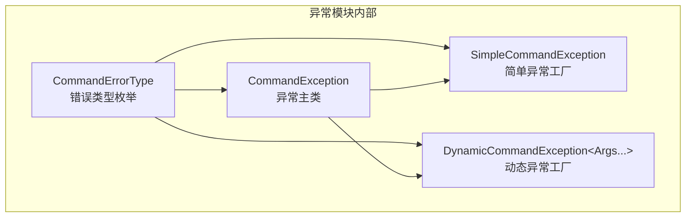

# Command Exceptions 模块

命令异常模块为命令解析和执行系统提供统一的错误报告机制。

## 目录结构

```
src/common/command/exceptions/
└── CommandExceptions.hpp    # 异常类型定义（CommandErrorType 枚举、CommandException 类、异常工厂类）
```

## 内部模块关系



## 上下游外部依赖关系

### 依赖项

| 依赖项 | 用途 |
|--------|------|
| `common/core/Types.hpp` | 基础类型定义（`std::string`, `std::string_view`, `i32` 等） |
| `common/core/Result.hpp` | `Result<T>` 错误处理类型 |
| `<stdexcept>` | `std::runtime_error` 基类 |

### 使用者

| 使用者 | 用途 |
|--------|------|
| `StringReader` | 字符串读取器解析失败时抛出异常 |
| `ArgumentType` 及其子类 | 参数类型解析器验证失败时抛出异常 |
| `CommandNode` | 命令节点解析失败时抛出异常 |
| `CommandDispatcher` | 捕获并收集解析异常，返回 ParseResults |

## 容易踩的坑

### 1. Cursor 位置未设置

使用 `create()` 创建异常时，cursor 默认为 -1，无法定位错误位置。应使用 `createWithContext()` 传入位置和输入字符串。

### 2. 动态参数类型不匹配

`DynamicCommandException` 的模板参数与 `create()` 调用参数必须匹配，否则编译错误。

### 3. 异常未携带输入字符串

捕获异常后重新抛出时，应使用 `withInput()` 保留原始输入，否则无法显示完整的错误上下文。

### 4. 异常捕获顺序

`CommandException` 继承自 `std::runtime_error`，catch 时要先捕获派生类 `CommandException`，再捕获基类 `std::runtime_error`。

### 5. 格式化字符串占位符

`DynamicCommandException` 只支持 `{}` 占位符（按顺序替换），不支持 `{0}`, `{1}` 等位置参数。

### 6. NBT 路径错误类型

枚举中新增了 NBT 路径相关错误类型（`NbtPathNotFound`, `NbtPathMultipleResults`, `NbtPathInvalidType`, `NbtPathIndexOutOfBounds`, `InvalidNbtPath`），处理 NBT 参数时需注意使用正确的错误类型。
