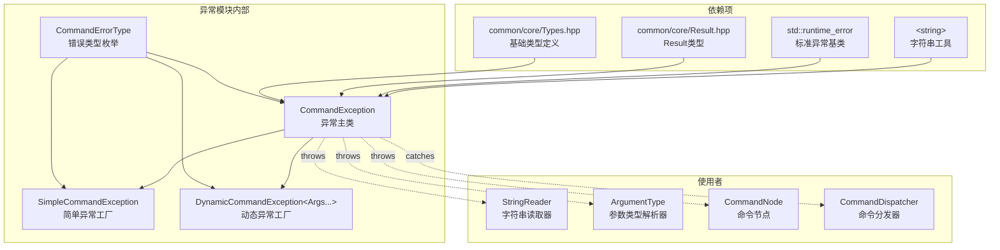
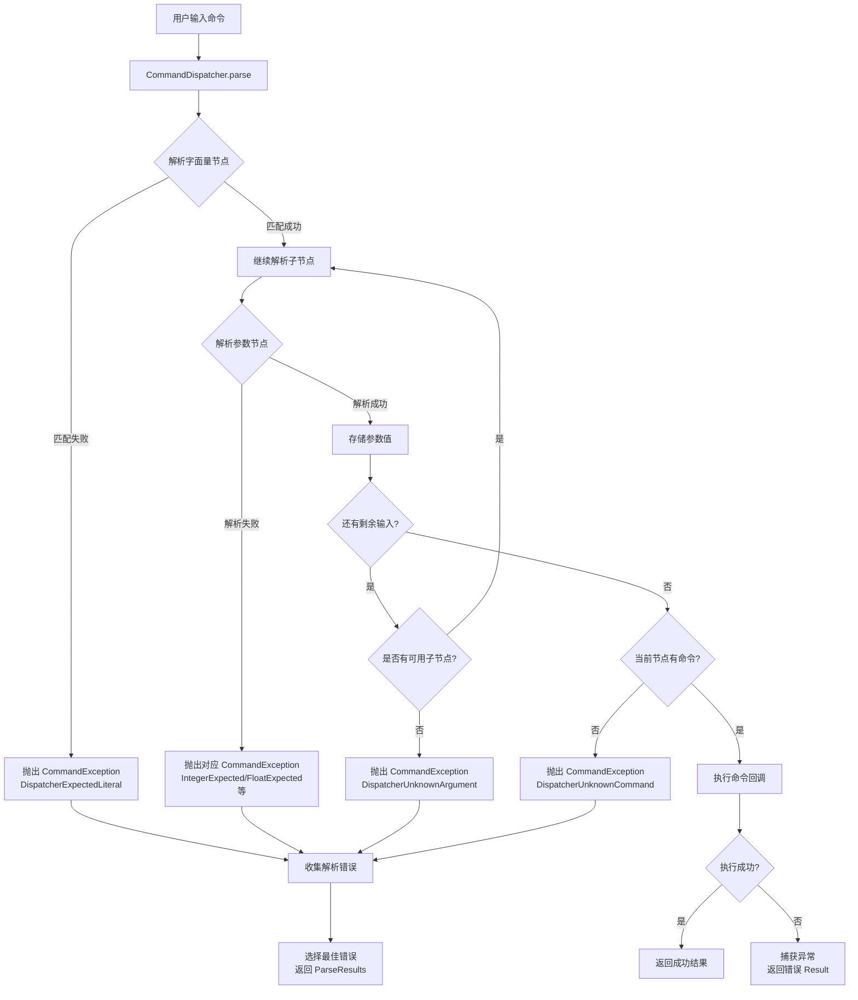

# Command Exceptions 模块

命令异常模块为命令解析和执行系统提供统一的错误报告机制。

## 目录结构

```
src/common/command/exceptions/
└── CommandExceptions.hpp    # 异常类型定义
```

## 文件详解

### CommandExceptions.hpp

命令异常定义文件，包含命令系统中使用的所有异常类型和错误码。

#### 主要内容

| 组件 | 类型 | 描述 |
|------|------|------|
| `CommandErrorType` | 枚举 | 定义所有命令错误类型 |
| `CommandException` | 类 | 命令异常基类 |
| `SimpleCommandException` | 类 | 无参数异常工厂 |
| `DynamicCommandException<Args...>` | 模板类 | 带参数异常工厂 |

#### CommandErrorType 枚举

定义命令解析和执行过程中可能遇到的各种错误类型：

```cpp
enum class CommandErrorType {
    // 分发器错误
    DispatcherUnknownCommand,           // 未知命令
    DispatcherUnknownArgument,          // 未知参数
    DispatcherExpectedArgumentSeparator,// 期望参数分隔符
    DispatcherExpectedLiteral,          // 期望字面量

    // 参数错误
    IntegerExpected,                    // 期望整数
    IntegerTooLow,                      // 整数太小
    IntegerTooHigh,                     // 整数太大
    FloatExpected,                      // 期望浮点数
    FloatTooLow,                        // 浮点数太小
    FloatTooHigh,                       // 浮点数太大
    BoolExpected,                       // 期望布尔值
    StringExpected,                     // 期望字符串
    StringQuotedExpected,               // 期望引号字符串

    // 实体选择器错误
    EntityNotFound,                     // 实体未找到
    PlayerNotFound,                     // 玩家未找到
    EntityTooMany,                      // 实体太多
    PlayerTooMany,                      // 玩家太多
    EntitySelectorNotAllowed,           // 选择器不允许
    EntitySelectorInvalid,              // 无效的选择器

    // 位置参数错误
    BlockPosUnloaded,                   // 方块位置未加载
    BlockPosOutOfWorld,                 // 方块位置超出世界

    // 权限错误
    PermissionDenied,                   // 权限不足

    // 通用错误
    Unknown,                            // 未知错误
};
```

#### CommandException 类

命令异常的主类，继承自 `std::runtime_error`：

```cpp
class CommandException : public std::runtime_error {
public:
    // 构造函数
    explicit CommandException(CommandErrorType type, const String& message);
    CommandException(CommandErrorType type, const String& message, i32 cursor);

    // 访问器
    [[nodiscard]] CommandErrorType type() const noexcept;
    [[nodiscard]] const String& message() const noexcept;
    [[nodiscard]] i32 cursor() const noexcept;
    [[nodiscard]] const String& input() const noexcept;

    // 创建带上下文的异常副本
    [[nodiscard]] CommandException withInput(StringView input) const;
};
```

**核心属性：**

| 属性 | 类型 | 描述 |
|------|------|------|
| `m_type` | `CommandErrorType` | 错误类型枚举值 |
| `m_message` | `String` | 人类可读的错误消息 |
| `m_cursor` | `i32` | 错误发生位置（-1 表示未知） |
| `m_input` | `String` | 原始输入字符串（可选） |

#### SimpleCommandException 类

用于创建无参数的异常消息，适合预定义错误：

```cpp
class SimpleCommandException {
public:
    explicit SimpleCommandException(CommandErrorType type, const String& message);

    // 创建异常实例
    [[nodiscard]] CommandException create() const;
    [[nodiscard]] CommandException createWithContext(i32 cursor, StringView input) const;
};
```

**使用示例：**

```cpp
// 预定义异常常量
const SimpleCommandException ERROR_ENTITY_NOT_FOUND(
    CommandErrorType::EntityNotFound,
    "Entity not found"
);

// 在代码中使用
throw ERROR_ENTITY_NOT_FOUND.createWithContext(cursor, input);
```

#### DynamicCommandException 模板类

用于创建带动态参数的异常消息，支持 `{}` 占位符：

```cpp
template<typename... Args>
class DynamicCommandException {
public:
    explicit DynamicCommandException(CommandErrorType type, const String& format);

    // 创建异常实例，参数替换 {} 占位符
    [[nodiscard]] CommandException create(Args... args) const;
};
```

**使用示例：**

```cpp
// 预定义带参数的异常
const DynamicCommandException<int, int> ERROR_INTEGER_RANGE(
    CommandErrorType::IntegerTooLow,
    "Integer must be between {} and {}"
);

// 在代码中使用
throw ERROR_INTEGER_RANGE.create(min, max);
```

## 模块关系图



## 异常处理流程



## 整体职责

异常模块负责：

1. **错误类型标准化** - 通过 `CommandErrorType` 枚举定义所有可能的命令错误类型
2. **异常信息携带** - 异常包含错误类型、消息、位置和原始输入
3. **异常工厂模式** - 提供简单和动态两种异常创建方式
4. **与标准库兼容** - 继承 `std::runtime_error`，可被标准异常处理机制捕获

## 输入和输出

### 输入

- 无运行时输入，模块仅提供类型定义

### 输出

| 输出类型 | 描述 |
|----------|------|
| `CommandErrorType` 枚举值 | 标识错误类型 |
| `CommandException` 实例 | 携带完整错误信息的异常对象 |
| 错误消息字符串 | 人类可读的错误描述 |

## 依赖项

| 依赖项 | 用途 |
|--------|------|
| `common/core/Types.hpp` | 基础类型定义（`String`, `StringView`, `i32` 等） |
| `common/core/Result.hpp` | `Result<T>` 错误处理类型 |
| `<string>` | 标准字符串类 |
| `<stdexcept>` | `std::runtime_error` 基类 |

## 使用方法

### 直接创建异常

```cpp
#include "common/command/exceptions/CommandExceptions.hpp"

// 创建简单异常
throw CommandException(
    CommandErrorType::IntegerExpected,
    "Expected integer value"
);

// 创建带位置的异常
throw CommandException(
    CommandErrorType::IntegerTooHigh,
    "Integer must be at most 100",
    cursorPosition  // 错误发生的字符位置
);

// 创建带完整上下文的异常
CommandException ex(CommandErrorType::Unknown, "Error", 5);
throw ex.withInput("/gamemode creative");
```

### 使用预定义异常

```cpp
// 定义全局异常常量
namespace errors {
    const SimpleCommandException INTEGER_EXPECTED(
        CommandErrorType::IntegerExpected,
        "Expected integer"
    );

    const DynamicCommandException<int, int> INTEGER_OUT_OF_RANGE(
        CommandErrorType::IntegerTooLow,
        "Integer must be between {} and {}"
    );
}

// 在解析代码中使用
i32 parseInteger(StringReader& reader, i32 min, i32 max) {
    i32 start = reader.getCursor();
    if (!canParseInteger(reader)) {
        throw errors::INTEGER_EXPECTED.createWithContext(start, reader.getString());
    }

    i32 value = reader.readInt();
    if (value < min || value > max) {
        throw errors::INTEGER_OUT_OF_RANGE.create(min, max);
    }
    return value;
}
```

### 捕获和处理异常

```cpp
try {
    auto result = dispatcher.execute(input, source);
    if (result.success()) {
        // 命令执行成功
    } else {
        // 命令执行失败（非异常方式）
        spdlog::error("Command failed: {}", result.error().message());
    }
} catch (const CommandException& e) {
    // 命令解析或执行异常
    spdlog::error("Command error at position {}: {}", e.cursor(), e.message());

    // 显示错误位置
    if (!e.input().empty()) {
        String pointer(e.cursor(), ' ');
        pointer += '^';
        spdlog::error("{}", e.input());
        spdlog::error("{}", pointer);
    }
}
```

## 容易踩的坑

### 1. Cursor 位置未设置

**问题：** 使用 `create()` 创建异常时，cursor 默认为 -1，无法定位错误位置。

```cpp
// 错误：cursor 为 -1
throw SimpleCommandException(
    CommandErrorType::IntegerExpected,
    "Expected integer"
).create();

// 正确：带位置的创建
throw SimpleCommandException(
    CommandErrorType::IntegerExpected,
    "Expected integer"
).createWithContext(reader.getCursor(), reader.getString());
```

### 2. 动态参数类型不匹配

**问题：** `DynamicCommandException` 的模板参数与 `create()` 调用参数不匹配会导致编译错误。

```cpp
// 定义时指定了 int, int 参数
DynamicCommandException<int, int> ERROR("type", "Range: {} to {}");

// 错误：参数数量不匹配
ERROR.create(1);  // 编译错误：缺少第二个参数

// 正确：参数数量和类型匹配
ERROR.create(1, 10);
```

### 3. 异常未携带输入字符串

**问题：** 抛出的异常没有原始输入，无法显示完整的错误上下文。

```cpp
// 错误：丢失输入上下文
catch (const CommandException& e) {
    throw e;  // 直接重新抛出，但 input 可能为空
}

// 正确：保留输入上下文
catch (const CommandException& e) {
    throw e.withInput(originalInput);
}
```

### 4. 异常捕获顺序

**问题：** `CommandException` 继承自 `std::runtime_error`，捕获时要注意顺序。

```cpp
// 错误顺序：先捕获基类
try {
    // ...
} catch (const std::runtime_error& e) {
    // 会先捕获 CommandException
} catch (const CommandException& e) {
    // 永远不会执行
}

// 正确顺序：先捕获派生类
try {
    // ...
} catch (const CommandException& e) {
    // 处理命令异常
} catch (const std::runtime_error& e) {
    // 处理其他运行时异常
}
```

### 5. 格式化字符串占位符

**问题：** `DynamicCommandException` 只支持 `{}` 占位符，不支持位置参数。

```cpp
// 支持的格式
DynamicCommandException<int, int> OK("type", "Range: {} to {}");

// 不支持的格式（不会替换）
DynamicCommandException<int> BAD("type", "Value: {0}");  // {0} 不会被替换
```

## 涉及的测试用例

测试文件位置：`tests/common/command/test_command_dispatcher.cpp`

| 测试用例 | 描述 |
|----------|------|
| `CommandExceptionTest::CreateException` | 测试基本异常创建，验证类型、消息和位置 |
| `CommandExceptionTest::SimpleException` | 测试 `SimpleCommandException::create()` 方法 |
| `CommandExceptionTest::ExceptionWithInput` | 测试 `withInput()` 方法保留原始输入 |
| `StringReaderTest::ReadIntWithRange` | 测试整数范围检查抛出 `CommandException` |
| `StringReaderTest::Expect` | 测试 `expect()` 方法抛出异常 |
| `ArgumentTypeTest::IntegerArgument` | 测试参数解析器范围验证抛出异常 |
| `ArgumentTypeTest::FloatArgument` | 测试浮点参数范围验证抛出异常 |
| `ArgumentTypeTest::BoolArgument` | 测试布尔参数解析错误抛出异常 |
| `ArgumentTypeTest::EnumArgument` | 测试枚举参数无效值抛出异常 |
| `CommandDispatcherTest::ExecuteFailsOnUnknownExtraArgument` | 测试分发器未知参数错误 |

### 测试代码示例

```cpp
TEST_F(CommandExceptionTest, CreateException) {
    CommandException ex(CommandErrorType::IntegerExpected, "Expected integer", 5);

    EXPECT_EQ(ex.type(), CommandErrorType::IntegerExpected);
    EXPECT_EQ(ex.message(), "Expected integer");
    EXPECT_EQ(ex.cursor(), 5);
}

TEST_F(CommandExceptionTest, SimpleException) {
    SimpleCommandException simpleEx(CommandErrorType::EntityNotFound, "Entity not found");

    CommandException ex = simpleEx.create();
    EXPECT_EQ(ex.type(), CommandErrorType::EntityNotFound);
    EXPECT_EQ(ex.cursor(), -1);  // 无位置信息
}

TEST_F(CommandExceptionTest, ExceptionWithInput) {
    CommandException ex(CommandErrorType::Unknown, "Error", 5);
    CommandException withInput = ex.withInput("test input");

    EXPECT_EQ(withInput.input(), "test input");
}

// 参数解析器测试
TEST_F(ArgumentTypeTest, IntegerArgument) {
    auto intArg = IntegerArgumentType::integer(0, 100);

    StringReader reader1("50");
    EXPECT_EQ(intArg->parse(reader1), 50);

    StringReader reader2("150");
    EXPECT_THROW(intArg->parse(reader2), CommandException);  // 超出范围
}
```

## 扩展指南

### 添加新的错误类型

1. 在 `CommandErrorType` 枚举中添加新类型：

```cpp
enum class CommandErrorType {
    // ... 现有类型 ...

    // 新增错误类型
    CustomError,          // 自定义错误
    ValidationFailed,     // 验证失败
};
```

2. 定义预定义异常：

```cpp
// 在全局命名空间或专门的 errors 命名空间中
namespace command_errors {
    const SimpleCommandException CUSTOM_ERROR(
        CommandErrorType::CustomError,
        "Custom error message"
    );

    const DynamicCommandException<String> VALIDATION_FAILED(
        CommandErrorType::ValidationFailed,
        "Validation failed: {}"
    );
}
```

3. 在相关代码中使用新异常：

```cpp
void validateInput(StringReader& reader) {
    if (!isValid(reader.peek())) {
        throw command_errors::CUSTOM_ERROR.createWithContext(
            reader.getCursor(),
            reader.getString()
        );
    }
}
```

## 参考资料

- Minecraft Java Edition 1.16.5 `com.mojang.brigadier.exceptions` 包
- 项目 CLAUDE.md 命令系统文档
