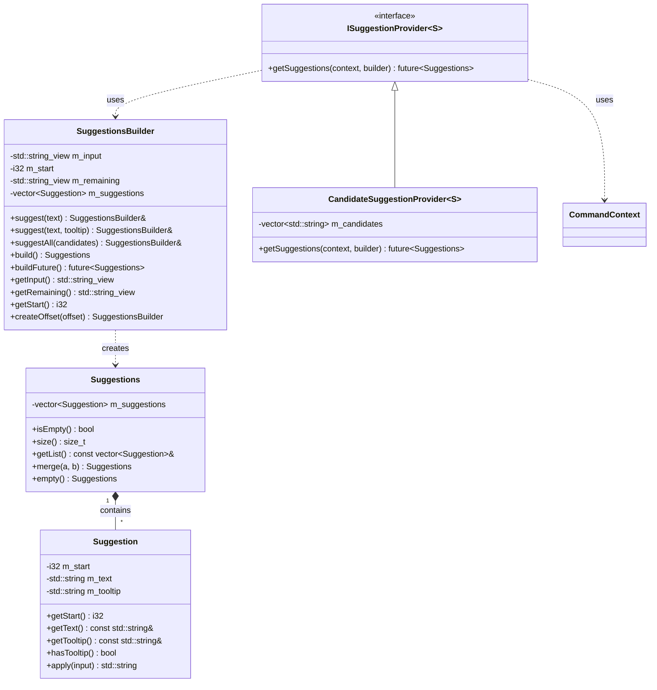
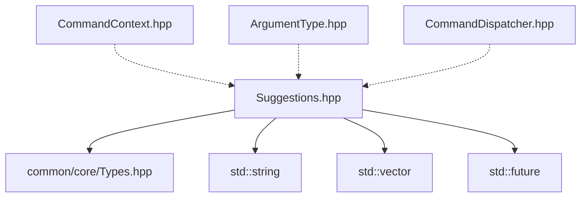

# Suggestions 模块

命令自动补全建议系统，用于在玩家输入命令时提供 Tab 补全功能。

## 目录结构

```
src/common/command/suggestions/
└── Suggestions.hpp    # 建议系统核心实现（Suggestion、Suggestions、SuggestionsBuilder、ISuggestionProvider）
```

## 内部模块关系



**核心组件**：
- `Suggestion` - 单个自动补全建议（文本 + 位置 + 可选工具提示）
- `Suggestions` - 建议容器，自动按字典序排序
- `SuggestionsBuilder` - 增量构建建议列表，支持链式调用
- `ISuggestionProvider` - 建议提供者抽象接口，返回 `std::future<Suggestions>` 支持异步
- `CandidateSuggestionProvider` - 基于预定义候选词列表的实现

## 外部依赖关系



**内部依赖**：
- `common/core/Types.hpp` - 基础类型定义（i32, std::string, std::string_view 等）

**被依赖**：
- `CommandContext.hpp` - 命令上下文（前向声明）
- `ArgumentType.hpp` - 参数类型需要访问 `CommandContext`
- `CommandDispatcher.hpp` - 命令分发器使用建议系统

## 容易踩的坑

### 1. 起始位置理解错误

`m_start` 是建议文本的起始位置，不是当前光标位置。`getRemaining()` 返回从 `m_start` 开始的子串，建议文本会替换从 `m_start` 到末尾的内容。

```cpp
// 输入: "gamemode survival"，建议应该替换 "survival"
SuggestionsBuilder builder("gamemode survival", 9);  // 正确：9 是 "survival" 的起始位置
```

### 2. suggestAll 的大小写问题

`suggestAll` 使用不区分大小写的前缀匹配，候选词列表中的 "Apple"、"APPLE"、"apple" 都会匹配前缀 "ap"。

### 3. 异步返回的 future 处理

`ISuggestionProvider::getSuggestions` 返回 `std::future<Suggestions>`，需要正确处理 future（阻塞等待或异步获取）。

### 4. 建议自动排序

`Suggestions` 构造时自动按字典序排序，不是添加顺序。

### 5. 子构建器的偏移计算

`createOffset(offset)` 创建的子构建器，其 `m_start` = 原始 `m_start` + offset，`m_remaining` 从新位置开始。

### 6. 空建议的处理

`Suggestions::empty()` 或不添加任何建议的 `builder.build()` 都会产生空建议集合，使用 `isEmpty()` 检查。
