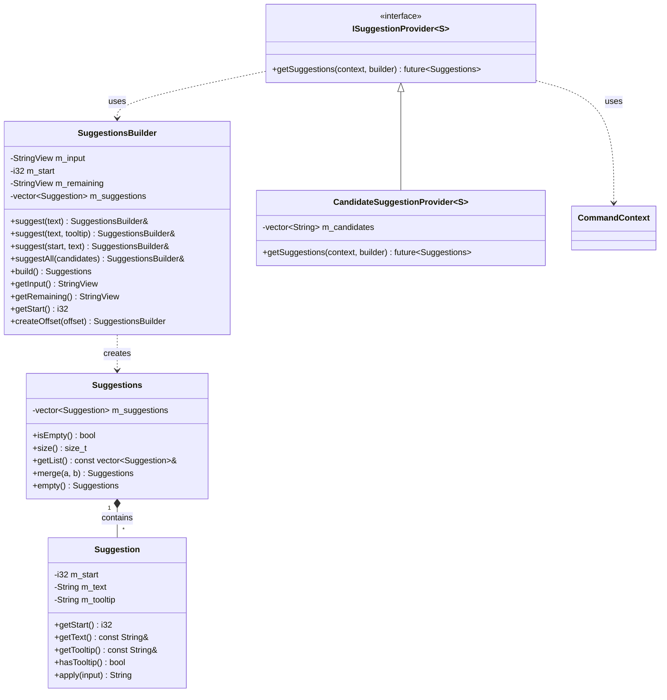
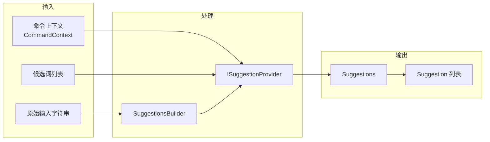
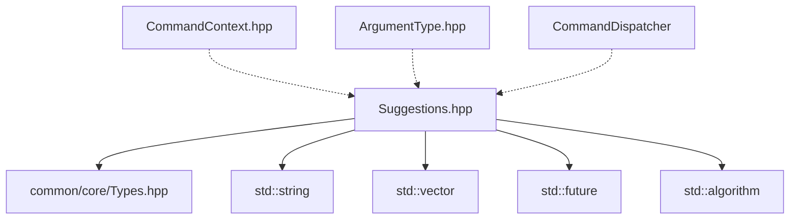

# Suggestions 模块

命令自动补全建议系统，用于在玩家输入命令时提供 Tab 补全功能。

## 目录结构

```
src/common/command/suggestions/
└── Suggestions.hpp    # 建议系统核心实现
```

## 文件详解

### Suggestions.hpp

**职责**：提供命令自动补全建议的完整基础设施，包括建议对象、构建器、提供者接口。

#### 核心类



#### Suggestion 类

表示单个自动补全建议。

| 成员 | 说明 |
|------|------|
| `m_start` | 建议文本的起始位置 |
| `m_text` | 建议文本内容 |
| `m_tooltip` | 可选的工具提示（悬停显示） |

**核心方法**：

- `apply(input)` - 将建议应用到输入字符串，返回补全后的完整字符串
- `operator<` - 按文本字典序排序
- `operator==` - 比较两个建议是否相等

#### Suggestions 类

包含一组自动补全建议的容器。

| 成员 | 说明 |
|------|------|
| `m_suggestions` | 建议列表（自动排序） |

**核心方法**：

- `merge(a, b)` - 合并两组建议
- `empty()` - 创建空建议集合

#### SuggestionsBuilder 类

用于增量构建建议列表的构建器。

| 成员 | 说明 |
|------|------|
| `m_input` | 原始输入字符串 |
| `m_start` | 建议起始位置 |
| `m_remaining` | 剩余未解析部分 |

**核心方法**：

- `suggest(text)` - 添加简单建议
- `suggest(text, tooltip)` - 添加带工具提示的建议
- `suggestAll(candidates)` - 添加候选词列表（自动过滤匹配前缀）
- `createOffset(offset)` - 创建子构建器

#### ISuggestionProvider 接口

建议提供者的抽象接口。

```cpp
template<typename S>
class ISuggestionProvider {
public:
    virtual ~ISuggestionProvider() = default;
    virtual std::future<Suggestions> getSuggestions(
        CommandContext<S>& context,
        SuggestionsBuilder& builder
    ) = 0;
};
```

#### CandidateSuggestionProvider 类

基于预定义候选词列表的建议提供者实现。

- 从候选词列表中过滤匹配当前输入前缀的词
- 返回 `std::future<Suggestions>` 支持异步操作

## 整体职责

Suggestions 模块负责：

1. **建议表示** - 定义建议的数据结构（文本、位置、工具提示）
2. **建议构建** - 提供流畅的构建器 API
3. **建议过滤** - 根据当前输入自动过滤候选词
4. **建议合并** - 支持多个来源的建议合并
5. **提供者抽象** - 定义统一的建议提供者接口

## 输入和输出



### 输入

| 输入 | 类型 | 说明 |
|------|------|------|
| 命令上下文 | `CommandContext<S>` | 包含命令源、已解析参数等 |
| 原始输入 | `StringView` | 用户输入的完整命令字符串 |
| 起始位置 | `i32` | 建议应该插入的位置 |
| 候选词 | `vector<String>` | 可选的候选词列表 |

### 输出

| 输出 | 类型 | 说明 |
|------|------|------|
| Suggestions | `Suggestions` | 排序后的建议集合 |
| Suggestion | `Suggestion` | 单个建议（文本 + 位置 + 工具提示）|

## 依赖项



### 内部依赖

- `common/core/Types.hpp` - 基础类型定义（i32, String, StringView 等）

### 被依赖

- `CommandContext.hpp` - 命令上下文（前向声明）
- `ArgumentType.hpp` - 参数类型需要访问 `CommandContext`
- `CommandDispatcher.hpp` - 命令分发器使用建议系统

## 使用方法

### 基本用法

```cpp
#include "common/command/suggestions/Suggestions.hpp"

using namespace mc::command;

// 1. 创建建议构建器
SuggestionsBuilder builder("gamemode su", 9);  // 输入: "gamemode su", 从位置9开始

// 2. 添加建议
builder.suggest("survival")
       .suggest("spectator");

// 3. 构建建议
Suggestions suggestions = builder.build();

// 4. 使用建议
for (const auto& suggestion : suggestions.getList()) {
    std::cout << suggestion.getText() << std::endl;
    // 输出: spectator, survival (按字典序排序)
}
```

### 带工具提示

```cpp
SuggestionsBuilder builder("gamemode ", 9);
builder.suggest("survival", "生存模式")
       .suggest("creative", "创造模式")
       .suggest("adventure", "冒险模式")
       .suggest("spectator", "旁观者模式");

Suggestions suggestions = builder.build();
```

### 使用候选词过滤

```cpp
SuggestionsBuilder builder("test ap", 5);
std::vector<String> candidates = {"apple", "application", "apply", "banana", "cherry"};

builder.suggestAll(candidates);  // 自动过滤出以 "ap" 开头的词

Suggestions suggestions = builder.build();
// 结果: apple, application, apply
```

### 创建自定义建议提供者

```cpp
class PlayerNameSuggestionProvider : public ISuggestionProvider<ServerPlayer> {
public:
    std::future<Suggestions> getSuggestions(
        CommandContext<ServerPlayer>& context,
        SuggestionsBuilder& builder
    ) override {
        // 获取在线玩家列表
        auto& playerManager = context.getSource().getServer().getPlayerManager();
        auto playerNames = playerManager.getOnlinePlayerNames();

        // 过滤并添加建议
        for (const auto& name : playerNames) {
            if (name.find(builder.getRemaining()) == 0) {
                builder.suggest(name);
            }
        }

        std::promise<Suggestions> promise;
        promise.set_value(builder.build());
        return promise.get_future();
    }
};
```

### 应用建议到输入

```cpp
Suggestion suggestion(6, "world");
String result = suggestion.apply("hello ");
// result == "hello world"
```

### 合并多组建议

```cpp
Suggestions a = builder1.build();
Suggestions b = builder2.build();
Suggestions merged = Suggestions::merge(a, b);
```

## 容易踩的坑

### 1. 起始位置理解错误

```cpp
// 错误：起始位置应该是建议插入的位置，不是当前光标位置
SuggestionsBuilder builder("gamemode survival", 9);  // 正确
SuggestionsBuilder builder("gamemode survival", 18); // 错误（末尾）

// 建议：
// - getRemaining() 返回从 m_start 开始的子串
// - 建议文本会替换从 m_start 到末尾的内容
```

### 2. suggestAll 的大小写问题

```cpp
// suggestAll 使用不区分大小写的前缀匹配
std::vector<String> candidates = {"Apple", "APPLE", "apple"};
SuggestionsBuilder builder("ap", 0);
builder.suggestAll(candidates);
// 会匹配所有三个，因为比较时使用 tolower()
```

### 3. 异步返回的 future 处理

```cpp
// ISuggestionProvider::getSuggestions 返回 std::future<Suggestions>
// 需要正确处理 future
auto future = provider.getSuggestions(context, builder);
Suggestions suggestions = future.get();  // 阻塞等待
```

### 4. 建议自动排序

```cpp
// Suggestions 构造时自动按字典序排序
SuggestionsBuilder builder("", 0);
builder.suggest("zebra").suggest("apple").suggest("mango");
Suggestions suggestions = builder.build();
// 顺序: apple, mango, zebra（不是添加顺序）
```

### 5. 子构建器的偏移计算

```cpp
SuggestionsBuilder builder("gamemode survival", 0);
SuggestionsBuilder subBuilder = builder.createOffset(9);
// subBuilder.m_start = 0 + 9 = 9
// subBuilder.m_remaining = "survival"
```

### 6. 空建议的处理

```cpp
Suggestions empty = Suggestions::empty();
EXPECT_TRUE(empty.isEmpty());
EXPECT_EQ(empty.size(), 0u);

// 或者构建空建议
SuggestionsBuilder builder("test", 0);
Suggestions suggestions = builder.build();  // 没有添加任何建议
EXPECT_TRUE(suggestions.isEmpty());
```

## 测试用例

模块测试位于 `tests/common/command/test_command_dispatcher.cpp` 中的 `SuggestionsTest` 测试套件：

| 测试用例 | 说明 |
|----------|------|
| `BuildSuggestions` | 测试建议构建器的基本功能 |
| `ApplySuggestion` | 测试将建议应用到输入字符串 |
| `MergeSuggestions` | 测试合并两组建议 |
| `SuggestionComparison` | 测试建议的比较和排序 |

### 测试代码示例

```cpp
TEST_F(SuggestionsTest, BuildSuggestions) {
    SuggestionsBuilder builder("test", 0);
    builder.suggest("testing");
    builder.suggest("testcase");
    builder.suggest("example");

    Suggestions suggestions = builder.build();
    EXPECT_EQ(suggestions.size(), 3u);
}

TEST_F(SuggestionsTest, ApplySuggestion) {
    Suggestion suggestion(6, "world");
    String result = suggestion.apply("hello ");
    EXPECT_EQ(result, "hello world");
}

TEST_F(SuggestionsTest, MergeSuggestions) {
    Suggestions a;
    Suggestions b;
    Suggestions merged = Suggestions::merge(a, b);
    EXPECT_TRUE(merged.isEmpty());
}

TEST_F(SuggestionsTest, SuggestionComparison) {
    Suggestion s1(0, "apple");
    Suggestion s2(0, "banana");
    Suggestion s3(0, "apple");

    EXPECT_TRUE(s1 < s2);
    EXPECT_TRUE(s1 == s3);
}
```

## 设计模式

### Builder 模式

`SuggestionsBuilder` 使用 Builder 模式，支持链式调用：

```cpp
builder.suggest("a")
       .suggest("b")
       .suggest("c")
       .build();
```

### 策略模式

`ISuggestionProvider` 定义了建议提供策略的接口，允许不同实现：

- `CandidateSuggestionProvider` - 基于静态候选词列表
- 自定义实现 - 可从数据库、玩家列表等动态获取

### 异步设计

`getSuggestions` 返回 `std::future<Suggestions>`，支持：

- 异步获取建议（如从数据库查询）
- 非阻塞 UI 响应
- 并行建议计算

## 与 MC 1.16.5 的对应关系

| MC Java 类 | 本项目类 | 说明 |
|------------|----------|------|
| `Suggestion` | `Suggestion` | 基本一致 |
| `Suggestions` | `Suggestions` | 基本一致 |
| `SuggestionsBuilder` | `SuggestionsBuilder` | 基本一致 |
| `ISuggestionProvider` | `ISuggestionProvider` | 接口定义一致 |
| `CompletionProvider` | `CandidateSuggestionProvider` | 简化实现 |

## 扩展建议

### 添加新的建议提供者

```cpp
// 1. 继承 ISuggestionProvider
class BlockSuggestionProvider : public ISuggestionProvider<ServerPlayer> {
public:
    std::future<Suggestions> getSuggestions(
        CommandContext<ServerPlayer>& context,
        SuggestionsBuilder& builder
    ) override {
        // 获取方块注册表
        auto& registry = BlockRegistry::instance();

        // 遍历所有方块 ID
        for (const auto& [id, block] : registry.getAll()) {
            String name = block->getName();
            if (name.find(builder.getRemaining()) == 0) {
                builder.suggest(name);
            }
        }

        std::promise<Suggestions> promise;
        promise.set_value(builder.build());
        return promise.get_future();
    }
};
```

### 集成到参数类型

```cpp
class BlockArgumentType : public ArgumentType<BlockId> {
public:
    // 解析逻辑
    BlockId parse(StringReader& reader) override { /* ... */ }

    // 自动补全
    std::future<Suggestions> listSuggestions(
        CommandContext<S>& context,
        SuggestionsBuilder& builder
    ) override {
        return m_provider.getSuggestions(context, builder);
    }

private:
    BlockSuggestionProvider m_provider;
};
```
